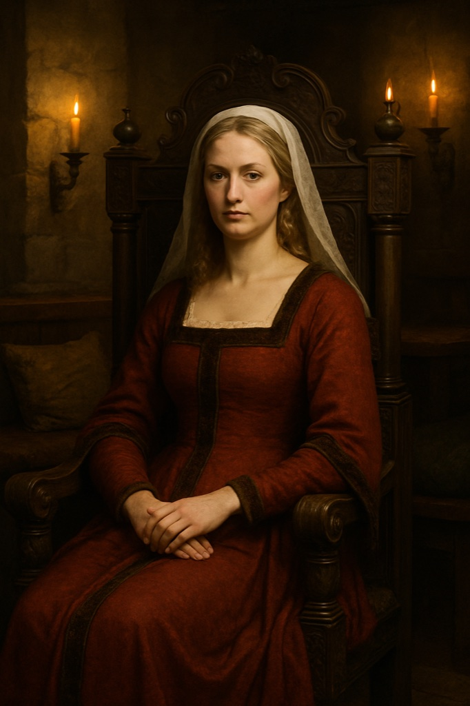

> **Legacy status:** `archive`
> **Reason:** NPC roster entry outside the seven-character vertical-slice scope.
> **Current source of truth:** [`README.md`](../../../README.md) - Main cast; approved character briefs in [`docs/CHARACTERS/`](../../../docs/CHARACTERS/).

# Katharina

The proprietress who receives important guests seated in her carved chair.

### Visual Description

Katharina is a woman in her thirties with shoulder-length golden hair, a composed, regal bearing and a rich red wool gown with velvet trim and a veil. She holds court seated in a carved dark wooden chair.

### Motivations

- **To Stay Untouchable:** Her house is neutral ground, and she intends to keep it that way.
- **To Collect Favors:** Debts of favor are her protection.

### Ties & Relationships

- **Allies:** Adelheid, Hilde, and powerful guests from every faction.
- **Enemies:** Anyone who tries to force her to take sides.

### History (Biography)

Katharina bought the house with her late husband's silver and has outlasted three changes of local power by never choosing a side openly.

### Daily Routines

Receives guests in the late evening in the back room.

### In-Game Role & Abilities

Patron and faction contact: opens private-room scenes, trades favors for information, can broker neutral meetings.

### Animations (planned)

seated idle, gesture, stand, walk, receive guest

> Concept portrait replaces a legacy pixel sprite; the new portrait is clothed and period-appropriate. Production task: see the character production epic R-1221.
