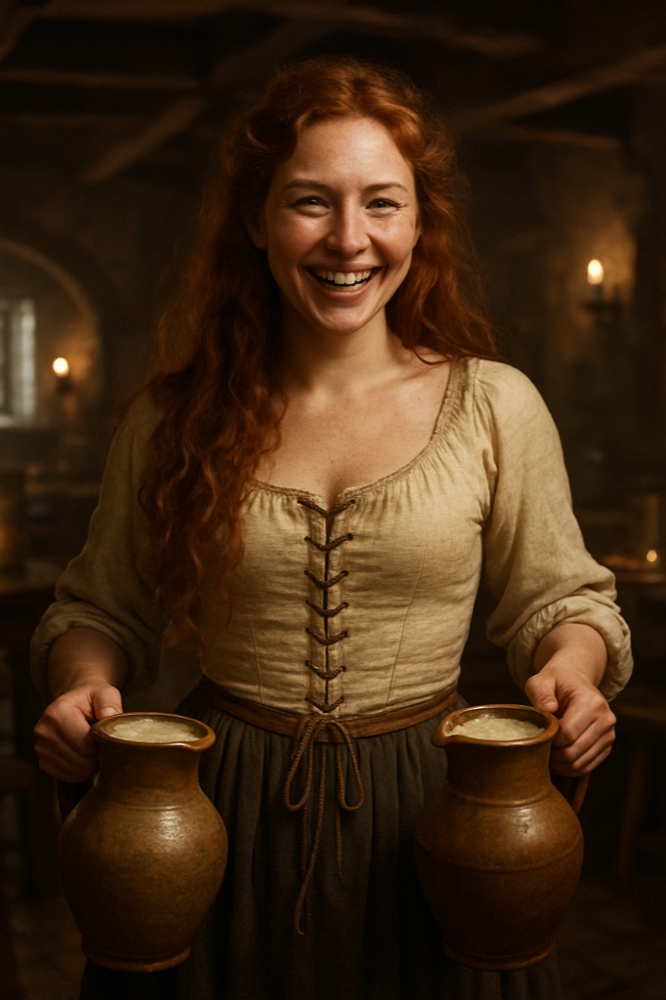

> **Legacy status:** `archive`
> **Reason:** NPC roster entry outside the seven-character vertical-slice scope.
> **Current source of truth:** [`README.md`](../../../README.md) - Main cast; approved character briefs in [`docs/CHARACTERS/`](../../../docs/CHARACTERS/).

# Rusalka 'Red Rosa'

A barmaid with copper hair and a quick tongue who carries more than ale between the tables.

### Visual Description

Rosa is a woman in her mid-twenties with long wavy copper-red hair, freckles and a bold grin. She wears a linen chemise with a laced bodice and a dark skirt, and usually carries a jug in each hand.

### Motivations

- **To Pay Off a Family Debt:** Every tip counts.
- **To Hear First:** Nothing happens in town that she does not hear by closing time.

### Ties & Relationships

- **Allies:** Adelheid; the apprentices and sailors who tip well.
- **Enemies:** Drunk patrons who grab; the debt-collecting guild.

### History (Biography)

A freed serf's daughter, Rosa came to Reval to work off her father's debt and never left the tavern.

### Daily Routines

On her feet from noon to midnight.

### In-Game Role & Abilities

Barmaid: delivers drinks, small fetch quests, tips about who is asking questions.

### Animations (planned)

carry jugs, serve, dodge, laugh, walk (seen from behind for crowd variants)

> Concept portrait replaces a legacy pixel sprite; the new portrait is clothed and period-appropriate. Production task: see the character production epic R-1221.
