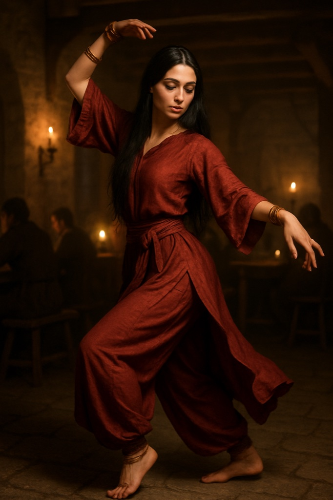

> **Legacy status:** `archive`
> **Reason:** NPC roster entry outside the seven-character vertical-slice scope.
> **Current source of truth:** [`README.md`](../../../README.md) - Main cast; approved character briefs in [`docs/CHARACTERS/`](../../../docs/CHARACTERS/).

# Zaida

A traveling dancer whose performances draw a crowd, and whose travels bring news from far ports.

### Visual Description

Zaida is a slender woman in her late twenties with long straight black hair and kohl-lined dark eyes. She wears a flowing red silk tunic with a sash and wide trousers, and brass bracelets and anklets that chime when she moves.

### Motivations

- **To Earn Her Passage:** Every coin she makes buys a place on the next ship east.
- **To Keep Her Freedom:** She answers to no guild or lord.

### Ties & Relationships

- **Allies:** Hilde, who gives her a stage; sailors who carry her news.
- **Enemies:** Moralizing clergy and guards who want her gone.

### History (Biography)

Born in a trading city far to the south-east, Zaida learned dance in caravanserais and has crossed many seas. Reval is only the latest stop.

### Daily Routines

Sleeps late, rehearses in the afternoon, performs at night.

### In-Game Role & Abilities

Entertainer and information source about distant lands; her dance draws attention while others slip away unseen.

### Animations (planned)

dance loop, bow, walk with bracelets chime, idle sit

> Concept portrait replaces a legacy pixel sprite; the new portrait is clothed and period-appropriate. Production task: see the character production epic R-1221.
