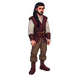

# Albrecht

A skilled fletcher, a man with a steady hand and a sharp eye.

### Visual Description

Albrecht is a man in his late twenties, with a slender, athletic build. He has long, dark hair that he keeps tied back in a practical braid. His eyes are a piercing green, and they miss nothing. He is dressed in simple, practical clothes: a leather jerkin over a linen shirt, and sturdy trousers.

### Motivations

- **To Be the Best Fletcher in Reval:** Albrecht is a man who is passionate about his craft. He is a skilled fletcher, and he is determined to make the best arrows in the city.
- **To Live a Free and Independent Life:** Albrecht is a man who values his independence. He is a skilled artisan, and he is proud to be his own master.

### Ties & Relationships

- **Allies:**
    - **The city guard:** The city guard are his best customers, and he has a good working relationship with them.
- **Enemies:**
    - **The Bowyers' Guild:** The Bowyers' Guild is a powerful and exclusive organization, and they look down on fletchers as inferior craftsmen.

### History (Biography)

Albrecht is the son of a fletcher, and he has been working with wood and feathers his entire life. He is a man who has had to fight for his place in a world dominated by the powerful guilds. He is a skilled artisan, and he is respected for his skill and his determination.

### Daily Routines

- **All Day:** Albrecht can be found in his workshop, making and mending arrows.
- **Evening:** In the evenings, he can be found at the archery range, practicing his aim.
