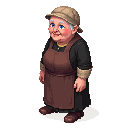

## Old Elga

A cheerful, rosy-cheeked woman in her late sixties, the proprietor of the cheesemonger's shop.

### Visual Description
Old Elga is a woman in her late sixties, with a round, friendly face and a cheerful disposition. Her cheeks are rosy, and her blue eyes sparkle with good humor. Wisps of white hair escape from her linen cap, framing her face. She wears a simple, clean apron over a dark wool dress.

### Motivations
- **To Sell the Best Cheese in Reval:** Elga takes great pride in her cheese, and she is always experimenting with new recipes.
- **To Gossip with Her Customers:** Elga is a social butterfly, and she loves to chat with her customers and catch up on the latest news and gossip.
- **To Enjoy a Good Cup of Ale:** At the end of a long day, Elga enjoys nothing more than a cup of ale at The Leaky Flagon.

### Ties & Relationships
- **Allies:**
    - **The other shopkeepers:** Elga is on good terms with the other shopkeepers in the quarter.
    - **Kalev (The Player):** Elga is a friendly and outgoing woman, and she will quickly befriend the player.
- **Enemies:**
    - **The Rat Catcher:** Elga is constantly at war with the rats that try to steal her cheese.
- **Initial View of the Main Player:** Elga is a warm and welcoming woman, and she will greet the player with a smile and a sample of her cheese.

### History (Biography)
Elga has been running the cheese shop for over forty years, having inherited it from her husband. She is a shrewd businesswoman, but she is also known for her kindness and generosity. She is a widow, and her children are grown and have moved away.

### Daily Routines
- **All Day:** Elga can be found in her shop, serving customers and making cheese.
- **Evening:** In the evenings, she can often be found at The Leaky Flagon, sharing a drink and a story with her friends.

### Possible Quest Lines
- **The Stolen Cheese:** A shipment of Elga's best cheese has been stolen, and she asks the player to recover it.
- **The Rival Cheesemonger:** A rival cheesemonger is spreading rumors about Elga, and she asks the player to help her clear her name.
- **The Festival Cheese:** Elga wants to create a special cheese for the upcoming festival, and she asks the player to help her find the rare ingredients.
