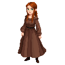

# Elsa

A master tailor, a woman of impeccable taste and a sharp wit.

### Visual Description

Elsa is a woman in her early forties, with a slender, elegant build. She has a cascade of auburn hair, which she wears in an intricate braid, and her eyes are a bright, intelligent green. She is dressed in a gown of the finest wool, a testament to her skill and her success.

### Motivations

- **To Create the Most Beautiful Clothes in Reval:** Elsa is an artist at heart, and she is driven by a desire to create beautiful things. She is not interested in the crude accumulation of wealth; her only desire is to surround herself with beauty.
- **To Live a Life of Independence:** Elsa is a woman who has made her own way in the world. She is a shrewd businesswoman, and she is not afraid to compete with the men who dominate the guilds.

### Ties & Relationships

- **Allies:**
    - **The wealthy women of Reval:** The wealthy women of Reval are Elsa's most important patrons. They are women who appreciate her taste and her skill, and they are willing to pay a high price for her work.
- **Enemies:**
    - **The other guilds:** The other guilds in the city are wary of Elsa's success. They see her as a threat to their power, and they would like nothing more than to see her fail.

### History (Biography)

Elsa is the daughter of a weaver, but she has always been more interested in the art of tailoring. She is a woman who has dedicated her life to her craft, and she is widely regarded as the best tailor in Reval.

### Daily Routines

- **All Day:** Elsa can be found in her workshop, creating her latest masterpiece.
- **Evening:** In the evenings, she can be found at the Gilded Grape, discussing fashion and politics with the other wealthy women of the city.
