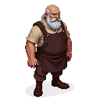

## Friedrich

A master saddler in his late fifties, a man who is as tough and stubborn as the leather he works with.

### Visual Description
Friedrich is a man in his late fifties, with a wiry, muscular build. He has a bald head and a bushy, grey beard. His face is a mask of perpetual grumpiness, and his small, dark eyes miss nothing. He wears a heavy leather apron over a simple linen shirt and wool trousers.

### Motivations
- **To Make the Best Saddles in Reval:** Friedrich is a master of his craft, and he takes immense pride in his work.
- **To Be Left Alone:** He is a man of few words, and he has little patience for fools.
- **To Complain:** He is a world-class complainer, and he can find fault with anything and everything.

### Ties & Relationships
- **Allies:**
    - **The horses:** Friedrich has a soft spot for horses, and he is said to be able to communicate with them.
    - **Kalev (The Player):** Friedrich is a grumpy old man, but he will respect the player if they can prove that they are not a fool.
- **Enemies:**
    - **The world:** Friedrich is at war with the world, and he is determined to find fault with everything.
- **Initial View of the Main Player:** Friedrich is a suspicious and grumpy man, and he will not be quick to trust the player.

### History (Biography)
Friedrich has been a saddler his entire life, and he is a master of his craft. He is a man of few words, but his saddles are known for their quality and durability. He is a grumpy old man, but he has a good heart.

### Daily Routines
- **All Day:** Friedrich can be found in his workshop, making and repairing saddles.
- **Evening:** In the evenings, he can be found in the stables, talking to the horses.

### Possible Quest Lines
- **The Runaway Stallion:** A prize stallion has run away from the city stables, and Friedrich asks the player to help him find it.
- **The Perfect Saddle:** Friedrich is determined to create the perfect saddle, but he is missing a rare type of leather. He asks the player to help him find it.
- **The Grumpy Old Man:** Friedrich is being even more grumpy than usual. The player must find out what is bothering him and help him to resolve it.
