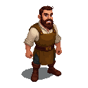

# Hendrik

A cheerful and hardworking man who operates the public grindstone.

### Visual Description

Hendrik is a man in his early thirties, with a friendly, open face and a ready smile. He has a stocky, powerful build from years of operating the grindstone. He has a short, brown beard and his eyes are a warm, friendly brown. He is dressed in simple, practical clothes: a leather apron over a linen shirt, and sturdy boots.

### Motivations

- **To Keep the City Sharp:** Hendrik takes great pride in his work, and he is determined to keep the tools and blades of the city's residents in top condition.
- **To Hear the Latest Gossip:** The grindstone is a natural gathering place, and Hendrik is always up-to-date on the latest news and rumors.

### Ties & Relationships

- **Allies:**
    - **The artisans:** The artisans of the city rely on Hendrik to keep their tools sharp, and they are his most loyal customers.
- **Enemies:**
    - **Rust:** Rust is the enemy of all sharp things, and Hendrik is constantly at war with it.

### History (Biography)

Hendrik is the son of a blacksmith, and he has been working with metal his entire life. He is a man who is content with his lot in life. He is a simple man, but he is also a man of great kindness and integrity.

### Daily Routines

- **All Day:** Hendrik can be found at the grindstone, sharpening tools and chatting with his customers.
- **Evening:** In the evenings, he can be found at The Leaky Flagon, sharing a drink and a story with his friends.
