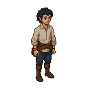

# Hinrik

A talented young painter, who is torn between his artistic ambitions and the demands of his patrons.

### Visual Description

Hinrik is a man in his mid-twenties, with a slender build and a sensitive, intelligent face. He has dark, curly hair and his eyes are a deep, thoughtful brown. He is dressed in a simple, but well-made, linen shirt and woolen trousers. His hands are stained with paint, a testament to his dedication to his craft.

### Motivations

- **To Create Great Art:** Hinrik is a man who is driven by a passion for his art. He is not interested in fame or fortune; his only desire is to create beautiful things.
- **To Find His Own Voice:** Hinrik is a man who is still searching for his own artistic voice. He is a talented painter, but he is not yet sure what he wants to say with his art.

### Ties & Relationships

- **Allies:**
    - **The other artists:** The other artists in the city admire Hinrik for his talent and his dedication.
- **Enemies:**
    - **The church:** The church is a powerful patron of the arts, but it is also a conservative institution. The church fathers are not interested in new ideas, and they are suspicious of artists who do not conform to their expectations.

### History (Biography)

Hinrik is the son of a stonemason, but he has always known that he was meant to be an artist. He is a man who is blessed with a great talent, but he is also a man who is cursed with a restless spirit. He is a man who is searching for something, but he is not yet sure what it is.

### Daily Routines

- **All Day:** Hinrik can be found at the Painters' Guild, working on his latest commission.
- **Evening:** In the evenings, he can be found at the Gilded Grape, sketching in his notebook and dreaming of the day when he will be able to paint whatever he wants.
