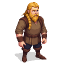

## Knut

A ropemaker in his late thirties, a man of immense strength and few words.

### Visual Description
Knut is a man in his late thirties, with a powerful, muscular build. He has long, blond hair, which he wears in a braid, and a thick beard. His eyes are a pale, icy blue, and they seem to look right through you. He wears a simple linen shirt and wool trousers, and his hands are calloused and scarred from his work.

### Motivations
- **To Make the Strongest Ropes in Reval:** Knut is a master of his craft, and he takes great pride in his work.
- **To Live a Simple Life:** He is a man of simple needs, and he is content with his life as a ropemaker.
- **To Protect His Family:** He is a devoted husband and father, and he would do anything to protect his wife and children.

### Ties & Relationships
- **Allies:**
    - **The sailors and fishermen:** Knut's ropes are in high demand, and he is a respected member of the harbor community.
    - **Kalev (The Player):** Knut is a man of few words, but he is a loyal friend to those who earn his respect.
- **Enemies:**
    - **The Hemp Merchant:** A wealthy merchant who is trying to monopolize the hemp trade.
- **Initial View of the Main Player:** Knut is a quiet and reserved man, and he will not be quick to trust the player.

### History (Biography)
Knut comes from a long line of ropemakers, and he has been making ropes his entire life. He is a master of his craft, and his ropes are known for their strength and durability. He is a simple man, but he is also a man of great strength and integrity.

### Daily Routines
- **All Day:** Knut can be found at the ropemaker's walk, twisting hemp fibers into rope.
- **Evening:** In the evenings, he returns to his small house by the harbor, where he spends time with his wife and children.

### Possible Quest Lines
- **The Stolen Hemp:** A shipment of high-quality hemp has been stolen, and Knut asks the player to help him recover it.
- **The Ropemaker's Competition:** A rival ropemaker is trying to put Knut out of business. Knut asks the player to help him win a ropemaking competition.
- **The Sea Serpent:** A giant sea serpent has been attacking ships in the harbor. Knut asks the player to help him create a giant rope to capture the beast.
