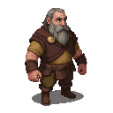

# Lars

A gruff, no-nonsense sailmaker, who is widely regarded as the best in Reval.

### Visual Description

Lars is a man in his late fifties, with a barrel chest and powerful arms. His face is a mask of wrinkles, and his hands are as tough as old leather. He has a wild, gray beard and his eyes are a stormy gray, the color of the sea in winter. He is dressed in simple, practical clothes: a heavy woolen tunic, canvas trousers, and sturdy boots.

### Motivations

- **To Make the Best Sails in the World:** Lars is a man who is obsessed with his craft. He is a perfectionist, and he will not tolerate shoddy workmanship.
- **To Keep the Old Ways Alive:** Lars is a man who believes in the importance of tradition. He is a staunch opponent of newfangled ideas, and he is determined to keep the old ways of sailmaking alive.

### Ties & Relationships

- **Allies:**
    - **The sea captains:** The sea captains of Reval know that Lars is the best sailmaker in the city, and they will not trust their ships to anyone else.
- **Enemies:**
    - **The younger generation:** The younger generation of sailmakers are eager to try new methods and materials, but Lars will have none of it. He sees them as a threat to his way of life, and he will do whatever it takes to stop them.

### History (Biography)

Lars has been making sails for as long as he can remember. He is a man who has dedicated his life to his craft, and he has no time for fools or dreamers. He is a man of few words, but his work speaks for itself.

### Daily Routines

- **All Day:** Lars can be found at the Sailmakers' Workshop, working on his latest masterpiece.
- **Evening:** In the evenings, he can be found at the Salty Siren, drinking alone and grumbling about the state of the world.
