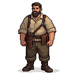

## Marek

A master carpenter in his early forties, a man of few words but great skill.

### Visual Description

Marek is a tall, broad-shouldered man in his early forties, with a physique honed by years of heavy lifting and woodworking. His face is weathered and tanned from working outdoors, and he has a short, neatly-trimmed brown beard. His hair is a matching brown, cut short and practical. His eyes are a calm, steady green, and they have the focused gaze of a craftsman. He wears a simple, durable linen shirt and wool trousers, with a leather tool belt slung around his hips.

### Motivations
- **To Build Things That Last:** Marek is a true craftsman, and he takes great pride in his work. He believes in using the best materials and techniques to create things that will stand the test of time.
- **To Provide for His Family:** Marek is a devoted husband and father, and he works hard to provide a comfortable life for his wife and children.
- **To Live a Quiet Life:** Marek is a simple man, and he has no desire for wealth or power. He is content with his life as a carpenter, and he wants nothing more than to be left in peace to do his work.

### Ties & Relationships
- **Allies:**
    - **The other artisans:** Marek is well-respected by the other artisans in the quarter, who admire his skill and his honesty.
    - **Kalev (The Player):** Marek is a man of few words, but he is a loyal friend to those who earn his respect. If the player proves themselves to be a person of honor, Marek will be a valuable ally.
- **Enemies:**
    - **The Timber Baron:** A wealthy merchant who is trying to monopolize the timber trade in Reval. The Timber Baron's shoddy materials and unfair business practices are a threat to Marek's livelihood.
- **Initial View of the Main Player:** Marek is a reserved man, and he will not be quick to trust the player. He will judge the player by their actions, not their words.

### History (Biography)
Marek was born in the countryside, in a small village surrounded by forests. His father was a woodcutter, and Marek learned the ways of the forest at a young age. When he was a young man, he moved to Reval to become a carpenter's apprentice. He quickly showed a natural talent for the trade, and he rose through the ranks to become a master carpenter. He is now one of the most respected craftsmen in the city, known for his skill, his honesty, and his unwavering commitment to quality.

### Daily Routines
- **All Day:** Marek can be found in his yard, working on his latest project. He is a master of all aspects of carpentry, from framing houses to carving intricate furniture.
- **Evening:** In the evenings, he returns to his home, which is attached to the yard. He spends his evenings with his wife and children, sharing a meal and telling stories.

### Possible Quest Lines
- **The Crooked Timber:** The Timber Baron has sold Marek a load of green, unseasoned timber. Marek asks the player to help him get a refund, or at least to get a new load of quality wood.
- **A Carpenter's Tools:** Marek's prized set of carving tools has been stolen. He asks the player to track down the thief and recover his tools.
- **The Whispering Woods:** Marek needs a special type of wood for a secret project. The wood can only be found in a haunted forest, and he asks the player to accompany him on the dangerous journey.
