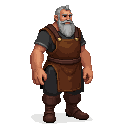

# Markus

A master mason, a man of quiet strength and unwavering faith.

### Visual Description

Markus is a man in his late forties, with a powerful build and a calm, steady gaze. His hands are large and calloused, a testament to a lifetime of working with stone. He has a short, graying beard and his eyes are a deep, thoughtful brown. He is dressed in simple, practical clothes: a leather apron over a woolen tunic, and sturdy boots.

### Motivations

- **To Glorify God Through His Work:** Markus is a deeply religious man, and he sees his work as a form of worship. He is not interested in personal glory; his only desire is to create beautiful things that will stand as a testament to his faith.
- **To Build a Better World:** Markus is a man who believes in the power of community. He is a kind and generous man, and he is always willing to lend a hand to those in need.

### Ties & Relationships

- **Allies:**
    - **The church:** The church is Markus's most important patron, and he has a close relationship with the clergy.
- **Enemies:**
    - **Time:** Time is the enemy of all things, and Markus is well aware that his creations will one day crumble to dust. But he is not a man who is easily discouraged. He is a man who believes in the power of faith, and he is confident that his work will endure.

### History (Biography)

Markus is the son of a farmer, but he has always been drawn to the beauty and permanence of stone. He is a man who has dedicated his life to his craft, and he is widely regarded as the best mason in Reval.

### Daily Routines

- **All Day:** Markus can be found at the Masons' Guild, working on his latest commission.
- **Evening:** In the evenings, he can be found at the Chapel of St. John, praying for guidance and inspiration.
