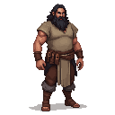

# Nikolaus

A master sculptor, a man of intense passion and a fiery temper.

### Visual Description

Nikolaus is a man in his late forties, with a powerful build and a wild, untamed look in his eyes. He has a shock of black hair, streaked with gray, and his hands are large and powerful, capable of shaping both stone and clay with equal skill. He is dressed in a simple, practical tunic, stained with the dust of his trade.

### Motivations

- **To Capture the Essence of Life in His Work:** Nikolaus is a man who is obsessed with the human form. He is a master of anatomy, and he is able to capture the full range of human emotion in his work.
- **To Challenge the Conventions of His Time:** Nikolaus is a man who is not afraid to take risks. He is a bold and innovative artist, and he is determined to push the boundaries of his art.

### Ties & Relationships

- **Allies:**
    - **The other artists:** The other artists in the city are in awe of Nikolaus's talent, but they are also intimidated by his fiery temper.
- **Enemies:**
    - **The church:** The church is a powerful patron of the arts, but it is also a conservative institution. The church fathers are not interested in Nikolaus's realistic and often brutal depictions of the human form. They see his work as a threat to their authority, and they are determined to suppress it.

### History (Biography)

Nikolaus is the son of a butcher, and he has always been fascinated by the human body. He is a man who has dedicated his life to his art, and he is widely regarded as the most talented sculptor in Reval.

### Daily Routines

- **All Day:** Nikolaus can be found in his workshop, wrestling with his latest creation.
- **Evening:** In the evenings, he can be found at the Broken Shield Tavern, drinking heavily and arguing with anyone who will listen.
