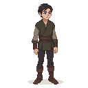

## Peeter

Ingrid's son, a young man of sixteen. He is a quiet and sensitive boy, with a talent for painting.

### Visual Description
Peeter is a tall, slender youth of sixteen, with his mother's dark hair and his father's blue eyes. He has a quiet and gentle demeanor, and he often seems to be lost in his own thoughts. He wears simple, practical clothes, similar to his mother's, but they are always neat and clean.

### Motivations
- **To Help His Mother:** Peeter loves his mother very much, and he does his best to help her in the workshop. He is not a natural potter, but he is a hard worker.
- **To Become an Artist:** Peeter's true passion is painting. He spends his spare time sketching the people and places of Reval, and he dreams of one day becoming a famous artist.
- **To See the World:** Peeter has lived in Reval his entire life, and he is curious about the world outside the city walls.

### Ties & Relationships
- **Allies:**
    - **Ingrid:** His mother is his closest friend and confidante.
    - **Kalev (The Player):** Peeter is shy and reserved, but he will open up to the player if they show an interest in his art.
- **Enemies:**
    - None. Peeter is a gentle soul, and he does not have any enemies.
- **Initial View of the Main Player:** Peeter is a little intimidated by the player at first, but he is also curious about them. He will be grateful for any help the player can give him and his mother.

### History (Biography)
Peeter was born in Reval, and he has never known any other life. He does not remember his father, who was lost at sea when he was just a baby. He has been raised by his mother, and he is devoted to her. He is a talented artist, but he knows that there is no future for an artist in Reval. He is torn between his duty to his mother and his desire to follow his dreams.

### Daily Routines
- **Morning:** Peeter helps his mother in the workshop, preparing the clay and firing the kiln.
- **Afternoon:** In the afternoons, he is free to pursue his own interests. He can often be found in the market, sketching the faces of the shoppers, or by the harbor, drawing the ships.
- **Evening:** In the evenings, he helps his mother prepare dinner. After dinner, he works on his drawings by the light of a single candle.

### Possible Quest Lines
- **The Colors of the Sea:** Peeter wants to paint a picture of the sea, but he does not have the right shade of blue. He asks the player to find a rare flower that can be used to make the dye.
- **A Portrait of a Hero:** Peeter is impressed by the player's deeds, and he asks if he can paint their portrait.
- **The Artist's Dilemma:** A wealthy merchant has seen Peeter's work, and he has offered to take him on as an apprentice. This is a once-in-a-lifetime opportunity for Peeter, but it would mean leaving his mother behind.
