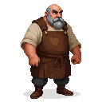

## Rein

A grizzled old cobbler in his late fifties, known for his expert craftsmanship and his cantankerous demeanor.

### Visual Description
Rein is a man in his late fifties, with a stocky, powerful build from a lifetime of working with leather. His face is weathered and deeply lined, and his bushy grey eyebrows are often furrowed in concentration. He has a bald head, fringed with grey hair, and a thick, well-kept beard. His eyes are a sharp, intelligent brown, and they don't miss a thing. He wears a heavy leather apron over a simple linen shirt and wool trousers. The apron is stained and worn, a testament to his years of labor.

### Motivations
- **Pride in His Work:** Rein is a master of his craft, and he takes immense pride in the quality of his work. He believes that a good pair of shoes can change a person's life.
- **To Be Left Alone:** Rein is a solitary man who prefers the company of his tools to that of other people. He is not unfriendly, but he is not one for idle chatter.
- **A Sense of Justice:** Despite his grumpy exterior, Rein has a strong sense of right and wrong. He will not stand for injustice, and he will always help those in need, albeit grudgingly.

### Ties & Relationships
- **Allies:**
    - **The other cobblers:** Rein is respected by the other cobblers in the square, who often come to him for advice.
    - **Kalev (The Player):** Rein is initially dismissive of Kalev, seeing him as just another young troublemaker. However, if the player can prove their worth, Rein will become a valuable ally.
- **Enemies:**
    - **The City Guard:** Rein has a long-standing feud with the city guard, who he sees as corrupt and lazy.
- **Initial View of the Main Player:** Rein is suspicious of Kalev at first. He will test the player with a series of difficult tasks before he is willing to trust them.

### History (Biography)
Rein was born and raised in Reval. He has been a cobbler his entire life, learning the trade from his father. He has seen the city change over the years, and he is not impressed by what he has seen. He is a man of the old school, who believes in hard work, honesty, and quality craftsmanship. He has little patience for the politics and intrigue of the city, and he prefers to keep to himself.

### Daily Routines
- **All Day:** Rein can be found at his stall in Cobblers' Square, from sunrise to sunset. He is a tireless worker, and he is always busy with a pair of shoes.
- **Evening:** In the evenings, he retires to his small room above his workshop. He spends his evenings reading and smoking his pipe.

### Possible Quest Lines
- **The Captain's Boots:** The captain of the city guard needs a new pair of boots, but he is too cheap to pay for quality work. Rein asks the player to "acquire" a pair of high-quality boots for him.
- **The Runaway Apprentice:** Rein's young apprentice has run away, and he asks the player to find him. The quest will lead the player into the city's underworld.
- **A Cobbler's Legacy:** Rein is getting old, and he is looking for someone to pass his skills on to. If the player has proven themselves to be trustworthy and hardworking, Rein will offer to teach them the art of cobbling.
