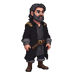

## Valentin

A quiet and enigmatic locksmith in his late forties.

### Visual Description
Valentin is a man in his late forties, with a lean, wiry build. He has sharp, intelligent eyes that seem to see right through people. His dark hair is streaked with grey, and he has a neatly trimmed beard. He dresses in dark, practical clothes.

### Motivations
- **To Create the Perfect Lock:** Valentin is a master of his craft, and he is obsessed with creating a lock that cannot be picked.
- **To Keep Secrets:** He is a man with a mysterious past, and he guards his secrets closely.
- **To Atone for Past Sins:** He is haunted by something in his past, and he seeks to atone for it through his work.

### Ties & Relationships
- **Allies:**
    - **The City's Underworld:** Valentin has connections to the city's criminal underworld, who value his skills.
    - **Kalev (The Player):** Valentin is a man of few words, but he will help the player if they can prove that they are trustworthy.
- **Enemies:**
    - **The City Guard:** The guard is suspicious of Valentin and his connections to the criminal underworld.
- **Initial View of the Main Player:** Valentin is a cautious and reserved man, and he will not be quick to trust the player.

### History (Biography)
Valentin's past is a mystery. He arrived in Reval a few years ago and set up a locksmith's shop. He is a master of his craft, but he is also a man with a dark past.

### Daily Routines
- **All Day:** Valentin can be found in his workshop, working on his locks.
- **Evening:** He spends his evenings alone, reading and studying.

### Possible Quest Lines
- **The Unpickable Lock:** Valentin has created a lock that he believes is unpickable. He challenges the player to try and pick it.
- **A Favor for a Friend:** An old friend of Valentin's is in trouble, and he asks the player to help them.
- **The Key to the Past:** Valentin is looking for a key that will unlock the secrets of his past. He asks the player to help him find it.
