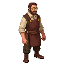

## Walter

A master tinsmith in his late forties, a meticulous and skilled craftsman.

### Visual Description
Walter is a man in his late forties, with a thin, wiry build. He has a sharp, intelligent face, and he wears a pair of spectacles perched on his nose. His brown hair is neatly combed, and he has a well-trimmed beard. He wears a leather apron over a simple linen shirt and wool trousers.

### Motivations
- **To Create Beautiful and Functional Objects:** Walter is a true artist, and he takes great pride in his work.
- **To Live a Quiet and Orderly Life:** He is a man of routine and precision, and he has little patience for chaos and disorder.
- **To Read:** He is a lover of books, and he spends his evenings reading by the light of a single candle.

### Ties & Relationships
- **Allies:**
    - **The scholars and alchemists:** Walter's skills are in high demand among the city's intellectuals, who need his help to create their delicate instruments.
    - **Kalev (The Player):** Walter is a man of few words, but he will respect the player if they can prove that they are a person of intelligence and learning.
- **Enemies:**
    - **The Blacksmiths' Guild:** The powerful blacksmiths' guild sees the tinsmiths as a threat to their business.
- **Initial View of the Main Player:** Walter is a quiet and reserved man, and he will not be quick to trust the player.

### History (Biography)
Walter learned the trade from his father, and he has been a tinsmith his entire life. He is a master of his craft, and he is known for the quality and precision of his work. He is a simple man, but he is also a man of great intelligence and learning.

### Daily Routines
- **All Day:** Walter can be found in his workshop, creating a variety of objects from tin, from simple cups and plates to elaborate lanterns and scientific instruments.
- **Evening:** In the evenings, he can be found in his small room above the workshop, reading.

### Possible Quest Lines
- **The Alchemist's Crucible:** A local alchemist needs a special crucible made of tin, but he does not have the money to pay for it. Walter asks the player to help the alchemist.
- **The Stolen Spectacles:** Walter's prized pair of spectacles has been stolen. He asks the player to help him find them.
- **The Tinsmith's Competition:** The Blacksmiths' Guild has challenged the tinsmiths to a competition. Walter asks the player to help him win.
