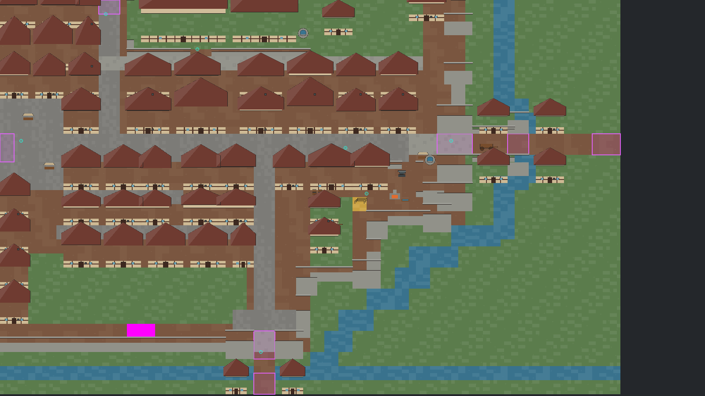
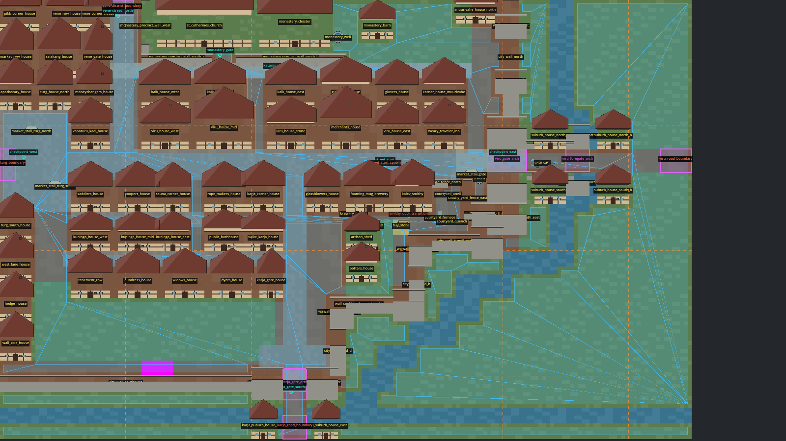

# Compact map authoring

This document defines the target authoring contract for programmatic maps. It is normative for new map work and should be read with [ADR 0009](adr/0009-map-blueprint-authoring-architecture.md). The architecture is accepted before implementation: existing maps still construct `MapDefinition` directly until the blueprint model, compiler, and migration checks described below land.

## Goals

- Give humans and AI agents a compact, typed vocabulary that expresses intent instead of runtime dictionaries.
- Keep the existing `MapDefinition` contract stable for builders, navigation, collisions, transitions, audits, and the 2D and 3D views.
- Make repeated structures reusable without hiding their local geometry or gameplay IDs.
- Produce deterministic, reviewable output with actionable validation errors and stable fingerprints.
- Preserve exact author control for exceptional composition without adding a general raw-data back door.
- Keep generated Godot nodes disposable and keep large-map chunking independent from semantic authoring.
- Support incremental migration with mechanical and visual parity evidence.

Non-goals for the first implementation are a visual level editor, a new runtime map contract, a custom YAML/JSON grammar, arbitrary procedural generation, seamless-world streaming, and a universal raw `Dictionary` escape hatch.

## Architecture and terminology

```text
human or AI author
        |
        v
MapBlueprint factory        <- source of truth
  metadata + primitives
  prefab instances
  exact placements
  allowlisted overrides
        |
        v
MapBlueprintCompiler
  source validation
  prefab expansion
  stable-ID resolution
  coordinate conversion
  canonical ordering
  fingerprinting
        |
        v
MapDefinition               <- existing runtime contract
        |
        +--> MapBuilder / navigation / collision / gameplay
        +--> 2D and 3D renderers
        +--> runtime node assembly
        +--> optional runtime chunk index
```

| Term | Meaning |
|---|---|
| **MapBlueprint** | The human/AI-authored semantic source for one map. Initially this is a typed GDScript factory using named APIs, not a raw nested dictionary. |
| **MapBlueprintCompiler** | A pure compiler that validates and expands a blueprint into the existing `MapDefinition` runtime contract. |
| **MapDefinition** | The current runtime data consumed by map builders and systems. It is compiler output for migrated maps, not the preferred authoring surface. |
| **Primitive** | The smallest supported semantic operation, such as a terrain rectangle, wall run, prop, transition, or anchor. |
| **Prefab** | A reusable composition of primitives in a named local cell coordinate system. A prefab contains no absolute map position. |
| **Instance** | One placement of a prefab with an explicit stable instance ID, origin, and optional supported transform and overrides. |
| **Local ID** | A stable ID inside a prefab, such as `door.front` or `prop.anvil`. |
| **Resolved ID** | The map-wide ID derived from an instance ID and local ID, such as `smithy/door.front`. |
| **Exact placement** | A first-class primitive placed directly in map cell space when a prefab would not improve reuse. |
| **Override** | A narrow, validated change to one named prefab child field after expansion. |
| **Generated nodes** | Terrain, geometry, collision, navigation, markers, and view nodes assembled from a compiled definition. They are never source of truth. |
| **Chunk** | A runtime partition used for loading or rendering. It is not a blueprint namespace or gameplay identity. |

`MapBlueprint`, `MapBlueprintCompiler`, `MapPrefabPackage`, `MapPrefab`, and `MapTransform` are implemented typed GDScript APIs. Prefab packages are registered explicitly on each blueprint; the compiler never discovers packages by filesystem order.

## Coordinate and unit rules

- Author semantic layout in integer **cells**. The project default is `MapTypes.DEFAULT_CELL_SIZE`, currently 32 world pixels per cell.
- The gameplay plane remains orthogonal X/Y per [ADR 0002](adr/0002-orthogonal-three-quarter-perspective.md). The view layer may present that plane isometrically.
- Rectangle origins use the north-west cell and sizes are positive. Bounds are half-open: `[position, position + size)`.
- A point-like primitive occupies an explicit cell or cell-relative offset. The compiler performs all conversion to `Vector2`, `Rect2`, and other world-space runtime values.
- Do not mix cells and world pixels in a blueprint. A rare non-grid visual offset must use a field whose unit is explicit in its name and schema, for example `visual_offset_px`; it must not alter gameplay collision or navigation silently.
- Array order is semantic only where the primitive says so, such as terrain paint layers or patrol points. Otherwise the compiler canonicalizes output independently of declaration order.

## Supported primitive vocabulary

The initial vocabulary must cover the existing runtime contract without exposing arbitrary runtime dictionaries. The exact typed API may evolve during implementation, but these capabilities and semantics are required.

| Primitive or metadata | Required author intent | Compiles to |
|---|---|---|
| `map` metadata | `map_id`, canonical location, scope, active flag, seed, palette, size, base terrain, source references | Top-level `MapDefinition` fields |
| `terrain_rect` | Terrain ID, cell rectangle, explicit layer/order when overlaps matter | `zones` |
| `structure_rect` | Stable ID, supported building/structure kind, cell footprint, style parameters | `buildings` |
| `wall_run` | Stable ID, endpoints or cell rectangle, thickness, openings, style | One or more canonical `buildings` entries |
| `prop` | Stable ID, supported prop kind, cell placement, optional facing/style | `props` |
| `player_spawn` | Named or primary spawn placement | `player_spawn` and any supported spawn metadata |
| `transition` | Stable ID, cell rectangle, destination scene/spawn IDs, optional local spawn metadata | `transitions` |
| `interaction_anchor` | Stable ID, cell placement, optional kind | `interaction_anchors` |
| `patrol_path` | Stable ID and ordered cell points | `patrols` |
| `excluded_rect` | Cell rectangle blocked from traversal | `excluded_areas` |
| `fade_rect` | Cell rectangle for roof or foreground fade | `fade_volumes` |
| `direction_sign` | Stable association, text, placement, outgoing direction | `direction_signs` |
| `view_landmark` | Stable ID, supported view-only kind, placement and dimensions | `view_landmarks` |
| `surroundings` | Explicit town-continuation sides | `surroundings_town_sides` |
| `camera_bounds` | Optional cell rectangle, otherwise full map bounds | `camera_bounds` |
| `prefab_instance` | Stable instance ID, prefab ID/version, origin, supported transform, overrides | Expanded primitives in the fields above |

New reusable behavior must be added as a reviewed typed primitive with validation, compilation, and tests. Do not bypass the vocabulary with a generic `raw_definition_entry` or embedded `MapDefinition` dictionary.

## Stable-ID rules

Stable IDs connect map geometry to content, saves, transitions, audits, captures, and tests. Treat them as public API.

1. `map_id` is globally unique and immutable after external references exist. Prefer the existing map ID when migrating.
2. Every semantic object that can be referenced, overridden, audited, saved, or reported receives an explicit ID. Terrain paint fragments need IDs only when they are referenced or overridden.
3. IDs use lowercase ASCII segments with digits, `_`, `.`, or `-`. `/` is reserved for prefab namespace composition. Do not derive IDs from display text.
4. IDs describe identity or role, for example `gate.viru`, `anchor.forge`, or `stall.fish`, not array position or incidental coordinates such as `prop_12_7`.
5. IDs are unique after prefab expansion across all referenceable map objects. The compiler rejects duplicates across categories unless the schema explicitly defines a shared object.
6. A prefab declares immutable local child IDs. An instance with ID `smithy` resolves local ID `door.front` to `smithy/door.front`. Nested namespaces compose in the same order.
7. Moving, rotating, reflecting, reordering, or overriding an object does not change its ID. Runtime chunk assignment also never changes it.
8. Deleting or renaming an externally referenced ID is a migration. Update all references atomically or provide a documented alias at the runtime/content boundary when that boundary supports aliases.
9. The compiler may create internal fragments, such as wall segments around an opening, only from a documented deterministic suffix of the owning stable ID. Internal fragments must not become gameplay references.

## Deterministic generation requirements

Given the same blueprint semantic content, compiler version, primitive/prefab library versions, and seed, compilation must produce semantically identical output and the same canonical fingerprint on every supported platform.

- No wall-clock time, global random state, filesystem enumeration order, scene-tree state, editor metadata, locale, or platform-dependent path is an input.
- Random variation uses an explicit seed and stable per-object derivation from IDs. Adding an unrelated object must not reshuffle existing object variation.
- Prefab expansion order and generated suffixes are specified. Never use hash-map iteration order or declaration index as identity.
- Canonical output ordering is documented and covered by tests. Ordered semantics, such as paint precedence and patrol paths, preserve explicit author order; unordered collections sort by resolved stable ID and a defined tie-breaker.
- Numeric transforms are exact for supported grid operations. Canonical fingerprint input does not depend on `str(Dictionary)` or locale-sensitive float formatting.
- The fingerprint covers all runtime-relevant semantics and excludes comments, source formatting, generated scene node names, and chunk assignment.
- Compiling twice in one process and in fresh processes must match. A compile-check mode must fail if a checked-in generated artifact, if any, is stale.

## Prefabs and local coordinates

- A prefab has a stable prefab ID and, once compatibility requires it, an explicit schema/version.
- Prefab geometry is authored relative to local cell origin `(0, 0)`. Prefabs do not know the destination map, absolute world pixels, scene paths, or runtime chunk.
- Every referenceable child has a stable local ID. Prefab internals may refer to siblings by local ID; the compiler resolves those references after namespacing.
- Instances provide an explicit stable instance ID and map-cell origin. Supported transforms should be limited initially to integer translation and orthogonal rotations/reflections that can be represented exactly on the cell grid.
- Transform order is fixed: resolve prefab defaults, apply the instance transform in local space, translate to the map origin, then apply allowlisted overrides and validate final bounds/references.
- Nested prefabs are allowed only if cycle detection, maximum expansion depth, deterministic namespace composition, and diagnostics are implemented. Otherwise they must be rejected in the first version.
- A prefab may supply defaults, but it must not silently choose map-wide IDs, destinations, activation state, or content references.
- If a reusable composition requires many per-instance structural overrides, create a clearer prefab variant or use explicit primitives. Do not turn overrides into a second programming language.

## Escape hatches: explicit placement and overrides

Compact authoring must not prevent exact layouts.

### Explicit placement

Use a supported primitive directly in map coordinates for unique geometry, a landmark, a one-off transition, or composition that is clearer without a prefab. Exact placement is normal authoring, not an error. It still uses typed fields, cell units, stable IDs, validation, canonical ordering, and the compiler.

### Prefab overrides

An override targets one resolved prefab child by local stable ID and changes only allowlisted fields, for example:

- terrain/style/material variant;
- facing, dimensions, or height within primitive constraints;
- enabled/disabled state for an optional child;
- destination IDs or text deliberately left as prefab parameters;
- an explicit cell-relative placement adjustment when the primitive supports it.

The compiler rejects unknown targets, duplicate/conflicting overrides, type changes, ID mutation, raw runtime fields, and overrides that leave geometry or references invalid. Overrides apply after expansion and transforms, before final validation and fingerprinting.

There is no generic raw dictionary escape hatch. If neither a primitive, exact placement, nor a narrow override can express a requirement, extend the reviewed primitive vocabulary and its tests.

## Authoring example

The final method names may change during implementation, but intended source shape is compact and typed:

```gdscript
class_name ExampleSmithyBlueprint
extends RefCounted

static func create() -> MapBlueprint:
    var map := MapBlueprint.new(
        &"lower_town_smithy_example",
        &"loc.kalev_smithy",
        Vector2i(50, 28),
        MapTypes.TERRAIN_GRASS,
    )
    map.scope = &"prototype"
    map.active = false
    map.seed = 42042
    map.palette = &"clean_painted"
    map.add_source_reference("scenes/revel-map.jpg")

    map.terrain_rect(&"street", MapTypes.TERRAIN_COBBLESTONE, Rect2i(8, 0, 30, 4))
    map.prefab_instance(
        &"smithy",
        &"building.smithy_small",
        Vector2i(10, 8),
        MapTransform.IDENTITY,
        {
            &"door.front": {"destination_scene_id": &"lower_town_slice"},
            &"prop.anvil": {"style_variant": &"worn"},
        },
    )
    map.prop(&"well", MapTypes.PROP_KIND_WELL, Vector2i(30, 19))
    map.transition(&"gate.north", Rect2i(20, 0, 2, 1), &"lower_town_slice", &"smithy_gate")
    map.interaction_anchor(&"anchor.delivery", Vector2i(24, 15))
    map.player_spawn(&"spawn.main", Vector2i(22, 16))
    return map
```

The compiler, not the author, converts cells to world units, expands `smithy/door.front` and `smithy/prop.anvil`, emits canonical `MapDefinition` arrays, and computes the fingerprint.

A unique layout should remain explicit rather than hiding behind a single-use prefab:

```gdscript
map.structure_rect(&"wall.courtyard_west", &"wall", Rect2i(8, 8, 1, 10))
map.fade_rect(&"fade.south_roof", Rect2i(9, 17, 8, 2))
map.view_landmark(&"landmark.gate_arch", &"gate_arch", Rect2i(19, 7, 4, 1))
```

### Migrated map excerpt (`lower_town_slice`)

Production Lower Town authoring compiles through `LowerTownSliceBlueprint` and the thin `LowerTownSliceDefinition.create()` adapter. Terrain paint order is preserved with grouped `terrain_rects` batches; structures use named styles plus a compact placement table; gameplay routes, transitions, and landmarks stay explicit.

```gdscript
static func create() -> MapBlueprint:
    var map := MapBlueprint.new(&"lower_town_slice", &"loc.lower_town_slice", Vector2i(88, 56), MapTypes.TERRAIN_DIRT)
    map.scope = &"production"
    map.active = true
    map.palette = &"clean_painted"
    _define_styles(map)
    _add_terrain(map)
    _add_structures(map)
    _add_landmarks_props_routes(map)
    map.surroundings([&"north", &"west"])
    return map

static func _add_terrain(map: MapBlueprint) -> void:
    map.terrain_rects(&"terrain.00", MapTypes.TERRAIN_GRASS, [Rect2i(66, 0, 22, 50), Rect2i(0, 50, 88, 6), ...], 0, 0)
    map.terrain_rects(&"terrain.01", MapTypes.TERRAIN_WATER, [Rect2i(70, 0, 3, 16), Rect2i(70, 14, 5, 2), ...], 0, 9)
    map.terrain_rects(&"terrain.02", MapTypes.TERRAIN_DIRT, [Rect2i(66, 19, 22, 3), Rect2i(36, 50, 3, 6)], 0, 22)
```

## Reusable prefab packages

A `MapPrefabPackage` owns versioned, package-local prefabs. Maps register a package explicitly with `use_prefab_package()` and refer to a prefab by qualified ID such as `urban.house_row`. Every instance has a stable map-local ID; `street.houses/house.west` is derived from instance and local IDs, never an array index. The reviewed example library is `scripts/map/prefabs/urban_prefab_package.gd` and includes `urban.house_row`, `urban.wall_tower_segment`, and nested `urban.gate_composition`. It is example content only and does not migrate Lower Town.

Parameters must be declared with a type and default. Values use `MapPrefab.parameter()` references. Supplying an unknown parameter or a value of the wrong declared type is an error. Nested instances are allowed, but direct or indirect recursion and nesting deeper than 32 levels are rejected.

Deterministic evaluation order is normative:

1. Resolve declared parameter defaults, then supplied instance parameter values.
2. Expand local primitives and nested instances. Nested transforms apply from the innermost instance outward.
3. For each transform, mirror local X, then local Y, then rotate clockwise by `0`, `90`, `180`, or `270` degrees. Transform occupied integer cells around local `(0, 0)`.
4. Translate transformed cells by the instance origin.
5. Apply prefab-child inline values, then the nearest instance override, then each containing-instance override from inner to outer, then map-level `override_object()`.
6. Validate allowlisted fields, IDs, references, final map bounds, and canonical output.

Orientation fields transform with geometry: cardinal `door_side`, `facing`, and `direction` values rotate/reflect; `ridge_axis` and `passage_axis` swap axes on quarter turns. Overrides occur after transforms, so an override states the final map-space orientation. Override targets are local semantic paths such as `house.middle` or `east/tower`, never indices.

### Concise AI-generation examples

```gdscript
var map := MapBlueprint.new(&"new_quarter", &"loc.new_quarter", Vector2i(80, 50), MapTypes.TERRAIN_GRASS)
map.use_prefab_package(UrbanPrefabPackage.create())
map.prefab_instance(
    &"street.houses",
    UrbanPrefabPackage.HOUSE_ROW,
    Vector2i(8, 12),
    MapTransform.new(90, true), # mirror X, then rotate clockwise
    {&"roof_color": Color(0.28, 0.12, 0.10)},
    {&"house.middle": {"door_side": &"east"}}, # final map-space side
)
map.prefab_instance(
    &"gate.north",
    UrbanPrefabPackage.GATE_COMPOSITION,
    Vector2i(42, 8),
    MapTransform.new(),
    {},
    {&"east/tower": {"wall_height": 256.0}},
)
```

Choose the smallest construct that communicates intent:

| Need | Use | Rule |
|---|---|---|
| Repeated multi-object composition with stable internal roles | Prefab | Reuse it at least twice, or establish a reviewed domain building block. Prefer a variant over many structural overrides. |
| Repeated same-kind objects along one vector | `placement_row` | Every slot needs an explicit stable slot ID. Use it when spacing is regular and composition is one-dimensional. |
| Connected orthogonal terrain or wall path | Stroke or `wall_run` | Use ordered points for path intent; use explicit rectangles if overlap/paint fragments need independent meaning. |
| Unique geometry, transition, landmark, or exception | Explicit placement | Keep one-off intent visible. Do not create a single-use prefab solely to shorten code. |

AI authors should invent IDs before coordinates, keep package IDs domain-scoped, use parameters for declared reusable variation, and use named overrides only for narrow exceptions. If generation needs indices, raw runtime dictionaries, recursive composition, or many overrides, stop and choose a clearer primitive/prefab variant.

## Validation expectations

Validation has four layers and must report the blueprint path plus source ID, not only a generated array index.

### 1. Blueprint source validation

Reject missing metadata, unsupported primitive kinds, invalid units or rectangles, duplicate source IDs, invalid scope/activation combinations, unknown fields, stale source references, and non-explicit randomness.

### 2. Prefab and reference validation

Reject unknown prefab IDs or versions, cycles, duplicate resolved IDs, invalid transforms, unresolved local references, unknown override targets, forbidden override fields, and references to disabled or missing children.

### 3. Compiled contract validation

Run `MapDefinition.validate()` and require known terrain/building/prop kinds, positive in-bounds geometry, valid transitions and anchors, complete fingerprint and metadata, unique IDs, and valid camera/world bounds. Compiler diagnostics must map a runtime failure back to its blueprint primitive.

### 4. Behavioral and parity validation

Require full terrain coverage, collision-footprint equality, spawn/transition/mandatory-anchor reachability, patrol segment reachability, deterministic fingerprints, shared Y-sort policy, activation isolation, source-reference resolution, scene startup, and deterministic visual captures where relevant.

For a migration, compare old and compiled definitions using a canonical semantic snapshot. Preserve at minimum:

- map, transition, spawn, anchor, patrol, prop, structure, and landmark IDs;
- scope, activation, destination references, source references, and map bounds;
- terrain coverage and precedence;
- collision and excluded areas;
- navigation reachability between mandatory points;
- view metadata and capture composition within the approved visual tolerance.

An intentional difference must be listed in the migration change and asserted in a test or updated golden artifact. A changed fingerprint alone neither proves parity nor automatically indicates failure: migrated compiler output uses the new canonical fingerprint policy, while semantic parity is checked explicitly.

## Documented checks

Run the existing repository checks after any current map change and while building the compiler:

```bash
godot --headless --path . --script tools/run_godot_tests.gd
python3 tools/verify_map_audit.py
python3 tools/verify_map_activation.py
python3 tools/verify_map_conversion_plan.py
python3 tools/generate_active_docs_report.py --check
```

The Godot suite includes contract, deterministic fingerprint, terrain coverage, collision, reachability, Y-sort, scene bootstrap, and map audit coverage. The Python checks cover audit inventory/captures, activation isolation, and conversion-plan consistency.

### `lower_town_slice` parity fixture

`tests/fixtures/maps/lower_town_slice.parity.json` is the reviewed pre-compiler baseline for `lower_town_slice`. Its canonical serializer records normalized map metadata, an output terrain-ID grid hash, buildings and props, anchors, transitions, patrols, view landmarks, direction signs, exclusions, fade volumes, source references, surroundings metadata, and a cell-by-cell walkability hash/count. Dictionary keys and stable-ID collections are sorted, unordered records are compared canonically, and floats use nine fixed decimal places so representation-only changes do not create diffs. Patrol points retain order because their order is gameplay-relevant. Legacy paint-operation order and the authoring fingerprint are intentionally excluded: a compiler may express the same final terrain differently and will use a new canonical fingerprint policy.

The normal test suite only reads this fixture and never rewrites it. Regeneration is intentionally guarded and must be invoked explicitly:

```bash
godot --headless --path . \
  --script tools/regenerate_lower_town_slice_parity.gd \
  -- --write-lower-town-slice-parity-fixture
```

After regeneration, review the full fixture diff before accepting it. Confirm every metadata or stable-ID change is intended, inspect changed building footprints/properties and gameplay collections, and treat either terrain or walkability hash changes as a map-layout/navigation change requiring dedicated map review. Then run the Godot suite and verify the existing endpoint, gate-passage, water exclusion, and navigation-polygon tests still pass. Do not regenerate merely to make a failing migration test green.

The compiler implementation is not complete until it adds documented commands or focused test targets that prove all of the following:

1. blueprint schema and negative-case validation;
2. deterministic compile output in repeated and fresh runs;
3. prefab transform, namespace, cycle, and override behavior;
4. canonical semantic snapshot comparison between legacy and compiled definitions;
5. collision/navigation/transition/anchor parity for each migration;
6. stale generated-artifact detection if generated artifacts are checked in.

Until those checks exist, agents may design or test the compiler but must not declare a production map migrated. Once implementation lands, replace this paragraph with the exact commands and keep `AGENTS.md` synchronized.

For visual changes, also run the relevant map scene or capture tool and inspect the deterministic capture. Generated nodes in the running scene are evidence only; edit the blueprint or compiler to fix them.

### Godot editor preview

Migrated blueprint scenes may include `MapBlueprintEditorPreview`, an `@tool` component that is safe to reuse in small scene shells. `scenes/reval_east/reval_east.tscn` binds it to `LowerTownSliceBlueprint`. The component calls `MapBlueprintCompiler.compile_with_diagnostics()` and then uses the normal `MapBuilder` and `MapAssembler` visual path. It does not use `MapSceneBootstrap`, instantiate transition doors, install a gameplay view, or attach a live navigation region.

Select `MapBlueprintPreview` in the Scene dock to use these Inspector controls:

- **Rebuild Preview** - recompile the blueprint and replace all disposable terrain, building, prop, landmark, and overlay nodes.
- **Validate** - compile and validate without replacing the current preview. The read-only **Preview Status** contains the map ID, fingerprint, counts, or one actionable compiler diagnostic per line. Errors also appear as node configuration warnings and in the editor Output panel.
- **Show Stable IDs** - label compiled building, prop, landmark, anchor, and transition IDs.
- **Show Anchors** - display interaction anchors as cyan crosshairs.
- **Show Navigation** - draw polygon data baked with the runtime `MapNavBuilder`; no `NavigationRegion2D` enters the edited scene tree.
- **Show Chunk Bounds** - display a clearly labeled 16x16-cell planning grid. This is a placeholder, not authored chunk identity or a runtime streaming contract.

Only `blueprint_factory` is stored in the scene. The controls and status are editor-session state. The generated root is internal, has no `owner`, is marked `preview_only`, and has physics disabled. Therefore generated nodes are omitted from `.tscn` saves and `PackedScene.pack()`, and the component clears itself and disables processing outside the editor. Runtime still compiles the Lower Town blueprint independently through `LowerTownSliceDefinition.create()` and deliberately rebuilds gameplay nodes there.

#### Manual verification and screenshots

1. Start Godot 4.7.1, open `scenes/reval_east/reval_east.tscn`, select `MapBlueprintPreview`, and click **Rebuild Preview**. Confirm terrain, buildings, props, magenta landmark rectangles, and cyan anchors appear in the 2D viewport. Capture `lower-town-preview-base.png` with the Scene dock, Inspector success status, and full viewport visible.
2. Enable **Show Stable IDs**, **Show Anchors**, **Show Navigation**, and **Show Chunk Bounds**. Confirm labels follow compiled objects, cyan anchor crosses match the labels, blue navigation avoids blocked footprints/water, and the orange grid says `CHUNK BOUNDS PLACEHOLDER`. Capture `lower-town-preview-overlays.png`.
3. Temporarily introduce an invalid blueprint value in `lower_town_slice_blueprint.gd`, for example duplicate a stable primitive ID. Click **Validate** and confirm the Inspector status, yellow node warning, and Output error name the compiler problem and tell the author to fix the blueprint. Undo the edit, click **Validate**, and confirm success.
4. Before and after toggling every overlay, save the scene and run `git diff -- scenes/reval_east/reval_east.tscn`. Confirm no generated nodes, overlay state, status text, or compiler output is serialized.
5. Run the scene. Confirm gameplay transitions are created only by `MapSceneBootstrap`, the preview component contains no generated child, and entering a transition changes scenes once rather than being triggered by preview geometry.
6. Run `godot --headless --path . --script tools/run_godot_tests.gd`. `test_map_blueprint_editor_preview.gd` verifies production-compiler parity, inert runtime behavior, disabled preview physics, packing separation, and the Lower Town scene binding.

Screenshots are manual review artifacts. Store them with the relevant map audit/capture package when a ticket requires checked-in evidence; do not embed generated preview nodes in the `.tscn` to preserve a visual baseline.

Lower Town base preview (compiled terrain, buildings, props, landmarks, and anchors):



Lower Town preview with stable IDs, anchors, runtime navigation polygon data, and chunk-bound placeholder enabled:



## Migration policy

1. **Do not mass-convert.** Existing direct `MapDefinition` factories remain supported while the compiler is introduced. They are legacy authoring sources, not examples for new maps.
2. **Freeze a baseline first.** Capture the legacy semantic snapshot, fingerprint, mandatory IDs/references, reachability, collision, and representative visual output before editing a map.
3. **Migrate one representative compact map first.** It must exercise terrain, a prefab, explicit placement, transitions, anchors, collision, and view metadata.
4. **Preserve stable IDs and external contracts.** Layout cleanup does not justify renaming IDs. Intentional renames require atomic reference updates or supported aliases.
5. **Keep runtime consumers unchanged.** A migration replaces the definition factory's source path with blueprint compilation; it does not rewrite builders, renderers, or gameplay systems to understand blueprints.
6. **Keep a temporary parity fixture.** The old factory or a reviewed canonical snapshot remains until semantic, behavioral, scene, and visual parity checks pass.
7. **Delete obsolete source only after parity.** Generated scene nodes are never retained as a fallback source. Small bootstrap scenes may stay.
8. **Update registries and docs atomically.** Audit manifest, conversion plan, source references, captures, and tests change in the same migration when needed.
9. **Guard new work.** After the representative migration passes, add a lint/review guard that rejects new giant direct `MapDefinition` dictionary factories while allowing focused runtime tests and unmigrated legacy files.
10. **Chunking does not block migration.** Do not add authored chunk IDs or split stable-ID namespaces during conversion. A later runtime layer partitions compiled data transparently.

## Recommended implementation order

| Order | Deliverable | Depends on | Exit evidence |
|---|---|---|---|
| 1 | Freeze `MapDefinition` semantic snapshots and representative parity fixtures | Existing runtime, audit registry, and map tests | Legacy definitions reproduce stable snapshots, collision/navigation checks, and captures |
| 2 | Add typed `MapBlueprint`, primitive records, diagnostics, and source validation | Step 1; `MapTypes`; current metadata contract | Positive and negative blueprint tests |
| 3 | Add prefab library, local coordinates, transforms, namespaced IDs, and overrides | Step 2 stable-ID and validation rules | Transform/namespace determinism, cycle rejection, override tests |
| 4 | Add pure `MapBlueprintCompiler` and canonical fingerprint serializer | Steps 1-3; unchanged `MapDefinition` | Repeated/fresh-process determinism and `MapDefinition.validate()` |
| 5 | Migrate one compact representative map | Step 4; existing audit/capture tools | Semantic, collision, navigation, scene, and visual parity |
| 6 | Migrate remaining maps incrementally and add direct-definition guard | Step 5 passing; per-map external-reference inventory | One reviewed parity package per map, no new giant factories |
| 7 | Design runtime chunk indexing only after profiling | Stable compiled contract plus measured large-map bottleneck | Separate runtime ADR/tests for cross-chunk identity and traversal |

The critical dependency direction is one-way: `MapBlueprint` and prefab libraries feed `MapBlueprintCompiler`; the compiler targets `MapDefinition`; current runtime consumers read only `MapDefinition`; optional chunking reads compiled runtime data. Rendering, scene nodes, and chunks never feed authored map semantics back into a blueprint.
