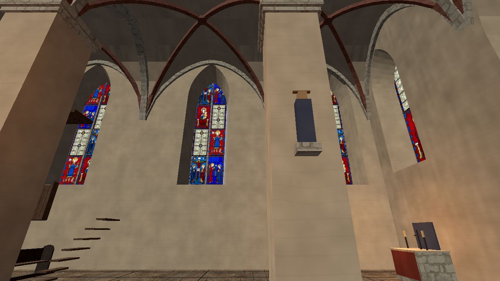

# Church interiors: period-correct glazing, furnishings and wall paintings

Status: in progress (epic task **R-1392**; glazing implemented in CI-01, task **R-1393**: eight painted plates as a texture array with a programme per church; CI-02..CI-06 planned). Scope: the interiors of the four city church sites (Holy Spirit, St Olaf, St Nicholas, St Mary's building site) built by `scripts/city/sites/*_builder.gd` and `church_furnishings.gd`. Out of scope: exteriors (LM / UF tasks), the Dominican St Catherine's interior (separate landmark task), Orthodox (Eastern) iconography.

## Why

The interiors read as primitive: stained glass was a shader of round medallions (`city_stained_glass.gdshader`, replaced by CI-01), wall decoration is a red circle with a plus sign (`_consecration_crosses` in `holy_spirit_builder.gd`) and zigzag friezes (`city_limewash.gdshader`), benches are plain boxes with the grain of the shared timber plate, and the liturgical vessels are bars and boxes. Goal: figurative, historically right content, mostly authored as generated art plus small real models.

## Period rules (apply to every item below)

- Reval in 1343 is Catholic, under the Danish crown, with Dominican (St Catherine's) and Cistercian (St Michael's) houses. Western forms only. The user asked for "icons": in 1343 that means painted panels (small devotional diptychs, altar frontals, the painted crucifix) and wall paintings, not Orthodox icons.
- Existing project rule (maintainer, 2026-10-07): an element dated after 1343 is left out; where the 1343 state is unknown, use a simplified form of the later documented one.
- **Benches need a decision.** Fixed nave pews are a 15th-16th century fashion. In a 1343 parish church the laity mostly stood or sat on stone benches along the walls and on movable stools; the clergy sat in choir stalls and sedilia. Proposed default: replace the nave benches with a few low movable oak benches and stools plus fixed choir stalls, and keep long benches only in the Holy Spirit almshouse chapel (a hospital church, where the sick sat). Needs maintainer confirmation before CI-03.
- Monstrances (c. 1350+), pointed Victorian canopies, printed books, pulpits with sounding boards and chandeliers of brass are later; keep the existing plain forms flagged as simplified in the doc, or drop them.

## Inventory: what to model, what to paint

| Group | Items attested for a 1340s Baltic parish church | Method |
|---|---|---|
| Altar vessels | chalice and paten (silver gilt), pyx / ciborium, cruets, altar cross, processional cross, censer and incense boat, aspergillum and holy-water bucket | small GLB kit, catalog objects |
| Lights | beeswax tapers, iron candle pricket stands (spike trays), paschal candle on a standing candlestick, sanctuary lamp, hanging corona | GLB kit plus existing lighting kit |
| Books and cloth | missal on a lectern, altar frontal, corporal and linen, banner / vexillum | lectern GLB, frontal textures |
| Altar fittings | painted crucifix (triumphal cross on the rood), winged retable with painted saints, reliquary casket, devotional panel | texture plates from image generation on simple panels |
| Fixtures | stone font with cover, piscina, sedilia, aumbry, Easter sepulchre niche, stoup, choir stalls, low benches and stools, bier, parish chest (poor box) | GLB kit and `church_furnishings.gd` |
| Glazing | figural lancets: Crucifixion, Virgin and Child, Annunciation, saints (Olaf, Nicholas, Mary, Catherine); ornamental grisaille with foliage for the rest | generated panel plates, new glass shader (CI-01) |
| Wall paintings | twelve consecration crosses (a cross pattee in a double ring, ochre and red, correct), a painted dado curtain (sinopia drapery), a Last Judgement over the chancel arch, Saint Christopher opposite the south door, a few saints in niches, ornamental banding of foliage and masonry lines | generated mural plates as decals (CI-04) |

## Glazing (implemented, CI-01 / R-1393)

Every glazed opening in the four church sites shows painted panels from one texture array instead of procedural medallions.

- **Plates** (layer index is a stable API, append only): 0 Crucifixion, 1 Virgin and Child, 2 Annunciation, 3 St Olaf (crowned king with axe and orb, dragon underfoot), 4 St Nicholas (bishop with three gold balls), 5 St Mary (crowned Queen of Heaven), 6 St Catherine (sword and wheel), 7 grisaille foliage with two small medallions. Sources: `assets/textures/churches/glass/plates/*.png` (512x768, not imported, `.gdignore`); runtime strip `assets/textures/churches/glass/glass_plates.png`, imported as `Texture2DArray` (8 horizontal slices). Rebuild the strip with `python3 tools/build_church_glass_plates.py` (`--check` reports a stale strip). Prompts and edits are in `assets/SOURCES.csv`.
- **Programmes:** `SiteKit.GLAZING` maps the site id to a programme row in `PROGRAMMES` of `scripts/city/city_stained_glass.gdshader` (six panels each, grisaille between figures): Holy Spirit = Crucifixion, Annunciation, Virgin and Child, St Catherine; St Olaf = St Olaf, Virgin and Child, Crucifixion, Annunciation; St Nicholas (and its St Barbara chapel) = St Nicholas, Virgin and Child, Crucifixion, St Catherine; St Mary = St Mary, Virgin and Child, Annunciation, Crucifixion. Builders pass it as `Kit.walls(body, glass, fabric, Kit.GLAZING.get(site.id, 0))`.
- **Per window:** vertex colour g packs `programme * 16 + seed` (seed from the opening's `seed` or position) as an exact 8-bit value; r, b, a carry window width, light count and height. Each light of a multi-light window starts at a different programme slot, and a tall light stacks `round(height * 0.667 / light_width / 1.3)` panels joined by dark saddle bars, so no plate is squeezed into a strip and adjacent figure panels differ. The pointed head clips the top panel.
- **Period:** flat Romanesque / early Gothic figures, pot-metal ruby, cobalt and silver-stain yellow, no lettering (the generated pseudo-text on the Crucifixion titulus was painted out to a blank plaque). Silver stain is attested in northern Europe from the early 14th century; acceptable for 1343 as a simplified form.

Verify: `tools/godot_render.sh --script tools/capture_church_interior.gd` (writes `glazing_*.png` for Holy Spirit and `glazing_<church>_{side_a,side_b,axis}.png` for St Olaf, St Nicholas, St Mary under `docs/reports/images/church_interiors/`), `godot --headless --path . --script tools/run_godot_tests.gd -- --filter=test_city_sites`, `python3 tools/validate_asset_sources.py`.

## Pipeline

1. **Image generation.** Try `openai_generate_image` first (project rule); on failure fall back to Leonardo (`leonardo_generate_image`). Prompts must name the period style: "Romanesque / early Gothic flat figures, Gotland and Westphalian 13th-14th century, hard outlines, no perspective, no text, no inscription, no cartouche". Never ask for "Gothic stained glass" unqualified: Leonardo returns 19th-century Gothic Revival with gibberish lettering.
2. **Plates** are stored under `assets/textures/churches/<kind>/` with a prompt sidecar, an `assets/SOURCES.csv` row (source, rights, approval) and an `.import` sidecar. Windows use the texture array described under Glazing above (the procedural medallion fallback was removed).
3. **Models** follow the object catalog rule ([OBJECT_CATALOG.md](./OBJECT_CATALOG.md)): a catalog entry with stats, a GLB or procedural builder and an image. Generators are Python/Blender scripts under `tools/` like the other `generate_*` kits.
4. **Integration** goes through `church_furnishings.gd` and the site builders; the Asset freeze (P0-040) forbids old pixel art, so everything here is new production art named by task.

## Task breakdown (parallelizable; each child has its own allowed files)

| ID | Task | Depends on |
|---|---|---|
| CI-01 (**R-1393**) | Stained-glass plates and shader: figural panels per window, grisaille, historic iconography per church | none |
| CI-02 (**R-1394**) | Liturgical vessel and light kit (GLB + catalog objects): chalice, paten, censer, crucifix, candle pricket, paschal candlestick, reliquary, lectern | none |
| CI-03 (**R-1395**) | Seating and fixtures: benches/stools/choir stalls, font with cover, piscina, sedilia, Easter sepulchre, plank floor (after bench decision) | decision above |
| CI-04 (**R-1396**) | Wall paintings: consecration crosses, dado drapery, Last Judgement, St Christopher, saint niches as decals; replace limewash zigzag frieze | none |
| CI-05 (**R-1397**) | Retable, altar frontal and painted crucifix plates (replace flat coloured boxes in `retable()` and `figure()`) | CI-02 for the cross |
| CI-06 (**R-1398**) | Integration, captures and review: place everything per church, `tools/capture_*` interior shots, docs, historian review | CI-01..CI-05 |

## Verification

- `tools/godot_render.sh --script tools/capture_holy_spirit_church.gd` style interior captures per church, before and after, saved under `docs/reports/images/church_interiors/`.
- `python3 tools/validate_object_catalog.py`, `python3 tools/validate_asset_sources.py`, `godot --headless --path . --script tools/run_godot_tests.gd`.
- Historian review of each plate (no post-1343 forms, no readable fake inscriptions).

## Limits

Only the glazing (CI-01) is implemented; plates are pending historian review, and the Leonardo account ran out of tokens on 2026-10-09, so further plates need a new budget or another generator. The St Mary captures frame the building-site choir tightly. Image-generation budget: the OpenAI account had no credits on 2026-10-08, so the first plates come from Leonardo (Nano Banana, `tools/generate_leonardo_v2_image.py`); the OpenAI model is also reachable there as `gpt-image-1.5`.
