# Church interiors: period-correct glazing, furnishings and wall paintings

Status: in progress (epic task **R-1392**; glazing implemented in CI-01, task **R-1393**: eight painted plates as a texture array with a programme per church; sunlight through the glass implemented in CI-07, task **R-1451**; ornamental wall paintings implemented in part in CI-04, task **R-1396**; CI-02, CI-03, CI-05, CI-06 and the figural murals planned). Scope: the interiors of the four city church sites (Holy Spirit, St Olaf, St Nicholas, St Mary's building site) built by `scripts/city/sites/*_builder.gd` and `church_furnishings.gd`. Out of scope: exteriors (LM / UF tasks), the Dominican St Catherine's interior (separate landmark task), Orthodox (Eastern) iconography.

## Why

The interiors read as primitive: stained glass was a shader of round medallions (`city_stained_glass.gdshader`, replaced by CI-01), wall decoration was a red circle with a plus sign and a zigzag frieze (both replaced by CI-04), benches are plain boxes with the grain of the shared timber plate, and the liturgical vessels are bars and boxes. Goal: figurative, historically right content, mostly authored as generated art plus small real models.

## Period rules (apply to every item below)

- Reval in 1343 is Catholic, under the Danish crown, with Dominican (St Catherine's) and Cistercian (St Michael's) houses. Western forms only. The user asked for "icons": in 1343 that means painted panels (small devotional diptychs, altar frontals, the painted crucifix) and wall paintings, not Orthodox icons.
- Existing project rule (maintainer, 2026-10-07): an element dated after 1343 is left out; where the 1343 state is unknown, use a simplified form of the later documented one.
- **Benches need a decision.** Fixed nave pews are a 15th-16th century fashion. In a 1343 parish church the laity mostly stood or sat on stone benches along the walls and on movable stools; the clergy sat in choir stalls and sedilia. Proposed default: replace the nave benches with a few low movable oak benches and stools plus fixed choir stalls, and keep long benches only in the Holy Spirit almshouse chapel (a hospital church, where the sick sat). Needs maintainer confirmation before CI-03.
- Monstrances (c. 1350+), pointed Victorian canopies, printed books, pulpits with sounding boards and chandeliers of brass are later; keep the existing plain forms flagged as simplified in the doc, or drop them.

## Inventory: what to model, what to paint

| Group | Items attested for a 1340s Baltic parish church | Method |
|---|---|---|
| Altar vessels | chalice and paten (silver gilt), pyx / ciborium, cruets, altar cross, processional cross, censer and incense boat, aspergillum and holy-water bucket | small GLB kit, catalog objects |
| Lights | beeswax tapers, iron candle pricket stands (spike trays), paschal candle on a standing candlestick, sanctuary lamp, hanging corona | GLB kit plus existing lighting kit |
| Books and cloth | missal on a lectern, altar frontal, corporal and linen, banner / vexillum | lectern GLB, frontal textures |
| Altar fittings | painted crucifix (triumphal cross on the rood), winged retable with painted saints, reliquary casket, devotional panel | texture plates from image generation on simple panels |
| Fixtures | stone font with cover, piscina, sedilia, aumbry, Easter sepulchre niche, stoup, choir stalls, low benches and stools, bier, parish chest (poor box) | GLB kit and `church_furnishings.gd` |
| Glazing | figural lancets: Crucifixion, Virgin and Child, Annunciation, saints (Olaf, Nicholas, Mary, Catherine); ornamental grisaille with foliage for the rest | generated panel plates, new glass shader (CI-01) |
| Wall paintings | twelve consecration crosses (a cross pattee in a double ring, ochre and red, correct), a painted dado curtain (sinopia drapery), a Last Judgement over the chancel arch, Saint Christopher opposite the south door, a few saints in niches, ornamental banding of foliage and masonry lines | generated mural plates as decals (CI-04) |

## Glazing (implemented, CI-01 / R-1393)

Every glazed opening in the four church sites shows painted panels from one texture array instead of procedural medallions.

- **Plates** (layer index is a stable API, append only): 0 Crucifixion, 1 Virgin and Child, 2 Annunciation, 3 St Olaf (crowned king with axe and orb, dragon underfoot), 4 St Nicholas (bishop with three gold balls), 5 St Mary (crowned Queen of Heaven), 6 St Catherine (sword and wheel), 7 grisaille foliage with two small medallions. Sources: `assets/textures/churches/glass/plates/*.png` (512x768, not imported, `.gdignore`); runtime strip `assets/textures/churches/glass/glass_plates.png`, imported as `Texture2DArray` (8 horizontal slices). Rebuild the strip with `python3 tools/build_church_glass_plates.py` (`--check` reports a stale strip). Prompts and edits are in `assets/SOURCES.csv`.
- **Programmes:** `SiteKit.GLAZING` maps the site id to a programme row in `PROGRAMMES` of `scripts/city/city_stained_glass.gdshader` (six panels each, grisaille between figures): Holy Spirit = Crucifixion, Annunciation, Virgin and Child, St Catherine; St Olaf = St Olaf, Virgin and Child, Crucifixion, Annunciation; St Nicholas (and its St Barbara chapel) = St Nicholas, Virgin and Child, Crucifixion, St Catherine; St Mary = St Mary, Virgin and Child, Annunciation, Crucifixion. Builders pass it as `Kit.walls(body, glass, fabric, Kit.GLAZING.get(site.id, 0))`.
- **Per window:** vertex colour g packs `programme * 16 + seed` (seed from the opening's `seed` or position) as an exact 8-bit value; r, b, a carry window width, light count and height. Each light of a multi-light window starts at a different programme slot, and a tall light stacks `round(height * 0.667 / light_width / 1.3)` panels joined by dark saddle bars, so no plate is squeezed into a strip and adjacent figure panels differ. The pointed head clips the top panel.
- **Period:** flat Romanesque / early Gothic figures, pot-metal ruby, cobalt and silver-stain yellow, no lettering (the generated pseudo-text on the Crucifixion titulus was painted out to a blank plaque). Silver stain is attested in northern Europe from the early 14th century; acceptable for 1343 as a simplified form.

Verify: `tools/godot_render.sh --script tools/capture_church_interior.gd` (writes `glazing_*.png` for Holy Spirit and `glazing_<church>_{side_a,side_b,axis}.png` for St Olaf, St Nicholas, St Mary under `docs/reports/images/church_interiors/`), `godot --headless --path . --script tools/run_godot_tests.gd -- --filter=test_city_sites`, `python3 tools/validate_asset_sources.py`.

## Wall paintings (implemented in part, CI-04 / R-1396)

The ornamental programme is painted; the figural murals (Last Judgement over the chancel arch, St Christopher opposite the south door, saints in niches) are not yet, because no image generator had budget on 2026-10-09 (Leonardo 402 "Insufficient tokens", OpenAI no credits, local ComfyUI not running).

- **Plates** (`assets/textures/churches/murals/`, RGBA, transparent where the wash shows): `consecration_cross.png` (cross pattee in a double ring, red ochre on yellow ochre), `dado_drapery.png` (curtain with rod and rings, folds, rosettes, scalloped hem; 2:1, tiles along the wall), `foliage_band.png` (green-earth vine scroll with trefoils and red berries between red-ochre rules; 8:1, tiles). They are geometry, so they are drawn procedurally by `python3 tools/build_church_mural_plates.py` (numpy + Pillow, fixed seeds, faded and flaking like secco on lime; `--check` reports a stale plate) instead of generated: deterministic and free of generated pseudo-lettering.
- **Decal layer:** `ChurchMurals.paint(lower, upper, site, fabric, cut, floor)` in `scripts/city/sites/church_murals.gd` lays the plates as textured quads 6 mm proud of the inner wall face (Godot decals are not available in the GL Compatibility renderer), shaded by `scripts/city/city_mural.gdshader` with the same indoor tone and candle smoke as the wash. The quads are cut at the cutaway height like the walls: `Church/Lower/Murals` holds the dado, `Church/Upper/Murals` the crosses. Walls with a plain `limewash` inner face get a curtain from the floor to 1.3 m and a 0.2 m foliage band over it, broken at doors, arches and low windows. Consecration crosses (0.62 m, centre 2.6 m above the wall's floor) go at the midpoints between openings of those walls, twelve picked evenly (`ChurchMurals.cross_spots`).
- **Per church:** St Olaf and St Nicholas (and its St Barbara chapel) get the full layer. Holy Spirit's walls use the `painted` wash, whose shader now paints its dado from `dado_plate` and its frieze from `frieze_plate` (the same plates; the zigzag is gone, the town-hall vine scroll beyond `rich_from` is unchanged); its eight crosses keep their old places (`_consecration_crosses()` in `holy_spirit_builder.gd`). St Mary is a building site and stays unpainted.
- **Period:** consecration crosses in a ring and painted dado curtains are attested in 13th-14th century Gotland and Baltic churches; Reval's own 1343 schemes are lost, so this is a simplified composite.

Verify: `tools/godot_render.sh --script tools/capture_church_interior.gd`, `godot --headless --path . --script tools/run_godot_tests.gd -- --filter=test_city_sites` (`test_church_murals_crosses_and_dado`), `python3 tools/build_church_mural_plates.py --check`, `python3 tools/validate_asset_sources.py`.

| Before | After |
|---|---|
| 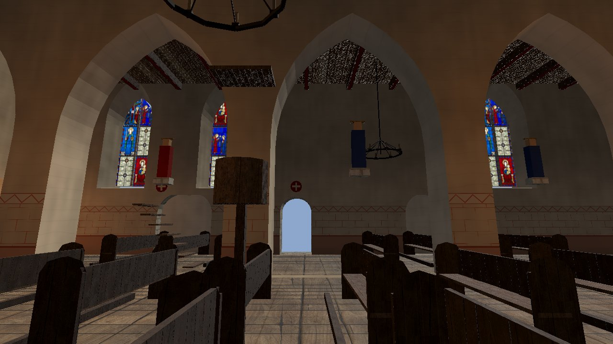 |  |
| 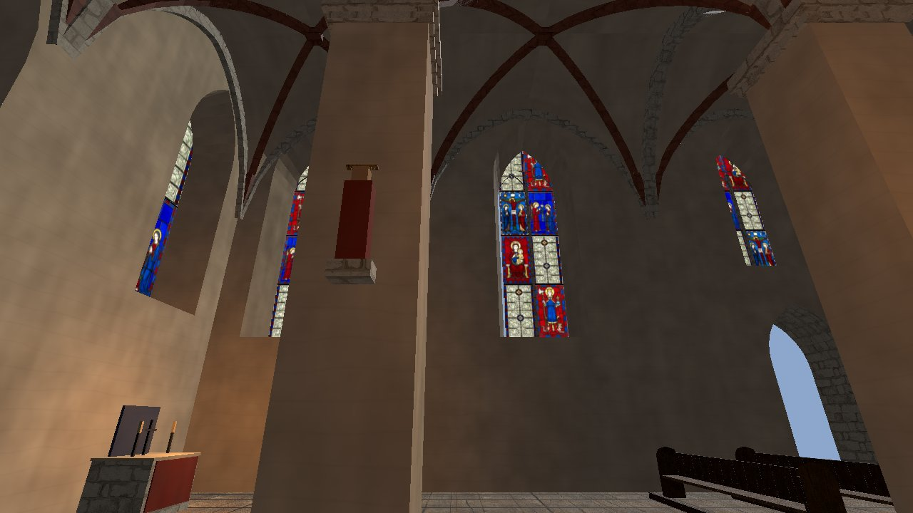 | 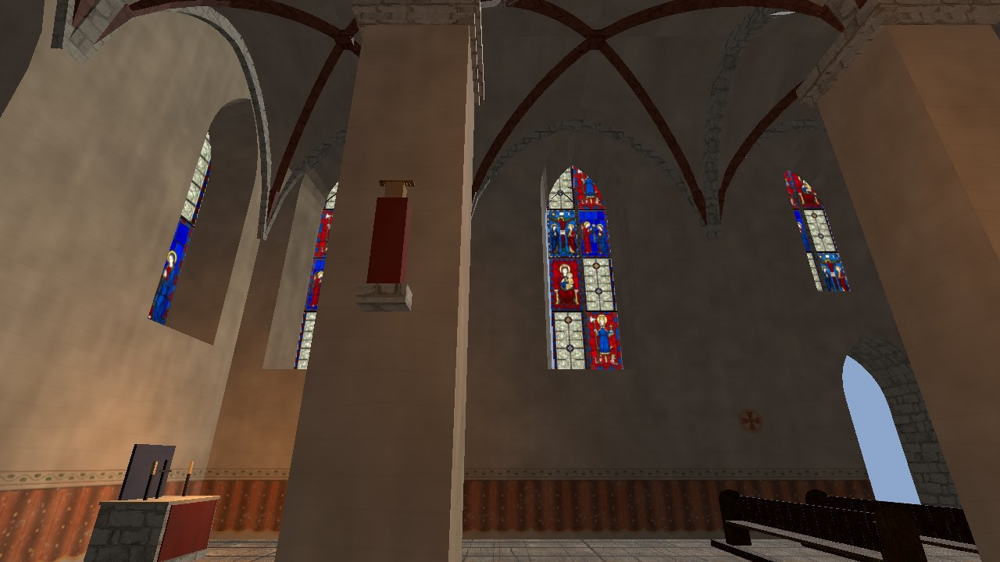 |
| 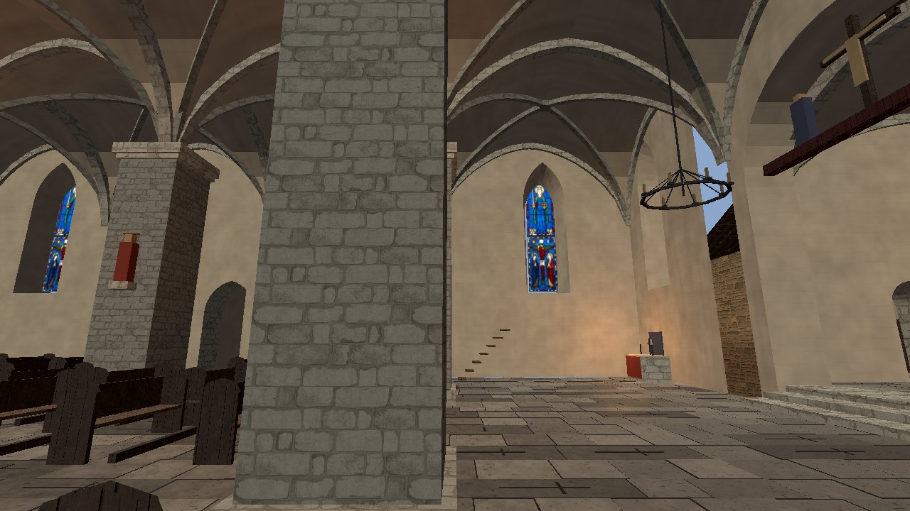 | 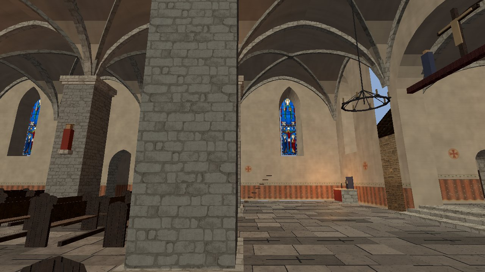 |

## Sunlight through the glass (implemented, CI-07 / R-1451)

The sun enters the four church sites only through their windows and lands as coloured patches of the window's own panels, with faint dusty shafts; both follow the sun over the day (and the moon at night, much weaker), without rebuilding any mesh.

- **Real sun through the holes:** the glass (`Glass`, `GlassLow`) casts no shadow, and the `Upper` walls and the `Roof` (vaults included) cast theirs through always-present proxies (`UpperShadow`, `RoofShadow`, `SHADOWS_ONLY`, same mesh). So the cutaway, which hides `Upper` and `Roof` while Kalev is inside, no longer floods the nave with sun from above: the engine's shadowed sun lights only what the window openings let through, and the reveals, piers and furniture cut it.
- **Coloured patch:** `scripts/city/city_window_sunlight.gdshader` is laid as `material_overlay` on every mesh under `Lower` and `Upper` except the glass (floor, walls, murals, furnishings). Per fragment it follows the ray towards the light, finds the window it leaves through (inside the glass outline, and through the outer face and the splayed inner face of the opening) and multiplies by that window's panel colour, sampled from the same plate array with the same panel walk (`scripts/city/city_stained_glass.gdshaderinc`, shared with the glass shader). The image is blurred with throw (`lod = log2(7.5 t)`, the sun disc's 0.53 degrees) and normalised to a fixed light level so a blue panel on a warm floor reads as light, not a hole. Window data (up to 32 per building: origin, wall direction and normal, width, spring, apex, glazing code, reveal depths) comes from the manifest fabric through `ChurchSunlight.windows()`.
- **Shafts:** `ChurchSunlight.shafts()` builds one prism per window (side quads of the glass outline); `scripts/city/city_window_shaft.gdshader` pushes the far end along the light to the floor or the opposite wall, adds the window's mean panel colour (half towards warm white), fades with throw and towards the silhouette, and dims as the wall thickness closes the opening to a grazing sun.
- **Light source:** the global shader uniform `window_sun` (`project.godot` `[shader_globals]`): xyz the direction towards the light, w its direct strength (sun energy against the clear-day `MapViewLighting.SUN_DAY_ENERGY`, times the shadow opacity that overcast lowers). `CityWorld3D.apply_time` sets it each time update through `ChurchSunlight.push_light(sun)`; capture tools call the same function.
- **Runtime entry points:** `ChurchSunlight.apply(building, lower, upper, roof, fabric, glazing)` in `scripts/city/sites/church_sunlight.gd`, called once by each church builder (`holy_spirit_builder.gd`, `st_olaf_builder.gd`, `st_nicholas_builder.gd` for the church and the St Barbara chapel, `st_mary_builder.gd`). No saved state.

- **Dim nave (R-1472):** the lime wash, painted wash and murals of the four churches are bound to `CitySiteKit.CHURCH_WASH_BRIGHTNESS` (0.5, against the 0.82 default for other buildings) through `bind_site_washes` and `ChurchMurals._material`, so the nave reads dim and the window patches, shafts and candles carry the scene. It is per-material, so streets and other buildings keep the global ambient. Tuning: change the constant; `test_church_walls_are_dimmed` guards that churches stay below the default.

Verify: `godot --headless --path . --script tools/run_godot_tests.gd -- --filter=test_city_sites` (`test_church_sunlight_through_glass`), `tools/godot_render.sh --script tools/capture_church_sunlight.gd` (writes `sunlight_<church>_{morning,noon,afternoon}.jpg` and `sunlight_<church>_noon_off.jpg`, the same view with the window light switched off, under `docs/reports/images/church_interiors/`).

| Window light off | Through the glass |
|---|---|
| 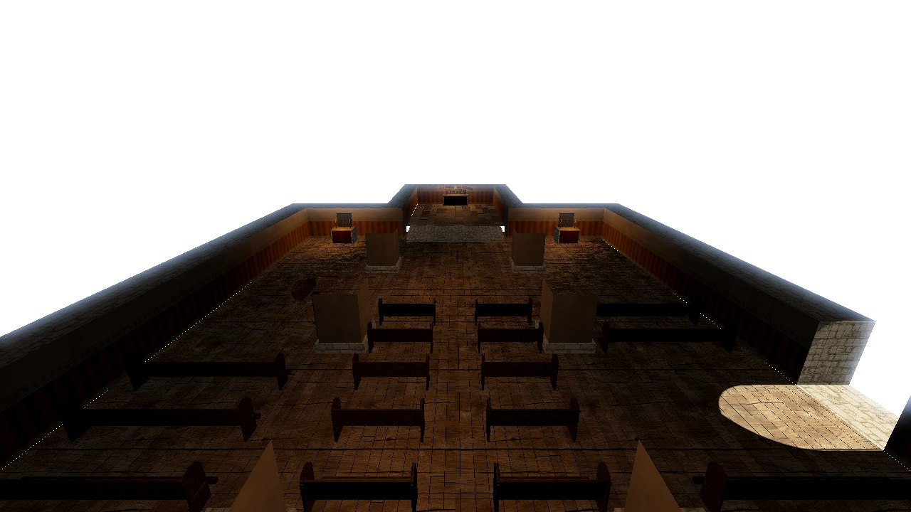 | 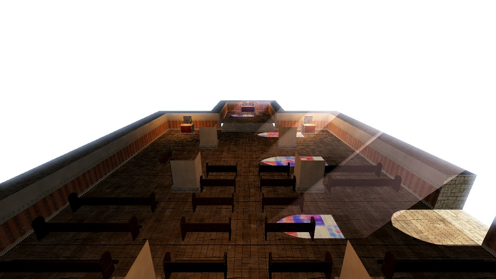 |
| 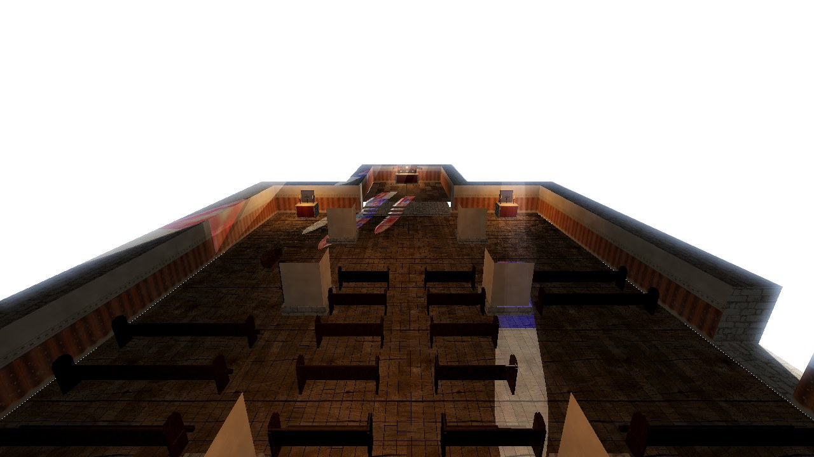 | 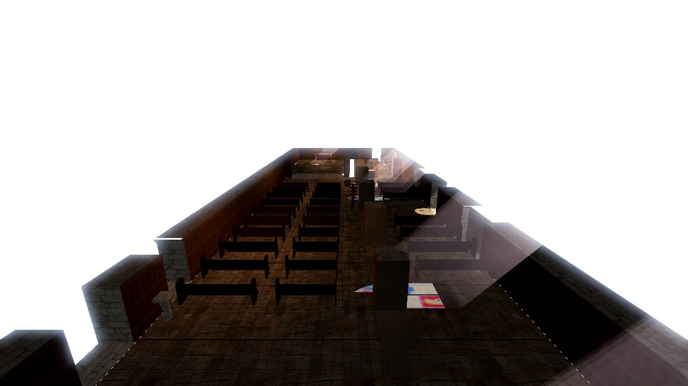 |

In the city with the game's own lighting at noon (`tools/capture_reval_city.gd` shots `st_olaf_cutaway` and `st_olaf_interior` with `DAY_PROGRESS` set to 0.5; at its default 0.42 the sun grazes St Olaf's walls and the patches are slivers):

| Cutaway | Nave |
|---|---|
| 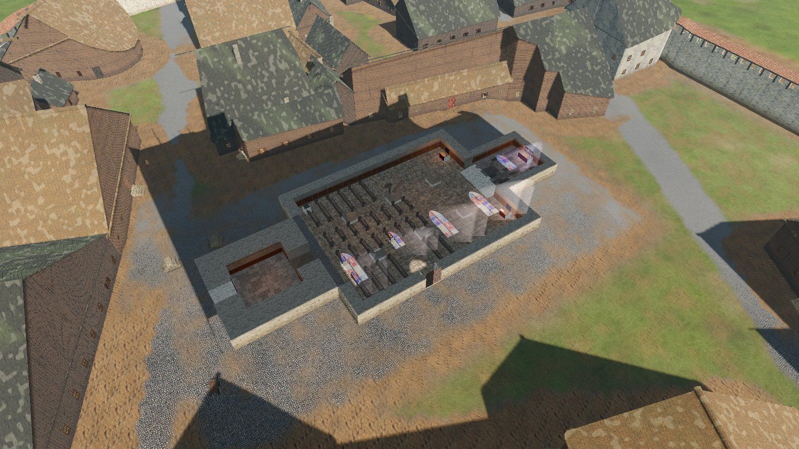 | 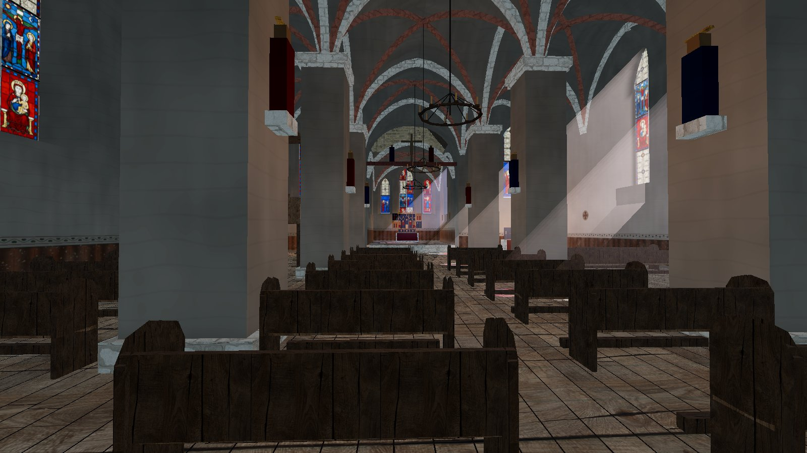 |

Limits: the overlay cannot read the shadow map (the Compatibility renderer draws shadowed lights in extra passes), so a bench or pier inside a patch casts no shade in it, and the tracery mullions do not cut it; the reveal is tested at its outer and inner faces only. The added light is a fixed level, not scaled by the surface's albedo (the screen texture read black in the city render). Shafts do not stop at piers. The interior's ambient light is unchanged, so the patches read best in the cutaway view; a dimmer church interior is a separate change. More than 32 glazed windows in one building: the rest get no window light.

## Pipeline

1. **Image generation.** Try `openai_generate_image` first (project rule); on failure fall back to Leonardo (`leonardo_generate_image`). Prompts must name the period style: "Romanesque / early Gothic flat figures, Gotland and Westphalian 13th-14th century, hard outlines, no perspective, no text, no inscription, no cartouche". Never ask for "Gothic stained glass" unqualified: Leonardo returns 19th-century Gothic Revival with gibberish lettering.
2. **Plates** are stored under `assets/textures/churches/<kind>/` with a prompt sidecar, an `assets/SOURCES.csv` row (source, rights, approval) and an `.import` sidecar. Windows use the texture array described under Glazing above (the procedural medallion fallback was removed).
3. **Models** follow the object catalog rule ([OBJECT_CATALOG.md](./OBJECT_CATALOG.md)): a catalog entry with stats, a GLB or procedural builder and an image. Generators are Python/Blender scripts under `tools/` like the other `generate_*` kits.
4. **Integration** goes through `church_furnishings.gd` and the site builders; the Asset freeze (P0-040) forbids old pixel art, so everything here is new production art named by task.

## Task breakdown (parallelizable; each child has its own allowed files)

| ID | Task | Depends on |
|---|---|---|
| CI-01 (**R-1393**) | Stained-glass plates and shader: figural panels per window, grisaille, historic iconography per church | none |
| CI-02 (**R-1394**) | Liturgical vessel and light kit (GLB + catalog objects): chalice, paten, censer, crucifix, candle pricket, paschal candlestick, reliquary, lectern | none |
| CI-03 (**R-1395**) | Seating and fixtures: benches/stools/choir stalls, font with cover, piscina, sedilia, Easter sepulchre, plank floor (after bench decision) | decision above |
| CI-04 (**R-1396**) | Wall paintings: consecration crosses, dado drapery, Last Judgement, St Christopher, saint niches as decals; replace limewash zigzag frieze | none |
| CI-05 (**R-1397**) | Retable, altar frontal and painted crucifix plates (replace flat coloured boxes in `retable()` and `figure()`) | CI-02 for the cross |
| CI-06 (**R-1398**) | Integration, captures and review: place everything per church, `tools/capture_*` interior shots, docs, historian review | CI-01..CI-05 |
| CI-07 (**R-1451**) | Sunlight through the glass: coloured patches and shafts that follow the sun | CI-01 |

## Verification

- `tools/godot_render.sh --script tools/capture_holy_spirit_church.gd` style interior captures per church, before and after, saved under `docs/reports/images/church_interiors/`.
- `python3 tools/validate_object_catalog.py`, `python3 tools/validate_asset_sources.py`, `godot --headless --path . --script tools/run_godot_tests.gd`.
- Historian review of each plate (no post-1343 forms, no readable fake inscriptions).

## Limits

Only the glazing (CI-01), its sunlight (CI-07) and the ornamental wall paintings (CI-04, without the figural murals) are implemented; plates are pending historian review, and the Leonardo account ran out of tokens on 2026-10-09, so further plates need a new budget or another generator. The St Mary captures frame the building-site choir tightly. Image-generation budget: the OpenAI account had no credits on 2026-10-08, so the first plates come from Leonardo (Nano Banana, `tools/generate_leonardo_v2_image.py`); the OpenAI model is also reachable there as `gpt-image-1.5`.
