# City sea, shore and harbour life

Status: implemented (tasks **R-885**, **R-1437**, **R-1440**, **R-1508**, **R-1606**, **R-1618**; city integration follow-up, 2026-10-09; ADR 0031). Scope: the Baltic off Reval and its shore in the seamless city: the sea surface and storm swell, seabed and beach relief, shore dressing, boardable boats and the working craft of the two shores; the Hareapea stream and moat water, their water plants and the wake Kalev leaves in any city water. Out of scope: swimming mechanics (ADR 0021), shipping routes, fishing as gameplay. Harbour layout and sources: [`FARMLAND.md`](./FARMLAND.md#harbour-and-kalamaja).

## What the player sees

- **Sea.** The same FFT ocean as the district maps (`MapViewMaterials.water_surface(TERRAIN_SHALLOW_WATER)`): baked waves, whitecaps and foam, shore swash, caustics, refraction and sun glint, driven by the sky weather (`apply_sea_weather` is called from `CityWorld3D.apply_time`). The open sea is 1 m per unit, so `SEA_WAVE_BOOST` (5.0, `CityWorld3D`) scales displaced crest height: a calm sea moves a few centimetres, a gale lifts crests to about 1.7 m and boats and swimmers ride it (`WATER_MATERIALS.set_wave_height_boost`, mirrored in the CPU hull sampler).
- **Seabed.** The generator (`build_reval_city_plan.py`) shapes the bed with shore-parallel sandbars and troughs, undulation and boulder fields, so depth varies instead of one tilted plane. Beaches get berms and runnels near the water and drift-sand hummocks.
- **Ground shader** (`city_ground.gdshader`): two sands, a dark wet strand, shingle just above the swash (see [Shingle and shore stones](#shingle-and-shore-stones-r-1606)), and below the waterline weed, mottled natural bedrock and ripple-marked sand. Land paving is suppressed below sea level; the shared masonry plate is not used for submerged rock.
- **Shore dressing** (`CityShore`): granite erratics clustered in the shallows (with weed skirts), half-buried boulders and stone clusters on the beach, 3D pebble beds, wrack lines, and glacial erratics on the coastal grass behind the beach, reusing the district maps' CO-02 meshes. Deterministic from the plan heightfield; nothing above the waterline lands on a cart road, paving or a field.

## Shingle and shore stones (R-1606)

Status: implemented (task **R-1606**). Scope: how beach shingle, loose road stones and dry-land shore stones look and where they lie in the seamless city. Out of scope: the district terrain blend shader (`map_view_terrain_blend.gdshader` keeps its shingle plate strands), an inland whole-map boulder scatter, and per-stone collision.

- **Shingle with depth.** The shingle band no longer samples the flat `shore_shingle` plate up close. `pebble_layer()` draws stones one per lattice cell, like the fieldstone paving: each is an ellipsoid cap of random size, elongation, yaw and flatness, bedded `bury` deep in the ground, with an analytic normal, a muted Estonian north-coast palette (`pebble_rock()`: mostly limestone, grey and red granite, dark gneiss, rare quartz) and contact shade in the gaps. Two layers: cobbles on `shingle_cell` (0.15 wu, about 5-12 cm stones) and pebbles at 0.42 of that cell filling their gaps. Past about one stone per pixel the band falls back to the `shore_shingle` plate's tone, so distant beaches keep their grain without shimmer. No new sampler (the ground stays at 13 texture units).
- **Soft edge.** `shingle` is a stone cover 0..1, not a texture blend weight. Cover decides per stone whether it is there and how big it is, so a bed thins stone by stone into scattered pebbles and then bare sand or mud over several metres. The band follows height above the sea (onset 0.2-0.75 wu, fade 1.3-2.9 wu) and low-frequency strands, and only grows on sand and mud (`smoothstep(0.2, 0.75, sand)`), not into turf.
- **Never on roads.** Cover is multiplied by `off_road = (1 - smoothstep(0.03, 0.3, roads.r)) * (1 - paving) * (1 - field)`.
- **Road stones.** Cart roads had flat pale value-noise blobs. Now a sparse `pebble_layer()` on `road_stone_cell` (0.07 wu) shows small stones bedded 55 % deep and dusted with the road clay, more on busy stretches (`roads.b`), only near the camera.
- **Pebble beds.** `shore_pebble_patch_a` and `_b` (stable kind IDs `pebble_patch_a` / `pebble_patch_b`) were flat discs with the shingle plate behind a vertex-alpha rim. `tools/build_shore_debris.py` now builds them as beds of separate rounded stones (4,920 and 7,980 triangles, granite and limestone slots, opaque), bedded 30-55 % below z = 0, with density and size falling off at a ragged rim. `CityShore` draws them only to `PEBBLE_DRAW_RANGE` (80 m) and only on beach sand (splat sand > 0.3 or within 1 wu of the sea).
- **More stones.** `CityShore.placements_for` adds half-buried boulders and denser stone clusters on the beach (`STONE_BAND`) and glacial erratics and cleared stones on the coastal grass up to 9 wu above the sea (`HINTERLAND_BAND`, thinning with height). Dry stones take a mid-tone tint (`_beach_tint`), not the pale plate colour. Every dry placement checks `_natural_ground()` (roads, paving and field rasters, probed 1.5 wu round the spot). Counts on the Reval plan: stone clusters 61 -> 641, boulders 268 -> 658, pebble beds 405 -> 515; placement takes about 1.2 s.
- **Districts.** `MapViewShoreDebris._place_dry_stone` lays the new beds without a lift and with a lighter tint; district placement rules are unchanged.

Review plates (`tools/godot_render.sh --script tools/capture_city_shingle.gd -- --tag=after`, picks a cart road crossing the shingle band and an open beach from the plan; left before, right after):

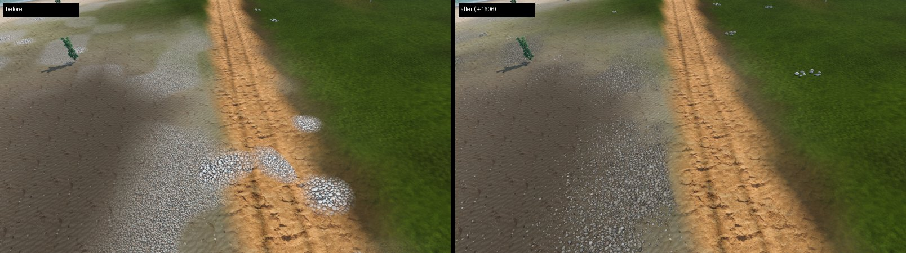

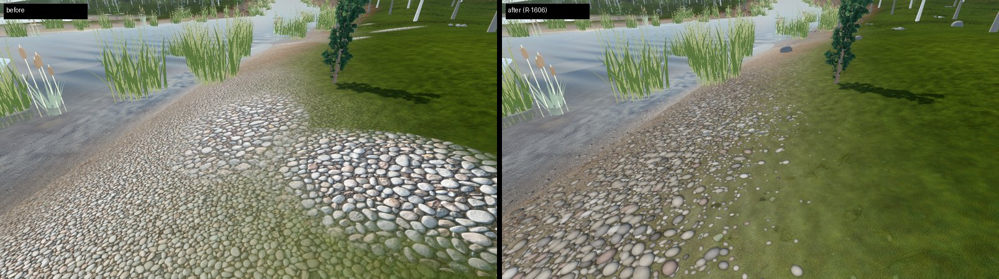

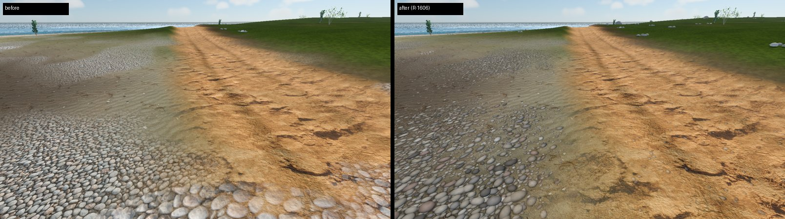

Verify: `--filter=test_city_shore` (bounded, deterministic, kinds present, no stone on a road, paving or field), `--filter=test_water_beach_response` (texture-unit budget, dry shingle stays matte, wet pebble variant).

Limits: the warp of the pebble lattice is left out of the analytic normal, so a stone's shading is very slightly off its outline; overlapping stones are resolved by the taller one, not by a full sort. Pebble beds are still visual only, and their wet look follows the fixed sandbox line, not the swash (see Beach response limits).
- **Boats.** `CityBoats` builds lofted clinker hulls: fishing clinker boat, skiff, flat-bottomed cargo lighter and the boat turned over on trestles. Cogs are `CogModel` ([`SHIPS.md`](./SHIPS.md)). **Cogs, boats and lighters at anchor or beached can be boarded**: Kalev swims alongside and steps onto the hull (`CityShips.deck_height_at`, hooked into `CityPlan.walk_height` through `dynamic_deck`). The sailing cog under way cannot be boarded.
- **Crane and shore furniture** (`CityHarbour`): a Hanseatic treadwheel crane (timber tower, spoked tread drum, jib with rope and hook) at the merchant landing, cargo stacks, net yards with pole racks.
- **Fish** (`CityFish`): deterministic shoals of herring and perch circle in the clear shallows near Kalev. Each school uses one `MultiMesh`, with a tapered body, forked tail and fins; `city_fish.gdshader` animates the tail from the shared ocean clock. Full body and fin bounds stay above the sampled bed and below the mean surface. Seven schools at most, with 11 herring or 5 perch each; school centres and seeds are unchanged.

## Stream, moat and wake

Status: implemented (task **R-1440**, deterministic swim pools and generator vegetation exclusion).

- **Hareapea stream** (`CityWorld3D._build_water`, `_stream_mesh`): a mitred grid ribbon (1.5 m cells) along the plan trace. Its width is measured per trace point out to where the carved bank climbs above the surface (`_stream_wet_halves`, plus `STREAM_BANK_OVERLAP` 1.5 m that the terrain hides), so the water meets the bank at the waterline instead of ending in a step over a dry pit. It uses the moat's murky shader (`city_moat_water.gdshader`) in a peat-brown tint (`_stream_material`): colour deepens with the water column and the edge fades into mud; ripples run downstream along the ribbon UV. The column comes from the vertices (depth over the plan ground baked into `COLOR.r`), not the depth texture, which read about zero in perspective under GL Compatibility and left the stream fully clear.
- **Water plants** (`CityMoatPlants`): reed and cattail clumps in the shallows (bed up to 0.8 m under the surface) of the moat and, now, both stream banks; on the stream the belt also climbs onto wet bank up to 0.3 m above the surface, and floating lily pads and duckweed are at 40 % of the moat's density.
- **No trees in the stream plan.** `stream_vegetation_exclusion()` in the generator rejects serialized tree/bush positions on the bed and wet banks, comparing interpolated water level with terrain plus 0.26 m clearance (runtime clearance plus quantisation tolerance). `plant()` and `shrubs()` guard their placement sinks; `countryside()` woods and orchard trees use the same guarded `add()`. Rejected candidates still reserve their spacing cell so unrelated seeded placements and stable land-use IDs do not shift. `CityWorld3D._clear_wet_trees` remains a safety net for stale/imported plans and the moat/sea, not the normal stream cleanup.
- **Wake** (`CityMapView._create_city_ripple_sim`): the district maps' WS-15 ripple sim (`WaterRippleSim`, 64-unit window, off on tiers with `ripple_sim_size` 0) runs in the city, centred 6 units ahead of the camera. `MapViewSwimmerPresenter` feeds it, so wading and swimming leave a V wake and an entry splash. It binds the sea material and every city water material; the moat shader reads it as normal slope, a little sheen and bubbly foam.
- Review plates: [bank](../reports/images/city/city_stream_bank.png) (murky water to the waterline, reed and cattail fringe), [wake](../reports/images/city/city_stream_wake.png) (ripple rings behind a wader).
- **Depth.** `stream_depth()` grades the bed from 0.9 m margins to a 1.05 m thalweg in ordinary reaches. Three compact, smooth pools deepen its centre: 2.0 m targets 18 m downstream of the Viru and Tartu road crossings (outside their decks), and a 1.8 m target on the approach to the lower bend, 16 m upstream of its vertex. The committed 2 m height grid gives swim-capable columns of roughly 1.7-2.0 m, with shallow exit margins. Pool profiles use deterministic distance along the existing trace, no RNG. Bed lowering happens after land-use placement so underwater slope changes do not rename fields or pastures. Water levels, banks, crossings and stable plan IDs are unchanged.
- **Playing and persistence.** Walk into a pool using the usual keyboard/mouse or gamepad movement: `CityMapView.water_depth_at()` feeds the existing `PlayerSwimState` (enter at 1.25 m, exit below 1.05 m); no new button or control mapping. The unchanged swimmer presenter floats and strokes the rig. No new save fields, flags or content IDs: reload continues to derive the medium from position and depth. Pool labels `pool.viru`, `pool.tartu`, `pool.lower_bend` are generator-local profile names, not saved entities.
- **Historical limits.** Scoured bend/bridge pools and a mill-pond-like deep reach are a **plausible composite**, not measured or attested 1343 bathymetry; no dam, named mill or pond site is added. See [canon confidence](../CANON.md). The lower pool stays upstream of the sea-datum boundary because the current runtime water query prioritises sea level wherever ground is below zero.
- **Pool proof.** [Kalev swimming below Viru](../reports/images/city/city_stream_pool_swim.png). The capture runs the real player water-depth provider and swimmer presenter through 120 controlled traversal frames, requiring `SWIM` on every frame, rather than forcing an enum or posing a mesh. This is not an end-to-end input or save/load capture. The current shared GL capture emits a particles-shader cleanup diagnostic at shutdown after writing the plate; no script/shader compilation error occurs during the pool traversal.

## Verify

```bash
godot --headless --path . --script tools/run_godot_tests.gd -- --filter=test_city_shore
tools/godot_render.sh --script tools/capture_city_sea.gd -- --only=sea_storm_wide,sea_calm_beach_close,fish
tools/godot_render.sh --script tools/capture_city_stream.gd -- --tag=x   # build/stream/{bank_up,bank_low,bank_mouth,top,wake,pool_swim}_x.png
godot --headless --path . --script tools/run_godot_tests.gd -- --filter=test_city_plan,test_city_stream
python3 -m unittest tests.python.test_build_reval_city_plan -v
python3 tools/city/build_reval_city_plan.py --check
```

## Perspective sea visibility (R-1437)

The FFT surface keeps discrete cloud-cell shadows but does not include the extra
continuous-deck sampler: that helper made the FFT sea disappear on macOS GL
Compatibility, even with no shader error in the capture log. Lightweight stream,
moat and horizon water retain their deck shadows. City sea meshes opt into
`sea_physical_depth` and use signed terrain height in vertex `UV2.y` as a minimum
optical column, independent of screen-depth failures. District meshes default off.
Shared material weather updates remain intact; the switch is mesh-instance state.
No input, stable content IDs or save format changes.

Verification: `tools/godot_render.sh --script tools/capture_city_sea.gd -- --tag=restored
--only=sea_calm_wide,sea_calm_shore,sea_storm_shore` (put both arguments on one line).
Run `tools/run_godot_tests.gd` with `--filter=test_cloud_cells,test_city_stream`.

## Surf, run-up and spray (shore field)

Status: implemented (city follow-up to **R-885**, WS-08).

The sea shader draws all surf (breaker foam, wave crest, run-up film, quay slosh) analytically from a per-map shore distance field. The city bound none, so its sea met the land as a hard cut with no foam. The district defaults also make a breaker only about 0.25 m tall and 2 m wide, which does not read on a metre-per-unit sea. What the city does now:

- **Shore field** (`CityShoreField.bake`, `scripts/city/city_shore_field.gd`): marching squares on plan ground height 0, then nearest-contour distance, landward direction and a beach flag (contour slope under 0.42 m per unit is beach, above 0.75 is quay, rock or bluff). Distances are divided by `DISTANCE_SCALE` (3), so the shader's 8-unit surf zone spans 24 world units; `shore_depth_scale` carries the same factor into the shader. Bake time is about 0.5 s.
- **Continuous surf and run-up** (`CityShoreField.build_band`): the 4 m coarse sea grid joins an indexed 0.5 m mesh in 128 m tiles, extending about 22.5 m offshore and 10.5 m inland. Both use one coarse-cell ownership predicate (`covers_coarse_cell`), preventing overlapping transparent triangles. Coarse boundary cells subdivide their shared edge at 0.5 m intervals and fan triangles to the centre, so their displaced edges meet the fine mesh without cracks. The inland extension belongs to this same surface: the separate city `ShoreSwashSheet` and its mesh builder have been removed.
- **Raised advancing front:** signed terrain height in `UV2.y`, with fine triangles matching the terrain's parent diagonal, carries the sea up the sand. Horizontal chop fades before the bank; the front gains 0.10–0.42 m of wind-dependent roller height plus the thinning water layer. Its shading normal follows that rise, using an interpolated bed gradient so reflections do not expose the terrain triangle diagonals. All potential run-up vertices retain a floor 1.8 cm above the encoded bed, including dry corners of triangles that cross the moving front; partial beach weights cannot sink wet triangles into the sand. Actual bed height controls permanent sea coverage; filtered shore distance controls only the advancing inland edge. Disagreement between the two zero contours can no longer expose a dry strip between meshes. Foam uses one multiscale patch pattern on the sea, breaking crest and run-up, with denser foam at the front and a fading trail. Existing tile channels provide metre-scale clumps, irregular lace and centimetre-scale grain; large circular rims are no longer the main close-camera pattern. The common foam mask suppresses mirror reflection and specular light and raises roughness. The shader displacement has a 6 m culling margin.
- **Surf strength** (`CityWorld3D.SURF_*`, applied through `MapViewMaterials.apply_surf_gain`): breaker height gain 2.0, run-up gain 1.8, crest geometry scale 1.3 (district 0.12), foam gain 2.2, depth scale 3. `apply_shore_field` resets all of them for district maps. The sea state, so the wind, scales the energy: a calm day laps, a fresh wind rolls breakers in with white crests, a gale floods the beach.
- **Spray** (`CityShoreSpray`, `scripts/city/city_shore_spray.gd`): thrown at breaking waves, not continuously ([WR-6](#event-driven-spray-wr-6)). Wind 0.35 starts it, 0.9 is full strength (`CityWorld3D.apply_time` feeds `set_wind`).

Earlier side-on review plates (`tools/capture_city_sea.gd`, before the continuous-surface correction below):

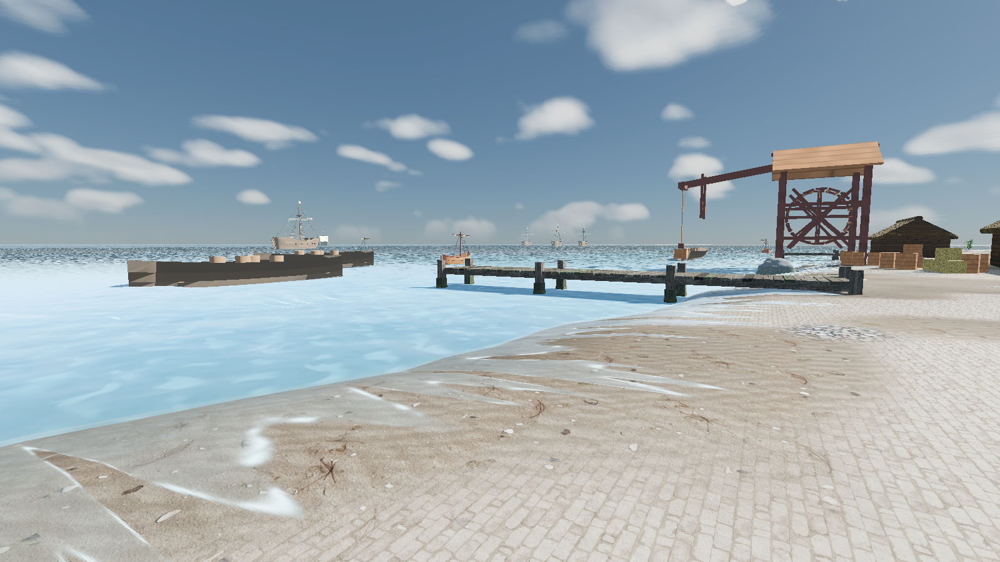

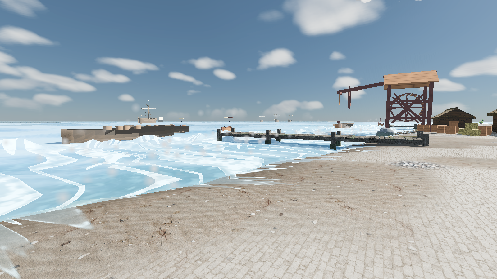

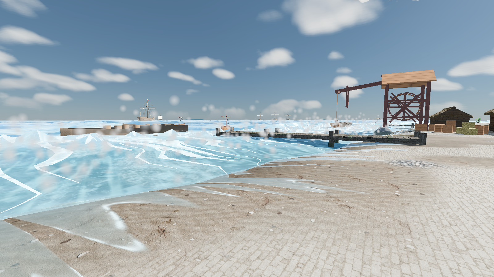

Verify: `godot --headless --path . --script tools/run_godot_tests.gd -- --filter=test_city_shore_field`; plates `tools/godot_render.sh --script tools/capture_city_sea.gd -- --tag=x --advance=6 --only=surf_side_calm,surf_side_fresh,surf_side_storm` (`--advance` shifts the wave phase; `surf_*` are the front plates).

Limits: the crest is a displaced mesh with foam, not a curling wave with a hollow face; steep silhouettes can still reveal the 0.5 m mesh. Inland run-up is visual: the existing camera medium and swim-depth queries still classify coastal positions by the mean waterline (`bed < 0`), so they do not classify a camera inside the thin inland bore as underwater. The wet-sand band follows the field since WR-9 ([Beach response](#beach-response-wr-9)); district quays and rocks get slosh foam only (no climbing water); in the city a reflected crest stands against the wall ([WR-4](#waves-feel-the-seabed-wr-4)).

## Optical and camera integration (R-885 / R-1437 follow-up)

The 2026-10-09 pass follows the existing [water/sky contracts](../tasks/water_sky/README.md): WS-01 transmission, WS-06/08 foam and shore, WS-11 lighting, WS-13 underwater and WS-15 ripples, plus CO-08 water life. The recorded [R-885 acceptance packet](../reports/r885_water_sky_pack_acceptance.md) identifies R-887/R-1150 and R-896/R-940 reviews, underwater follow-ups R-934/R-1031/R-1068/R-1087, and R-910 swimming. This does **not** close those gates or assert current board status; the live task-board tool was unavailable during this pass. No new tasks were created.

- **Transmission:** city sea uses metre-scale Beer–Lambert extinction (`physical_extinction`, RGB 0.40/0.24/0.30 per metre), multiplied by weather turbidity. Actual bed geometry replaces the synthetic floor. Fresnel controls the reflected share rather than a fixed reflection floor. In GL the city alpha path exposes opaque submerged geometry and reads its optical column only from bathymetry, skipping unreliable screen-depth/refraction reads; the opaque underwater face uses the sky LUT for its Snell window. Existing district material profiles retain their optical scale.
- **Wind, rain and flow:** `water_capillary.gdshaderinc` supplies two derivative-filtered waves from the shared wind direction, strength and ocean clock, without extra textures. City ground puddles, district puddle decals and stream/moat use it. Rain rings use current precipitation, not retained ground wetness. Stream and moat read baked bathymetry directly without a depth-buffer sampler/copy. Stream current follows the ribbon tangent and world-distance UV; shallow foam travels downstream, while still moat water only responds to wind and local wakes.
- **Camera:** `CityMapView` now creates and updates `UnderwaterPass`. `CityWorld3D.water_medium_at()` returns the actual sea, elevated stream or moat surface and rejects dry overlap at the banks. `CityWaterSurface` samples FFT, tide, shore shelter, analytic crest/slosh and the near-bank raised surface on the CPU using the retained shore field. The near-plane pass receives the local surface and one metre per world unit, with hysteresis at entry/exit. City surface triangles use their consistently authored face orientation for the underwater-face shader; a crest above a low camera must not turn into a false underwater strip. The underwater sea uses the same `physical_extinction × water_turbidity` as its top surface. Stream and moat use distinct, stronger humic profiles (blue attenuates fastest); all media take current day/night lighting from the shared sky-driven water material, even before the camera visits the sea.
- **Shore foam continuity:** surf phase and run-up variation use continuous world-space noise, shared with the CPU height probe. Projecting absolute city coordinates onto a changing shoreline tangent produced phase islands and white wedges at bends; that projection is removed. Bore foam forms over 0.18 seconds, then decays behind the front. City surf reuses the existing foam tile for bubble holes, with less entrained air in calm water than a gale; its downwind texture drift wraps by a whole number of tiles with the ocean clock. No new texture or simulation buffer.
- **Air bubbles:** entering the underwater state emits at most 24 small lit bubbles for 2.4 seconds. A single `MultiMesh` rises from the entry position, removes bubbles at the surface and becomes hidden when the burst ends or the camera exits. The underwater pass also hides completely once the existing wet-lens effect dries.
- **Cost and state:** no new per-frame textures, GPU readback, physics bodies, saved fields, content IDs or controls. Fish and bubbles have fixed budgets. The CPU shore field is retained once per city; fine surf generation visits only owned shoreline cells. Weather/save restoration continues through the existing R-715 environment envelope. Keyboard and gamepad still use the existing swim controls; this pass adds no new binding.

Water-body clarity is an authored optical profile, not a universal "Estonian water" setting. Sea transmission fades over metres; the stream's brown profile attenuates faster than the green moat, while puddles retain their visible ground. Wind/rain raise the sea turbidity. [HELCOM's water-transparency assessment](https://indicators.helcom.fi/indicator/water-transparency/) supports differentiating basins and the effect of coloured dissolved organic matter; its modern monitoring is a visual reference, **not** evidence for medieval Reval or a calibration of these shader coefficients. No lakes, algal-bloom simulation or seasonal water-quality model are introduced.

The camera sample is an approximation: it does not invert the shore crest's horizontal curl or reproduce every interpolated GPU triangle/local wake. It substantially improves coastal entry classification, but does not claim exact CPU/GPU surface parity. Fish containment uses mean sea level; waves can temporarily uncover the very shallowest school edges. Caustics remain on the existing screen-refraction path; the GL transparency fallback does not project them onto the real bed.

### Reproduce and inspect

```bash
godot --headless --path . --script tools/run_godot_tests.gd -- --filter=test_city_water_realism,test_city_shore_field,test_city_stream,test_shore_distance_field,test_r715_water_material_contract,test_r715_water_weather_sync,test_sea_state_ladder,test_r715_water_save_envelope,test_r715_water_surface_geometry
tools/godot_render.sh --script tools/capture_city_sea.gd -- --tag=review --only=fish,fish_under,fish_straddle,fish_under_up,fish_night,stream,sea_calm_wide,surf_side_storm --bench=180 --motion=96
tools/godot_render.sh --script tools/capture_city_sea.gd -- --tag=minimum --tier=minimum --only=fish,fish_under,stream,sea_calm_wide
tools/godot_render.sh --rendering-method mobile --rendering-driver metal --script tools/capture_city_sea.gd -- --tag=metal --only=fish,fish_under,stream
```

The capture uses the real `CityMapView` camera/underwater integration. `--advance=N` offsets the wave phase; `--motion=N` writes N frames at a fixed 24 Hz simulation step. For recording only, a shader copy replaces the water material's secondary `TIME` inputs with the stepped ocean clock; slow PNG readback must not accelerate the fine ripples/foam in the resulting video. Runtime shader files are unchanged by this override. `--bench=N` measures N frames after warm-up with VSync disabled and without screenshot readback inside the timing loop, writing mean/p95 milliseconds and draw calls to `build/city_sea/benchmark_<tag>.json`. This is **whole-scene frame time**, not isolated GPU water time. `--baseline` loads the locally preserved pre-edit sea shader from `build/scratch/water_before/`; it compares that shader only, with current geometry, fish and city systems, and fails if the snapshot is absent. Benchmark both variants serially without another GPU capture running. `--hide-water` is a diagnostic control: hide the city Water subtree (including water plants) to measure the remaining scene, retaining the same camera and other systems. It is not a gameplay quality preset. `--shader=res://…` loads a diagnostic sea shader without replacing the runtime source. `sea_morning`, `sea_evening`, `sea_night`, `sea_windy`, `sea_rain`, `sea_gale` pin actual sky presets; morning/evening use the calendar's sunrise/sunset ±36 minutes. Sky weather is held during each pose, and the log records sun elevation, wind and rain. The game's storm preset represents local thunderclouds with possible clear sky between cells; the rain preset is the overcast front.

The focused tests cover dry-bank rejection, elevated water, underwater state transitions, night lighting on first stream entry, bubble lifetime, full fish body/fin bounds, rain cessation, shared wind, continuous crest phase at shore bends, exclusive mesh ownership and stitched edge vertices. Shore regressions also check matching terrain triangles, the full inland run-up extent, raised moving fronts/backwash, and uninterrupted wet-bed coverage when the shore-field zero disagrees with the real terrain. They do not replace manual swim/input or gameplay save/reload acceptance.

### Captured evidence and performance (2026-10-09)

Generated review media and JSON are local output, intentionally ignored by Git under the storage policy. This session keeps them in `docs/reports/images/water_realism_20261009/`; raw repeatable captures are in `build/city_sea/`. Filenames below refer to that review directory. Reproduce the raw scenes with the commands above.

Prior sea shader (`before.jpg`), clear shallows and fish (`shallows.jpg`), underwater and bubbles (`underwater.jpg`), night (`night.jpg`), stream (`stream.jpg`), storm (`storm.jpg`), Metal refraction (`metal_shallows.jpg`), and surf motion at 24 fps (`surf_calm_motion.mp4`, six seconds; `surf_motion.mp4`, three seconds). Motion clips: fish (`fish_motion.mp4`), stream current (`stream_motion.mp4`), puddle wind (`puddle_wind_motion.mp4`), rain on puddles (`puddle_rain_motion.mp4`). Puddle land views: rain (`puddle_rain.jpg`), calm (`puddle_calm.jpg`), wind (`puddle_wind.jpg`). The weather/time comparison (`sea_conditions.jpg`) shows sunrise, cloud/wind, rain, evening, night and a gale from one camera; it precedes only the final textured shore-foam refinement. Final calm/storm surf clips and fish motion include that refinement.

Measured on Apple M5 Pro, Godot 4.7.1, GL Compatibility, 1600×900, recommended tier, 240 frames per pose after warm-up. Recorded frame times and control runs (`frame_times.json`):

| Scene | Mean frame time | p95 | Mean FPS equivalent |
|---|---:|---:|---:|
| Clear shallows / fish | 19.69 ms | 35.61 ms | 50.8 |
| Underwater | 15.11 ms | 28.13 ms | 66.2 |
| Camera at waterline | 18.50 ms | 35.60 ms | 54.0 |
| Open harbour view | 12.22 ms | 19.90 ms | 81.8 |
| Storm surf | 16.10 ms | 19.03 ms | 62.1 |
| Stream, including the surrounding city | 69.37 ms | 73.97 ms | 14.4 |

These are whole-scene samples, not a stable 60 FPS guarantee. The prior-sea-shader control measured 25.61 ms at the fish and 18.38 ms at the open harbour, with the same current geometry; it does not establish a whole-project speedup. Minimum tier still measured 66.84 ms at the stream, so lowering water quality alone does not meet the frame budget there. GPU captures on GL and Mobile/Metal produced no in-frame shader compilation errors; both retain the pre-existing particles-shader cleanup diagnostic at process exit.


The final 180-frame surf checks measured 13.86 ms mean / 20.21 ms p95 in calm water and 17.78 / 30.03 ms in storm surf. The weather/time matrix measured 14.00–26.15 ms mean per scene (sun elevations about +4.1° for morning/evening and −13.9° at night). These shorter runs include the shoreline-phase correction and sea clarity profile; the matrix precedes the final foam-texture refinement. One final capture also encountered a transient, unrelated `UserSettingsStore.load_graphics_settings` startup error in the shared checkout; the explicit capture tier was still applied.

Initial optical-pass focused gate: **green**, 9 files / 63 tests / zero failures / zero captured errors (`build/city_sea/focused_tests.log`). A second read-only reviewer confirmed mesh stitching, bounded fish/bubble costs, lighting, scope and the documented limitations. The subsequent foam clock-wrap correction also passed the 16-test material contract (`build/city_sea/wrap_contract.log`) and a GL surf capture. The shoreline follow-up below adds another regression.

After removing the stream's unused depth-buffer read, a separate 360-frame control measured **55.88 ms without the Water subtree versus 57.29 ms with it** (p95 74.80 / 83.83 ms). That pair includes water plants and shows a 1.41 ms mean difference; host/frame variation prevents treating it as an exact GPU cost. The scene remains about 17 FPS even with water hidden, so this pass cannot claim a smooth whole-city frame budget.

Full workspace gate at the initial optical pass: **not green** — 382 loaded files, 2,257 tests, 369 failed assertions and 1,172 captured errors (failure groups (`suite_summary.json`); raw log `build/city_sea/full_suite.log`). Failures include inactive map-transition destinations, missing house production evidence, vegetation checks and world traversal. The two R-715 rollout/inventory failures also concern maps rejected by the current transition registry. The changed city-water tests pass within that run. The shared checkout contains other in-progress changes, so this is not a clean regression baseline and does not close the pack-wide acceptance gate. `docs_index.py --check`, GDScript lint for changed water scripts, and `git diff --check` pass. The active-docs report recorded 150 workspace link/anchor issues at that point; the later shoreline verification regenerated it against the updated shared checkout with zero documentation issues.

### Low-camera shoreline regression (2026-10-09)

The reported screenshot exposed a gap between the sea and the independent terrain sheet, which the earlier coarse/fine sea-grid test did not exercise. The continuous surface described above removes that second owner and adds signed-bed and full-run-up coverage checks. City coarse and fine meshes also have a tested clockwise top face and identical bed values at shared edge vertices; only the city opts into face-based underwater shading. District sheet meshes and their minimum-tier rule remain unchanged. The city retains its joined surface on every tier.

Reproduce the low-angle views and a nine-second wave cycle:

```bash
tools/godot_render.sh --script tools/capture_city_sea.gd -- --tag=join --advance=4 --only=shore_reverse_fresh --motion=216 --bench=180
tools/godot_render.sh --script tools/capture_city_sea.gd -- --tag=conditions --advance=4 --only=shore_join_calm,shore_reverse_storm,fish_under,fish_under_up --bench=180
tools/godot_render.sh --script tools/capture_city_sea.gd -- --tag=minimum --tier=minimum --advance=4 --only=shore_join_fresh
```

Local ignored evidence is in `docs/reports/images/water_shore_join_20261009/`: `shore_cycle.mp4` (216 frames at 24 fps), `raised_front.png`, `shore_before.png`, `shore_join.png`, `calm.png`, `storm.png`, `underwater.png`, test/capture logs and `frame_times.json`. The static `shore_join.png` precedes only the city face-orientation refinement; the complete reverse-view movie includes it. GL calm/fresh/storm and underwater shots, plus Mobile/Metal fresh/storm shots, compile and render without in-frame shader errors. A diagnostic face-colour render confirmed consistent top faces; it encountered an unrelated transient sky-shader edit in the shared checkout and is not acceptance evidence for lighting. Final water regression: **9 files / 64 tests / zero failures / zero errors**. That review missed a separate numerical failure: later user screenshots and GPU diagnostics exposed dark polygons from a non-finite wave profile. This historical capture is superseded by the close-camera regression below; it is not acceptance evidence for the final appearance.

Whole-scene GL measurements at 1600×900, recommended tier, Apple M5 Pro, 180 frames after warm-up: calm shoreline **18.96 ms mean / 33.34 ms p95**, fresh wind reverse view **23.90 / 37.92 ms**, storm reverse view **25.40 / 43.01 ms**. An earlier same-direction forward view measured **21.38 ms before / 24.32 ms after** the geometry change (p95 31.40 / 36.83 ms); these short samples in a concurrently edited checkout do not isolate GPU water cost or establish a speedup. There are no added rendering passes, textures or per-frame mesh rebuilds; the removed city sheet saves its separate draw, while the joined mesh extends farther inland. These results do **not** meet a stable 60 FPS budget.

### Close-camera foam and non-finite surface regression (2026-10-09)

The sharp sea/shore bands were not just a foam-density mismatch. GLES evaluation of `cos(PI)` could undershoot −1 by one ulp; the fractional power of `0.5 + 0.5*cos(phase)` then yielded NaN in the shared shore height and subsequently the shading normal. GPU diagnostic plates showed invalid values exactly over the reported dark bands. `shore_swash.gdshaderinc` now clamps the power base to a positive epsilon; squared Gaussian coordinates use multiplication. The CPU shore-height mirror keeps the same bound.

Exact-zero height nodes retain a landward field direction from the local terrain gradient; their formerly zero direction grew small invalid shore islands under texture filtering. A separate sharp colour boundary came from the sediment tint stepping at the mean waterline. City sediment now continues across that contour and scales with absorbed light, so a thin run-up cannot scatter like a deep bore.

The city surface also smooths the ocean/run-up join and preserves the terrain floor at mixed beach weights. Its 0.5 m mesh is indexed: approximately four unique vertices per square metre replace six unindexed vertices on the old 1 m grid. This bounds repeated vertex-shader work, but increases triangle count fourfold and adds one-time mesh indexing/bed-normal baking; it is not a blanket performance improvement. No extra render pass, sampler, production texture or per-frame mesh rebuild is added. Three samples of the existing foam tile replace the previous two whitecap samples plus one bore sample. The GL city alpha path explicitly skips synthetic-bed and caustic evaluations whose result would be discarded; Metal and district transmission retain them.

`tools/capture_city_sea.gd` adds `close_…` views on an open strand and `sea_level_calm/fresh/storm` views at swimmer-eye height. `--validate-surface=N` samples N phases of a full wave period after timing/capture. The default-off `debug_surface_validity` shader mode marks finite water green and invalid vertices/normals/colours magenta; only in this diagnostic are invalid vertices restored so they cannot silently disappear before fragment checks. The capture fails on any magenta samples or insufficient green coverage in any phase, writes `validity_<tag>.json`, and saves a diagnostic plate. Pixel readback is outside the benchmark and absent in gameplay. An intentionally unguarded scratch shader is the negative control.

```bash
tools/godot_render.sh --script tools/capture_city_sea.gd -- --tag=close --advance=4 --only=close_shore_reverse_fresh,sea_level_storm --validate-surface=12 --motion=216 --bench=240
tools/godot_render.sh --rendering-method mobile --rendering-driver metal --script tools/capture_city_sea.gd -- --tag=close_metal --advance=4 --only=close_shore_reverse_fresh,sea_level_storm --validate-surface=12
```

The exact-zero regression in `test_city_shore_field.gd` checks interpolated directions and beach type across a synthetic zero-height contour. Its mixed-beach floor regression sweeps wave phases, partial beach flags and terrain heights, including dry vertices needed by front-straddling triangles. Geometry tests still require matching terrain triangles, exclusive ownership and stitched bed values. This pass changes presentation only: controls, persistent state and stable content IDs are unchanged. The earlier full-workspace gate limitations still apply.

Local ignored evidence is in `docs/reports/images/water_close_20261009/`: `before.png`, `close_shore.png`, `sea_level_storm.png`, `shore_cycle.mp4`, `sea_level_storm.mp4`, phase contact sheets, renderer/weather plates and validity/performance JSON. Production GL/Metal and calm/morning/rain/night checks found no invalid water values across 72 sampled phases. The negative control, reverting only the positive power-base guard in a scratch shader, found 416,050 invalid sampled pixels over four phases and exited with failure. Independent review accepted the removal of the reported dark bands, dry island and contour seam; Metal still shows stronger specular highlights and small refraction facets, so this is not renderer parity or a claim of perfect realism. The focused water suite passed **9 files / 66 tests / zero failures / zero errors**. Captures retain the known particles-shader cleanup diagnostic at process exit; it is not an in-frame shader compile failure.

A 240-frame GL run at 1600×900/recommended tier measured **35.54 ms mean / 53.07 ms p95** at storm swimmer height and **36.27 / 53.80 ms** along the close shore. Matching Water-hidden controls measured **32.03 / 50.14 ms** and **33.09 / 54.04 ms**. The roughly 3.2–3.5 ms mean difference includes the whole Water subtree and host/frame variation; it is not a precise isolated GPU shader cost. The city remains above a 16.7 ms frame budget without water. These samples precede only the explicit discarded-bed-work guard and the capture-only secondary clock fix; no stable 60 FPS claim is made.

The final guard passed the 16-test material contract and a further six-phase GL validity check. The synchronized GL recordings added twelve valid phases; a minimum-tier Mobile/Metal run added six, with no invalid samples or in-frame shader errors. Its shorter 120-frame GL shoreline sample measured **46.78 ms mean / 68.18 ms p95** (`frame_times_final_gl_static.json`); it does not demonstrate a speedup. The guard avoids logically unused work, but varying whole-scene timings cannot establish its GPU benefit. The two final nine-second clips use the synchronized recording clock described above. Their phase sheets retain a connected surface throughout; steep crests can still reveal the mesh and storm foam can appear overly dense.


## Water realism v2 (WR-1, WR-2)

Status: implemented (tasks **R-1499** WR-1 and **R-1500** WR-2; pack [WR - Water realism v2](../tasks/water_sky/WR_water_realism_v2.md), epic **R-1497**). Scope: the city sea's wave geometry and foam. Out of scope (planned in the pack): camera-distance LOD and tier presets (WR-3), depth refraction and breaker types ([WR-4](#waves-feel-the-seabed-wr-4)), wave interaction with rocks (WR-5), event-driven spray ([WR-6](#event-driven-spray-wr-6)), a persistent foam buffer (WR-7), gusts and rain on the sea (WR-8). Beach wetting is implemented in [Beach response (WR-9)](#beach-response-wr-9). District maps are unchanged: every switch below is gated on the city's `sea_physical_depth` instance flag or on `shore_crest_shape`, which `apply_shore_field` resets to 0.

Verified on the [water sandbox](./WATER_SANDBOX.md) (synthetic coast, R-1498) and in the city.

**Wave geometry (WR-1).**

- **Real troughs.** The district guard `FFT_TROUGH_FLOOR` clamps every trough to 1.5 mm below rest, because district beds sit centimetres down. The city has metres of water, but used the same clamp, so its sea was crests over a flat plane with a kink at the clamp: the sharp ridges players saw. The city path now uses `_fft_bed_trough` (`ocean_fft_common.gdshaderinc`): troughs keep their full depth and only ease, with a 0.08 m polynomial smooth max, onto the actual bed plus `CITY_TROUGH_CLEARANCE` (0.05 m).
- **Band-limited displacement.** Cascade C1 (4-16 m waves) no longer displaces the city's 4 m open-sea grid (`CITY_C1_GEOMETRY` 0, `_fft_displacement_foam_with_c1`): below Nyquist it drew triangular spikes. C1 and C2 stay in the per-pixel normal, so the small waves still shade. Both city meshes (coarse grid and 0.5 m surf band) use the same rule, so their shared edges still meet. C1 returns to the geometry near the camera with the LOD rings of WR-3 (see [Sea LOD and graphics tiers](#sea-lod-and-graphics-tiers-wr-3)).
- **Rounded spilling crest.** `shore_crest_shape` (city 1.0, `CityWorld3D.SURF_CREST_SHAPE`) widens the breaker by 30 %, softens the skew (shoreward face 0.65 instead of 0.4 of the width), lowers the peaking exponent from 1+2s to 1+0.8s and keeps 30 % of the curl that pushed the crest over its own face into a lip.
- **CPU parity.** `CityWaterSurface.sea_height` (camera medium, swimmers) uses the same band-limited displacement (since WR-3 weighted by `CitySeaLod.displacement_weights`) (`OceanFftSampler.height_at(..., c1_geometry)`), `OceanFftSampler.bed_trough` and the crest shape.

**Foam attached to the water (WR-2).**

- **No conveyor.** The former `_city_foam_pattern` scrolled all layers downwind at a fixed speed, independent of the water, and read as a foam sheet sliding over the sea. `_city_foam_cells` has no clock term: it is sampled at the rest (Lagrangian) position, which the FFT vertex displacement carries with the surface, so foam rides its crest. Structure: warped value-noise patches (metres, decimetres) carry the shape and the foam tile's bubble cells and grain add detail. The domain warp keeps the tile's round Worley rims from showing as rings.
- **Surf foam moves with the swash.** `shore_state` exports `surge`: the shallow-water excursion of water under a broken wave (about H/2 sqrt(g/h) T / 2 pi, capped at 4 m), with a quick landward lunge as the bore passes and a slow return. The surf samples its foam at the rest position minus that surge, so foam surges in and out with every breaker. On the run-up sheet the coordinate follows the swash front instead, carrying foam up the sand and back with the backwash.
- **Foam ages into lace.** `_foam_dissolve` keeps only the brightest part of the structure as coverage falls, so dying foam shrinks to rims and holes instead of fading as a sheet. Its edge widens with `fwidth`, so distant and grazing foam averages instead of producing moire. Surf coverage follows the bore's age (`shore_state.foam_age`): a dense roller about 0.35 s behind the front, lace that decays over `CITY_SURF_FOAM_LIFE` (4 s), and a 12 % patchy scum over the surf zone between sets. Quays and rocks keep their slosh foam. The run-up film is a narrow bead at its leading edge plus sparse lace, no longer a white blanket. The scrolling edge ribbons (`edge_foam`) are off on the city sea.
- **Whitecap coverage.** Only the part of the baked fold mask above `CITY_WHITECAP_THRESHOLD` (0.5) breaks, dissolved at gain 0.6. In the sandbox, the open sea shows isolated caps in a fresh breeze and large foam fields with dark water between them in a gale, the Beaufort 3-4 versus 8-9 progression. Wind streaks keep 35 % of the tile's streak channel and meander with the warp.
- **Interim spray.** Shore spray droplets shrank from 0.45 m to 0.11 m quads (twice as many) and are lit (`SHADING_MODE_PER_VERTEX`) instead of unshaded, so they no longer look like floating cotton balls or glow at night. Replaced by event-driven spray in [WR-6](#event-driven-spray-wr-6).

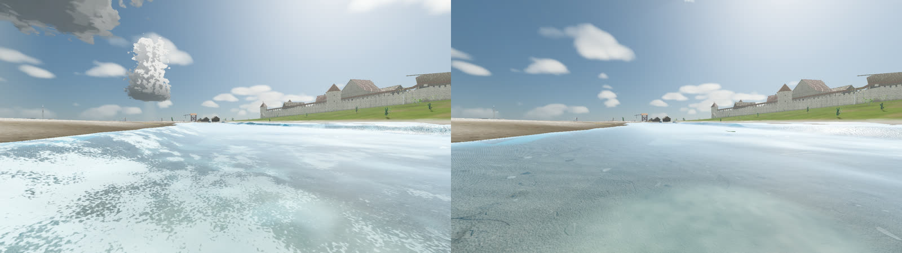

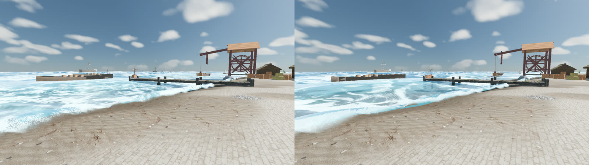

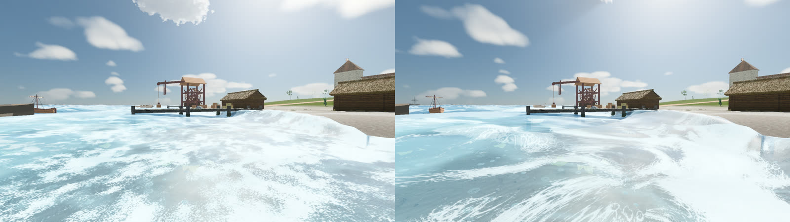

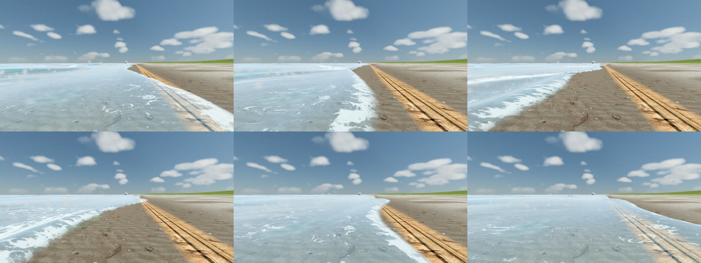

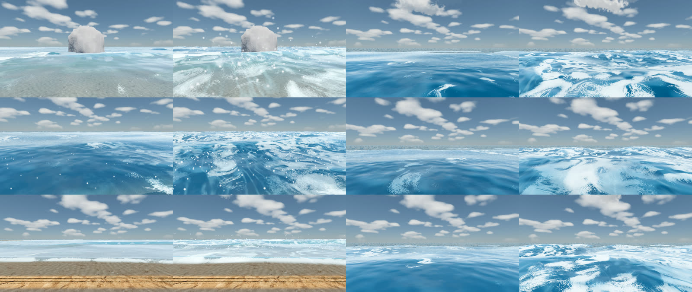

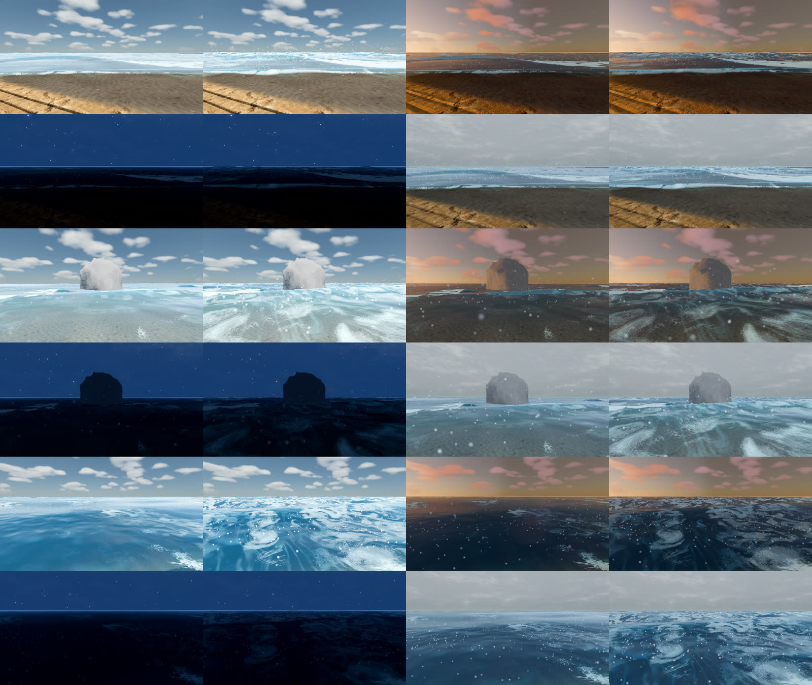

All plates show the final version except the motion strip, captured before the foam-structure warp. A GPU validity pass on the three city shots (`--validate-surface=12`) found no invalid (NaN/Inf) samples in 36 sampled phases.

Verify:

```bash
godot --headless --path . --script tools/run_godot_tests.gd -- --filter=test_water_realism_v2,test_city_water_realism,test_city_shore_field,test_r715_water_material_contract,test_city_shore,test_shore_distance_field,test_r715_water_surface_geometry
tools/godot_render.sh --script tools/water_sandbox/capture.gd -- --tag=x --case=sand,reef,stack,quay --shot=close,side,open --wind=fresh,gale
tools/godot_render.sh --script tools/water_sandbox/capture.gd -- --tag=x --case=sand --shot=side --motion=144
tools/godot_render.sh --script tools/capture_city_sea.gd -- --tag=x --advance=4 --only=close_shore_reverse_fresh,sea_level_storm,surf_side_storm,sea_storm_wide
```

`test_water_realism_v2` covers the bed trough (deep troughs kept, shallow ones eased onto the bed, continuous), C1 weighting, the shader contracts (city-only band limit, bed trough, clock-free foam cells, surge and age-driven coverage), the crest-shape reset for district maps and the sandbox build. No controls, saved fields or content IDs change.

Limits: boats (`BoatFloat3D`) still sample the district trough floor, so in a city gale a hull can sit above a deep trough instead of dropping into it. Foam coverage is analytic: it has no memory between waves (WR-7). Wave height is not attenuated behind rocks or reefs below the 2 m height grid (WR-5). Gale whitecap coverage was tuned by eye in sandbox plates, not measured against photographs (WR-10).

## Waves feel the seabed (WR-4)

Status: implemented (task **R-1509** WR-4; pack [WR - Water realism v2](../tasks/water_sky/WR_water_realism_v2.md)). Scope: the city's analytic shore waves (height, crest shape, breaking, surf foam, run-up drain and reflection) over the real bathymetry instead of the idealised 1:20 beach (`_swash_depth`). Out of scope: diffraction and wave shadows behind single rocks (WR-5), event spray (WR-6), the open-sea FFT spectrum (unchanged), district maps (unchanged: every branch needs `shore_bed_valid`, which only the city sets and `apply_shore_field` resets to 0).

**Bake** (`CityShoreField.bake` -> `_bake_bed`, `scripts/city/city_shore_field.gd`). Per height node, on the shore field's grid:

| Channel | Meaning |
|---|---|
| R | still-water depth, m (0 on land) |
| G | crest travel time from the offshore source line, s (`BED_OUTSIDE` -1 where no wave arrives); land inside the shore field copies the time of its nearest waterline, so the run-up starts as the crest arrives |
| B | beach-face slope tan(beta) of the nearest shore: ground rise from 6 m seaward to 4 m landward of the waterline, over 10 m |
| A | controlling depth: the shallowest depth the wave crossed on its way here (upwind average, never deeper than the local depth) |

The travel time solves the eikonal with the local celerity: pass 1 finds the geodesic distance through water from the waterline (exact contour distance as seeds); every water node `BED_REACH` (80 m) out becomes a source; pass 2 is a 16-neighbour Dijkstra (bucket queue, 0.01 s) with edge cost = length x mean slowness. Celerity is linear theory with Eckart's wavelength, `L = L0 sqrt(tanh(2 pi h / L0))`, `c = L / T`, `T` the fixed 9 s shore period (sqrt(g h) in the shallows). Crests are lines of equal travel time, so they bend parallel to the depth contours (refraction) and pack closer where the water shallows (shoaling). The city bake grows from about 0.55 s to 1.1 s.

**One sampler.** The GPU gets field and bathymetry side by side in one half-float atlas (`bed_texture`, two grids wide) that `MapViewMaterials.apply_shore_bed` binds as `shore_field`; `shore_atlas_uv` picks a half and keeps each clamp-to-edge. WHY: the water shader already uses GL Compatibility's 16 fragment samplers. The CPU copy (`bed_samples`) is read back from the same half floats, so both sides see identical data.

**Shader** (`shore_swash.gdshaderinc`, branch `bed_mode`, helper `_shore_bed_water`):

- **Phase:** `cycle = (ocean_time - travel time) / T` plus a 0.15-cycle alongshore scatter. The offset is static, so the 182-wave `ocean_time` wrap stays seamless.
- **Height:** Green's law from `BED_REF_DEPTH` (4 m), `H = H_ref (4 / h)^1/4`, capped at `gamma` (0.78) x the controlling depth. A wave breaks where `H / (gamma h)` reaches 1. Behind a bar or reef it travels on at gamma x the bar depth, unbroken (re-formed, residual foam only), and breaks again where the bed rises above the bar.
- **Crest shape** over the local wavelength (`_shore_bed_profile`, half-width 0.24 L): the shoreward face shortens as the wave steepens.
- **Breaker type** from the Iribarren number `xi = tan(beta) / sqrt(H_b / L0)` with the sea state's breaker height `H_b`; `tan(beta)` is the larger of the beach-face slope and the local seaward-facing bed slope (capped at 0.1, so a boulder dome is not read as a 1:1 beach). Blends: plunging over xi 0.45-0.8, collapsing / surging over 1.6-2.4 (Battjes 1974: spilling < 0.4, plunging 0.4-2, surging > 2; the plunging blend sits a little higher so a 1:25-1:30 sand beach stays spilling at the 9 s period).
  - *Spilling* (gentle sand): rounded crest, foam roller on the crest and a trailing bore.
  - *Plunging* (bars, reef, boulder beach): steeper, shorter face, more crest curl, and a burst of foam just after the crest (`bore_foam` x up to 1.8, a wider and denser roller in the city foam coverage).
  - *Surging / collapsing* (shingle, quays): a nearly symmetric crest that slides up the face, 80 % less bore foam and 70 % less surf coverage, an earlier, harder backwash (`_swash_front` drain exponent 2 -> 1.2, thicker backwash sheet, thinner front foam) and reflection.
- **Reflection:** Battjes `R = 0.1 xi^2` on the beach face (capped at 1). A reflected crest leaves the waterline as the incident one arrives and dies off within about half a wavelength. The reflected crest adds `R x H / 2`: the lift-only profile already draws the incident crest at the full height H (troughs are not drawn), so a second full H would quadruple the physical elevation of a standing crest and overtop the 1.6 m sandbox quay. A quay reflects fully, so the crest stands against the wall (1.5 H) and replaces the district wall slosh; the wall foam stays.
- **Run-up reach** keeps the district breaker height its gains were calibrated on; the bed's taller Green's-law breaker only sets the wave height and xi. WHY: feeding it into the reach pinned every storm run-up at `SHORE_MAX_RUNUP` and laid a film across the harbour paving.
- **WR-2 contract kept:** `surge` (landward excursion under the bore) and `foam_age` (seconds since the bore passed) come from the same phase, so the Lagrangian foam cells and their age dissolve work unchanged. `ShoreState` gains `plunge` and `surging`.

Measured on the [water sandbox](./WATER_SANDBOX.md) (CPU mirror, `bed_state`):

| Bay | Fresh (0.55) | Gale (0.95) |
|---|---|---|
| Sand 1:30 with a bar | xi 0.54 at the shore, spilling; breaks on the bar 48 m out, re-forms in the trough, breaks again from 20 m | xi 0.47, spilling; same bar sequence |
| Shingle 1:8 | xi 2.19, collapsing / surging (0.8) | xi 1.93, collapsing (0.4) |
| Reef | breaks over the rocks 34 m out, re-forms behind them, breaks again inshore | same |
| Quay, 4 m berth | xi 7.5, surging, no breaking, full reflection | xi 6.7, same |

**CPU parity** (`CityWaterSurface`): `bed_state` mirrors the branch (same three bed taps, phase, height, reflection and breaker class); `shore_lift(..., shore)` and `runup_profile(..., shore)` use it when `shore_bed_valid` is set, so the camera medium and swimmers ride the same crests and run-up. `sea_height` passes the city's `sea_shore`.

Plates (water sandbox, `--tag=wr4 --shot=side --wind=gale --motion=192`, noon; frames from the motion clips):

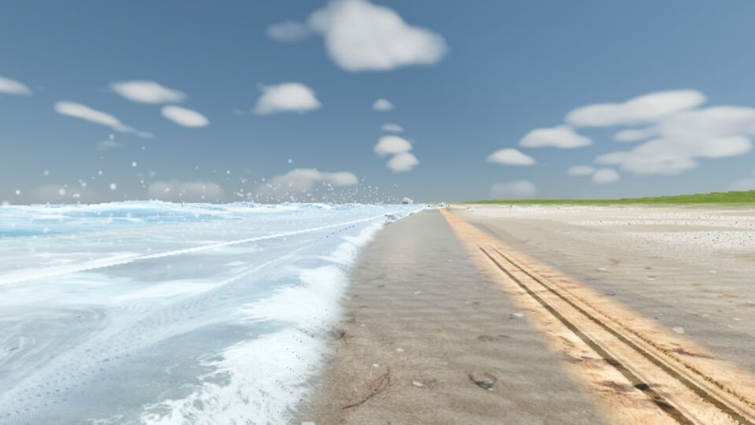

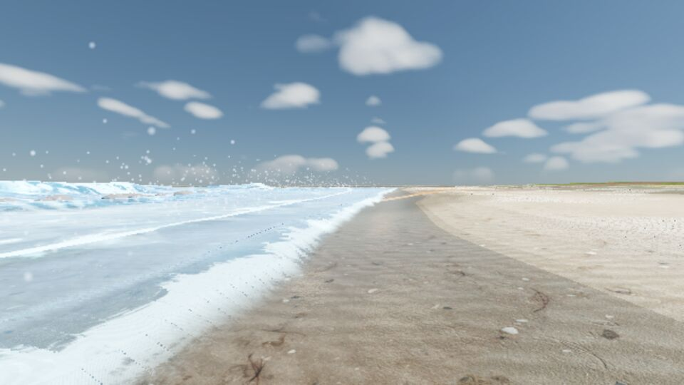

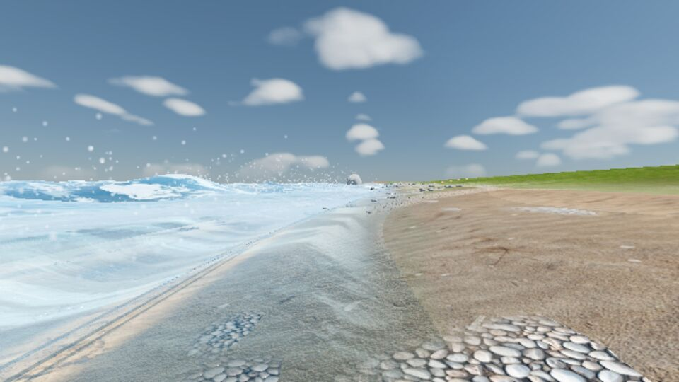

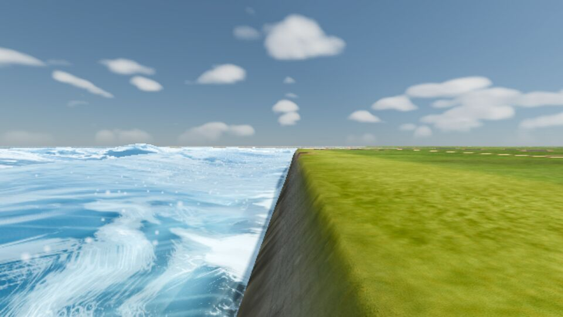

Verify:

```bash
godot --headless --path . --script tools/run_godot_tests.gd -- --filter=test_water_realism_v2,test_city_shore_field,test_city_water_realism
tools/godot_render.sh --script tools/water_sandbox/shore_parity.gd
tools/godot_render.sh --script tools/water_sandbox/capture.gd -- --tag=wr4 --case=sand,shingle,reef,quay --shot=side --wind=fresh,gale --motion=192 --size=640x360
tools/godot_render.sh --script tools/capture_city_sea.gd -- --tag=x --advance=4 --validate-surface=12 --only=surf_side_storm,close_shore_reverse_fresh,sea_level_storm
```

`test_water_realism_v2` covers the bake (crests within 4 degrees of the contours of an oblique beach, travel pace = 1 / celerity, slower inshore), bar and reef break / re-form / re-break, the breaker class per bay and wind (and xi rising as the sea calms), the seamless `ocean_time` wrap and the district reset (no extra sampler, district crest path untouched). `tools/water_sandbox/shore_parity.gd` renders `shore_state()` on the GPU (canvas shader `shore_parity.gdshader`) at 192 probe points across the four bays, two winds and four times on both sides of the wrap, and compares the camera lift, the surging share and the validity with the CPU mirror (tolerance 0.02 world units; measured 0.010). No controls, saved fields or content IDs change.

Limits: refraction is the eikonal of first arrivals, so waves wrap into the lee of a headland or a reef gap without the energy loss of real diffraction (WR-5), and the refraction coefficient (ray spreading) is not applied to the height. Breaker type uses one period (9 s, the visual loop); a shorter Baltic wind sea would push every beach towards spilling. Beyond the 0.5 m surf band (about 22 m offshore) the bar breakers ride the 4 m coarse grid: their foam is per pixel, their crest geometry coarse. The wave zone reaches 80 m from the waterline; enclosed water the source line never reaches (a pool below sea level) gets no shore waves.

## Living waterline (R-1618)

Status: implemented (task **R-1618**). Scope: where the city sea meets a beach the waves reach: the shape of every run-up front, the fading tip of the film and the backwash below the still-water line. Out of scope: ponds below sea level behind the beach (no crest reaches them, so they stay still water with the mean-level edge), quays and rocks (slosh only), district maps (the rundown needs the city's `shore_bed_valid`; the tongues and the roller change also reach the district swash sheet).

What the player sees:

- **No slab through the swash.** The coarse `FarTerrain` mesh (12 m cells) drew right under the camera wherever the camera was more than about 480 m from the plan origin, which is most of the coast, because its visibility range is measured to the whole plan. On concave beach faces its chords stood above the near terrain and the water as long straight-edged slabs between the sea and the run-up. `city_ground.gdshader` now sinks every far-mesh vertex (vertex colour alpha `CityTerrainBuilder.FAR_MARK`) within `FAR_TERRAIN_CUT` (420 m) of the camera, inside the range the near chunks always cover (see [Seamless city](./SEAMLESS_CITY.md)).
- **No fixed line.** The backwash now drains the bed just below the still-water line before the next bore floods it again (`SHORE_RUNDOWN` 0.3 of the run-up reach, over the last 40 % of the cycle and the first 12 % of the next). Before, every bed below the mean level was always covered, so that contour stood still as a hard edge, straight wherever the beach face is planar, while only the run-up above it moved.
- **Tongues, not a contour.** Each wave's reach is `_swash_reach_variation`: a steady 9 m term plus lobes (about 4 m) and fingers (about 1 m) seeded by the wave index modulo the 182-wave wrap, so every wave lays its tongues somewhere else and the `ocean_time` wrap stays seamless. Mean 1, range 0.6..1.4 (was one smooth 0.8..1.2 noise for all waves). The wetting history and residue lines of the ground use the same per-wave reach, so the wet band and the foam lines are lobed too.
- **Ragged tip.** The film fades out over `_swash_edge_feather` (0.12..0.67 m, per wave) behind its front instead of a 12 cm cut. Foam lace at the tip keeps its own opacity (`tip_foam`), so the edge reads as a broken foam line.
- **Backwash is thin.** The raised roller (0.10..0.42 m) belongs to the uprush; on the backwash it drops to 15 %, so a retreating front no longer stands as a glassy wall along the beach.

Runtime entry points: `scripts/map/view3d/shore_swash.gdshaderinc` (`_swash_wave_seed`, `_swash_reach_variation`, `_swash_edge_feather`, `ShoreState.edge_feather`, `ShoreState.rundown`, `SHORE_RUNDOWN`); `scripts/map/view3d/map_view_water.gdshader` (`CITY_RUNDOWN_BED` 0.3 m: the bed band below the still-water line the rundown may uncover, the city coverage rule, `tip_foam`, the roller in `_city_runup_profile`); `scripts/city/city_water_surface.gd` mirrors all of it (`reach_variation`, `edge_feather`, `RUNDOWN`, `RUNDOWN_BED`, `runup_profile`). Below the still-water line coverage only drops while the rundown is active, so the filtered field zero still cannot open a standing dry crack there (`test_true_wet_ground_cannot_be_cut_by_the_shore_field_zero`).

No controls, saved fields or content IDs change; everything is a pure function of position, `ocean_time` and sea state.

Verify:

```bash
godot --headless --path . --script tools/run_godot_tests.gd -- --filter=test_city_shore_field,test_water_beach_response,test_city_far_terrain
tools/godot_render.sh --script tools/capture_city_sea.gd -- --tag=after --only=close_surf_side_fresh --motion=216
```

`test_city_far_terrain` checks the far-mesh mark and that the cut leaves no hole between near chunks and the far mesh. `test_runup_front_changes_shape_from_wave_to_wave` checks the reach range and mean, that most of the beach gets a different reach on the next wave, the wrap period and the tip band; `test_backwash_uncovers_and_refloods_the_still_water_line` checks on the baked city coast that points just below the still-water line are uncovered once a wave and flooded again. `capture_city_sea.gd` close surf shots now skip contour points whose travel time is `BED_OUTSIDE` (ponds behind the beach); they used to land on such a pond.

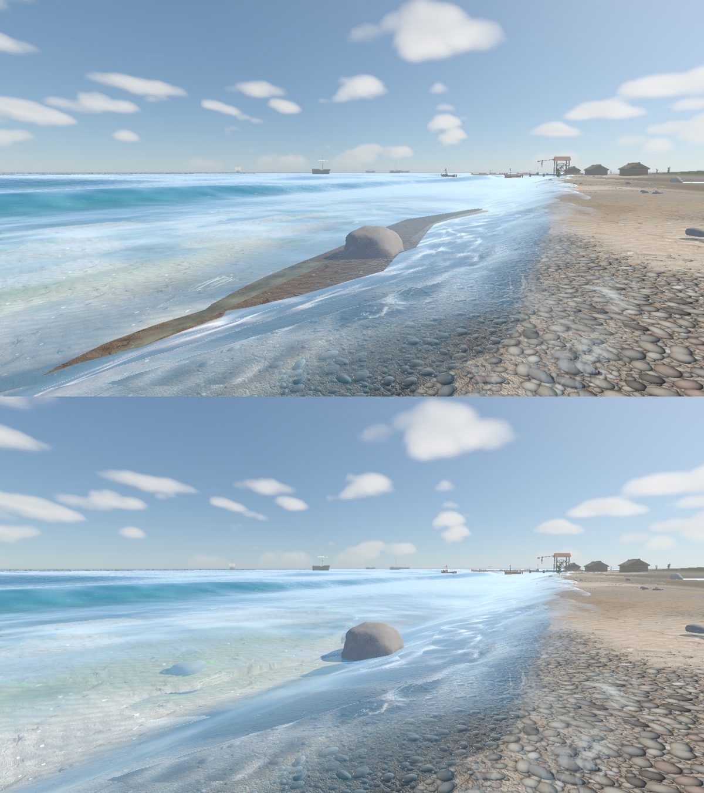

Limits: the camera medium and swim depth still classify by the mean waterline, so a drained strip is still "water" for gameplay. The rundown is a phase rule, not a simulated drawdown of the FFT surface. Ponds below sea level behind the beach keep a still, sharp edge.

## Sea LOD and graphics tiers (WR-3)

Status: implemented (task **R-1508** WR-3; pack [WR - Water realism v2](../tasks/water_sky/WR_water_realism_v2.md)). Scope: the city sea's open-water mesh and its graphics-tier presets. Out of scope: the 0.5 m surf band (unchanged), district maps (unchanged: every LOD branch needs the city's `sea_physical_depth` instance flag and `sea_lod_lattice.w`), the `OpenSea` horizon plane, compute or tessellation (GL Compatibility only).

**What changed.** The fixed 4 m grid over every wet cell is replaced by camera-centred rings. Player-visible: near the camera the 4-16 m waves (C1) are real geometry again, so storm crests have relief and silhouettes; far water gets fewer vertices and stays normal-mapped.

- **Ownership (still exclusive).** `CityWorld3D._surface_grid(..., split_rings = true)` keeps the surf band (`CityShoreField.build_band`) and the 4 m cells stitched to it (the static "skirt", node `Water/Sea`) as meshes; every other wet 4 m cell is recorded as a ring cell. `CitySeaLod` (`scripts/city/city_sea_lod.gd`, node `Water/SeaLod/SeaRings`) draws them.
- **Rings (CDLOD).** One `MultiMesh` of 16 x 16-quad nodes. Level L has vertex spacing `base_spacing * 2^L`; a node is split while part of it is nearer than `ring_range * 2^(L-1)`, so ring L ends at `ring_range * 2^L`. Nodes without ring cells are dropped. Selection runs on the CPU when the camera moves more than 5 cm (`update_eye`), and binds the same eye as `sea_lod_eye`, so the CPU node choice and the GPU morph agree.
- **Geomorphing.** `_sea_lod_vertex` (map_view_water.gdshader) morphs every vertex towards the next level over the outer 40 % of each ring (`SEA_LOD_MORPH`), on exact integer lattice coordinates: a fine vertex on a coarse neighbour's edge repeats the neighbour's arithmetic, so levels meet without cracks and a split node equals its four children (no popping).
- **No cracks at the surf band.** A float texture with one texel per 4 m lattice vertex (bound as `sea_depth_map`, `CitySeaLod.field`) holds depth, signed bed height, a floor flag (1 at vertices touching a band or skirt cell: those vertices stay at exactly 4 m spacing and so share position and wave weights with the static meshes) and a cap (levels allowed above 4 m from the Chebyshev distance to the nearest cell the rings do not own, so no coarse triangle spans one). Ring pixels in cells owned by band, skirt or land are discarded (`_sea_lod_pixel_drawn`). All city sea meshes now derive the shore factor from the same float bed, so shared vertices are bit-identical.
- **Which cascades a ring displaces.** `_sea_lod_weights`: C1 needs a mesh spacing of 1 m or finer (fades out by 2 m), C0 of 4 m (fades out by 8 m); the effective spacing is the coarser of the mesh spacing and the distance ring's spacing. Band and skirt count as 4 m: no C1, as in WR-1. Far rings are normal-only.
- **CPU parity.** `CityWaterSurface.sea_height` multiplies the CPU FFT height by `CitySeaLod.displacement_weights` (same formula, no node snapping); C0 scales only the height, not the horizontal inversion, and is 1 within about 250 m of the camera.

**Graphics-tier presets** (`MapViewWaterMaterials.SEA_LOD_PRESETS`, read when the city sea is built from the tier last passed to `MapViewWaterMaterials.set_ocean_fft_quality_tier`, the same request as the FFT and SkyWeather tiers; `high` is accepted here only, SkyWeather reads it as recommended):

| | minimum | recommended | high |
|---|---|---|---|
| Ring-0 spacing / range | 2 m / 64 m | 1 m / 64 m | 0.5 m / 64 m |
| Rings (coarsest spacing) | 6 (64 m) | 7 (64 m) | 8 (64 m) |
| Cascades in the mesh | C0 | C0 + C1 | C0 + C1 |
| Foam detail layers (`city_foam_layers`) | 3 (no grain) | 4 | 4 |
| Spray droplets per burst (slots, see [WR-6](#event-driven-spray-wr-6)) | 160 (5) | 420 (8) | 640 (10) |
| Ripple sim size (from SkyWeather) | off | 256 | 256 |

Root nodes are 1024 m on every tier.

**Frame time** (water sandbox, `sand` open shot, fresh wind, 600 frames, M-series Mac, GL Compatibility, `--bench=600`; before = HEAD `44506eec` fixed grid, both trees run interleaved, two runs each). The GPU timer reads 0 on this driver, so these are wall times per presented frame:

| Tier | Before (ms) | After (ms) | Sea vertices before | after |
|---|---|---|---|---|
| minimum | 4.64 / 4.58 | 4.73 / 4.54 | 272 936 | 233 735 |
| recommended | 4.88 / 4.85 | 4.94 / 4.97 | 272 936 | 253 098 |
| high | 4.83 / 4.95 | 4.84 / 4.84 | 272 936 | 325 637 |

The minimum row was measured with two foam layers; the shipped preset keeps the bubble-cell layer (one more texture fetch per foam pixel) because two layers flattened gale foam into white blobs. The difference is within run-to-run noise: the sandbox frame is not bound by the sea mesh (the surf band holds most of its vertices). The LOD's gain is the C1 geometry near the camera at the same cost; the ring selection and MultiMesh upload take about 0.2 ms (sandbox, 154 nodes) to 0.3 ms (city plan, 214 nodes, 62 k ring vertices) per frame and only run when the camera moves; building the lattice field, clearance and node tables adds about 0.6 s to the city load (headless measurement).

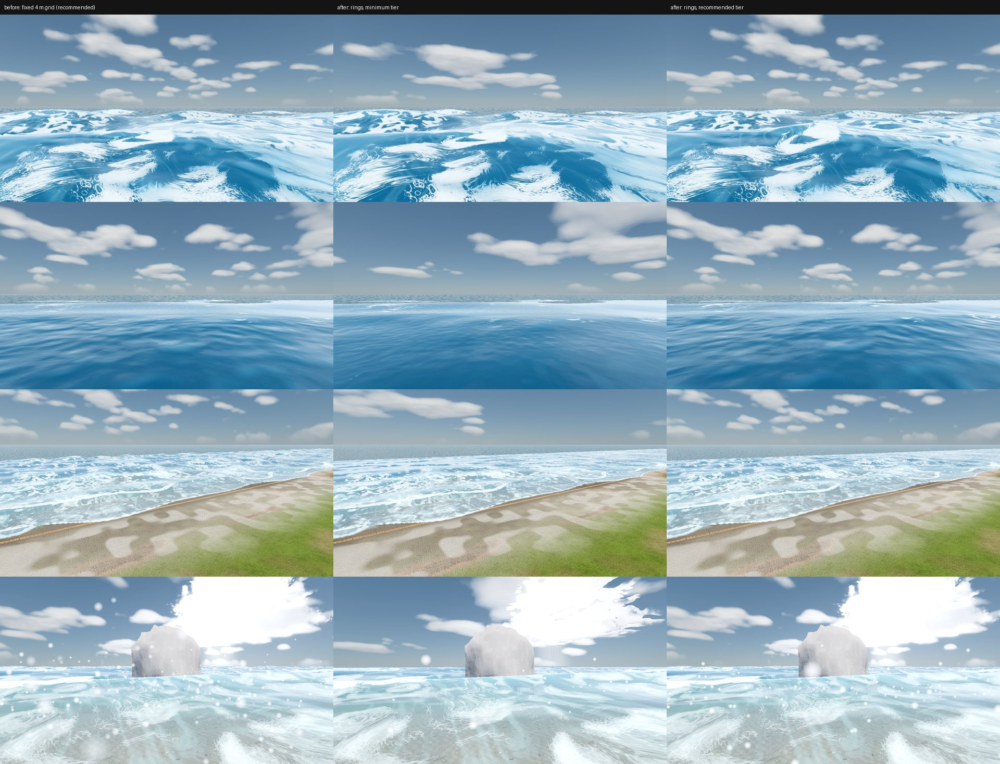

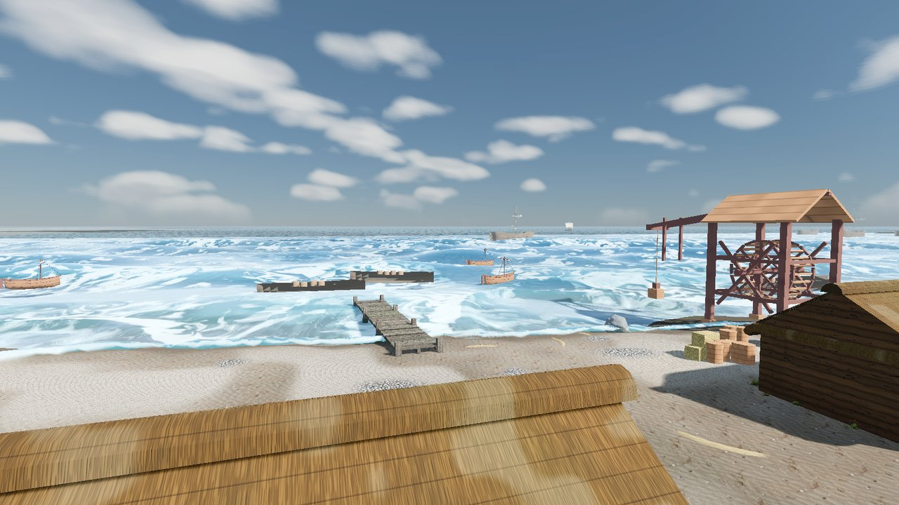

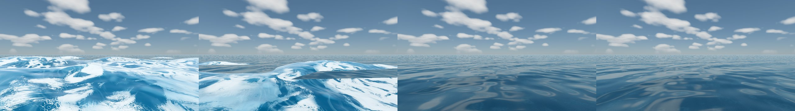

Verify:

```bash
godot --headless --path . --script tools/run_godot_tests.gd -- --filter=test_city_sea_lod,test_city_shore_field,test_water_realism_v2
tools/godot_render.sh --script tools/water_sandbox/capture.gd -- --tag=lod --shot=open,close,wide --wind=fresh,gale --tier=minimum --bench=600
tools/godot_render.sh --script tools/water_sandbox/capture.gd -- --tag=lod --shot=open,close,wide --wind=fresh,gale --tier=recommended --bench=600
tools/godot_render.sh --script tools/water_sandbox/capture.gd -- --tag=lod_motion --case=sand --shot=open,wide --wind=gale --motion=48 --dolly=120
```

`test_city_sea_lod` ports the vertex morph to GDScript and checks, on a synthetic lattice with an island and skirt: every shared node edge meets without a crack at four camera positions, a node at its split distance coincides with its four children (no popping), ring vertices touching the skirt stay at the 4 m lattice and level, selected coarse nodes never span a cell the rings do not own, the ring level is continuous and capped, the displacement weights per spacing and tier, the presets, the shader contract and the sandbox build (one owner per cell, finite CPU heights). The dolly clips showed no isolated frame-difference spikes (max / median of consecutive-frame difference 1.2-1.7 in a gale, smooth trend). No controls, saved fields or content IDs change.

Limits: ring nodes touching the plan edge or a static cell stay at 4 m spacing or finer (the cap treats outside the lattice as not owned), so the far plan edge costs a strip of fine nodes. The CPU height ignores node snapping and the C0 horizontal scale. Changing the tier needs a rebuild of the city (like the FFT tier). Boats (`BoatFloat3D`) still sample the district path.

## Beach response (WR-9)

Status: implemented (task **R-1514** WR-9; pack [WR - Water realism v2](../tasks/water_sky/WR_water_realism_v2.md)). Scope: how the city beach ground, the run-up film and shore pebbles react to the swash. Out of scope: footprints filling with water, sand transport or berm building, per-pebble wet/dry animation on the stone meshes (see Limits). District maps are unchanged: the district terrain blend keeps its WS-08 wet sand, and every water change below sits in the city's `sea_physical_depth` branch.

What the player sees:

- **Wet band from the swash history.** The city ground (`scripts/city/city_ground.gdshader`) evaluates the same analytic `shore_state` as the sea. Ground that the last waves reached is dark (wet sand at about half its dry albedo) and dries over `SHORE_DRY_TIME` (28 s, about 30 s) after the backwash leaves it. For the first few seconds (`SHORE_GLISTEN_TIME`, 4 s) a standing film mirrors the sky (roughness 0.06, sand relief levelled). Because the swash comes in 7-wave sets, the band advances with each big wave and fades between sets. Where a shore field is bound, this replaces the old static "wet strand by height" and the flat `shore * 0.5` damp term. Without a field (no sea), the old height strand stays.
- **Shingle drains.** Porosity comes from the bed slope (`shore_porosity(tan_beta)`, 0 below 1:14, 1 above 1:9). Shingle beaches are steep because backwash sinks into the gaps instead of carrying stones down, so the slope works in the city and the sandbox without a land-use texture. The ground's own pebble band (`shingle`) also counts as porous. On porous ground: wet stone dries in `SHORE_SHINGLE_DRY_TIME` (9 s), glistens only briefly (0.8 s), is darker and more saturated than wet sand, and carries a sheen (roughness 0.28, specular up). Dry shingle above the berm is forced matte (roughness 0.95).
- **Backwash film and foam over shingle.** In the city sea's run-up, `shore_beach()` thins the film as the backwash progresses (`ShoreState.backwash`, up to 85 % less film over full porosity) while the front itself stays analytic, so the ground's wet time still matches the water. Foam lace and the bead lose up to 40 % on the uprush and vanish within the first third of the backwash (bubbles pop into the gaps). `shore_pebble_cover()` fades the film out as it gets thinner than the pebble crowns (`SHORE_PEBBLE_SIZE`, 5 cm). It is a mean cover, not a per-pebble hole pattern: under the film the GL bed is the ground texture, and holes showed it as a lattice of sand dots.
- **Wet and dry pebbles.** `MapViewShoreDebris.wet_shore_debris_mesh(kind)` returns a copy of a shore debris mesh whose family materials are swapped for wet variants (`wet_debris_material`: roughness 0.32, specular 0.75); callers darken the instance colour by `WET_STONE_TINT` (0.55). The sandbox shingle bay uses it for pebbles seaward of `SHINGLE_WET_LINE` (z = 3.5, jittered over 2 m; the berm crest is at z = 5). Pebble scale acts through the stone meshes themselves: the film is drawn at bed height plus its thickness, so a stone breaks through wherever it is taller than the film, and the large section (1.8 x) shows more stone above a thin film than the small one (0.5 x).

Runtime entry points:

- `scripts/map/view3d/shore_swash.gdshaderinc`: `ShoreState.backwash`, `ShoreBeach`, `shore_beach()`, `shore_porosity()`, `shore_pebble_cover()`, the dry and glisten constants.
- `scripts/city/city_ground.gdshader`: the beach response block after the pebble band, the roughness/specular block before the final normal.
- `scripts/map/view3d/map_view_water.gdshader`: `runup_drain` in the city run-up coverage, applied with `city_coverage`.
- `scripts/city/city_world_3d.gd`: `mirror_shore_to_ground()` copies every `shore_*` uniform the ground shader declares (`shore_uniform_names`) from the shared sea material to the ground after the shore field binding, surf gain and every `apply_time` (sea state, tide). The ground is not one of the shared map-view shore materials, so it needs this mirror. The sandbox capture calls it after `apply_sea_weather`.
- `scripts/map/view3d/map_view_shore_debris.gd`: `WET_STONE_*`, `wet_shore_debris_mesh()`, `wet_debris_material()`.

GL Compatibility texture-unit budget: Godot binds a texture unit to every *declared* sampler, used or not. The city ground had 13; a 14th (`shore_field`) first failed to link (17 fragment samplers with the engine's own), and once the fragment stopped using one, the draw still vanished on macOS without any error, because the extra unit collided with an engine-reserved one. `rock_normal` was therefore removed; since R-1606 the shingle relief is procedural (`pebble_layer()`), and `shingle_albedo` only gives the distant tone of the band. `shingle_albedo` is the CO-01 storm-beach plate (`assets/materials/pbr/shore_shingle/shore_shingle_albedo.png`, `shingle_scale` 0.8); it used to be the masonry `stone_albedo.png` (cut ashlar), which drew a brick grid along the beach (before left, after right: `docs/reports/images/city_beach_shingle_before_after.jpg`). `test_ground_stays_inside_its_texture_unit_budget` keeps the count at 13 or fewer; any new sampler here needs the same kind of trade.

No controls, saved fields or content IDs change. Everything is a pure function of position, `ocean_time` and sea state, so it is deterministic and the `ocean_time` wrap stays seamless.

Verify:

```bash
godot --headless --path . --script tools/run_godot_tests.gd -- --filter=test_water_beach_response
tools/godot_render.sh --script tools/water_sandbox/capture.gd -- --tag=wr9 --case=shingle,sand --shot=close,side --wind=fresh,gale --motion=192
```

`test_water_beach_response` checks the include API and dry-time ordering (sand about 30 s, shingle faster, film lasts longer on sand), that the ground uses the swash instead of the static strand, the water drain hooks, that every shore uniform the include declares is mirrored to the ground (except the vertex-only `shore_geometry_scale`), the wet stone material, the texture-unit budget and the sandbox wet/dry pebble split.

Plates (water sandbox, `--tag=wr9`, noon):

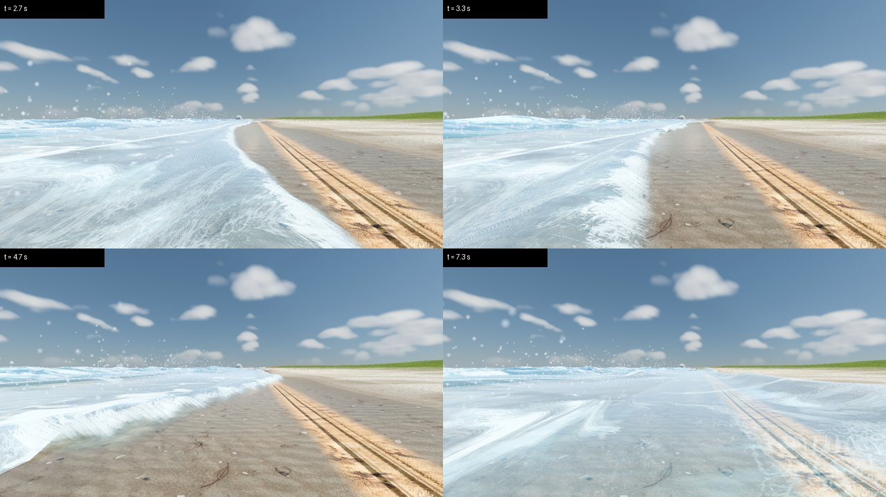

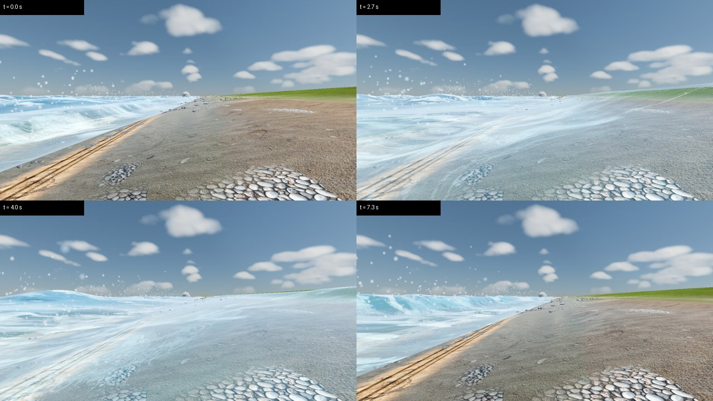

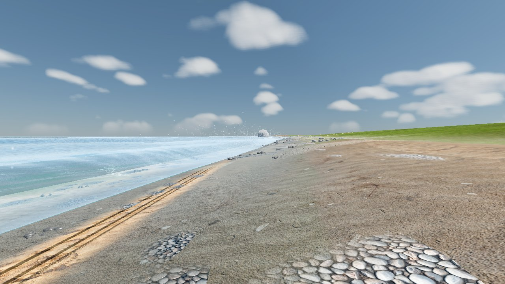


Limits: pebble meshes are wet or dry by a fixed line, not by the live swash (they use `StandardMaterial3D`; a swash-driven stone shader is a separate task). The porosity is a slope proxy, so a steep sand scarp reads as shingle and a flat gravel patch as sand. The film's thinning uses one nominal grain size; the sandbox's three pebble sizes differ only through their meshes, and the plates above do not isolate the three sections. The sandbox ground still paints land use (grass, a cart-track stripe on the berm) from height alone ([water sandbox](./WATER_SANDBOX.md) limit), so some sandbox wet ground is drawn over those textures; the city land use is deliberately not changed for it.

## Event-driven spray (WR-6)

Status: implemented (task **R-1511** WR-6; pack [WR - Water realism v2](../tasks/water_sky/WR_water_realism_v2.md)). Scope: when and where the city sea throws spray, and how it is drawn. Out of scope: crest impacts on rocks and quays (needs the WR-5 impact events, not built yet), district maps (no `CityShoreSpray`).

**What changed.** The old emitters streamed droplets from the waterline all the time. Now each slot sits where the surf breaks and fires one burst when a crest passes.

- **Event source.** `CityShoreSpray.place_slots` takes `slot_count(budget)` contour points near the camera and slides each offshore along the landward normal (14 taps, 3 m apart) to the position where `CityWaterSurface.bed_state` (CPU mirror of `shore_state`) reports the strongest breaking; slots below `BREAK_MIN` (0.5) stay silent. Each frame `update_events(OceanFftSampler.ocean_time())` calls `bed_state` once per slot and fires when `floor(cycle)` grows, i.e. the bore front phase u wrapped past 0. The first sample after placement only records the crest, so a burst never fires on placement. Re-placement runs when the camera moves 12 m or the wind changes by more than 0.2, never as a scan of the whole coast.
- **Determinism.** The burst is a function of the ocean time and the slot position; the particle seed is `burst_seed(slot, event)`, so the same crest throws the same droplets (`use_fixed_seed`).
- **Three layers per slot** (`GPUParticles3D`, one-shot, `scripts/city/city_spray.gdshader`, lit with per-vertex lighting so spray darkens at night): *droplets* are 2.2 cm quads stretched 5x along their velocity (`particle_flag_align_y`; the shader builds the camera-facing quad around that axis and relaxes the streak as the drop slows), thrown at 1-4.8 m/s so they stay within about 1 m of the crest; *splash sheet* is a burst of 28 cm ragged clumps of white water that open over 0.45 s; *mist* is a spume puff living 1.3 s, blown out fast and braked hard by damping, whose gravity vector is the downwind drift (`WindField.current().direction`) with a slight settle. Shore emitters sit `CREST_LIFT * intensity` (up to 0.45 m) above `WATERLINE_Y` so storm drops are not born inside the crest.
- **Whitecaps in a gale.** `gale_slot_count` extra slots sit 24-60 m offshore and test a 2.3 s crest period; the crest tears spray (droplets and mist) with a hash chance of `0.8 * gale`, where `gale = smoothstep(0.9, 1.0, wind)`. A gale at 0.95 tears about half of the crests, the peak of a gust (1.0) most of them.
- **Calm.** Below wind 0.35 nothing is emitted (`update_events` returns 0, emitters are stopped).

**Budgets** (`MapViewWaterMaterials.sea_lod_preset()["spray_particles"]` is the droplet count of one burst at full strength; read every 0.5 s, so a tier change rebuilds the slots). `slot_count = round(3.5 + budget / 100)` clamped to 4..12, droplets are `DROPLET_DENSITY` (2.5) times the budget, mist is 12 % and sheets 20 % of the budget, offshore slots have no sheet. `particle_ceiling(budget)` is the number of particles allocated if every slot were alive at once; in practice a burst lives 1-3 s once per crest period (about 9 s), so a handful of slots are alive at any time:

| | minimum | recommended | high |
|---|---|---|---|
| Tier budget (`spray_particles`) | 160 | 420 | 640 |
| Droplets per burst | 400 | 1 050 | 1 600 |
| Shore slots / gale slots | 5 / 2 | 8 / 4 | 10 / 5 |
| Allocated particles (ceiling) | 3 093 | 13 872 | 26 420 |

Burst strength scales with breaking and wind (`burst_ratio`, via `amount_ratio`), so a fresh breeze throws a fraction of a gale's burst.

**Verify:**

```bash
godot --headless --path . --script tools/run_godot_tests.gd -- --filter=test_city_shore_spray
godot --headless --path . --script tools/water_sandbox/spray_probe.gd
tools/godot_render.sh --script tools/water_sandbox/capture.gd -- --tag=wr6 --case=stack,reef,sand --shot=close,side --light=noon,night --wind=gale --gust --motion=192
```

`test_city_shore_spray` checks the crest-event rule (fires once per crest, never on the first sample, never backwards), tier slot and ceiling growth, seed determinism, that a gale on the real city coast fires bursts identically in two runs, and that calm fires none. `spray_probe.gd` prints the active slots and burst counts per sandbox case.

Plates (water sandbox, `--tag=wr6`, sand, gale with gust, motion frame 54 as the crest breaks):

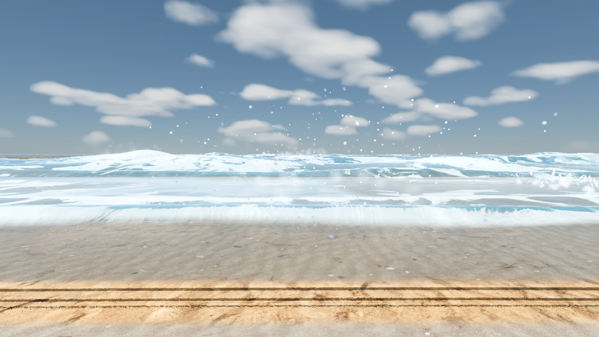

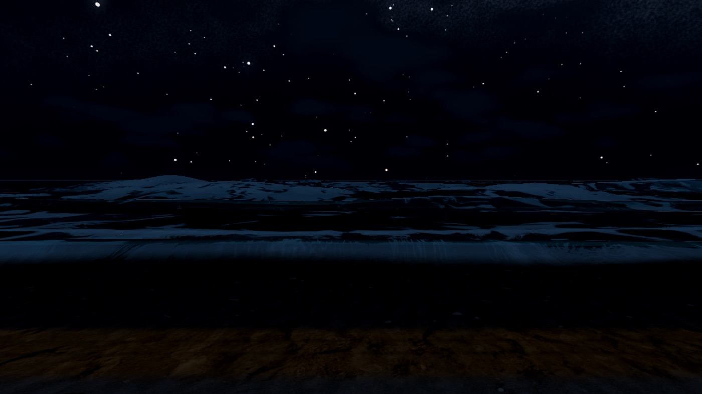

**Spray realism pass (2026-10-10).** The plates above are the first WR-6 tuning: few 7 cm drops thrown up to 4 m and a slow 3 s mist that read as fog. Now the drops are 2.5x denser, a third of the size and stay low over the crest, the sheet is small torn clumps instead of soft 1 m glowing discs, and the mist is a 1.3 s spume puff (motion frame 48, `--tag=spray2`):

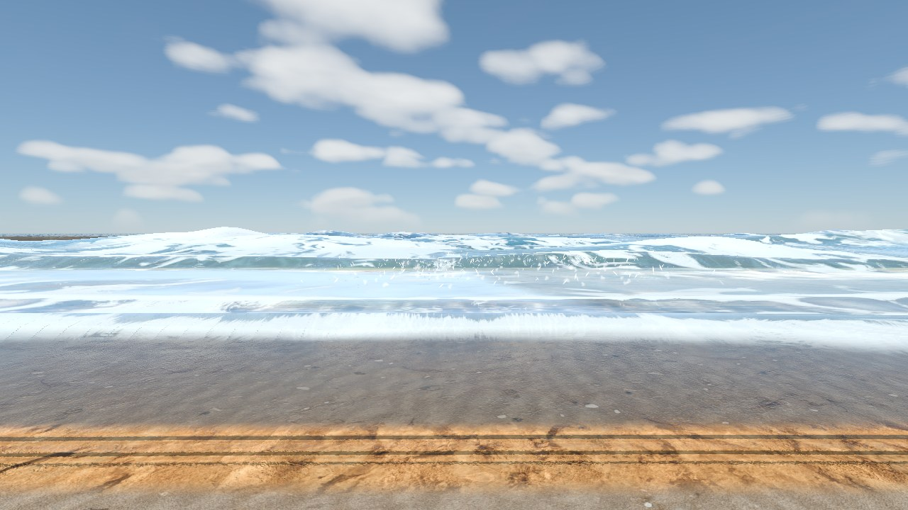

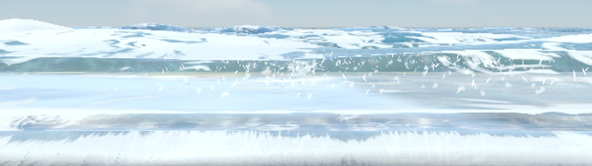

Limits: spray is emitted at the breaker line the slot found at placement (waves that break further out at a different sea state wait for the next re-placement); only about 8 shore slots near the camera exist, so a long beach shows bursts as separate fans about 12 m apart; crest impacts on rocks and quays throw nothing yet (WR-5 impact events); droplets are camera-facing quads, not refractive; mist is lit but not shadowed or fogged by the sky beyond the scene's own fog. The stretch uses the particle life as a proxy for speed.

**Bore and crest slope without screen derivatives (task **R-1609**, 2026-10-10).** The city sea shades the run-up bore face and the incoming shore crest from the slope of the run-up height (`_city_runup_profile`). That height comes from the filtered shore field, which steps slightly between pixels when one texel covers many of them, so the old `dFdx`/`dFdy` gradient turned the steps into slope spikes: a close, low camera (Retina) saw a moire of dashes and black-white zebra stripes on the wave. `map_view_water.gdshader` now takes a world-space forward difference over `CITY_RUNUP_SLOPE_STEP` (0.08 units) along `to_land`, one extra `shore_state` sample per city-sea fragment in the shore field; the alongshore slope is the interpolated bed slope. Verify with `tools/godot_render.sh --script tools/capture_city_sea.gd -- --only=surf_storm,surf_fresh`; the evidence below used a scratch copy with `VIEWPORT_SIZE` 3200x1800, since the moire grows with pixel density (left before, right after; top storm, bottom fresh):

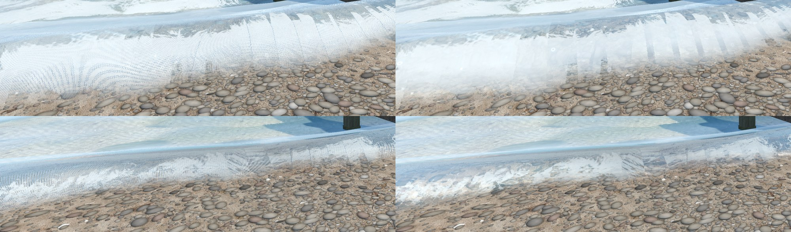

## Limits

- GL Compatibility uses alpha transmission with scalar luminance extinction and an analytic sky window underwater. It does not provide distorted screen-space refraction, coloured transmission of individual background objects, off-screen object reflections or full depth-resolved underwater fog. Metal retains the screen-depth/refraction path. These renderer differences are deliberate and are not visual parity.
- Storm swell is 5 times the district value; boats were not re-tuned for it, so a gale may bury a small boat's gunwale.
- Boarding a cog drops Kalev onto the deck (`CogModel.walk_height`) with no climb animation.
- The ground shader's seabed layers are cheap noise, not authored plates.
- Stream and moat use baked vertex depth for their optical column on GL; they are murkier than the sea. Their small surface displacement is not included in the CPU waterline query.
- The ripple window follows the camera, so in the top-down overview a wake far from the screen centre is not drawn.
