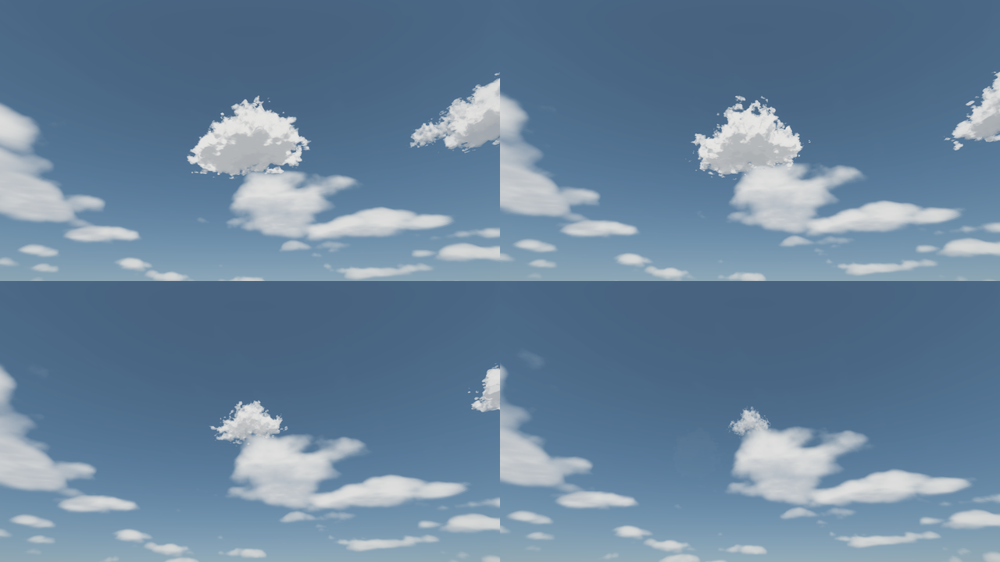
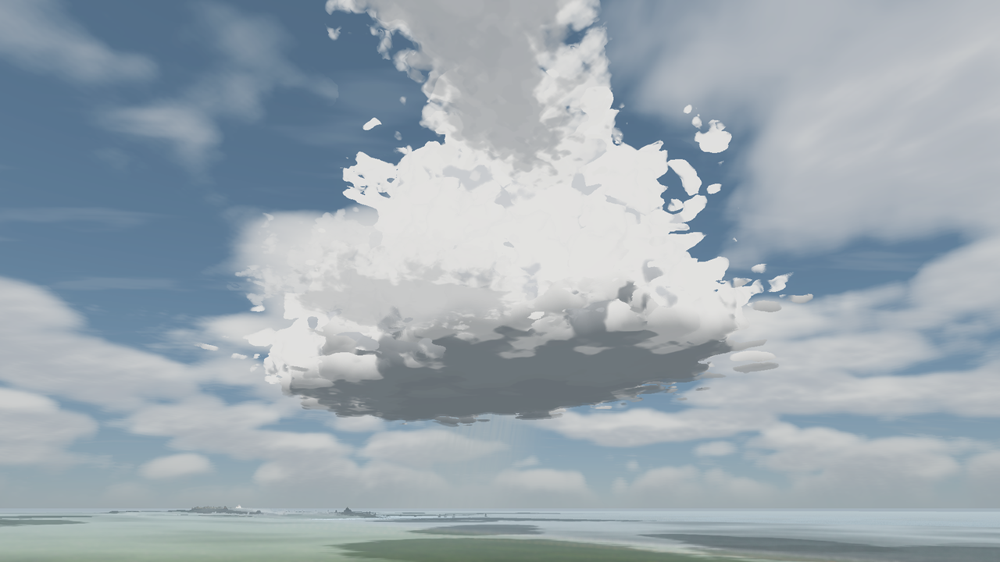
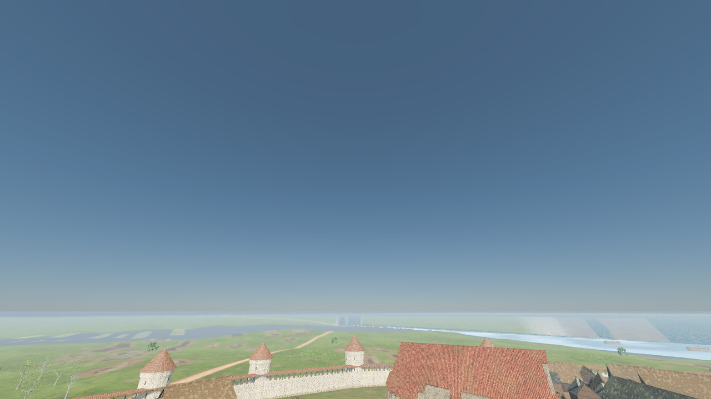
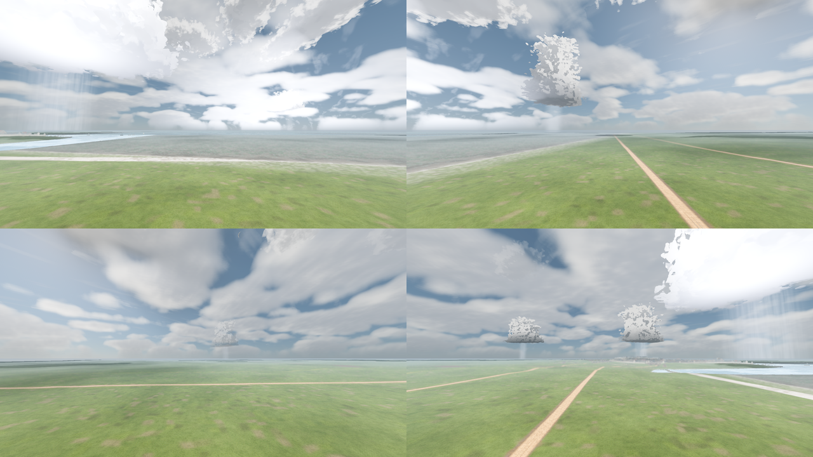
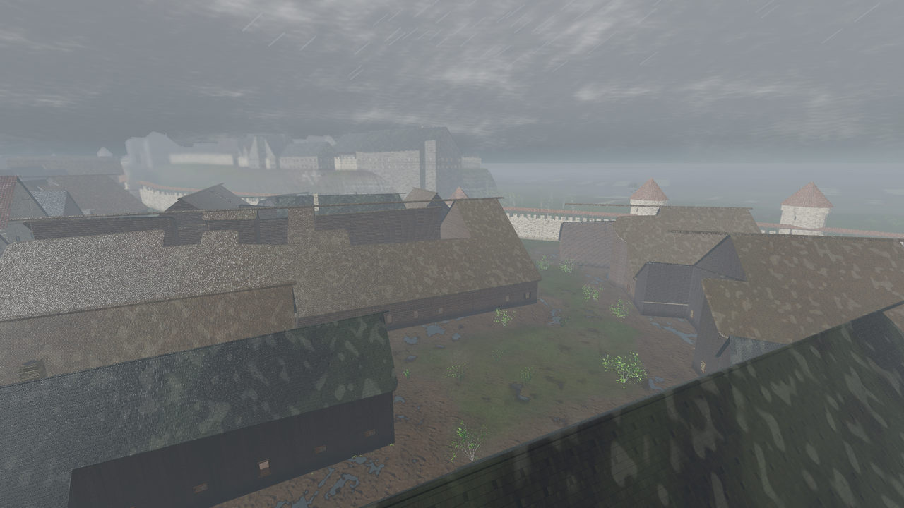
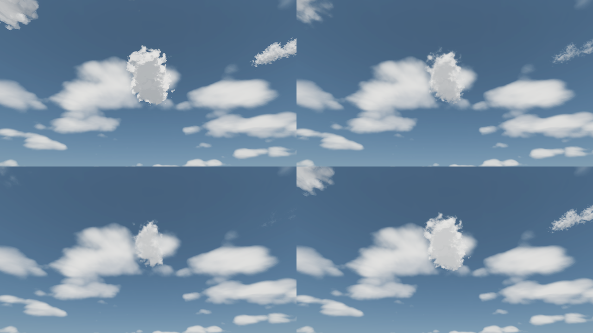
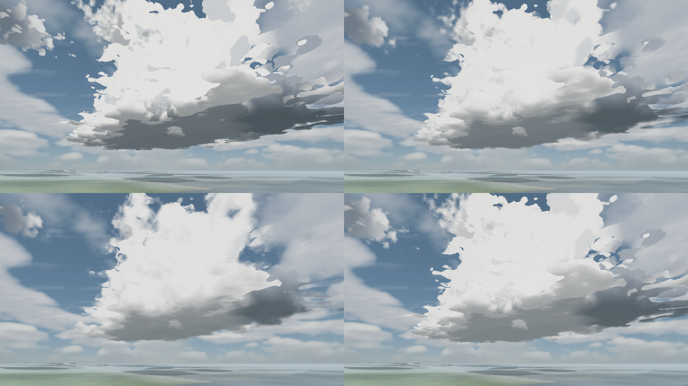
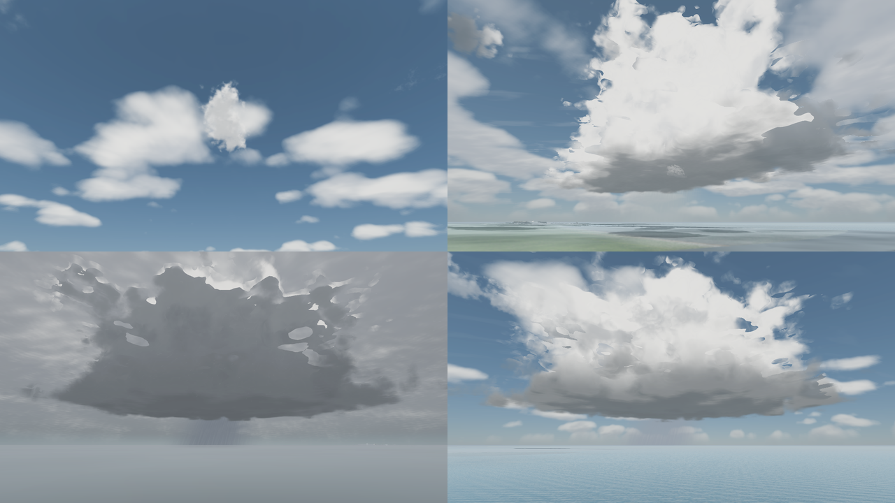

# Discrete cloud cells, cloud shadows and storm-cell lightning

Status: implemented (tasks **R-1400**, **R-1436** water deck shadows, **R-1444** crepuscular rays, **R-1481** cumulus shape, drift, dissolve and merging, **R-1493** distant tower visibility, **R-1495** cloudless sky and varied towers, **R-1501** convective hotspots, wide storms and wind-slanted rain, **R-1507** gaseous rims and softer shading, **R-1517** deck shade and blurred silhouettes)

Scope: individual clouds as world-space objects in the 3D view. Each cumulus or cumulonimbus has a position, base altitude, size and life; the sky dome ray-marches it as a volume, the ground shadow pass projects it along the sun, god rays are cut by it, and lightning is born only inside a grown cumulonimbus. Mounted in both `MapView3D` maps and the seamless city (`CityMapView`).

Out of scope: puddles and mud that follow the storm cell (ground water stays weather-wide, see **Local storm rain**), thunder audio tied to strike distance, clouds that react to terrain, and replacing the dome's continuous cloud deck (it stays as the distant layer and the overcast sheet).

## What the player sees

- **Cloudless, fair and cloudy days**: a `cloudless` sky (R-1495) has no cumulus at all; about eight (`clear`) to twenty (cloudy) separate cumulus ride the wind, each at its own speed, grow from small puffs, spread out, shrink and dissolve over about 55-90 s of game time. Each is a fused cluster of uneven heaps drawn out along its own axis and downwind, not one round ball. They have flat grey bases, sunlit cauliflower crowns and a silver lining when they cross the sun. They move with real parallax as the camera moves.
- **Merging into a thunderstorm (R-1481, R-1495, R-1501)**: when three or more cumulus drift together inside a convective hotspot, they merge into one storm 1.8-3 km across and 1.1-2 km tall: its base drops and darkens, the heaps fuse into a tapering cluster of turrets, some with an anvil, a rain curtain hangs under it, it rains on the player standing under it, and it can throw lightning even when the weather itself has no thunder. When the cluster drifts apart or its clouds dissolve, the tower sinks back.
- **Cloud shadows**: every cell throws its own soft-edged shadow on the ground, roofs and sea, offset along the sun, so you can watch one cloud's shadow sweep across a street or the harbour. The shadow removes most of the direct-sun share (up to 85%), and fades out at night and under full overcast.
- **Thunderstorms**: `storm` weather grows up to three cumulonimbus towers (1.7-2.3 km tall, with a spreading anvil) that are visible from several kilometres away, with a grey rain curtain hanging under the base. `rain` weather embeds the same cells in its deck.
- **Lightning** comes only from a mature storm cell. About 40% of strikes are cloud-to-ground: a jagged channel with two thinner, dimmer branches from the cell base to the ground. The channel is a hairline (about one pixel, physical half-width 0.35 m that only shows on a very close strike) with a faint halo; the bright corona comes from scene glow, not a painted fat stroke. The rest are in-cloud flashes that light the tower from inside. With no grown storm cell, there is no lightning, even when the weather profile has thunder. Scene light lift falls off with camera distance to the cell (to 40% beyond 2.6 km); the strike in the sky is always drawn at full strength.
- **Sunbeams (crepuscular rays, R-1444)**: when the sun stands behind broken cloud, shafts of light fan out from the gaps and dark columns trail from the cloud edges, all converging on the sun. Both the dome cloud deck and the cells cut them, by day and with the sun on the horizon at dawn and dusk. Over the town and sea the air in a cloud's shadow is darker than sunlit air, and street-level shafts still start at roof edges. See **Crepuscular rays** below.

## Runtime entry points

| Piece | File |
|---|---|
| Cell field (pure, deterministic) | `scripts/map/view3d/cloud_cells.gd` (`CloudCells`) |
| Shared shader maths (density, ground shadow, bolt) | `scripts/map/view3d/cloud_cells.gdshaderinc` |
| Simulation, strike placement, uniforms | `scripts/map/view3d/sky_weather_3d.gd` (`_update_cells`, `_advance_lightning`, `_place_strike`) |
| Volume march, sky beams, bolt | `scripts/map/view3d/sky_weather_3d.gdshader` (`cells_volume`, `sky_sunbeams`, `cells_toward`, `lightning_bolt`) |
| Ground shadows | `scripts/map/view3d/cloud_shadow_pass.gd` / `.gdshader` |
| God rays cut by deck and cells | `scripts/map/view3d/god_ray_pass.gd` / `.gdshader` (`cloud_shadow`, far march) |
| Review plates | `tools/capture_god_rays_city.gd` |
| Water dims its own sun under deck and cells | `scripts/map/view3d/map_view_water.gdshader` (`cloud_cell_shadow`, `light()`), shared `scripts/map/view3d/water_cloud_shadow.gdshaderinc`, `scripts/city/city_water_light.gdshaderinc` (city sea, stream, moat); pushed by `MapViewMaterials.apply_cloud_cells` and `CityWorld3D.apply_cloud_cells` |
| 3D Worley noise for cell shapes | `SkyWeatherResources.build_cell_noise_3d` |
| City mounting | `CityMapView._create_sky_passes`, `CityMapView._process` |

`CloudCells.update(clock, cloud_offset, counts, wind)` rebuilds 23 slots (20 cumulus, 3 cumulonimbus; 16 and 13 before R-1495) every `SkyWeather3D.advance()`. Counts come from the blended weather profile (`CloudCells.counts_for(coverage, storm)`), so a weather transition fades cells in and out. `wind` is the smoothed drift strength (`_wind_drift_strength`, already saved). Cells drift with the shared `cloud_offset` (`METRES_PER_UV` = 5000 world units per offset unit); cumulus scale and turn it per generation (see below). They tile a periodic square (3.2 km for cumulus, 9.6 km for storm cells). Fair cumulus and native storm slots use the copy nearest the camera and fade before the seam. Merged towers retain the 3.2 km simulation tile but draw additional periodic copies (see **Distant merged towers**).

The `cloud_cells` uniform is four `vec4` per slot plus one (93 total): `(x, base, z, radius)`, `(height, weight, kind, seed)`, `(life, tower, windiness, tile)`, `(pull x, pull z, tower radius, tower height)`, then the hotspot centre `(x, z, 0, 0)`. `tile` packs how many tiles the cumulus has drifted (`x + 64 z`, see **Cloudless sky and varied towers**). The first three are the fair cloud; `cell_copy_shape()` turns each periodic copy into what is drawn (R-1501, see **Convective hotspots**). `cell_storminess(b, c) = max(kind, tower)` of that copy blends every cumulonimbus term (profile, shading, footprint, opacity, rain curtain), so a merged storm shades as one while it still lives on the cumulus tile.

`WeatherPresentation.cloud_cells` carries the packed uniforms to the passes; `cell_sun_edge` (how ragged the cover is right around the sun) adds haze to god rays. `celestial_cloud_clear` (water glints) also multiplies in the cells in front of the sun or moon. Since R-1444 it no longer scales god-ray strength: the pass shades each air sample by the clouds instead, so beams keep going when the sun is hidden behind a cloud edge.

## Crepuscular rays (R-1444)

Before R-1444 only the discrete cells cut beams. The dome deck, which is most of the cloud the player sees, never did, and the pass dropped to zero whenever a cloud covered the sun. The beams were invisible in exactly the shots they are for.

- **Sky dome** (`sky_sunbeams`): for each sky pixel within ~80 deg of the sun, 14 samples walk the great circle from the sun to the pixel and read how open the deck (`sky_cloud_shadow_soft`, thresholded 0.2-0.55 like the dome's thick slab) and the cells are. Cells are tested by `cells_toward`, which takes the copy `cells_volume` draws (nearest the camera, faded before the periodic seam) and the true ray slope. The ground-shadow helper clamps the slope and picks the copy nearest the projected point, so low directions were hidden by cells the dome never draws, which printed dark rectangles into the beams. The weights favour the sun's neighbourhood (a hidden sun dims every path) and the stretch just sunward of the pixel (where a cloud's shadow column starts). It is the light-scattering post-process of GPU Gems 3 ch. 13 done analytically in direction space, with no screen texture. The result scales the sky's own radiance: a shaded path darkens by up to `SUNBEAM_SHADE` and an open one brightens by up to `SUNBEAM_LIGHT`, times a Henyey-Greenstein phase (g 0.55 by day, 0.35 at sunrise and sunset so dawn rays sweep wide) and haze (strongest with broken cover). At dawn the beams take the warm hue of the glow instead of the dim red sun disc colour.
- **God-ray pass** (`god_ray_pass.gdshader`): every air sample is shaded by `cloud_shadow()`, which combines the deck projected along the real light slope onto the 400-unit WS-12 plane and the cells. Besides the 32 m roof-cut slab, a far march (12 samples to 1.6 km, the deck plane, or the scene depth, whichever is nearest) adds a little light in lit haze and takes haze back out of shaded columns (`blend_premul_alpha`, `ALPHA` capped at 0.35). Sky pixels skip the far march, since the dome draws its own beams.
- **Surfaces and weather**: a downward ray over water ends at the sea plane (`water_plane_y`), because water writes no depth and the bed mesh outline otherwise printed hard light/dark edges on the sea. The roof-edge slab ceiling sits at least `volume_top` above the visible surface, so the town on the klint gets the same air depth as the shore (a fixed sea-level ceiling printed a step along the cliff). Under a closed sheet both effects fade out: the pass by `GodRayPass.overcast_fade` (`overcast` 0.35-0.6, so cloudy 0.32 keeps its beams and rain 0.62 or overcast 0.75 have none), the dome by `cloud_darken` 0.45-0.7 (an open storm sky keeps them).
- **Draw order**: the pass sorts at `RENDER_PRIORITY` -99, right after the cloud shadow pass and before the water. In Compatibility the water's screen copy empties `hint_depth_texture` for later transparents, and the far march needs depth to stop at land and roofs. The water refracts the beams already drawn.
- **Verify**: `godot --headless --path . --script tools/run_godot_tests.gd -- --filter=test_god_ray_pass`, then `tools/godot_render.sh --script tools/capture_god_rays_city.gd [-- --tag=after]`. That tool writes `godrays_<shot>_<tag>.png` for a street lens toward a morning sun, an aerial lens with the sun behind a cloud edge, a dawn lens and a clear-noon control that must stay clean.


## Local storm rain

In `storm` weather the falling rain is local: the rain particles and the roof-rain bed only run while the camera stands inside a cumulonimbus rain shaft, the same cylinder the sky draws its curtain in (`RAIN_SHAFT_RADIUS` = 0.55 x cell radius, faded over +-15% of it, scaled by the cell's visible weight). Three kilometres from the cell the street is dry and the roof is quiet while the curtain still hangs on the horizon. In `rain` weather the deck rains everywhere.

- `SkyWeather3D.local_rain_factor()` blends from 1 (everywhere) to the shaft cover by `smoothstep(0.3, 0.8, storm_locality())`, so the `rain` front (locality 0.18) gives 1 and the `storm` profile (0.9) is fully local. Weather transitions blend smoothly.
- `local_rain_intensity()` = `rain_intensity()` x that factor. It drives `rain_emitter_visible()`, the emitter `amount_ratio`, and `SkyWeatherRoofAudio.sync()` in `_update_rain()`.
- `storm_rain_cover_at(point)` measures the shaft cover; horizontal distance uses `CloudCells.wrap_delta(..., KIND_STORM)`.
- With no camera in the tree (headless simulation, tests that never call `configure`) the factor is 1, like lightning proximity.

**Decision: puddles, mud and saved state stay weather-wide.** `rain_intensity()`, `puddle_wetness()`, `mud_wetness()`, `seconds_since_rain()` and `WeatherPresentation.rain_intensity` keep using the profile rain (0.22 in a storm). Storm cells drift over the whole town during one storm, so the low profile rain stands in for the town-wide average, and a camera-dependent fill would make saved ground water depend on where the player stood. Local rain is presentation only: nothing new is saved, and older saves load unchanged.


## Cloud shape and weather (follow-up)

- **Cumulus are lobed clusters (R-1481).** `cell_density()` builds each cumulus from three lobes (`cell_lobe`): a main heap (0.8 R) and two smaller, lower side heaps 0.5-0.9 R either side along a seeded axis, with a seeded sideways offset, fused by a smooth minimum (`cell_smin`). The footprint is then stretched along the axis (aspect 0.9-1.3), drawn out downwind by the wind (`windiness`, along-wind distance divided by up to 1.8), domain-warped by large noise, and the top leans downwind, more in a strong wind. Footprints are on median about twice as long as wide. The fair-cumulus edge ramp is wider (`smoothstep(1.0, 0.72, dist)`) so the rim is a soft fringe, not a cut-out. Storm cells and merged towers fold the lobes into one mass (offsets and the smooth-min width go to 0 as storminess reaches 1, so a storm keeps its old size inside its march box).
- **Shadows match the shape.** `cell_footprint()` (shader) and `CloudCells.footprint_distance()` (CPU, used by `shadow_at`, sun-behind-cloud and tests) evaluate the same lobes and stretch without 3D noise, so ground, water and god-ray shadows are the cloud's outline, not a disc.
- **Cumulus are a blue-sky cloud.** `CloudCells.counts_for()` peaks them at moderate cover and removes them once a deck closes (coverage 0.6-0.92). The remaining ones darken toward rain grey through the sky shader uniform `cloud_gloom` (`smoothstep(0.55, 0.95, coverage)`).
- **Cumulonimbus are wide and rare.** Radius 1100-1700 m, height 1300-1900 m (wider than tall), no narrow stem: the profile is a broad mass, and a seeded anvil share (0 to 0.42) makes some flat-topped and some ragged. Storm slots after the first are alive for `STORM_ACTIVE_SHARE` (half) of a 150-220 s cycle only. Some storm shafts get a whiter, greenish hail tint. Hail as a gameplay or ground effect is not implemented.

## Wind drift, dissolving and merging (R-1481)

- **Wind drift.** Each cumulus generation draws a speed share (0.7-1.4) and a veer (up to +-0.3 rad off the wind bearing) and moves by `cloud_offset.rotated(veer) * 2.6 * speed` (`CUMULUS_WIND_GAIN`). The shared offset is the integrated wind, so motion stays continuous while a cell lives, follows gusts and heading changes, and neighbours overtake, meet and part. A cumulus crosses several of its own widths in one life (about 7-35 m/s depending on wind).
- **Dissolving.** Cumulus live 55-90 s (`CUMULUS_PERIOD`). From life 0.5 a cloud shrinks to 30% of its radius and flattens to 40% of its height; only from life 0.8 does its weight fade. The shader spreads the side lobes apart with age and, past life 0.55, breaks the cloud along its large lumps and thins it (`tatter`), so it comes apart in heaps instead of glittering at the fine boil scale.
- **Merging.** `CloudCells._merge_crowded_cumulus()` runs after the slots are placed. A cumulus's crowding is the weight-scaled overlap of its neighbours (1 when centres are 0.55 x their summed radii apart, 0 beyond 1.1). Crowding 1.35-2.0 ramps `towers[slot]` 0-1 (how ready the cloud is to storm), gated to grown cells that are not in their last 15% of life. Since R-1501 only the copy in a convective hotspot storms, by `towers x hot_at(copy)` (see **Convective hotspots**). It only reads positions of this instant, so the field is still a pure function and the storm grows and sinks smoothly as clouds drift.
- **Tower weather.** A cumulus whose hotspot copy storms at `tower_level() >= 0.75` with weight >= 0.5 joins `mature_storm_cells()`. `SkyWeather3D._advance_lightning` takes `max(profile thunder, 0.6 * smoothstep(0.75, 1, max_tower()))` (`TOWER_THUNDER`), so a merged tower can strike in fair weather; `_place_strike` takes the storming copy in the hotspot nearest the camera (`tower_copy_centre`, `copy_shape`) before the strike is wrapped on the storm tile. The sky hangs a rain curtain under any cell with storminess above 0.5. `tower_shower_intensity()` makes it rain (up to 0.35, `TOWER_SHOWER_RAIN`) where the camera stands inside the storming copy's leaning shaft; `local_rain_intensity()` takes the larger of that and the weather rain. Like storm-cell local rain it is presentation only: puddles, mud and saved state stay on `rain_intensity()`.






## Saved state

`SkyWeatherState` gains four optional fields (older saves default them): `cloud_cell_clock` (rebuilds the whole cell field together with `cloud_offset`, the profile and the saved `wind_drift_strength`), `lightning_origin`, `lightning_ground`, `lightning_kind`. R-1481 adds no saved state: drift speeds, dissolve stage and towers all rebuild from these inputs. See [`SKY_WEATHER_STATE_CONTRACT.md`](../SKY_WEATHER_STATE_CONTRACT.md).

## Quality tiers

Tiers change cost only; cell positions and strike timing are identical.

| Key | Minimum | Recommended |
|---|---|---|
| `cloud_cell_steps` (coarse surface search) | 6 | 12 |
| `cloud_cell_fine_steps` (surface march) | 5 | 10 |
| `cloud_cell_light_samples` | 1 | 2 |
| `cloud_cell_ray_samples` (sky beams) | 0 | 8 |
| `cloud_cell_noise_size` (3D noise edge) | 32 | 48 |

The radiance cubemap pass skips the cells. A 1280x720 street view in the seamless city showed no measurable frame-time difference with cells on or off (26.1-26.5 ms either way, M-series Mac, Compatibility).

## Screen-pass fixes made with this task

The ground shadow pass had two defects that kept it from ever drawing a localised shadow:

- **Compositing**: `blend_mul` multiplied the frame by `ALBEDO`, but the Compatibility 3D buffer stores colour pre-scaled by its HDR luminance multiplier, so `ALBEDO = 1` multiplied every frame by about 0.25 and the old `COMPAT_BLEND_GAIN` still left frames ~40% darker. The pass now mixes black by `ALPHA` (`blend_mix`), which is exact under any multiplier or tonemapper.
- **Draw order**: the pass drew at transparent priority 96, after the water. Water samples the screen texture, and in Compatibility that back-buffer copy leaves `hint_depth_texture` empty (all 0) for every transparent pass drawn after it, so the pass rebuilt no positions on any map with a sea. It now draws first (`RENDER_PRIORITY = -100`), so it darkens the opaque scene and the bed seen through the water. The water surface shades itself: every water shader samples `cells_ground_shadow` and scales the directional light's diffuse and specular by `1 - shadow * 0.85` (the pass's `CELL_SHADOW_STRENGTH`), so a cloud's shadow continues from the shore across the sea and puts out the sun glints under it. The map-view sea and city harbour (`map_view_water.gdshader`) evaluates it per vertex because its fragment stage already uses all 16 Compatibility sampler units; the cell edge is ~60 m wide, far coarser than any water grid. The city's `city_water` / `city_moat_water` use a `light()` that repeats Godot's Burley diffuse and Schlick-GGX specular with that factor. The shadow is gated to the sun (0 once the light has handed over to the moon). `cloud_cells` is pushed every frame (`MapViewMaterials.apply_weather_presentation`, `CityMapView._process`). Pixels with no depth behind them (sea without a bed mesh) are shaded on the sea plane, faded out between 1.5 and 3 km.

## Verify

```bash
godot --headless --path . --script tools/run_godot_tests.gd -- --filter=test_cloud_cells
godot --headless --path . --script tools/run_godot_tests.gd -- --filter=test_cloud_shadow_pass
godot --headless --path . --script tools/run_godot_tests.gd -- --filter=test_sky_weather_3d,test_sky_weather_state
tools/godot_render.sh --script tools/capture_cloud_cells.gd [-- --only=<shot>[,<shot>...]]
# R-1436: continuous deck patches must continue from land onto the sea.
tools/godot_render.sh --script tools/capture_cloud_cells.gd -- --only=cells_aerial_cloudy,cells_harbour_shadow
```

R-1481 plates: `tools/godot_render.sh --script tools/capture_cloud_cells.gd -- --only=cells_field_cumulus,cells_cumulus_life,cells_tower_merge` (camera on land on the sun's side of the cell; the tower shot walks the cell clock in fixed 4 s steps until a tower is fully merged).

Captures land in `docs/reports/images/weather/`: `cells_field_cumulus`, `cells_cumulus_life` (2x2 sheet), `cells_tower_merge`, `cells_aerial_clear`, `cells_aerial_cloudy`, `cells_topdown_shadow`, `cells_street_cumulus`, `cells_storm_ground_stroke`, `cells_storm_in_cloud`, `cells_storm_rain_under` / `cells_storm_rain_away` (same view with the storm cell overhead and 3 km away), `cells_sunbeams`, `cells_harbour_shadow` (a cell shadow crossing the waterline; the tool walks the cell clock in fixed 10 s steps until one shadow covers both shore and sea). Screen passes composite over the live framebuffer, so captures must render in the root window, not a `SubViewport`.


## Distant merged towers (R-1493)

Decision: option (b), extend the visibility of the existing cumulus field rather
than hand towers to storm slots. `storminess` above 0.5 smoothly blends to the
far range, reaching full strength at `TOWER_MATURE` (0.75). Mature tower centres
stay unfaded through 5 km, then fade to zero at 6 km (horizontal camera distance).
Ordinary cumulus and native storm slots keep their previous ranges.

Widening fade alone would still select a different nearest copy every 3.2 km.
`cells_volume` and `cells_toward` therefore enumerate the same 5x5 neighbourhood
of periodic copies for towers, including across tile seams. Both use
`cell_view_copy_offset` and `cell_view_fade`, mirrored by `CloudCells.view_copy_offset`
and `view_fade` for tests. Only towers above 0.5 visit the extra copies; rejected
copies skip density marching. This increases rendering cost during mergers but
adds no uniform slots, RNG, camera-dependent simulation, stable IDs or saved state.
Cloud formation, ground shadows, local rain and lightning eligibility are unchanged.
Restoring the existing clock, drift, weather counts and wind recreates the field.

Verification: `test_cloud_cells.gd` checks 4/5 km visibility, the smooth maturity
transition, native-storm parity, copy coverage in every bearing, wrap-seam
continuity and history-independent rebuilds. Capture the actual world-space tower
from 4 km with the minimized render wrapper (no input or gamepad changes):

```bash
tools/godot_render.sh --script tools/capture_cloud_cells.gd -- --only=cells_tower_merge --tower-distance=4000
```

`--tower-distance` overrides only this plate's horizontal camera distance in
metres (default 4000 since R-1501 storms are wider). The output remains `cells_tower_merge.png`; use 5000 for the
full-strength boundary. The capture uses a naturally merged field, not a handoff
or an artificially pinned storm slot.

## Cloudless sky and varied towers (R-1495)

**Problem.** The weather cycle had no clear sky: `clear` (coverage 0.30) always carried about eight cumulus and a broken dome deck, and even at coverage 0 the brightest dome heaps cleared the deck threshold. Tallinn spends roughly a fifth of late-spring daylight under a fully clear sky (under 20% cover; weatherspark climatology: clear, mostly clear or partly cloudy about 45% of the time in April and 50-55% in May-August). Separately, a merged tower was drawn on every copy of the 3.2 km cumulus tile (R-1493), so one merged cluster showed up as many identical round storms all around the horizon.

**Cloudless weather.** `SkyWeather3D.WEATHER_CLOUDLESS` (`&"cloudless"`, also in `SkyWeatherState.WEATHER_MODES`) has coverage 0.05, full sun and the `clear` breeze. `CloudCells.counts_for()` shows no cumulus below coverage 0.08 (eight at 0.30, all twenty on a cloudy sky), and `sky_cloud_clear_fade()` in `sky_clouds.gdshaderinc` fades the dome deck out below coverage 0.16 (mirrored in `SkyWeather3D._cloud_opacity_at`), so the sky is plain blue. `clear` keeps its id and meaning (fair weather with scattered cumulus) for save compatibility.

**Weather cycle.** The Markov odds (`CLOUDLESS_TO_STAY_CHANCE` ... `STORM_TO_CLOUDY_CHANCE` in `sky_weather_3d.gd`) are tuned to Tallinn in late April-May, the campaign start. A long seeded run spends about 18% cloudless, 31% clear (fair cumulus), 27% cloudy, 12% overcast, 10% rain and 1% storm; before R-1495 it was 0% cloudless, 39% clear, 36% cloudy, 13% overcast, 11% rain and 2% storm. Cloudless only becomes `clear` (clouds bubble up first) and is reached from `clear`, or straight from rain or a storm when a front passes. Clear spells still never jump to rain. Decision: one tuned chain for the whole campaign; seasonal odds need a calendar-driven table and are not implemented.

**Varied towers.** Every periodic copy of a cumulus is its own cloud:

- `tiles` (packed into `c.w`) counts how many tiles the cloud has drifted. A copy's label is its tile step from the wrapped centre minus that count, which stays constant when the drift carries the centre over the seam (`CloudCells.copy_tile`, `cell_copy_tile`).
- `copy_hash(label, seed, salt)` (a small-input hash that float32 shaders reproduce to ~1e-4) gives each copy its own shape seed (`copy_seed`: stretch axis, lobes, noise, anvil, rain-shaft tint) and, for towers, a height factor of 0.65-1.35 (`copy_height_scale`).
- Superseded by R-1501: R-1495 also gave tower copies their own height and drew only 30% of the distant ones. That still left a storm near the player for every merged cluster; hotspots replaced it.
- A merged tower folds its lobes only to `TOWER_LOBE_FOLD` (0.45, storm slots fold fully), narrows to 0.55 of its width at 0.7 h (storm slots 0.72) and can spread an anvil up to 0.6 (storm slots 0.42). The ground shadow (`cells_ground_shadow`, `CloudCells.slot_shadow`) uses the copy's seed.

Nothing new is saved: tiles, seeds and towers rebuild from the cell clock, drift and weather as before. Older saves load unchanged; a save made in `cloudless` weather and opened by an older build falls back to `clear` in `SkyWeatherState.normalize()`.

Verify:

```bash
godot --headless --path . --script tools/run_godot_tests.gd -- --filter=test_cloud_cells,test_sky_weather_3d
tools/godot_render.sh --script tools/capture_cloud_cells.gd -- --only=cells_tower_horizon,cells_tower_merge,cells_sky_cloudless,cells_sky_clear
```

Tests: `test_cloudless_sky_has_no_cumulus_and_cloudy_fills_the_slots`, `test_copy_seed_survives_the_tile_wrap`, `test_merged_tower_keeps_its_lobes` (`test_cloud_cells.gd`) and `test_cloudless_sky_takes_a_realistic_share_of_time` (`test_sky_weather_3d.gd`).




## Convective hotspots, wide storms and wind-slanted rain (R-1501)

**Problem.** After R-1495 storms still showed up too often, several at a time, and too narrow. Every merged cluster drew a tower in its copy nearest the player, so any merge anywhere put a storm within about 2 km; and a 3.2 km tile cannot hold storms several kilometres wide as repeating copies. Falling rain leaned at most ~20 degrees, and gravity straightened it further.

**Hotspots.** `CloudCells.hot_centre` is one point of a `HOT_SPACING` (9.6 km, three cumulus tiles) lattice that rides the base cloud drift; cumulus ride 1.8-3.6x faster, so clusters pass through. `hot_at(p)` is 1 within 700 m of a hotspot and 0 beyond 1.4 km (`HOT_RADIUS`). A copy storms by `towers x hot_at(fair copy centre)` (`copy_shape`, `cell_copy_shape`): it moves by up to `tower_pulls` toward its cluster, widens to `tower_radii`, rises to `tower_heights` and drops its base to 480 m. Every other copy of the same cluster stays ordinary cumulus. Because `HOT_RADIUS.y` is under half a tile, at most one copy of a cluster storms per hotspot, and hotspots are one view radius apart. `tower_level(slot)` is the strongest copy's level (the copy nearest any hotspot); it drives `mature_storm_cells`, `max_tower` and thunder.

**Wide storms.** Within one cluster only the most crowded cloud grows into the storm (`TOWER_LEAD` blends leadership over a 0.25 score margin, so it never pops); the others shrink to half their radius inside its base. The leader takes a seeded radius of 900-1500 m (`TOWER_RADIUS`, like the native storm slots, so 1.8-3 km across, about three times the R-1495 towers) and a top of 1.1-2.0 km (`TOWER_HEIGHT`). Shadows check the 3x3 copies around the nearest one for merging slots, because a storm is wider than half a tile.

**How often.** Headless, three cameras 4-5 km apart, 50 min per coverage: a storm within 5 km is visible 0% of the time on a `clear` day (0.30), 1.2% at 0.45 and 5.4% on a cloudy day (0.66); two at once never. Native storm slots in `storm` weather are unchanged.

**Slanted rain.** `SkyWeather3D.rain_slant()` is the downwind drift per metre of fall: wind strength x 16 m/s (`WIND_MS_AT_FULL`, the Beaufort sea ladder) over an 8 m/s terminal fall speed (`RAIN_TERMINAL_SPEED`), capped at 1.4 (about 55 degrees). The particles fly at that angle with no gravity (`SkyWeatherResources.build_rain`), with the streak speed scaled to keep it, and the emitter sits upwind so the rain still lands around the camera. Cloudy wind (0.52) leans the rain about 46 degrees; a rain-front gale (0.92) hits the cap. Storm and tower rain curtains lean at half that (`RAIN_SHAFT_SLANT`, sky uniform `rain_slant`, a sheared cylinder in `cells_volume`), and local storm and tower rain on the CPU (`storm_rain_cover_at`, `tower_shower_intensity`) follows the leaning foot of the shaft. Decision (user, 2026-10-09): this replaces the WS-11 rule that rain must not fly sideways (`test_rain_uses_world_wind_and_keeps_shelter_suppression`).

Nothing new is saved: the hotspot follows the saved cloud drift, and everything else rebuilds as before.

Verify:

```bash
godot --headless --path . --script tools/run_godot_tests.gd -- --filter=test_cloud_cells,test_weather_realism
tools/godot_render.sh --script tools/capture_cloud_cells.gd -- --only=cells_tower_merge,cells_tower_horizon,cells_rain_slant --tower-distance=2000
```

Tests: `test_crowded_cumulus_merge_into_a_thunderstorm`, `test_a_cluster_storms_only_in_its_hotspot_copy`, `test_merged_tower_keeps_its_lobes`, `test_tower_lightning_uses_the_hotspot_copy` (`test_cloud_cells.gd`), `test_rain_uses_world_wind_and_keeps_shelter_suppression` (`test_weather_realism.gd`). `cells_rain_slant` thickens the streaks for the plate only.







## Gaseous rims and softer shading (R-1507)

**Problem.** The march used one extinction for every density, and the density ramp at the rim was narrow next to the fine step (0.1 R, about 170 m in a storm). A cell went opaque in its outer ~100 m, so cumulus and towers kept their relief but read as hard cut-outs with harsh light-to-shade contrast, not as gas.

Three sky-shader uniforms in `sky_weather_3d.gdshader` (presentation only; positions, footprints, ground shadows, lightning and saved state are unchanged):

- `cell_edge_softness` (0..1): `cell_density(..., soft)` pulls the inner end of the edge ramp in by up to 0.52 R (0.38 R for storms; 0.4 / 0.3 before R-1517), so density builds over a deeper rim; the outer edge, and so the footprint, stays put. In the fine march thin density is far more transparent (extinction `dens * mix(1, dens^2, soft)`), sigma drops by up to 25%, and the fine step shrinks from 0.1 R to 0.07 R so a storm step no longer crosses the whole fringe at once. Since R-1517 the cell's coverage is also raised to the power `1 + 0.9 * soft` (storms 30% less): rays that crossed only fringe become more transparent while the opaque core stays, so the outline fades over a wider band like the dome deck's heaps.
- `cell_wisp` (0..1): a finer 3D-noise lookup (0.16 R, at least 45 m) frays only the thin rim into tufts.
- `cell_shade_lift` (0..1): a stronger multiple-scattering octave, more skylight and a lighter powder term on the shaded side, and a little more aerial haze (distance scale 16 km to 7 km), so the relief stays with less contrast.

Storm cells get 30% less of the softness and wisp, so towers keep a firmer outline than fair cumulus. The fine march count and light samples are unchanged; `cell_wisp` adds one noise lookup per fine step.

| Preset | softness | wisp | lift |
|---|---|---|---|
| before | 0 | 0 | 0 |
| A soft rim | 0.6 | 0.3 | 0.25 |
| **B misty (default)** | 1.0 | 0.65 | 0.5 |
| C soft light | 0.3 | 0 | 0.7 |

**Decision:** B is the default (the strongest answer to "edges too sharp, not gaseous"). The other presets stay in `SOFTNESS_PRESETS` of `tools/capture_cloud_cells.gd`; switching is a change of the three uniform defaults.

Verify:

```bash
godot --headless --path . --script tools/run_godot_tests.gd -- --filter=test_cloud_cells,test_sky_weather_3d
tools/godot_render.sh --script tools/capture_cloud_cells.gd -- --only=cells_softness_cumulus,cells_softness_tower
```

Each sheet is the same frame under the four presets: before (top left), A (top right), B (bottom left), C (bottom right).





Limit: the dome's continuous cloud deck (`sky_clouds.gdshaderinc`) is not affected; its thresholded heaps can still show cut-out edges next to a soft cell.

## Shade from the deck above (R-1517)

**Problem.** The cells were lit by the sun whatever the dome deck did: under a closed grey sheet (rain, overcast front) a cumulus or a storm tower still glowed sunlit white, although no direct sun can reach it through the cloud above.

- `cell_deck_sun(ro, p)` in `sky_weather_3d.gdshader`: from the cell's entry point the sun ray is carried up to the deck layer (`CLOUD_HEIGHT_KM`, 1.5 km), and the deck is read in the direction the camera sees that point, with the same cover and thresholds as `sky_sunbeams` (`sky_cloud_shadow_soft`, `smoothstep(0.2, 0.55)`). `cloud_darken` 0.5-0.75 closes it fully, so a grey sheet hides the sun even where its texture thins. Read once per cell, three texture lookups.
- Samples above the layer (a tower crown through a broken deck) fade back to full sun over +-150 m, but not under a closed sheet (`cloud_darken` 0.5-0.75).
- In the shade the direct light and the silver lining are scaled by the open share, and the colour blends to the sheet's own tone (`overcast` from `sky()`, passed as `deck_col`), 0.72 at the base to 1.0 at the top and up to 18% darker in self-shadowed folds. The sunny-day storm-base shade made a cell under the sheet near black.
- Clear and broken skies are unchanged: cells there stay sunlit white with grey bases.

Decision: the shade is per cell, not per sample, so the deck's own shadow edge does not cross a single cell; ground shadows and god rays already used the deck and are unchanged. Nothing is saved.

Verify:

```bash
godot --headless --path . --script tools/run_godot_tests.gd -- --filter=test_cloud_cells,test_sky_weather_3d
tools/godot_render.sh --script tools/capture_cloud_cells.gd -- --only=cells_sky_context,cells_softness_cumulus,cells_softness_tower
```

`cells_sky_context` shows fair cumulus on a clear day (top left), a merged tower on a cloudy day (top right), a storm cell in rain under the closed deck (bottom left) and in storm weather with an open sky (bottom right), lightning off. The softness sheets are regenerated with the R-1517 values.



Limit: cells are composited over the deck without depth, so a tower crown that rises above a closed sheet is still drawn (unlit, in the sheet's tone) instead of being hidden by it.

## Limits

- Only the rain particles and roof-rain audio are local to storm cells. Puddles and mud stay weather-wide (see the decision above), and the outdoor rain ambience layer (`AmbienceController`, fed from `map_view_runtime_ambient.gd`) still hears the weather-wide `rain_intensity`.
- Under a storm cell the local rain is the storm profile's 0.22, so a thunderstorm shower reads as light rain, not a downpour.
- Water dims only its direct sun (diffuse and glints) under both the continuous deck and discrete cells; its sky reflection and ambient term stay, so sea shadows remain lighter than grass shadows. The shared water helper uses `sky_cloud_shadow_soft`, the pass's 400-unit projection and 1.5 erosion mip, and the same restored cloud globals. It combines `deck = soft_shadow * cloud_shadow_strength` and `cell` as `1 - (1 - deck) * (1 - cell * 0.85)`, then fades out at the sun-to-moon handoff; local lights are unchanged. `map_view_water` samples both `cloud_shape_tex` and `cloud_noise_tex` per vertex (the fragment stage is at the GL sampler limit), so coarse meshes can soften the interpolated shadow edges. The lightweight city water and moat shaders sample the same helper per fragment; city surfaces using `MapViewMaterials.water_surface` retain the vertex path. Water always uses the soft deck variant, even when the ground pass uses its one-sample minimum tier. In shallow clear water the bed is darkened by the pass and the surface's own diffuse again, so the bed under a cloud reads slightly darker than the same bed on land.
- The city god-ray raster leaves terrain out (sampling the relief over the whole city stalls the first frame), and the near air slab stops at 32 m, so roof-edge shafts do not form in Upper Town streets on the klint. The R-1444 far march (cloud shafts) does reach them.
- The dome deck is drawn around the camera, while the ground shadows and the pass's air shadows use the world-anchored WS-12 plane. Sky beams come from the visible clouds; beams over the land line up with the ground shadows, not with the dome clouds right above them.
- The god-ray pass has no quality-tier switch yet: minimum quality runs the same 16 near and 12 far samples. The sky beams do follow the tier (14 steps with cells on recommended, 7 deck-only on minimum).
- Cell edges show a fine dither from the deterministic march jitter at close range.
- Fair cumulus still fade at about 1.2-1.6 km. Storms draw to 5 km and fade out by 6 km. Hotspots sit on a regular 9.6 km lattice; only one is in view at a time, but storms in neighbouring hotspots are the same cluster (they grow and sink together).
- The existing slot/copy compositing is not depth-sorted, so overlapping towers can show ordering artifacts. Lightning strikes from the storm in the hotspot nearest the camera only.
- A storm has no life of its own: it follows the crowding of its cluster and the hotspot, so it sinks back as soon as its clouds drift apart, dissolve or leave the hotspot. Under it the local rain is at most 0.35, and its curtain is faint from a few kilometres away.
- Rain streaks are 1 cm wide, so their slant is hard to see in still captures; the evidence plate thickens them.
- The `cloudless` profile has no cirrus: the dome's high wisps start at coverage 0.25.
- Wind stretch (`windiness`) shapes the sky volume only; ground shadows use the lobed footprint without the downwind stretch.
- Thunder audio is not yet timed to strike distance.

### FFT sea compatibility limit (R-1437)

FFT sea surfaces sample only discrete cell shadows in the vertex stage. The extra
continuous-deck sampler made the surface disappear on macOS GL Compatibility,
without a reported compile failure. Lightweight city water retains the deck/cell
union; full deck shadows on FFT water require a separately verified sampler-safe
implementation. See [city sea visibility](./CITY_SEA.md#perspective-sea-visibility-r-1437).
