# Discrete cloud cells, cloud shadows and storm-cell lightning

Status: implemented (tasks **R-1400**, **R-1436** water deck shadows, **R-1444** crepuscular rays)

Scope: individual clouds as world-space objects in the 3D view. Each cumulus or cumulonimbus has a position, base altitude, size and life; the sky dome ray-marches it as a volume, the ground shadow pass projects it along the sun, god rays are cut by it, and lightning is born only inside a grown cumulonimbus. Mounted in both `MapView3D` maps and the seamless city (`CityMapView`).

Out of scope: puddles and mud that follow the storm cell (ground water stays weather-wide, see **Local storm rain**), thunder audio tied to strike distance, clouds that react to terrain, and replacing the dome's continuous cloud deck (it stays as the distant layer and the overcast sheet).

## What the player sees

- **Fair and cloudy days**: a handful (clear) to a dozen (cloudy) separate cumulus drift with the wind, grow from small puffs, mature, and dissolve over about 40-60 s of game time. They have flat grey bases, sunlit cauliflower crowns and a silver lining when they cross the sun. They move with real parallax as the camera moves.
- **Cloud shadows**: every cell throws its own soft-edged shadow on the ground, roofs and sea, offset along the sun, so you can watch one cloud's shadow sweep across a street or the harbour. The shadow removes most of the direct-sun share (up to 85%), and fades out at night and under full overcast.
- **Thunderstorms**: `storm` weather grows up to three cumulonimbus towers (1.7-2.3 km tall, with a spreading anvil) that are visible from several kilometres away, with a grey rain curtain hanging under the base. `rain` weather embeds the same cells in its deck.
- **Lightning** comes only from a mature storm cell. About 40% of strikes are cloud-to-ground: a jagged channel with two thinner, dimmer branches from the cell base to the ground. The channel is a hairline (about one pixel, physical half-width 0.35 m that only shows on a very close strike) with a faint halo; the bright corona comes from scene glow, not a painted fat stroke. The rest are in-cloud flashes that light the tower from inside. With no grown storm cell, there is no lightning, even when the weather profile has thunder. Scene light lift falls off with camera distance to the cell (to 40% beyond 2.6 km); the strike in the sky is always drawn at full strength.
- **Sunbeams (crepuscular rays, R-1444)**: when the sun stands behind broken cloud, shafts of light fan out from the gaps and dark columns trail from the cloud edges, all converging on the sun. Both the dome cloud deck and the cells cut them, by day and with the sun on the horizon at dawn and dusk. Over the town and sea the air in a cloud's shadow is darker than sunlit air, and street-level shafts still start at roof edges. See **Crepuscular rays** below.

## Runtime entry points

| Piece | File |
|---|---|
| Cell field (pure, deterministic) | `scripts/map/view3d/cloud_cells.gd` (`CloudCells`) |
| Shared shader maths (density, ground shadow, bolt) | `scripts/map/view3d/cloud_cells.gdshaderinc` |
| Simulation, strike placement, uniforms | `scripts/map/view3d/sky_weather_3d.gd` (`_update_cells`, `_advance_lightning`, `_place_strike`) |
| Volume march, sky beams, bolt | `scripts/map/view3d/sky_weather_3d.gdshader` (`cells_volume`, `sky_sunbeams`, `cells_toward`, `lightning_bolt`) |
| Ground shadows | `scripts/map/view3d/cloud_shadow_pass.gd` / `.gdshader` |
| God rays cut by deck and cells | `scripts/map/view3d/god_ray_pass.gd` / `.gdshader` (`cloud_shadow`, far march) |
| Review plates | `tools/capture_god_rays_city.gd` |
| Water dims its own sun under deck and cells | `scripts/map/view3d/map_view_water.gdshader` (`cloud_cell_shadow`, `light()`), shared `scripts/map/view3d/water_cloud_shadow.gdshaderinc`, `scripts/city/city_water_light.gdshaderinc` (city sea, stream, moat); pushed by `MapViewMaterials.apply_cloud_cells` and `CityWorld3D.apply_cloud_cells` |
| 3D Worley noise for cell shapes | `SkyWeatherResources.build_cell_noise_3d` |
| City mounting | `CityMapView._create_sky_passes`, `CityMapView._process` |

`CloudCells.update(clock, cloud_offset, counts)` rebuilds 16 slots (13 cumulus, 3 cumulonimbus) every `SkyWeather3D.advance()`. Counts come from the blended weather profile (`CloudCells.counts_for(coverage, storm)`), so a weather transition fades cells in and out. Cells drift with the shared `cloud_offset` (`METRES_PER_UV` = 5000 world units per offset unit). They tile a periodic square (3.2 km for cumulus, 9.6 km for storm cells). Shaders take the copy nearest the camera and fade cells out before the seam.

`WeatherPresentation.cloud_cells` carries the packed uniforms to the passes; `cell_sun_edge` (how ragged the cover is right around the sun) adds haze to god rays. `celestial_cloud_clear` (water glints) also multiplies in the cells in front of the sun or moon. Since R-1444 it no longer scales god-ray strength: the pass shades each air sample by the clouds instead, so beams keep going when the sun is hidden behind a cloud edge.

## Crepuscular rays (R-1444)

Before R-1444 only the discrete cells cut beams. The dome deck, which is most of the cloud the player sees, never did, and the pass dropped to zero whenever a cloud covered the sun. The beams were invisible in exactly the shots they are for.

- **Sky dome** (`sky_sunbeams`): for each sky pixel within ~80 deg of the sun, 14 samples walk the great circle from the sun to the pixel and read how open the deck (`sky_cloud_shadow_soft`, thresholded 0.2-0.55 like the dome's thick slab) and the cells are. Cells are tested by `cells_toward`, which takes the copy `cells_volume` draws (nearest the camera, faded before the periodic seam) and the true ray slope. The ground-shadow helper clamps the slope and picks the copy nearest the projected point, so low directions were hidden by cells the dome never draws, which printed dark rectangles into the beams. The weights favour the sun's neighbourhood (a hidden sun dims every path) and the stretch just sunward of the pixel (where a cloud's shadow column starts). It is the light-scattering post-process of GPU Gems 3 ch. 13 done analytically in direction space, with no screen texture. The result scales the sky's own radiance: a shaded path darkens by up to `SUNBEAM_SHADE` and an open one brightens by up to `SUNBEAM_LIGHT`, times a Henyey-Greenstein phase (g 0.55 by day, 0.35 at sunrise and sunset so dawn rays sweep wide) and haze (strongest with broken cover). At dawn the beams take the warm hue of the glow instead of the dim red sun disc colour.
- **God-ray pass** (`god_ray_pass.gdshader`): every air sample is shaded by `cloud_shadow()`, which combines the deck projected along the real light slope onto the 400-unit WS-12 plane and the cells. Besides the 32 m roof-cut slab, a far march (12 samples to 1.6 km, the deck plane, or the scene depth, whichever is nearest) adds a little light in lit haze and takes haze back out of shaded columns (`blend_premul_alpha`, `ALPHA` capped at 0.35). Sky pixels skip the far march, since the dome draws its own beams.
- **Surfaces and weather**: a downward ray over water ends at the sea plane (`water_plane_y`), because water writes no depth and the bed mesh outline otherwise printed hard light/dark edges on the sea. The roof-edge slab ceiling sits at least `volume_top` above the visible surface, so the town on the klint gets the same air depth as the shore (a fixed sea-level ceiling printed a step along the cliff). Under a closed sheet both effects fade out: the pass by `GodRayPass.overcast_fade` (`overcast` 0.35-0.6, so cloudy 0.32 keeps its beams and rain 0.62 or overcast 0.75 have none), the dome by `cloud_darken` 0.45-0.7 (an open storm sky keeps them).
- **Draw order**: the pass sorts at `RENDER_PRIORITY` -99, right after the cloud shadow pass and before the water. In Compatibility the water's screen copy empties `hint_depth_texture` for later transparents, and the far march needs depth to stop at land and roofs. The water refracts the beams already drawn.
- **Verify**: `godot --headless --path . --script tools/run_godot_tests.gd -- --filter=test_god_ray_pass`, then `tools/godot_render.sh --script tools/capture_god_rays_city.gd [-- --tag=after]`. That tool writes `godrays_<shot>_<tag>.png` for a street lens toward a morning sun, an aerial lens with the sun behind a cloud edge, a dawn lens and a clear-noon control that must stay clean.

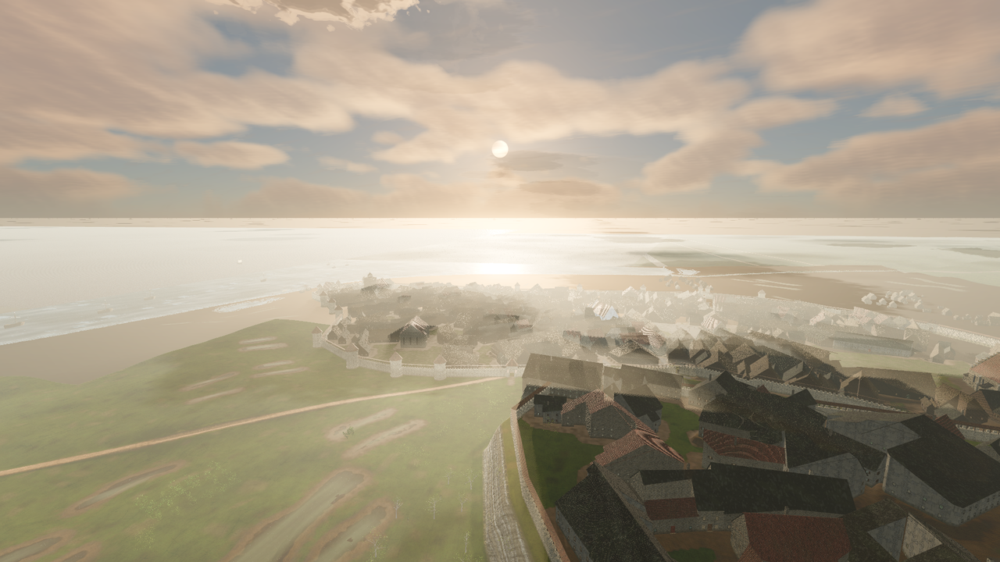

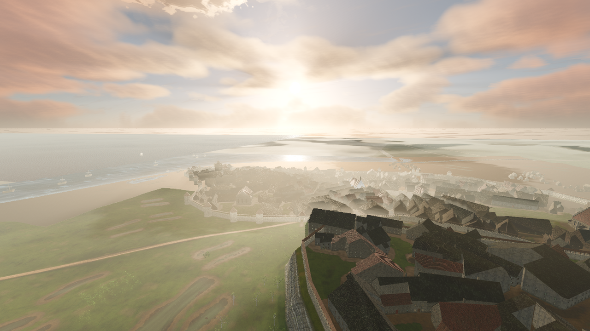

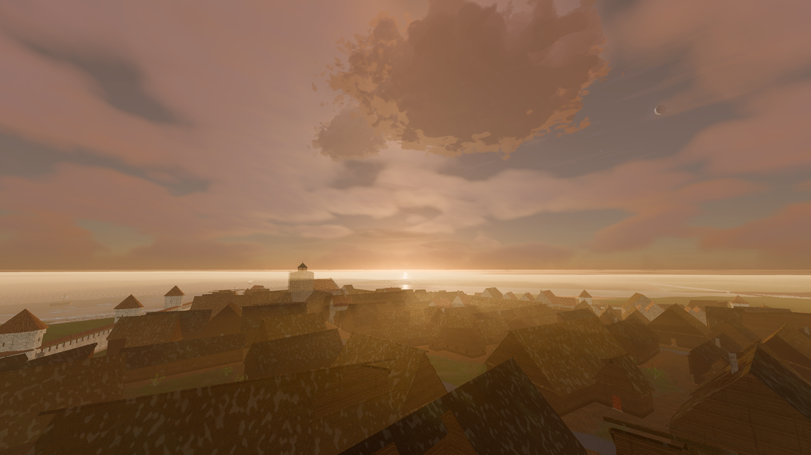

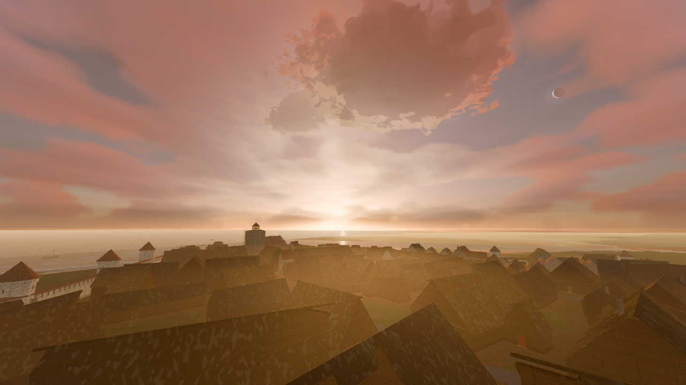

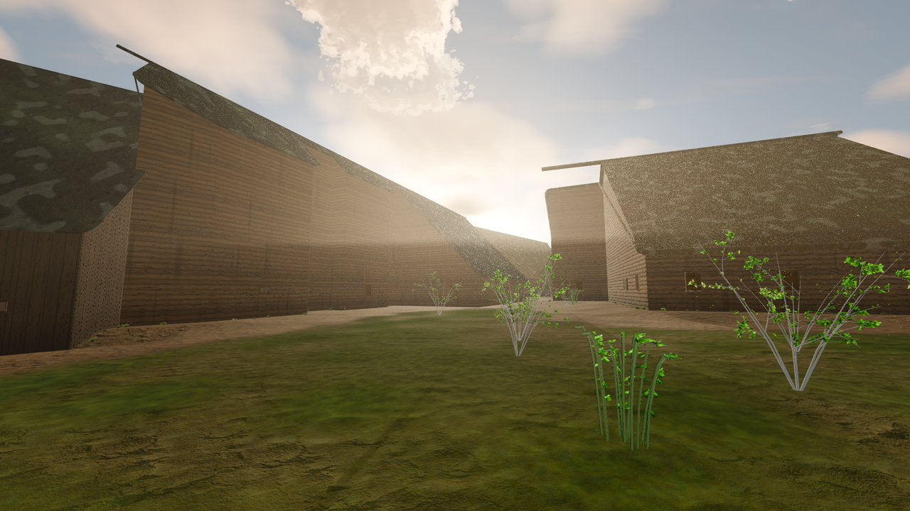

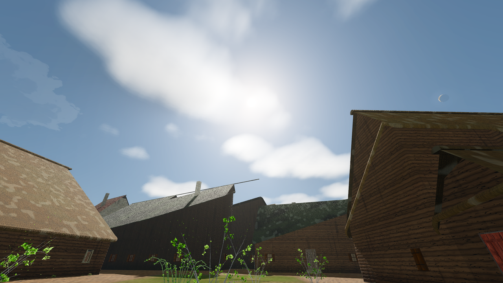

## Local storm rain

In `storm` weather the falling rain is local: the rain particles and the roof-rain bed only run while the camera stands inside a cumulonimbus rain shaft, the same cylinder the sky draws its curtain in (`RAIN_SHAFT_RADIUS` = 0.55 x cell radius, faded over +-15% of it, scaled by the cell's visible weight). Three kilometres from the cell the street is dry and the roof is quiet while the curtain still hangs on the horizon. In `rain` weather the deck rains everywhere.

- `SkyWeather3D.local_rain_factor()` blends from 1 (everywhere) to the shaft cover by `smoothstep(0.3, 0.8, storm_locality())`, so the `rain` front (locality 0.18) gives 1 and the `storm` profile (0.9) is fully local. Weather transitions blend smoothly.
- `local_rain_intensity()` = `rain_intensity()` x that factor. It drives `rain_emitter_visible()`, the emitter `amount_ratio`, and `SkyWeatherRoofAudio.sync()` in `_update_rain()`.
- `storm_rain_cover_at(point)` measures the shaft cover; horizontal distance uses `CloudCells.wrap_delta(..., KIND_STORM)`.
- With no camera in the tree (headless simulation, tests that never call `configure`) the factor is 1, like lightning proximity.

**Decision: puddles, mud and saved state stay weather-wide.** `rain_intensity()`, `puddle_wetness()`, `mud_wetness()`, `seconds_since_rain()` and `WeatherPresentation.rain_intensity` keep using the profile rain (0.22 in a storm). Storm cells drift over the whole town during one storm, so the low profile rain stands in for the town-wide average, and a camera-dependent fill would make saved ground water depend on where the player stood. Local rain is presentation only: nothing new is saved, and older saves load unchanged.

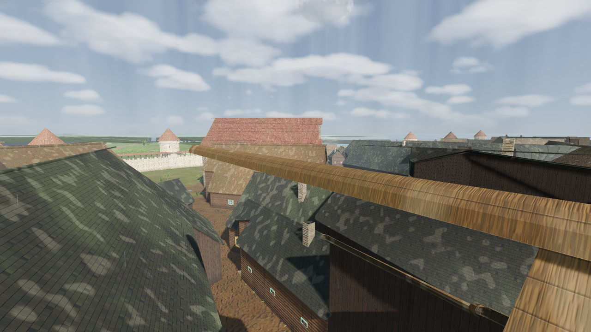

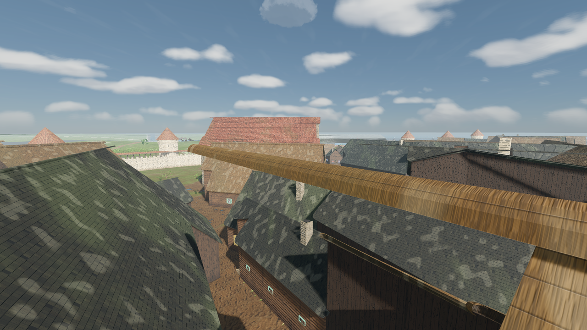

## Cloud shape and weather (follow-up)

- **Cumulus are irregular.** `cell_density()` stretches each cell along a seeded axis (aspect 0.6-1.7), domain-warps it with large noise so the outline breaks into lobes, leans the top downwind (`wind_dir`), and erodes a cell that is still forming or dissolving into ragged fragments.
- **Cumulus are a blue-sky cloud.** `CloudCells.counts_for()` peaks them at moderate cover and removes them once a deck closes (coverage 0.6-0.92). The remaining ones darken toward rain grey through the sky shader uniform `cloud_gloom` (`smoothstep(0.55, 0.95, coverage)`).
- **Cumulonimbus are wide and rare.** Radius 1100-1700 m, height 1300-1900 m (wider than tall), no narrow stem: the profile is a broad mass, and a seeded anvil share (0 to 0.42) makes some flat-topped and some ragged. Storm slots after the first are alive for `STORM_ACTIVE_SHARE` (half) of a 150-220 s cycle only. Some storm shafts get a whiter, greenish hail tint. Hail as a gameplay or ground effect is not implemented.

## Saved state

`SkyWeatherState` gains four optional fields (older saves default them): `cloud_cell_clock` (rebuilds the whole cell field together with `cloud_offset` and the profile), `lightning_origin`, `lightning_ground`, `lightning_kind`. See [`SKY_WEATHER_STATE_CONTRACT.md`](../SKY_WEATHER_STATE_CONTRACT.md).

## Quality tiers

Tiers change cost only; cell positions and strike timing are identical.

| Key | Minimum | Recommended |
|---|---|---|
| `cloud_cell_steps` (coarse surface search) | 6 | 12 |
| `cloud_cell_fine_steps` (surface march) | 5 | 10 |
| `cloud_cell_light_samples` | 1 | 2 |
| `cloud_cell_ray_samples` (sky beams) | 0 | 8 |
| `cloud_cell_noise_size` (3D noise edge) | 32 | 48 |

The radiance cubemap pass skips the cells. A 1280x720 street view in the seamless city showed no measurable frame-time difference with cells on or off (26.1-26.5 ms either way, M-series Mac, Compatibility).

## Screen-pass fixes made with this task

The ground shadow pass had two defects that kept it from ever drawing a localised shadow:

- **Compositing**: `blend_mul` multiplied the frame by `ALBEDO`, but the Compatibility 3D buffer stores colour pre-scaled by its HDR luminance multiplier, so `ALBEDO = 1` multiplied every frame by about 0.25 and the old `COMPAT_BLEND_GAIN` still left frames ~40% darker. The pass now mixes black by `ALPHA` (`blend_mix`), which is exact under any multiplier or tonemapper.
- **Draw order**: the pass drew at transparent priority 96, after the water. Water samples the screen texture, and in Compatibility that back-buffer copy leaves `hint_depth_texture` empty (all 0) for every transparent pass drawn after it, so the pass rebuilt no positions on any map with a sea. It now draws first (`RENDER_PRIORITY = -100`), so it darkens the opaque scene and the bed seen through the water. The water surface shades itself: every water shader samples `cells_ground_shadow` and scales the directional light's diffuse and specular by `1 - shadow * 0.85` (the pass's `CELL_SHADOW_STRENGTH`), so a cloud's shadow continues from the shore across the sea and puts out the sun glints under it. The map-view sea and city harbour (`map_view_water.gdshader`) evaluates it per vertex because its fragment stage already uses all 16 Compatibility sampler units; the cell edge is ~60 m wide, far coarser than any water grid. The city's `city_water` / `city_moat_water` use a `light()` that repeats Godot's Burley diffuse and Schlick-GGX specular with that factor. The shadow is gated to the sun (0 once the light has handed over to the moon). `cloud_cells` is pushed every frame (`MapViewMaterials.apply_weather_presentation`, `CityMapView._process`). Pixels with no depth behind them (sea without a bed mesh) are shaded on the sea plane, faded out between 1.5 and 3 km.

## Verify

```bash
godot --headless --path . --script tools/run_godot_tests.gd -- --filter=test_cloud_cells
godot --headless --path . --script tools/run_godot_tests.gd -- --filter=test_cloud_shadow_pass
godot --headless --path . --script tools/run_godot_tests.gd -- --filter=test_sky_weather_3d,test_sky_weather_state
tools/godot_render.sh --script tools/capture_cloud_cells.gd [-- --only=<shot>[,<shot>...]]
# R-1436: continuous deck patches must continue from land onto the sea.
tools/godot_render.sh --script tools/capture_cloud_cells.gd -- --only=cells_aerial_cloudy,cells_harbour_shadow
```

Captures land in `docs/reports/images/weather/`: `cells_aerial_clear`, `cells_aerial_cloudy`, `cells_topdown_shadow`, `cells_street_cumulus`, `cells_storm_ground_stroke`, `cells_storm_in_cloud`, `cells_storm_rain_under` / `cells_storm_rain_away` (same view with the storm cell overhead and 3 km away), `cells_sunbeams`, `cells_harbour_shadow` (a cell shadow crossing the waterline; the tool walks the cell clock in fixed 10 s steps until one shadow covers both shore and sea). Screen passes composite over the live framebuffer, so captures must render in the root window, not a `SubViewport`.

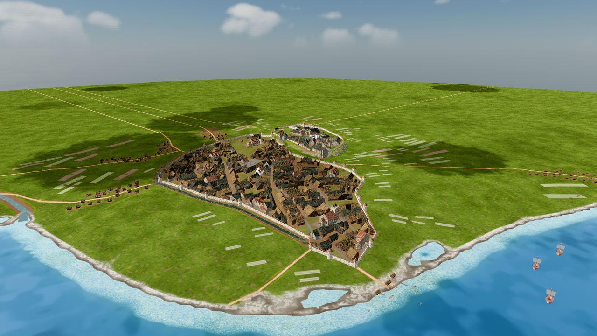

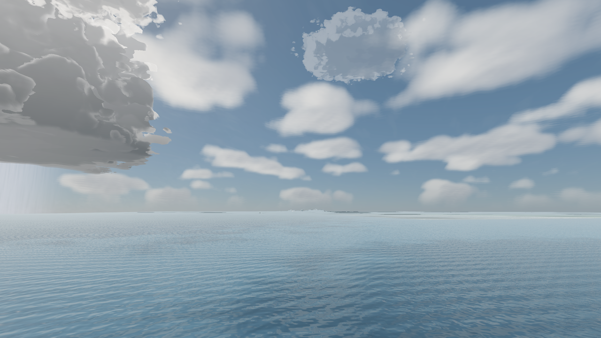

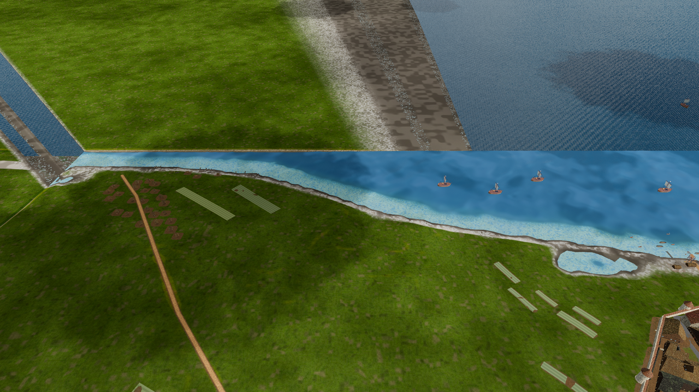

## Limits

- Only the rain particles and roof-rain audio are local to storm cells. Puddles and mud stay weather-wide (see the decision above), and the outdoor rain ambience layer (`AmbienceController`, fed from `map_view_runtime_ambient.gd`) still hears the weather-wide `rain_intensity`.
- Under a storm cell the local rain is the storm profile's 0.22, so a thunderstorm shower reads as light rain, not a downpour.
- Water dims only its direct sun (diffuse and glints) under both the continuous deck and discrete cells; its sky reflection and ambient term stay, so sea shadows remain lighter than grass shadows. The shared water helper uses `sky_cloud_shadow_soft`, the pass's 400-unit projection and 1.5 erosion mip, and the same restored cloud globals. It combines `deck = soft_shadow * cloud_shadow_strength` and `cell` as `1 - (1 - deck) * (1 - cell * 0.85)`, then fades out at the sun-to-moon handoff; local lights are unchanged. `map_view_water` samples both `cloud_shape_tex` and `cloud_noise_tex` per vertex (the fragment stage is at the GL sampler limit), so coarse meshes can soften the interpolated shadow edges. The lightweight city water and moat shaders sample the same helper per fragment; city surfaces using `MapViewMaterials.water_surface` retain the vertex path. Water always uses the soft deck variant, even when the ground pass uses its one-sample minimum tier. In shallow clear water the bed is darkened by the pass and the surface's own diffuse again, so the bed under a cloud reads slightly darker than the same bed on land.
- The city god-ray raster leaves terrain out (sampling the relief over the whole city stalls the first frame), and the near air slab stops at 32 m, so roof-edge shafts do not form in Upper Town streets on the klint. The R-1444 far march (cloud shafts) does reach them.
- The dome deck is drawn around the camera, while the ground shadows and the pass's air shadows use the world-anchored WS-12 plane. Sky beams come from the visible clouds; beams over the land line up with the ground shadows, not with the dome clouds right above them.
- The god-ray pass has no quality-tier switch yet: minimum quality runs the same 16 near and 12 far samples. The sky beams do follow the tier (14 steps with cells on recommended, 7 deck-only on minimum).
- Cell edges show a fine dither from the deterministic march jitter at close range.
- Thunder audio is not yet timed to strike distance.

### FFT sea compatibility limit (R-1437)

FFT sea surfaces sample only discrete cell shadows in the vertex stage. The extra
continuous-deck sampler made the surface disappear on macOS GL Compatibility,
without a reported compile failure. Lightweight city water retains the deck/cell
union; full deck shadows on FFT water require a separately verified sampler-safe
implementation. See [city sea visibility](./CITY_SEA.md#perspective-sea-visibility-r-1437).
