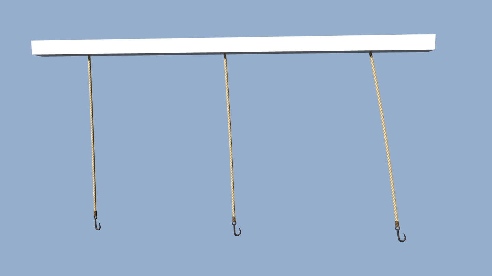

# Hoist ropes

Status: implemented (task **R-1200**). Owner: dev. Scope: the rope and iron hook hanging from hoist beams on kit houses (`merchant_stone`, the Lower Town stone storehouse), the town hall attic hoist, and the `hoist_beam` plot-dressing prop. Out of scope: other rope props (coils, stall lashings, nets), CPU rope physics, loads on the hook, and player interaction with the hoist.

## What the player sees

The rope is laid hemp with three visible strands and a tarred whipping where it is spliced through the eye of a forged J hook. In the shared world wind ([flag cloth](FLAG_CLOTH.md) uses the same wind):

1. **Pendulum swing.** The hook mass keeps the rope nearly straight. It swings slowly with a period set by its length (about 3 s for a 2.4 m rope) and traces a loose ellipse: the swing across the wind is weaker and detuned from the swing along it.
2. **Lean.** As the wind rises the rope leans downwind, and settles back a little in the lulls between gusts.
3. **Bow and ripple.** Drag bows the free rope downwind between the sheave and the hook; in strong wind a short ripple runs down it.
4. **Twist.** The hook turns slowly back and forth as the laid rope winds and unwinds.

The rope top stays pinned at the sheave. Each rope gets its own phase from its world position, so neighbouring hoists never swing in sync. In light air the hook barely moves; in a gale it travels roughly 0.3-0.5 m.

## Runtime entry points

| Piece | Path |
| --- | --- |
| Rope mesh, placement helpers | `scripts/map/view3d/map_view_hoist_rope.gd` (`MapViewHoistRope`) |
| Pendulum shader | `scripts/map/view3d/map_view_hoist_rope.gdshader` (`MapViewMaterialShaders.HOIST_ROPE_SHADER`) |
| Materials | `MapViewMaterials.hoist_rope_hemp()` and `hoist_rope_iron()` -> `map_view_wind_materials.gd`; both are in `wind_materials()`, so `MapViewMaterials.apply_world_wind(direction, strength)` drives them |
| Kit houses | `MapViewBurgherHouseModels.add_variant_model` calls `MapViewHoistRope.attach_at_markers(root, model)` (merchant_stone tier and service buildings) |
| Prop | `_add_plot_dressing_component` calls `MapViewHoistRope.replace_baked(model)` for `hoist_beam` |
| Town hall | `_add_attic_hoist` in `map_view_town_hall_model.gd` uses `MapViewHoistRope.create(length)` |

## Asset and mesh contract

- **Kit GLBs.** `House.hoist()` in `tools/burgher_house_kit_common.py` no longer bakes the rope and hook. It exports two empties, `HoistRopeAnchor` (rope top under the sheave) and `HoistRopeEnd` (hook eye). Godot reads their origins, parents the rope to the building root (not to the GLB, whose footprint fit is non-uniform) and turns the hook bill along the beam. Regenerate with `blender --background --factory-startup --python tools/generate_burgher_house_merchant_stone.py` and `... tools/generate_lower_town_service_buildings.py`.
- **Prop.** The plot-dressing `HoistBeam` component still ships its baked `Rope.001` and `Hook`; `replace_baked` reads their bounds for the rope top and hook eye, frees them and adds the live rope.
- **Mesh** (`MapViewHoistRope.build_mesh(length)`, cached per centimetre): surface 0 is the rope tube plus whipping, surface 1 the hook. Anchor at the origin, rope along -Y. `UV.y = s / L` on the rope, `UV2 = (hook flag, L)` on every vertex. The node must not be scaled: lengths are metres and wind is resolved in local space. The three-strand lay is drawn per pixel in the shader and fades out once it is smaller than a couple of pixels, so distant ropes do not shimmer.

## Data and save/load

No content IDs and no persistent state. The look depends only on the world wind and render time.

## Verification

- Tests: `godot --headless --path . --script tools/run_godot_tests.gd -- --filter=test_hoist_rope` (mesh contract, wind registration, kit markers on merchant_stone, prop swap, town hall).
- Visual: `tools/godot_render.sh --script tools/capture_hoist_rope.gd` writes `docs/reports/images/hoist_rope/hoist_rope_a.png` and `_b.png` (three ropes in light, moderate and strong wind, 0.7 s apart) and `hoist_rope_house.png` (merchant_stone gable).

## Known limits

- The motion is analytic, not simulated: the hook cannot hit the wall or the beam, and in a gale from the facade side it can swing into the wall slightly.
- No local wind sheltering behind buildings; every rope reads the shared world wind.
- The `hoist_beam` prop GLB still carries the baked rope and hook; they are removed at load time.
