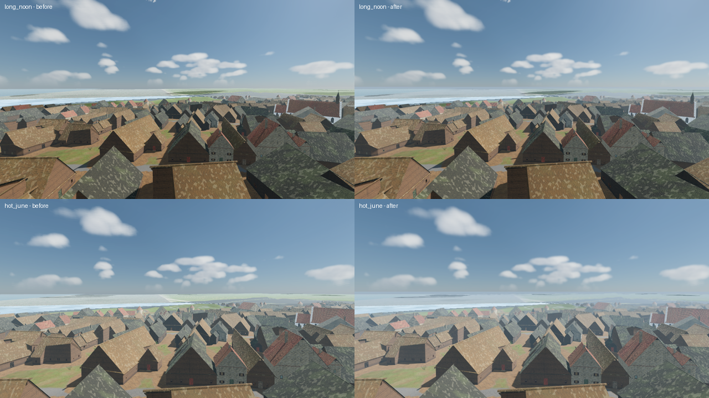

# Local fog banks, horizon haze, aerial perspective and heat mirage

Status: implemented (tasks **R-1430**, **R-1482** aerial perspective, distance blur and heat shimmer)

Scope: four presentation-only layers on top of the sky/weather system, mounted in both `MapView3D` maps and the seamless city (`CityMapView`). They read the shared `WeatherPresentation` snapshot and the `CloudCells` simulated clock and never write gameplay state or saves.

1. **Local fog banks**: patches of ground fog that gather near water, only in damp, calm air, lit by their own light.
2. **Horizon haze**: a faint distance veil for far land and sea, perspective cameras only.
3. **Heat mirage**: wavering pale streaks above the far horizon on hot, calm, clear summer middays.
4. **Aerial perspective** (R-1482): far surfaces take the colour of the air and soften with distance, and on hot days the far ground near the horizon wavers. The player's surroundings stay sharp.

Out of scope: volumetric fog (the GL Compatibility renderer has none), fog that blocks line of sight or AI vision, fog lit by street lamps and torches, a focus-pulling camera DOF (focus is fixed on the player's surroundings), superior mirages (looming ships over the cold sea), a persisted fog state.

## What the player sees

- **Fog banks** appear on the shore, on a pier or on the meadow beside the sea, the moat or the stream. They are *not* everywhere: a bank needs damp air, water within 44 world units, and a drifting noise patch, so most of the shore stays clear. Banks fade in over about 4 s, drift with the wind, and fade out when the air dries.
- **Weather drives density**: dawn radiation mist (the date-based `morning_fog_potential`), an overcast deck, falling rain and standing puddles (wet ground keeps giving moisture back after the rain stops) all raise it. Wind disperses it, and a high clear sun burns the damp share off by about half. Storm weather with strong wind clears it.
- **Own lighting**: each puff is shaded on the side facing the sun (or the moon at night), brightens at its thin edges when the camera looks toward the light (forward scatter), takes its ambient hue from the horizon the dome draws, and flashes with lightning. Fog never glows at night.
- **Horizon haze**: in third and first person the distant city, hinterland and sea blend toward the horizon colour. It thickens in damp air and in summer heat. The orthographic gameplay lens gets none (it would read as a flat wash).
- **Heat mirage**: when the sun is high (since R-1482 the gate is sine of elevation 0.7 to 0.78, so a little in mid-August, strong from May to July around noon), the sky holds no more than fair-weather cumulus and the air is calm and dry with no puddles, pale streaks shimmer just above the horizon line and the far ground below it wavers (see aerial perspective). The campaign's April opening shows almost none.
- **Aerial perspective** (third and first person outdoors): from about 25 m out, surfaces blend toward the colour of the air, about 17% at 300 m and up to 60% far away (45% at night). By day the air is the horizon colour pulled toward sky blue, at golden hour it takes the low sun's warmth, in rain and overcast it is grey, at night dark blue. Air washed by rain and ventilated by wind is the clearest; overcast damp air, hot still air and falling rain thicken it (up to 2.4x). Beyond 30 m surfaces also soften, reaching a 2-4 px blur (on a 720-line frame, scaled to the window) at 500 m; thicker air blurs more. The blur is depth-aware: a near roof edge does not bleed into the soft background. On hot days far surfaces seen nearly edge-on and the horizon line waver by up to 3 px with a rising, wobbling refraction. The orthographic gameplay lens, roofed rooms and the sky itself are untouched. Water draws over the pass, so the sea keeps only the exponential horizon haze.

Plates (R-1482, before left, after right): [clear noon and hot June](../reports/images/weather/aerial_before_after_day.png), [evening and rain](../reports/images/weather/aerial_before_after_weather.png), [street and first person stay sharp](../reports/images/weather/aerial_before_after_street.png).

Older plates: [overview contacts before/after](../reports/images/weather/fog_contacts_before_after.png), [overcast overview](../reports/images/weather/local_fog_overview.png), [overcast shore](../reports/images/weather/local_fog_overcast_shore.png), [after rain, low sun](../reports/images/weather/local_fog_after_rain_lowsun.png), [midsummer mirage](../reports/images/weather/horizon_mirage_midsummer.png).

## Runtime entry points

| Piece | File |
|---|---|
| Owner node, one per exterior view | `scripts/map/view3d/local_atmosphere.gd` (`LocalAtmosphere`) |
| Fog bank pool, scoring, light parameters | `scripts/map/view3d/local_fog_banks.gd` (`LocalFogBanks`) |
| Puff shader (camera-facing ellipse, own lighting, soft surface contacts) | `scripts/map/view3d/local_fog_puff.gdshader` |
| Heat mirage ring and shader | `scripts/map/view3d/horizon_mirage.gd` (`HorizonMirage`), `horizon_mirage.gdshader`; the gate is `AerialPerspectivePass.heat_amount` |
| Aerial perspective, distance blur and heat shimmer | `scripts/map/view3d/aerial_perspective_pass.gd` (`AerialPerspectivePass`: `haze_color_for`, `haze_density_for`, `blur_pixels_for`, `heat_amount`), `aerial_perspective_pass.gdshader` |
| Damp air, heat and horizon haze maths; distance fog | `scripts/map/view3d/map_view_lighting.gd` (`air_dampness`, `heat_amount`, `horizon_haze_amount`, `apply_ground_mist(..., horizon_haze)`) |
| Perspective check | `SkyWeather3D.view_is_perspective()` |
| Mounting (all layers are children of `LocalAtmosphere`) | `MapView3D._create_local_atmosphere` (view-effects stage and `_process`), `CityMapView._create_city_atmosphere` and `_process` |

How a bank is chosen (`LocalFogBanks`): the world is cut into 16-unit cells around a focus point (20 units ahead of a perspective camera, the view-ray ground hit for the orthographic one). Each cell scores `density(weather) * water_affinity * patch_mask`. Water affinity is measured once per cell from 25 water probes (centre plus three rings of eight) through the view's `water_surface_height_at` and then cached; at most 3 cells are measured per frame. The best cells, biased toward the player, claim one of 14 pooled `GPUParticles3D` emitters (12 soft puffs each); the `fog_quality` tier scales the pool (9 on minimum). Only the current camera halo is cached, stale queued probes are evicted, and invisible emitters stop simulating. Each viewport owns its own layer; hosted neighbors within one viewport share the first layer. Patches drift on `SkyWeather3D.cloud_cell_clock()`, so a load or map swap shows the same pattern at the same simulated time.

## Data and stable IDs

No content IDs, no JSON, no saves. All tunables are constants at the top of `local_fog_banks.gd`, `horizon_mirage.gd`, `aerial_perspective_pass.gd` (`HAZE_*`, `BLUR_*`, `HEAT_SUN_*`, `SHIMMER_*`) and `map_view_lighting.gd` (`HORIZON_HAZE_*`). The shared `fog_quality` field of `QUALITY_TIERS` limits fog, haze and mirage strength; the minimum tier (0.65) skips the blur and shimmer taps and keeps a lighter haze.

## Verify

- `godot --headless --path . --script tools/run_godot_tests.gd -- --filter=test_local_fog_banks` (density, water affinity, patch locality, light parameters, heat, haze fog, bank claim and fade, no-water case, bounded travel cache, roof suppression, active-camera projection switching, independent viewports).
- `godot --headless --path . --script tools/run_godot_tests.gd -- --filter=test_aerial_perspective` (haze hue by hour and weather, clarity after rain, heat gate by season and weather, near/far curves, quality tier, perspective/indoor/neighbour gating).
- Aerial plates: `tools/godot_render.sh --script tools/capture_aerial_perspective.gd -- --tag=after` and `-- --tag=before --no-pass` write `aerial_<shot>_<tag>.png` (`long_noon`, `long_evening`, `hot_june`, `street_noon`, `first_person`, `long_rain`). `--debug=1|2|3` shows the haze factor, the blur factor or the raw screen copy (which must match a `--no-pass` frame); `--bench` times the pass (about 1.3 ms/frame at 1280x720 on an Apple M-series GPU).
- Regression: `--filter=test_weather_realism`, `--filter=test_map_view_lighting`.
- Plates: `tools/godot_render.sh --script tools/capture_local_fog.gd` writes `build/local_fog/*.png`, including `fog_overcast_overview` (30 degrees) and `fog_overcast_steep` (75 degrees).
- Isolated surface-contact proof: `tools/godot_render.sh --script tools/capture_fog_contacts.gd`. If `build/scratch/local_fog_puff_before.gdshader` exists it renders old/fixed side by side, otherwise both columns use the current shader. Red tint highlights the contact; a sloped ground plane and screen-reading water strip exercise the render order.

## Limits

- Puffs face the full camera basis, so overview and steep top-down views do not collapse them into lines. Elliptical silhouettes, world-height fade and a 2.5-unit opaque-depth contact fade remove straight card cuts at terrain and walls. Fog draws at priority -90 (after cloud shadows at -100, before screen-reading water at 0); Compatibility otherwise loses the depth buffer after the water back-buffer copy. Transparent water does not contribute contact depth.
- Fog height follows the ground at each cell centre; on steep slopes a puff can float or sink a little.
- Banks only gather around water the view can probe. A map with no water gets no banks (the mirage still mounts outdoors).
- The mirage ring itself is an additive-looking veil; the warp of the scene comes from the aerial pass. Heat is inferred from solar elevation and weather, not from a temperature simulation.
- The aerial pass rewrites the frame from the pre-transparent screen copy, so it draws first among the screen passes (`render_priority` -110): cloud shadows, god rays, fog banks, water and other transparent surfaces are composited after it and are neither hazed nor blurred by it. Water also writes no depth, so the sea gets only the exponential horizon haze.
- Focus is fixed on the player's surroundings (0-30 m); there is no focus pull onto what the camera aims at.
- Sun/moon/lightning lighting is approximate; practical lights do not illuminate puffs.
- Hosted district neighbors share the first exterior layer, which probes only that map; water available exclusively in another mounted map may need a new owner before banks appear.
- Independent human or agent visual sign-off is still pending; the attempted reviewer returned no result.
