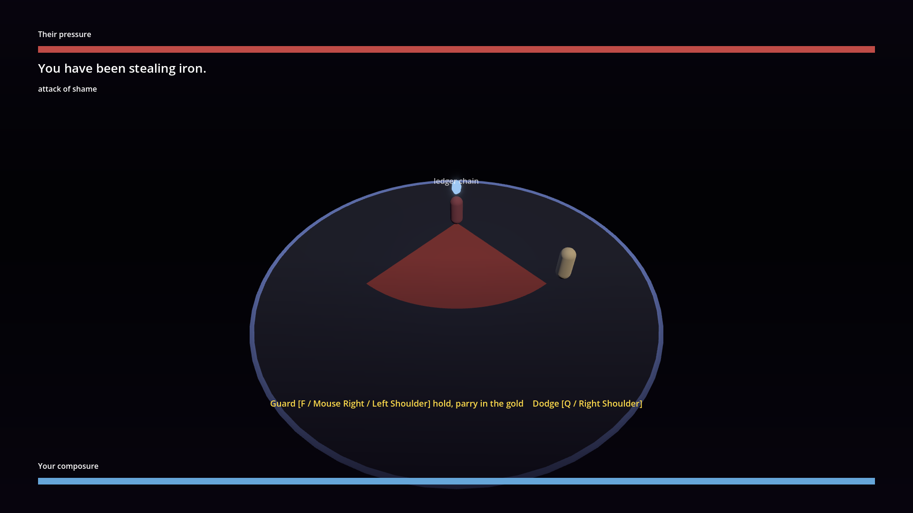
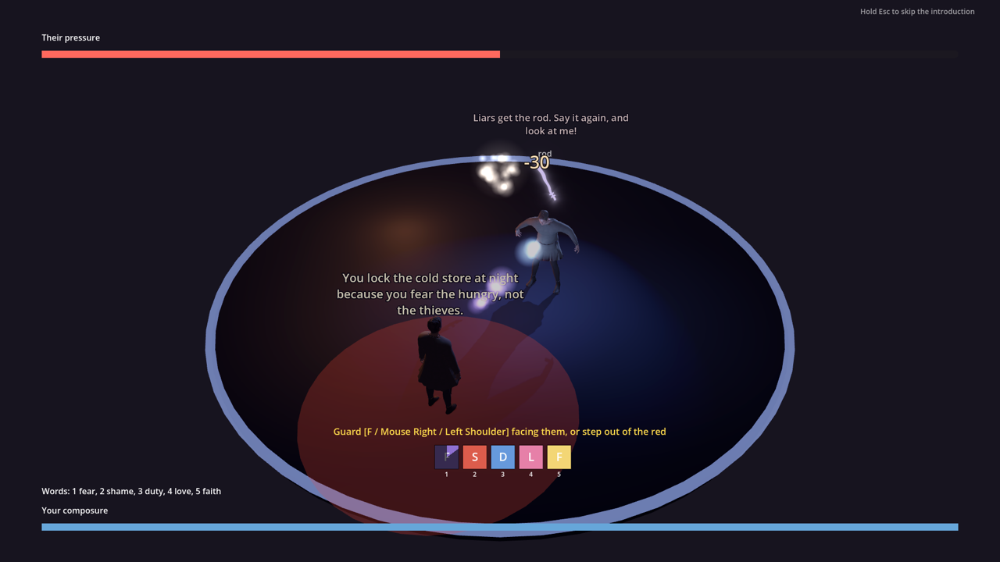
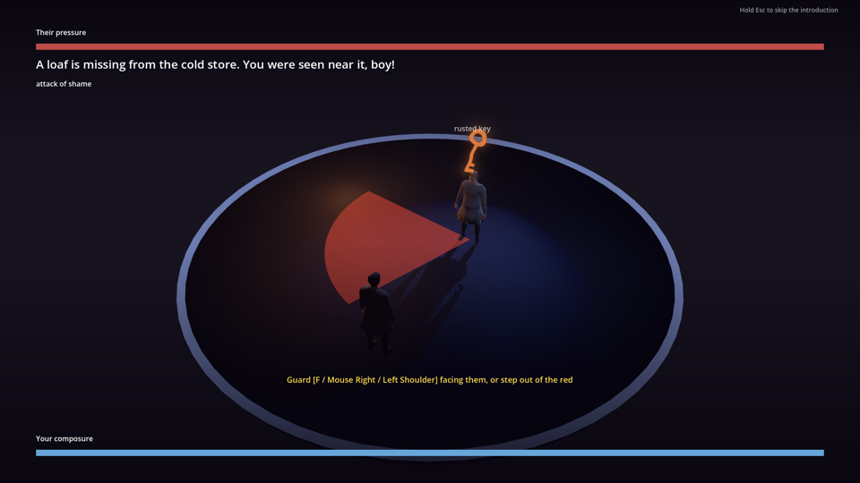

# Spirit dialogue combat

Status: planned; hero model implemented (SD-10) ([ADR 0033](../adr/0033-teen-protagonist-and-spirit-dialogue-combat.md)). Only the hero model (SD-10) is implemented; everything else is design. Scope: a teenage clairvoyant protagonist, dialogue authored as combat, observation of other people's conflicts as spirit duels, hybrid physical combat with per-school guilt, and the language-comprehension skill. Out of scope: party control, a universal morality score, runtime LLM dialogue (ADR 0003), a new magic framework beyond [`MAGIC.md`](./MAGIC.md) and [`PSYCHE.md`](./PSYCHE.md).

Canon labels: spirit world, creatures, and guilt rites are `folklore` / `invented` per [`docs/CANON.md`](../CANON.md). The almshouse at the Holy Spirit parish is `plausible composite`. The hero's perception is never given a clinical diagnosis.

## Runtime today

- **Playable hero model (SD-10):** the player rig spawns the 15-year-old orphan apprentice (`char.apprentice`, `assets/characters/variants/apprentice.tscn`, body `assets/characters/realistic/apprentice/`). Built by `tools/assets/realistic_humans/rebuild.sh apprentice` from the `apprentice` spec (Tier 0, shared 71-bone rig, 1.60 m, modular wardrobe). Outfits in `outfits.json`: `work` (default), `almshouse` (unshod), `street`, `travel`. Both player spawn points (`MapViewRuntimeBootstrap.PLAYER_RIG_SCENE`, `WorldHost.PLAYER_RIG_SCENE_PATH`) use it. Kalev's own scene is unchanged and is still used for tests and the master-smith NPC. Verify: `--filter=test_apprentice_rig`. No portrait yet (portraits need the local ComfyUI flow), and the teen move set is SD-11.

## Player-facing design

- **Physical world:** realistic, no magic. The hero can walk, observe, hide, talk, and, at a cost, strike.
- **Spirit sight (planned, [ADR 0041](../adr/0041-spirit-sight-auras-and-soul-lights.md), [`SPIRIT_SIGHT.md`](./SPIRIT_SIGHT.md)):** the hero toggles spirit sight anywhere; the same map turns cold and every person and animal shows a flowing aura with seven soul lights (strength, weak points, inner conflict; never a morality score). Duels start only from spirit sight, keep the building, hide furniture and clutter, and end back in spirit sight.
- **Observation:** when two people are in conflict and the hero "looks closer", the world dims into a spirit duel between them. He learns moves from what he sees and can step in.
- **Own duels:** the world freezes into an arena (being replaced by the in-place real-time arena of ADR 0038, entered from spirit sight per ADR 0041). Opponent lines are telegraphed attacks with text; the hero dodges, guards, or answers from a reply wheel. Slow beats (confession, grief) use paced choices instead.
- **Physical blows:** stronger and safer in the moment, but they open guilt (*süü*) in the matching school. Guilt is per school, not a single score: Christian sin and absolution, folk blood-debt and cleansing, civic and faction reputation.
- **Dreams:** unresolved guilt and fear return as phantoms in the Hingepuu hub.
- **Language:** speech in German, Russian, or Middle Low German is imagery without meaning until the comprehension skill grows.
- **Oddness:** self-talk is an action with a buff. Witnesses react by faction rules.
- **Traits:** hero traits are double-edged. NPC temperament tags decide which move kinds hit them.

## Dialogue move tags (implemented, SD-02)

A dialogue record may declare a top-level `duel` and tag nodes and choices with a `move` ([`schemas/dialogue.schema.json`](../../schemas/dialogue.schema.json), shared defs in `common.schema.json`):

- `duel`: `stakes[]` (declared stakes) and `resolution_node_ids[]` (how the duel can end).
- `move` (on a node or a choice): `kind` (`attack`, `defense`, `feint`, `appeal`, `pressure`, `evade`), `element` (`fear`, `shame`, `duty`, `love`, `faith`, `coin`), optional `stakes[]` (`respect`, `secret`, `obligation`, `balance`) and `spirit_image_id`.
- Validator codes (`tools/validate_content_semantics.py`): `DUEL_MISSING` (a move without a `duel`), `DUEL_UNTAGGED` (a `duel` with no move), `DUEL_STAKE` (a stake not declared in `duel.stakes`), plus `REFERENCE` / `REACHABILITY` for an unknown or unreachable resolution node. Untagged dialogue stays valid.
- Runtime: `DialogueRunner.get_duel()` and `get_current_move()` return copies of the markup; resolved choices carry `move`. The runner only exposes the tags; the arena that uses them is SD-04. Fixture: `content/examples/valid/dialogue.test_duel.json`.
- Verify: `python3 -m unittest tests.python.test_validate_content -v`, `--filter=test_dialogue_move_tags`.

## Guilt (implemented, SD-03)

`GuiltLedger` (`scripts/state/guilt_ledger.gd`, `GameState.guilt`) keeps three independent levels, `guilt.church`, `guilt.folk` and `guilt.civic`, each 0..10. There is no combined score and it never touches the faction ledger.

- `record_act(act_id, circumstance, lethal)` adds the circumstance weights once per `act_id`: `act.self_defence` (church 1), `act.defend_other` (church 1), `act.provoked` (2/1/1), `act.unarmed_victim` (4/3/3); a lethal blow adds church 3, folk 4, civic 2. Unknown circumstances and repeated acts return `{}`.
- `debuff_tier(school)`: 0 for level 0, 1 for 1-2, 2 for 3-5, 3 for 6+. SD-07 applies the tier as the spirit-layer debuff.
- `absolve(school, amount, rite_id)` lowers one school once per rite (confession, cleansing, apology); returns the amount removed.
- Save: `guilt` section with levels, recorded act IDs and used rite IDs; saves without it load as zero guilt. Verify: `--filter=test_guilt_state`.
- Recorded in play by physical blows (SD-07, below) and by the prologue shove (`act.almshouse_porter.blow`, R-1335). No rite content exists yet.

## Spirit arena (implemented prototype, SD-04)

- **Model:** `SpiritDuel` (`scripts/combat/spirit_duel.gd`) is a dialogue presenter that runs a tagged dialogue record as a fight on top of `DialogueRunner` (text, choices, effects, `once`) and `CombatVitals` / `CombatDefensePose`. Hero composure is `CombatVitals.health` (100), resolve is stamina (100); the opponent's pressure is health (60). `hero_id` (default `char.apprentice`) marks which speaker is the hero.
- **Telegraphed blows:** an opponent line whose move is `attack` (20), `pressure` (14) or `feint` (10) opens a 1.2 s window. Hold guard (`player_guard`) to block at a resolve cost; raising it within the last 0.18 s parries, which returns 15 pressure; `player_dodge` avoids the blow once for 25 resolve. Other moves are spoken without a blow.
- **Replies:** the hero's choices carry moves. A reply counters the incoming kind (defense beats attack, attack beats feint, feint beats defense, appeal and pressure beat each other) for 30 pressure; the same element adds 8; an untagged reply deals 0; a neutral reply 12; being countered 4. Each exchange restores 25 resolve.
- **Ending:** reaching a `duel.resolution_node_ids` node wins and reports `resolution_node_id` and whether the opponent was `broken` (pressure 0). Composure 0 loses; `retry()` restores the `EncounterCheckpoint` armed at the start and restarts with fresh vitals.
- **Screen:** `SpiritArenaHost` (`scripts/combat/spirit_arena_host.gd`) freezes the world (`SceneTree.paused`, restored on close), shows the line, bars and the reply hotbar (SD-18 below), and works with keyboard, mouse and gamepad. `open(content_db, state, dialogue_id)`, `close()`, signals `opened` / `closed(outcome)`. It refuses a record without a `duel`.
- **Verify:** `--filter=test_spirit_arena`; frames with `tools/godot_render.sh --resolution 1280x720 --script tools/capture_spirit_arena.gd`.
- **Limits:** no spells or hero moves beyond replies; NPC temperaments do not change damage yet (SD-15); the numbers are prototype values.

## Arena action feel (implemented, SD-18, task **R-1333**)

The duel reads as an action fight rather than a text menu (2D overlay; the real-time 3D arena uses the compact cast bar of SA3D-3 instead): the replies are a hotbar of spell cards, the reply window has a countdown ring, and an incoming blow sweeps a telegraph arc that names the bound defence keys.

- **Reply hotbar:** each reply is a `SpiritSpellCard` (`scripts/combat/spirit_spell_card.gd`, a `Button`) in an `HBoxContainer`, in authored order. A card shows an element-coloured icon placeholder with the element initial (`ELEMENT_COLORS` for `fear`, `shame`, `duty`, `love`, `faith`, `coin`; grey for an untagged reply), the spell name (or the plain reply text, wrapped over two lines), its willpower cost, the move (`attack shame`), the spoken line as a caption, and the slot badge with the bound keyboard key. The full binding including the gamepad button is the card's tooltip. No art asset is involved (P0-040).
- **Picking a card:** the slot keys `spellforge_element_1..5` (`1`..`5`, gamepad X / Y / shoulders) cast the card in that slot through `SpiritArenaHost.pick_slot(index)`; a mouse click presses it; on a gamepad the first castable card takes focus at the start of every reply window and `ui_accept` casts the focused one. While the hotbar is up the slot keys no longer cast loose magic, so a spell reply's cast and its spoken line are one act. During a telegraph a slot key that shares a binding with `player_guard` or `player_dodge` (the default gamepad slots 3 and 4 are the same shoulder buttons) defends and never casts.
- **Blocked cards:** `SpiritDuel.reply_block_reason(choice)` pre-checks the authored `disabled_reason`, the magic grant and the cost resource, so a card the hero cannot afford is `disabled`, dimmed, and says "Not enough willpower (2 needed, 1 left)." in place of its caption. The reasons are rechecked every round as willpower is spent. A disabled card cannot be pressed by mouse or confirm at all; its slot key only repeats the reason in the hint line.
- **Cast caption:** casting types the card's spoken line over the arena at the dialogue text speed (`DialogueSettings.chars_per_second`; instant with reduced motion or instant text speed). `SpiritArenaHost.cast_caption()` reads it back.
- **Countdown ring:** `SpiritReplyRing` (`scripts/combat/spirit_reply_ring.gd`) draws `SpiritDuel.reply_window_progress()` next to the hotbar. It is pressure, **not** a timeout: after `REPLY_WINDOW_SEC` (6 s) the hero hesitates **once**, loses `HESITATION_COMPOSURE` (6) composure clamped so it can never drop below 1 and so can never lose the duel on its own, the hint says so, and the window stays open until a reply is cast. Settings -> Gameplay accessibility -> **Reply timer pressure** off sets `SpiritDuel.reply_pressure_enabled = false`: the ring is hidden, the timer never runs and nothing is chipped ([`SETTINGS_AND_ACCESSIBILITY.md`](./SETTINGS_AND_ACCESSIBILITY.md)).
- **Telegraph arc:** `SpiritTelegraphArc` (`scripts/combat/spirit_telegraph_arc.gd`) is a half-circle the blow sweeps along over `telegraph_sec`, with the parry window marked in gold (`parry_window_sec / telegraph_sec`). Under it the prompt names the live bindings of `player_guard` and `player_dodge` ("Guard [F / Mouse Right / Left Shoulder] hold, parry in the gold    Dodge [Q / Right Shoulder]"), so a rebind is reflected at once. Both are hidden outside `PHASE_TELEGRAPH`.
- **Voice cue hook:** a dialogue choice may carry an optional `voice_path` ([`schemas/dialogue.schema.json`](../../schemas/dialogue.schema.json), passed through by `DialogueRunner`). `SpiritArenaHost.play_reply_voice(path)` plays it on the `Voice` bus when the file exists and `DialogueSettings.voice_enabled` is on, and returns false otherwise. No clip is authored yet, so today every cast is silent; nothing new is required to add one.
- Verify: `--filter=test_spirit_arena_hud` (card cost/key/colour/caption, slot key, gamepad slot button, gamepad focus + confirm, mouse click, disabled-with-reason and the recheck each round, the hesitation chip and that it cannot break composure, the accessibility toggle, the arc prompt bindings, guard not double-casting on a shared gamepad button, the voice hook); `--filter=test_gameplay_accessibility_settings`, `--filter=test_game_settings_overlay`; plates from `tools/godot_render.sh --resolution 1280x720 --script tools/capture_almshouse_opening.gd` (`telegraph.png` the arc and prompt, `duel.png` the hotbar and ring, `cast.png` the caption typing; they are regenerated on demand and not tracked, see [`ASSET_STORAGE_POLICY.md`](../ASSET_STORAGE_POLICY.md)).
- **Limits:** the icon is a coloured tile with the element initial, not spell art; the hotbar is one row of up to five cards and does not scroll or page, so a sixth reply has no slot key (it is still clickable and focusable); the ring has no sound; the caption is one line of plain text with no speaker portrait; the hesitation chip is the only cost of a slow reply and the opponent does not press harder.

## The apprentice at the anvil (implemented, SD-12)

- **Secret methods:** a commission forging option may declare `apprentice_method` (`quiet_modification`, `substitution` or `concealment`, [`schemas/commission.schema.json`](../../schemas/commission.schema.json)). Once `flag.prologue.apprenticed` is set the commission snapshot reports `apprentice_secret_available`, and `ForgeCommissionRunner.select_option(option_id, true)` does that option behind the master's back. A secret attempt on an option without a method, or before the apprentice is taken in, fails with `Result.SECRET_NOT_POSSIBLE`.
- **Same records:** a secret option writes exactly the `ForgedRecord` and effects of the master's version (`forged.<commission>.<option>`, the option's own flags), so every downstream consequence is unchanged; the only addition is the mark `flag.forge.secret.<commission>.<method>`. The forged-record schema is untouched.
- **Authored today:** `commission.watch_buckle_repair` (`subtle_defect` quiet modification, `secret_feature` concealment), `commission.lantern_hook_rush` (`subtle_defect` substitution), `commission.bitter_brew` (`subtle_defect` quiet modification, `secret_feature` concealment).
- **Screen:** `ForgeCommissionOverlay` adds a "...and do it quietly (method)" button under each such option when the secret path is available, and `ForgeCommissionUiPresenter` routes it to the runner.
- Verify: `--filter=test_apprentice_commissions` and the existing commission tests.
- **Limits:** nothing reads the secret marks yet (Kalev never discovers or reacts to them); Kalev is not mounted as a master-smith NPC in the smithy (the smithy routine system still drives him as before; see row SD-17 in `TODO.md`); the player has no way to be apprenticed in the running game until the prologue is wired.

## Magic in the spirit world (implemented, SD-14)

- **World casts are refused:** `SpellforgeController` checks `SpellforgeModel.is_spirit_world()` before any cast (number keys, learned-spell clicks, the cookbook's cast). The feedback line is "Magic answers only in the spirit world." and no willpower is spent.
- **Spirit world flag:** `GameState.in_spirit_world` is true from `SpiritDuel.begin` / `SpiritObservation.begin` until the duel or observation ends (win, loss, close). It is transient and never saved.
- **Arena casts:** `SpiritDuel.cast_spell(id)` (phases telegraph and answer) calls the same `MagicResolver.cast`, so locks, willpower and piety, and conduit rules are unchanged. Effects by authored impact: `damage` -> pressure (amount x 1.5), `stagger` / `knockback` -> the next blow is halved, `heal_over_time` -> +12 composure, a self `modifier` -> the hero's timed buffs (damage reduction and damage bonus apply to blows taken and replies dealt), a summon has no arena effect.
- **Screen:** `SpiritArenaHost` casts learned spells with `spellforge_element_1..5` in the 2D overlay (in the real-time 3D arena the slots are word spells, SA3D-3), shows the spell hint, and counts as a modal overlay so the world controller stands down while it is open.
- **Cast and blow effects (task **R-1332**):** `SpiritArenaHost` mounts `SpiritArenaVfx` (`scripts/combat/spirit_arena_vfx.gd`), a presentation-only `Control` bound to `SpiritDuel.exchange_resolved` while a duel is open. Looks follow the exchange, never a spell id: `spell` + `arena_effect` `pressure` -> a fireball flies from the hero (lower centre) to the opponent (upper centre) and bursts; `stagger` -> a dust ring and a heavy screen shake at the opponent's feet; `buff` -> an iron shimmer around the hero; `heal` -> a green pulse with `+12`. A landed `reply` flashes on the opponent. An `incoming` blow: `hit` -> red sparks, screen shake and a red edge vignette; `parried` -> a gold spark shower; `guarded` -> a small iron spark; `invulnerable` (dodge) -> a whoosh. Every composure or pressure loss floats a number (pressure loss is read from the change in `pressure_left`) and flashes its bar. Everything is procedural (`CPUParticles2D`, `_draw`, the soft sprite and colour ramps of `map_view_magic_vfx_parts.gd`; no texture assets, P0-040); `SpiritDuel` is unchanged and stays deterministic. The shake moves the arena layer's `offset` and is reset on close and retry.
- **Accessibility:** `SpiritArenaVfx.refresh_accessibility()` reads `UserSettings` on bind: screen shake only when `gameplay.allows_screenshake(dialogue.reduced_motion)`; reduced motion lands the fireball at once and keeps numbers in place; reduced flashing scales flashes, bar flashes and the vignette to 30 %.
- Verify: `--filter=test_spirit_magic`, `--filter=test_spellforge_hud`, `--filter=test_spirit_arena_vfx` (effect per exchange kind and outcome, shake gated off, unbind on close); plates via `tools/godot_render.sh --resolution 1280x720 --script tools/capture_spirit_arena_vfx.gd -- --out=res://docs/reports/images/spirit_arena_vfx` (`fireball_flight`, `fireball_impact`, `tremor`, `iron_skin`, `hit`, `parry`).
- **Limits:** the 2D world delivery nodes (`MagicProjectile2D`, pulses) and the 3D `MapViewMagicVfx` are still not used in the arena (the arena effects are their 2D look-alikes); the opponent casts no spells, so only its blows have effects; the anchors are fixed screen fractions, not the opponent's spirit form; the iron shimmer is a one-off flash, not held for the buff's duration; the new-game starter grants (fireball, earth tremor, iron skin) are unchanged.

## 3D arena disc and duel layer (implemented, SA3D-1 **R-1385**, SS-6 **R-1489**, [ADR 0038](../adr/0038-realtime-3d-spirit-arena-and-topic-spells.md) amended by [ADR 0041](../adr/0041-spirit-sight-auras-and-soul-lights.md) section 5)

Status: implemented (task **R-1489** rewrote the SA3D-1 stripping). Scope: what a 3D duel does to the place it happens in. Out of scope: how a duel starts from spirit sight (SS-7, **R-1490**).

`SpiritArena3D` (`scripts/combat/spirit_arena_3d.gd`) mounts a glowing boundary ring (default radius 9 m), an arena key and an arena fill light (`SpiritKey`, `SpiritFill`) under the world root. The old opaque floor disc is gone: the real floor or terrain stays. `clamp_position(p)` pulls a fighter back onto the disc, `contains(p)` tests it.

- **The building stays.** Walls, floors, pillars, stairs, terrain and building shells belong to no hide group, so they keep their place and their collision. A wall inside the radius bounds the fight like the disc does (the almshouse hall also clamps the boy's footwork to its side walls, `AlmshouseStage.ARENA_WALL_REACH`). The stage lifts its roof for the raised camera (`AlmshouseStage._set_cutaway`, the interior cut-away).
- **One hide list, as data.** `SpiritArena3D.HIDE_GROUPS` = `spirit_hide_furniture`, `spirit_hide_prop`, `spirit_hide_item`, `spirit_hide_clutter`. Indoors and outdoors hide the same list: furniture, props, carts, stalls, loose items and clutter. Spawners tag their nodes, the arena never knows a map: `CityInteriors` tags every household item holder as furniture, `MapView3D` tags every authored prop (`Prop_*`) as prop, `AlmshouseStage` tags the table and chest (furniture) and the hearth (prop). A new spawner joins by calling `add_to_group` with one of those names.
- **People outside the duel vanish.** Every `spirit_aura_bearer` rig that is not a fighter is hidden. A node that is a fighter, holds one or sits inside one is never hidden (`keep`).
- **Lights.** Every light except the arena key and fill (and each fighter's own lights) is switched off. Suns are graded, not switched off.
- **Duel grade.** Presets live in `scripts/combat/spirit_sight.gd` (`DUEL_*`): saturation 0.1, ambient energy x0.55 tinted deep indigo, sun x0.15. With a `SpiritSight` controller in the scene (the walking game) the arena sets `duel_amount = 1` and the controller layers the duel grade over the sight grade, so the sight snapshot and restore stay exact; the controller also stays in sight through the duel instead of cancelling it for the modal flags. A stage without a controller (the almshouse hall) is graded and restored by the arena itself.
- **Fighters-only auras.** `SpiritAuraManager.set_duel_fighters` shows full auras on the two fighters at full strength and hides every other aura. A scene without a manager gets a private one that the arena frees on close. `aura_view_for(body)` returns a fighter's view; `SpiritArenaHost.attach_arena` hands the opponent's view to the duel feedback (R-1488) when the caller set none.
- **Exact restore.** `close()` restores visibility node by node in reverse order (a node hidden before the duel stays hidden), the environment fields and sun energies, resets `duel_amount` and returns the auras to the sight budget. The hero is left in spirit sight; closing never switches it off.
- **Entry points:** `SpiritArenaHost.attach_arena(world_root, at, keep, is_indoors)` mounts it and `close()` detaches it (`is_indoors` is informational since R-1489).
- **Verify:** `--filter=test_spirit_arena_3d,test_spirit_arena_3d_motion,test_almshouse_opening,test_almshouse_stage` (walls stay, groups hide, fighter holders stay, other beings and lights off, grade restore, fighters-only auras, return to sight). Plates: `tools/godot_render.sh --resolution 1280x720 --script tools/capture_spirit_duel_layer.gd` (outdoor street before, in the duel, back in sight; copies in [`docs/reports/images/spirit_duel_layer/`](../reports/images/spirit_duel_layer/)) and `tools/capture_almshouse_opening.gd` (the hall with walls and no furniture).
- **Limits:** the colour grade is a whole-screen adjustment, so the fighters' auras are desaturated with the rest; only their light and bloom keep them readable. A prop or furnishing without a group tag stays visible (add the tag in its spawner). Lights switched off come back on close, but a light that another system re-enables during the duel stays on. The outdoor ring follows the arena centre height and can be clipped by uneven terrain.
Fighters are clamped automatically once the host gets a hero (SA3D-2 below).

## Real-time arena movement (implemented prototype, SA3D-2, task **R-1387**, [ADR 0038](../adr/0038-realtime-3d-spirit-arena-and-topic-spells.md))

Scope: the hero moves, guards and dodges in space during a duel; the opponent moves by its lines; telegraphs are drawn on the floor. Out of scope: word spells (SA3D-3, R-1388, below), opponent spells, navmesh or obstacle avoidance.

- **Player:** normal movement keeps working during the duel. An incoming blow paints its strike zone red on the floor, filling in until impact: an **arc** in front of the opponent for an `attack`, a **circle** on the spot the hero stood for `pressure` and `feint`. Being out of the zone at impact is a dodge (no resolve cost); the hero's own `player_dodge` roll is the usual way out. Holding `player_guard` blocks and parries as before, but only while the hero faces the opponent (within 60 degrees). Replies are spoken as word spells from the cast bar (SA3D-3 below).
- **Opponent footwork** by the move kind of the line it speaks: `attack`/`pressure` advance to 2.2 m, `defense` retreats to 6 m, `feint` (or no move) circles counter-clockwise, `appeal` holds. It stands still while a blow is wound up, so the locked zone and the body agree. Both fighters stay on the disc (`SpiritArena3D.clamp_position`).
- **Entry points:** `SpiritArenaHost.attach_arena(world_root, at, keep, is_indoors, hero, opponent = null, cell_size = 1)` (call before `open()`). With a `hero` it sets `freeze_world = false` (restored on detach), so the SceneTree is not paused; the overlay joins `spell_input_overlay` instead of `modal_input_overlay`, so locomotion stays live while the world Spellforge (`spellforge_controller.gd`) still stands down; the 2D telegraph arc is hidden. A `Node2D` fighter (the logic-plane `Player`) is mapped through `MapViewBridge` with `cell_size`, a `Node3D` is used as is; hero facing comes from `facing_direction()` or the node's -Z. Without an `opponent` a virtual one stands 4 m off. Logic: `SpiritArenaMotion` (`scripts/combat/spirit_arena_motion.gd`); floor mesh: `SpiritTelegraphDecal` (`scripts/combat/spirit_telegraph_decal.gd`, a mesh because GL Compatibility does not draw `Decal` nodes).
- **Rules hook:** `SpiritDuel.hit_check: Callable` is called at impact with the incoming move and returns `{in_zone, guard_facing}`; out of zone sets the dodge pose, a guard turned away is dropped. Unset keeps the 2D rules, so the overlay flow and its tests are unchanged. The `incoming` exchange result gains `in_zone`. Deterministic: positions advance only through `step(delta)`, no randomness. No save state: positions live for the duel only.
- **Verify:** `godot --headless --path . --script tools/run_godot_tests.gd -- --filter=test_spirit_arena_3d_motion,test_spirit_arena,test_spirit_arena_hud`; plates: `tools/godot_render.sh --resolution 1280x720 --script tools/capture_spirit_arena_3d.gd -- --out=res://build/spirit_arena_3d`.

- **Limits:** footwork speeds and zone sizes are untuned constants in `SpiritArenaMotion`; the opponent does not avoid the hero's body; `player_dodge` in the arena is only the hero's roll, the duel's i-frame `dodge()` is not used; a `Node2D` hero clamped onto the disc is written back through the bridge, which ignores map collision at the ring edge.

## Word spells (implemented prototype, SA3D-3, task **R-1388**, [ADR 0038](../adr/0038-realtime-3d-spirit-arena-and-topic-spells.md))

Scope: in the real-time 3D arena (a host given a hero through `attach_arena`) the slot keys cast emotional word spells at any time, the reply-card hotbar gives way to a compact cast bar, and both fighters' lines are speech bubbles. Out of scope: the 2D overlay (no hero; observation, tests and fallbacks keep the SD-18 card hotbar unchanged), opponent AI that dodges words, new art (P0-040).

- **Player:** `spellforge_element_1..5` (keys `1`..`5`, gamepad X / Y / shoulders) speak the word in that slot, during a telegraph, a spoken line or a reply window alike. The five slots are the elements of the duel's `duel.topic.lines` in authored order (first five; `fear, shame, duty, love, faith` for the porter), or `SpiritWordSpells.DEFAULT_ELEMENTS` without a topic. A word puts the authored topic line for its element (`SpiritDuel.topic_line_for`) in a speech bubble over the boy and throws a bolt in the element colour at the opponent. During a telegraph a slot key that shares a binding with guard or dodge defends and never casts (as in SD-18).
- **Answering words:** while the opponent waits for a reply, a slot whose element matches an enabled reply has a **gold rim** on the cast bar. Speaking it is that reply: the dialogue follows it at once (`SpiritDuel.answer(choice_id, spoken_word = true)`, so the reply's own spell is not cast again), its pressure lands through the normal reply rules (counters, guilt, traits, temperament, topic), and the bubble line is chosen with the reply's `topic_tags`. Spell replies come before plain ones when two share an element, so a gesture (the shove, silence) is taken only when nothing else fits. An answering word never costs willpower, so a short purse cannot stall the dispute.
- **Free strikes:** any other word costs `WORD_COST` (1) willpower and lands `WORD_DAMAGE` (6) pressure when its bolt arrives (`BOLT_SPEED` 9 m/s), through `SpiritDuel.land_word` with guilt, traits, buffs and `topic_multiplier` (the line's `relevance` tags are topic tags, so x1.5 in a duel with a topic). It does not move the dialogue. Without willpower the word is refused and the hint says "Not enough willpower (1 needed, 0 left)."; the slot is dimmed.
- **Cooldown:** every slot rests `COOLDOWN_SEC` (1.5 s) after a word; the cast bar draws it as a dark sweep that unwinds clockwise. A slot on cooldown says "Still catching your breath."
- **Opponent lines** have the same shape: the line is a bubble over the opponent (above its spirit image), and a telegraphed blow flies as a bolt in its element colour from the opponent to its floor zone, arriving at impact, so stepping out of the red is stepping out of its path (the hit itself is still the SA3D-2 zone check).
- **Compact HUD:** in the 3D arena the dark frame bands, the line column, the move label and the 2D caption are hidden; the bars, the hint (now "Words: 1 fear, 2 shame, ..."), the telegraph prompt, the reply ring and the cast bar stay. Closing restores the overlay layout.
- **Entry points:** `SpiritWordSpells` (`scripts/combat/spirit_word_spells.gd`, rules: slots, cooldowns, cost, answering choice, bolts in flight; deterministic, time only through `tick(delta)`), `SpiritCastBar` (`scripts/combat/spirit_cast_bar.gd`, procedural `_draw`), `SpiritWordBolt` (`scripts/combat/spirit_word_bolt.gd`, glow core, trail and light from `map_view_magic_vfx_parts.gd`, no textures). `SpiritArenaHost.words`, `cast_word(slot)` (also what `pick_slot` does in the 3D arena), `bubble_text(&"hero" | &"opponent")`, `cast_bar()`, `incoming_bolt()`, `word_bolt_count()`; `cast_caption()` returns the hero's last word. `SpiritDuel` gains `current_choices()`, `topic()` and `land_word(element, tags, base)`, which emits `exchange_resolved` with kind `word` (`SpiritArenaVfx` floats its number like a reply). No save state: cooldowns and bolts live for the duel only (Retry after a loss drops words still in flight); willpower is the existing `resource.willpower`.
- **Verify:** `godot --headless --path . --script tools/run_godot_tests.gd -- --filter=test_spirit_word_spells,test_spirit_arena_hud,test_spirit_magic` (slots from the topic, no cards, gold-rimmed answers, topic line in the bubble, pressure on arrival x1.5, slot key cast, cooldown and recovery, willpower refusal, answering without willpower, a non-matching word leaves the reply open, Retry drops words in flight, the opponent bolt halfway at half the wind-up and gone after a missed blow, determinism). Plate `word.png` from `tools/godot_render.sh --resolution 1280x720 --script tools/capture_almshouse_opening.gd -- --out=res://build/almshouse_opening`.

- **Limits:** a reply that shares its element with an earlier spell reply cannot be spoken from the cast bar (in the prologue the first-round shove, fear, is shadowed by the iron-skin reply; its ending stays reachable only from the 2D overlay); the sixth topic element (`coin` for the porter) has no slot; free strikes repeat the same best line per element; the opponent cannot dodge a word and casts no free strikes of its own; there is no accessibility "pause on cast" yet; bubbles are plain `Label3D` text without a frame and can overlap each other when the fighters stand close; numbers and flashes of `SpiritArenaVfx` still use fixed 2D screen anchors.

## Duel topic (implemented, SA3D-4, task **R-1386**, [ADR 0038](../adr/0038-realtime-3d-spirit-arena-and-topic-spells.md))

A duel may declare `duel.topic` = `{id, tags[], lines{element: [{text, relevance[]}]}}` and a move may carry `topic_tags[]`. `SpiritDuel.topic_multiplier(move)`: x1.5 when a move tag is in `topic.tags`, x0.6 when it names tags that all miss, x1 for an untagged move or a duel without a topic; it composes with guilt, traits and temperament. `SpiritDuel.topic_line_for(element, tags)` returns the authored line with the highest relevance overlap (first wins ties), used by word spells (R-1388). Validator code `DUEL_TOPIC` rejects undeclared tags. Fixture: `content/examples/valid/dialogue.test_duel_topic.json`. Verify: `--filter=test_spirit_topic`, `python3 -m unittest tests.python.test_validate_content`.

## Soul lights in a duel (implemented, SS-5, task **R-1488**)

An opponent's `SpiritAuraProfile` scales its pressure pool by the sum of its light levels, its blows by the light guarding their element, and the hero's words by the same light plus a closed-light weakness (x1.5 at level 0, x1.25 at level 1). The word product (traits x temperament x topic x light) is clamped to 0.5..2.0; spells through MagicResolver get no light factor; no profile means today's numbers. Rules, constants and the aura feedback live in [`SPIRIT_SIGHT.md`](./SPIRIT_SIGHT.md) "Soul lights in a duel". `SpiritSpellCard.ELEMENT_COLORS` now follow the soul-light colours. Verify: `--filter=test_spirit_duel_aura`.

## Traits and temperaments (implemented, SD-15)

- **Hero traits** (`SpiritTraits.TRAITS`, `GameState.grant_trait(id, origin)`): `trait.hears_fear`, `trait.watchful`, `trait.stubborn`. Each comes in two variants by how it was gained, `gift` or `scar`, and every variant has both a boon and a cost (checked by `SpiritTraits.is_double_edged`). Modifiers: reply damage by element, incoming blows by kind, dodge cost, parry window, composure. A trait is held once; saved under `traits` (optional in older saves).
  - `hears_fear`: gift fear replies x1.25 but pressure blows x1.15; scar fear x1.1, pressure x1.3, composure -10.
  - `watchful`: gift parry window +0.07 s, dodge cost +5; scar +0.04 s, dodge cost +10.
  - `stubborn`: gift composure +15, shame replies x0.8; scar composure +5, love replies x0.75.
- **Opponent temperament:** an optional `duel.temperament` list on the dialogue record (`impulsive`, `procrastinator`, `creative`, `proud`, `anxious`) scales the damage of the hero's reply kinds (for example impulsive: defense x1.3, evade x1.2, appeal x0.7; creative: feint x0.6, appeal x1.3). Tags multiply and the product is clamped to 0.5..2.0. Fixture: `content/examples/valid/dialogue.test_duel_temperament.json`.
- Applied inside `SpiritDuel` together with guilt and counters. Verify: `--filter=test_spirit_traits`.
- **Limits:** nothing grants a trait in play yet (no content or choice calls `grant_trait`), the three traits are examples, and no prologue duel declares a temperament.

## Talking to yourself (implemented, SD-09)

- **Action:** `player_self_talk` (`T` on keyboard, left trigger on gamepad; rebindable under Combat). `Player.perform_self_talk()` runs `SelfTalk` (`scripts/player/self_talk.gd`): a 12 s, 20% incoming-damage reduction through `CombatTimedModifiers` (id `self_talk`), then a 20 s cooldown. `Player.self_talk_performed(result)` carries the result.
- **Witnesses:** nodes in the `self_talk_witnesses` group within 420 px that implement `witness_info()` -> `{id, faction}`. `NPC` joins the group and exposes `witness_faction` (a `FactionLedger` id such as `livonian_order`); it is the only witness class so far.
- **Reaction table** (fixed, no randomness): `livonian_order` suspicion (standing -1, city suspicion +1); `danish_crown`, `hanseatic` contempt (suspicion +1); `pskov_novgorod` unease (suspicion +1); `harju_kings`, `black_cloaks` awe (standing +1); `cult_metsik` recognition (standing +1); `vitalienbruder` amusement (nothing); unaffiliated townsfolk unease (suspicion +1, capped by `PRESSURE_MAX`).
- **Once per witness per save:** the memory `memory.<witness>.saw_self_talk` marks a witness as having reacted; standing changes are faction events `faction.event.self_talk.<witness>`.
- Verify: `--filter=test_self_talk` (also `test_input_bindings` for the new action).
- **Limits:** the 3D city NPCs and map-view actors are not witnesses yet; there is no HUD cue for the buff or its cooldown; the buff does not touch the spirit arena.

## Language comprehension (implemented, SD-08)

- **State:** `GameState` keeps comprehension 0..100 per language: `lang.estonian` (always 100), `lang.german`, `lang.latin`, `lang.russian`, `lang.danish`. The orphan starts with a little Latin (20) and street German and Russian (10 each). `train_language(id, amount)` raises it; `language_tier(id)` is 0 imagery (<20), 1 fragments (20-49), 2 gist (50-79), 3 fluent (80+). Saved under `language_comprehension` (optional in older saves).
- **Content:** a dialogue node may set `language`, `gist` (shown at tier 1) and `imagery` (shown at tier 0); a choice may set `comprehension: {language, min_tier}` to stay disabled, with a reason, until the hero understands enough. Fixture: `content/examples/valid/dialogue.test_language.json`.
- **Rendering:** `DialogueLanguage.render` (used by `DialogueRunner`) shows imagery, then the gist, then the real line at tier 2 and above. Nodes without `language`, or in Estonian, are unchanged.
- **Spirit layer:** while a line is not readable (tier below 2) the arena shows only the kind of blow, not its element or stakes (`SpiritDuel.kind_only`), and watching such a conflict teaches no move.
- **Accessibility:** Settings -> Dialogue -> "Always translate foreign speech" (`DialogueSettings.always_translate`) shows every line in full; imagery is never the only channel.
- Verify: `--filter=test_language_comprehension`.
- **Limits:** nothing trains languages in play yet (no teacher, book or conversation content); only one fixture uses it; voice playback is not changed.

## Hybrid combat and guilt (implemented, SD-07)

- **Hook:** after every player melee pulse, `Player._on_attack_impact` calls `PhysicalBlowGuilt.record_hits(SessionState.state, targets)`. Only targets that implement `guilt_context()` carry guilt (training dummies do not). `CombatRoomEnemy` implements it: `guilt_actor_id` (default the lowercase node name), `guilt_armed` (false makes it an unarmed victim), `guilt_defending_other`.
- **Circumstance** (`PhysicalBlowGuilt.classify`): animal -> none; an aggressor (it had already noticed the hero before the first blow: detect, chase, telegraph or attack) -> `act.self_defence`, or `act.defend_other` when the hero protects someone; unarmed and not an aggressor -> `act.unarmed_victim`; otherwise (a calm armed guard) -> `act.provoked`.
- **Once per act:** a target records `act.<id>.blow` once however many swings land, plus `act.<id>.kill` (`GuiltLedger.record_kill`, the lethal weight only) once when it dies.
- **Spirit debuffs:** a reply of an element is weakened by 15% per debuff tier of its school (floor 40%): faith and shame by church, love and fear by folk, duty and coin by civic. The opponent's blows are sharpened by 10% per tier summed over all schools (cap 1.6). Both apply inside `SpiritDuel`.
- Verify: `--filter=test_hybrid_combat_guilt`.
- **Limits:** no content gives a rite to lower guilt yet; the only dialogue-flag blow converted into guilt is the prologue shove (R-1335, below); enemies other than `CombatRoomEnemy` and any NPC without `guilt_context()` carry none.

## Observation mode (implemented prototype, SD-06)

- `SpiritObservation` (`scripts/combat/spirit_observation.gd`) plays a tagged dialogue record with no input: `begin(runner, content_db, state, dialogue_id)`, `step()`, `play_all()`. It refuses a record without a `duel`. Choices in an observed record are taken in authored order (first enabled), so the outcome is deterministic.
- **Learning:** every move the hero sees is learned once through `GameState.learn_move`, with the stable id `move.<kind>.<element>` (for example `move.attack.shame`); saved under `learned_moves` (optional in older saves). Watching again teaches nothing new. Nothing consumes learned moves yet (the arena does not gate replies on them).
- **Intervention:** `intervene(speaker_id)` sides with a participant once before the conflict ends and sets `flag.duel.<dialogue_id>.sided_with.<speaker_id>`. No consequence reads the flag yet.
- **Screen:** `SpiritArenaHost.observe(content_db, state, dialogue_id)` dims and freezes the world, shows each line with its move, auto-advances every 2.4 s (`interact` skips ahead), offers "Side with ..." buttons, and reports `moves_learned` when closed.
- Verify: `--filter=test_spirit_observation`, frame `observation.png` from `tools/capture_spirit_arena.gd`.

## New Game opening (implemented, wired)

Main menu -> **Start** plays the historical cutscene, which chains into `res://scenes/prologue/almshouse_opening.tscn` (`AlmshouseOpening`, `scripts/prologue/almshouse_opening.gd`). The almshouse part is deliberately short: a 3 s year card ("REVAL, SPRING 1343"), then straight into the hero's first **spell duel** against the porter, Kalev's offer through the normal dialogue UI (sets `flag.prologue.apprenticed`), the closing cutscene, and `DoorNavigator.go_to_scene(forge, smithy_start)`. `interact` or a click leaves the year card early; **Esc on the year card skips** to the forge and still sets the apprenticed flag; **holding Esc for 0.8 s** during the duel or Kalev's dialogue skips the rest the same way (a corner hint shows it; the earlier historical cutscene has its own Esc skip). The observed quarrel and the `almshouse_dawn` cutscene are no longer part of the flow (their records stay in content). `content/prologue/` is part of `SessionState.DEMO_CONTENT_DIRS`.

- **Spells are the replies:** the opening grants the three starter spells (fireball, earth tremor, iron skin) and 8 willpower. A duel choice may carry `spell_id` ([`schemas/dialogue.schema.json`](../../schemas/dialogue.schema.json)); picking it casts that spell through `SpiritDuel.cast_spell` (damage, stagger or buff) and then resolves the choice's `move` as usual. The choice `text` is only the spoken line that voices the cast. A failed cast (locked, not enough willpower) refuses the answer, leaves the reply wheel open and sets `SpiritDuel.last_cast_failure`. In the arena, spell replies show as `1  Fireball (2 willpower)  -  "line"`; number keys 1..n (`spellforge_element_*`) pick them and no longer cast loose magic while a spell reply wheel is open. Non-spell replies (`[Shove him away]`, `[Say nothing]`) stay available.
- **The fight:** three rounds, the porter's blows are telegraphed (guard, parry or dodge as before). Endings: `resolved_spared` (`flag.prologue.spared_porter`), `resolved_broken` (`flag.prologue.broke_porter`), `resolved_punished` (`flag.prologue.punished_by_porter`), `resolved_struck` (`flag.prologue.struck_porter`).
- **The porter's spirit form (task **R-1335**):** `SpiritArenaHost` mounts `SpiritFormView` (`scripts/combat/spirit_form_view.gd`, shader `scripts/combat/spirit_form.gdshader`; procedural, P0-040) as a full-screen layer behind the text. The `spirit_image_id` of the opponent's current line looms over his body: `rusted_key` on the accusation, `rod` once he presses. It swells while a blow is telegraphed, shrinks and opens glowing cracks as his pressure falls (eased, not jumping), scatters into shards when he breaks, and flashes and flinches on every reply, cast and landed or parried blow. When the staged hall is mounted, `AlmshouseOpening` calls `form_view().track_3d(stage.camera(), stage.porter())`, so the image hangs over the 3D porter and no silhouette is drawn; any other duel (no staged actor) draws a dark body silhouette at the default framing. The tracked metre is capped so that the image, which looms about two metres over the chest, still fits under the top of the screen: a close two-shot shrinks the image rather than letting it drift out of frame. Unknown image ids draw a generic wisp. The form never changes the duel. Observation mode hides it.
- **The ending matters (task **R-1335**):** `dialogue.prologue.kalev_arrives` picks its first node through `entry_variants`: `kalev_heard_struck` (the matron told him about the shove), `kalev_heard_broke` (Hanß sits white on the cold-store step), `kalev_heard_punished` (Kalev looks at the rod-struck hand), each leading into the usual `kalev_looks` offer; the spared ending and a missing flag start at `kalev_looks`. The closing cutscene `cutscene.prologue.taken_in` echoes the ending with one conditional narration line in its first shot (`l1_spared`, `l1_broke`, `l1_struck`, `l1_punished`; cutscene line `conditions`, see [`CUTSCENES.md`](./CUTSCENES.md)). The shove becomes guilt: when the duel closes (or the opening is skipped after it), `AlmshouseOpening.record_duel_guilt` calls `GuiltLedger.record_act(&"act.almshouse_porter.blow", &"act.unarmed_victim")` (church 4, folk 3, civic 3; once per save, the act id is saved with the guilt section).
- **Staged hall (task **R-1334**):** the opening scene instances `res://scenes/prologue/almshouse_stage.tscn` (`AlmshouseStage`, `scripts/prologue/almshouse_stage.gd`), a small almshouse hall built from existing assets only (P0-040): the apprentice rig (`variants/apprentice.tscn`) and Porter Hanß (`variants/citizen_m_adult_heavy.tscn`, no bespoke body yet) face each other under a fixed two-shot `Camera3D`, with the lit hearth kit and warm light on the hero's side and a cold dawn window on the porter's. It sits under the year card and stays behind the duel and Kalev's dialogue. `SpiritArenaHost` no longer draws an opaque curtain: a light tint (`DIM_ALPHA`) plus dark top and bottom gradient bands (`FRAME_*`) keep the text legible while the middle of the screen shows the scene; this also applies to world duels, where the frozen street now stays visible.
- **Actors on the stage (task **R-1365**):** when the opening enters `kalev`, `AlmshouseStage.bring_in_kalev()` places Kalev's existing rig (`assets/characters/kalev/kalev.tscn`) in a timber-framed doorway in the back wall, facing the boy, gives him a warm key light, steps the porter back beside the chest and reframes the camera on hero + Kalev (`KALEV_CAMERA_*`). The rigs move their jaws through the existing `dialogue_speakers` group (`RealisticRig.on_dialogue_speaker`, fed by both the duel's and Kalev's `DialogueRunner`); the porter's borrowed crowd body gets a copied variant re-keyed to `char.almshouse_porter` so his lines reach him. `SpiritDuel.exchange_resolved` drives `AlmshouseStage.react_to_exchange()`: a reply that deals pressure or a `pressure`/`stagger` spell plays the rig's `hit` clip on the porter, a blow that costs composure plays it on the boy (back to `idle` after `HIT_RECOVER_SEC`); buffs, heals, hesitation and clean parries/dodges play nothing.
- **3D topic arena (task **R-1389**, SA3D-5, [ADR 0038](../adr/0038-realtime-3d-spirit-arena-and-topic-spells.md)):** the porter duel is fought on the spirit disc. `AlmshouseOpening.begin_duel()` calls `SpiritArenaHost.attach_arena(stage, Vector3.ZERO, [hero, porter], is_indoors = true, hero, porter, 1, AlmshouseStage.ARENA_RADIUS)` (5.5 m) before `open()`: the hall's walls, ceiling, floor, hearth, table, chest and window are hidden, the stage lights (hearth, warm key, cold window spot and rim) and `WorldEnvironment` stay, and `AlmshouseStage.frame_arena()` lifts the camera over the disc (`ARENA_CAMERA_*`). The duel runs in real time (world not paused). The rigs are glTF models facing +Z, so the opening sets `SpiritArenaHost.model_front_plus_z` (the porter's `look_at` and the hero's guard facing use +Z; other callers keep Godot's -Z). **Player:** the move keys (`ui_left/right/up/down`, arrows and WASD, gamepad stick) walk the boy (`AlmshouseStage.move_hero`, 2.4 m/s; screen up walks into the hall); standing still or holding `player_guard` squares him up to the porter, so a raised guard faces the blow (guarding also slows him to 1.2 m/s); `player_dodge` is a 0.28 s dash (`dash_hero`) along the move direction, or sideways from the porter when standing still, which clears an attack arc. The porter moves by his lines (SA3D-2 footwork) and his blows are red floor zones. When the duel closes the arena restores the hall and `AlmshouseStage.end_arena()` puts both rigs back on their marks and restores the two-shot before Kalev comes in. **Topic:** the duel's `duel.topic` is `rusted_key` (tags `key`, `place`, `bread`, `orphan`, `hunger`) with two or three authored lines for each of the six elements (for word spells, R-1388). Replies that name the dispute carry `topic_tags` and land x1.5 (`fire_hands`, `still_hunger`, `fire_lock`, `still_duty`, `ward_hold`, `fire_secret`, `still_mercy`, `ward_shame`); the rod taunt, the shove and silence are untagged (x1). Because the validator only accepts declared tags, no authored reply can be off topic (x0.6) here. The four endings and Kalev's branches are unchanged (endings follow the chosen replies, not damage).

- Verify: `--filter=test_almshouse_opening`, `--filter=test_almshouse_stage` (R-1389, R-1489: hall walls stay, furniture hides, hall restored, porter faces the boy, walk, dash and disc clamp), `--filter=test_spirit_prologue` (R-1389: topic lines per element, on-topic multiplier), `--filter=test_prologue_outcome` (Kalev branch per flag, cutscene echo per flag, shove guilt once), `--filter=test_spirit_form_view` (image per line, swell, shrink and crack, flashes, tracking); R-1335 plates from `tools/godot_render.sh --resolution 1280x720 --script tools/capture_spirit_form.gd` (copies in [`docs/reports/images/spirit_form/`](../reports/images/spirit_form/)); frames from `tools/godot_render.sh --resolution 1280x720 --script tools/capture_almshouse_opening.gd` (`title.png`, `telegraph.png` the attack arc in the hall (walls stay, furniture hidden), `arena_sidestep.png` the boy out of the arc, `duel.png` the reply hotbar over the disc, `cast.png` the hit reactions, `kalev.png` Kalev in the doorway on his first line).
- Limits: the arena dash plays the `run` clip (no roll clip on the shared rig) and has no i-frames; the replies are word spells on the compact cast bar since R-1388 (see Word spells), so the shove ending is not reachable from the arena; the stage has no walk-ins (Kalev appears in the doorway, the porter jumps to his new mark), the jaw is a timed open/close (no phoneme lip-sync), there is one camera cut (duel two-shot to Kalev two-shot), only the `hit` reaction exists (no expressions, gestures or deaths), the opponent has no spell VFX and his spirit form is the same procedural shape family for every opponent; Load Game and the debug overlay still enter the forge directly; the guilt from the shove has no visible feedback yet (the debuff applies only in later duels), and nothing past the closing cutscene reads the ending flags.

## Prologue content (implemented prototype, SD-05)

[`content/prologue/`](../../content/prologue/README.md) holds the almshouse opening: an observed matron-versus-porter quarrel (4 tagged nodes, hero not involved; no longer played in the opening), the hero's first own duel against the porter (spell replies, 3 rounds, four resolutions: `resolved_spared`, `resolved_broken`, `resolved_punished`, `resolved_struck`), Kalev taking the apprentice (`flag.prologue.apprenticed`), and three cast records. The `[Shove him away]` choice is the physical option: it ends the duel at once and sets `flag.prologue.struck_porter`, which the opening records as guilt (R-1335). Every other ending sets its own flag too (`spared_porter`, `broke_porter`, `punished_by_porter`), and Kalev's first line branches on them. Verify: `--filter=test_spirit_prologue`, `python3 tools/validate_content.py content/prologue content/examples/support content/examples/valid`.

**Authoring-cost note:** tagging a node costs one `move` line (kind, element, stakes); the real cost is designing each exchange so the counters and elements make sense (about the work of writing a normal branching scene twice over for the duel scenes). Both duel scenes plus the Kalev scene and three characters were written in one pass. Not yet wired to a location, observation mode (SD-06) or the hero spawn.

## Review

Prototype review with evidence and a go recommendation: [`spirit_dialogue_prototype_review.md`](../reports/spirit_dialogue_prototype_review.md).

## Planned entry points

The runner accessors and the spirit arena above are the entry points. First deliverable is a one-scene prototype (the almshouse quarrel) with schema fields, a validator check, and an arena host built on the existing combat feel. Tasks are to be created on the project board with allowed files and verification.

## Save state and IDs

Stable IDs in use: `guilt.church`, `guilt.folk`, `guilt.civic`, `act.*`, `rite.*`, `move.<kind>.<element>`, `lang.*`. Also in use: `trait.*`. Planned: `skill.language.*`; duel records `duel.*`. Guilt and comprehension must save and load through `GameState` ([`STATE_AND_SAVES.md`](./STATE_AND_SAVES.md)).

## Verification

Not yet available. Planned: a content-validator test for tagged dialogue and a Godot test for guilt weights and save round trip.

## Limits

- The hybrid combat balance (physical versus spiritual) needs tuning against the prototype.
- Over-tagging every conversation is out of scope; only key conflicts are tagged.
