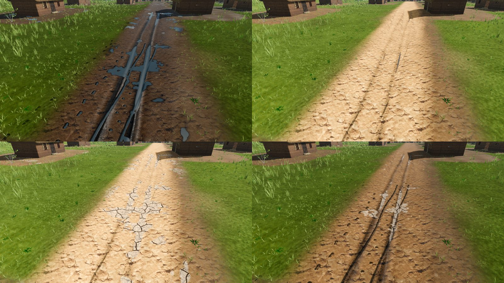
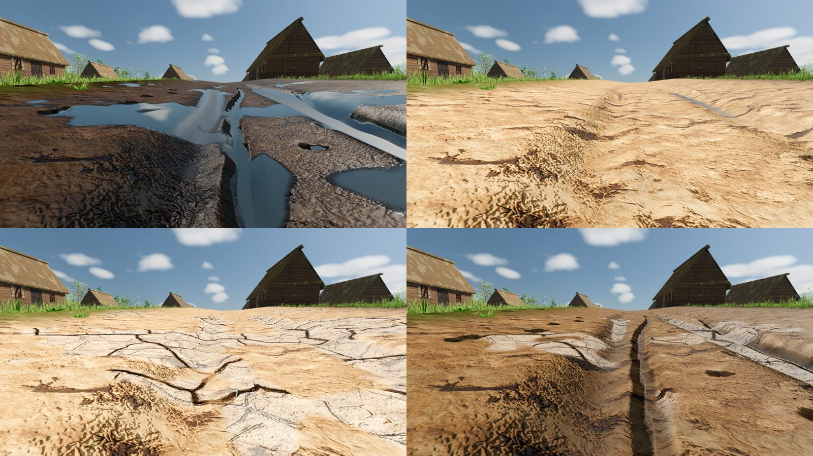

# Weather on the ground: puddles, drought and cracked earth

Status: implemented (task **R-1516**). Scope: the seamless Reval city ground (`city_ground.gdshader`). Rain fills puddles in the hollows, ruts and prints of bare soil; long sunny spells can turn into a drought that bakes those same basins into cracked clay; rain soaks the cracks back to loose earth before puddles form again. Out of scope: the district-map puddle shader (`map_view_puddle.gdshader`), vegetation wilting, gameplay effects of drought (crops, wells, NPC talk), and seasons (the odds do not yet follow the calendar month).

## What the player sees

| Ground state | When | Look |
|---|---|---|
| Puddles | During and after rain | Water stands in the deepest hollows, ruts and prints first and widens as rain goes on; dries at `PUDDLE_DRY_PER_SECOND` after the rain stops. |
| Dusty | Sunny weather after the puddles are gone | Bare soil turns paler and more matte (`ground_dryness` up to `DRYNESS_FAIR_CAP` = 0.4). No cracks. |
| Cracked | Only in a drought | The basins that hold puddles bake into polygonal cracked clay, deepest basins first, spreading as dryness climbs past ~0.45. A pale silt rim lies just outside the crust. |
| Soaking | First rain on dry ground | The rain is absorbed first: dryness falls, the crust darkens and shrinks back into loose earth. No puddle and no water film in the ruts until the ground is soaked (dryness 0). |
| Puddles again | Rain continues on soaked ground | Normal puddle fill resumes. |

Cracks appear only on bare soil (splat earth and mud, cart roads, ploughed fields). Turf, sand, rock and paving never crack. Cracks outlast the drought that made them: only rain closes them.

Review plates (cart road; top-left rain, top-right dry, bottom-left drought, bottom-right first rain on cracks):

## Simulation (`scripts/map/view3d/sky_weather_3d.gd`)

All rates are per weather second, so `time_scale` speeds or pauses them consistently.

- `ground_dryness()` (0..1). Rises only when it is not raining and `puddle_wetness()` is 0, by `DRYNESS_GAIN_PER_SECOND` times sun height times `1 - 0.85 * cloud_coverage()`. Outside a drought it stops at `DRYNESS_FAIR_CAP`; in a drought the gain is `DRYNESS_DROUGHT_GAIN` times faster and the cap is 1. Nothing but rain lowers it.
- Rain soaks first: each second rain removes up to `rain_intensity * DRYNESS_SOAK_PER_SECOND` of dryness, and only the share the soil could not absorb fills puddles (`_advance_ground_water`). So the order is always cracks, loose earth, puddles.
- Drought spell: `drought_active()`, `drought_seconds_left()`. When the sky changes to `clear` or `cloudless` (a real change, never a "stay" re-pick) over ground with dryness at least `DROUGHT_ONSET_DRYNESS`, a roll on the separate drought RNG starts a drought with `DROUGHT_START_CHANCE`, lasting `DROUGHT_SECONDS`. During a drought `_pick_drought_weather` only moves between clear, cloudless and cloudy, so no rain can form. Any rain (including a forced debug shower) ends the drought.
- Debug and tests: `start_drought(seconds)` opens (or with 0 ends) a drought now.
- The drought RNG is a separate stream (seed `WEATHER_SEED + 211`), so drought rolls never change the normal weather sequence.

## Rendering (`scripts/city/city_ground.gdshader`)

- Uniform `ground_dryness`, pushed each frame by `CityWorld3D.apply_time` from `WeatherPresentation.ground_dryness`.
- The crust uses the same basin mask as puddles (`hollow * soft`, deep ruts, on flat ground) with a level that rises with dryness, mirroring how the water level rises with `puddles`.
- Texture: `cracked_albedo` = `assets/materials/pbr/cracked_earth/cracked_earth_albedo.png` (1024 px, seamless, `crack_scale` 0.35 repeats per world unit). Only an albedo ships: the shader is near the GL Compatibility sampler limit, so crack relief is derived from the plate's luminance by finite differences. The plate's mean tone is divided out so the crust keeps the local soil colour, then pulled towards pale silt.
- Source plate: OpenAI `gpt-image-1` (Leonardo had no tokens), processed by `tools/process_leonardo_terrain_textures.py --only cracked_earth` (family `cracked_earth`, `albedo_only`). Prompt and provenance: `assets/materials/pbr/cracked_earth/prompt.json`, `assets/SOURCES.csv`.

## Save and load

`SkyWeatherState` saves `ground_dryness`, `drought_seconds_left` and `drought_rng_state` (contract: [`SKY_WEATHER_STATE_CONTRACT.md`](../SKY_WEATHER_STATE_CONTRACT.md)). Saves from before R-1516 load with dryness 0 and no drought.

## Verify

- `godot --headless --path . --script tools/run_godot_tests.gd -- --filter=test_ground_drought` (fair spell never cracks, puddles block baking, drought cracks and they outlast it, rain soaks before puddles, drought sky never rains, drought onset rules, save round trip, old saves).
- `--filter=test_sky_weather_state` (payload field list).
- Plates: `tools/godot_render.sh --script tools/capture_city_mud.gd -- --tag=drought --wet=0 --puddles=0 --dryness=1` (also `--tag=soak --wet=0.6 --puddles=0 --dryness=0.6`). Output in `build/mud/`.

## Limits

- Weather "stay" outcomes in `_pick_next_weather` do not reset the state timer (pre-existing), so a stay re-rolls every frame until the sky changes. The drought roll is tied to real weather changes to stay independent of that.
- Drought odds are the same in every month; there is no seasonal or calendar bias yet.
- District maps (`MapView3D`) still use `map_view_puddle.gdshader` and show no cracks.
