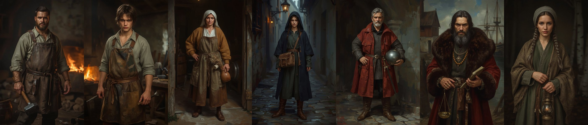

# Core character concept art

Status: reference only (not runtime assets, not imported by Godot; no `assets/SOURCES.csv` rows). Generated with Leonardo AI (account default model) in the painterly Baltic direction of [`docs/ART_BIBLE.md`](../../ART_BIBLE.md), one full-body portrait per vertical-slice core character. Costume and role follow the briefs in [`docs/CHARACTERS/`](../../CHARACTERS/README.md); faces and body types are invented, since the briefs carry no physical description. The legacy pixel sprites were used as mood inspiration only and are no longer shown in the root README.

| Character | Portrait | Costume notes |
|---|---|---|
| Kalev | [kalev.jpg](kalev.jpg) | soot-stained linen, scorched leather apron, forging hammer |
| Mart | [mart.jpg](mart.jpg) | lanky teenager, patched shirt, short apron, tongs |
| Aita | [aita.jpg](aita.jpg) | linen headcloth, ochre wool, dried herbs, ale jug |
| Kaja | [kaja.jpg](kaja.jpg) | indigo hooded cloak, courier satchel, cobbled alley |
| Captain Henning | [henning.jpg](henning.jpg) | mail hauberk, red surcoat, steel kettle helm |
| Jürgen Witte | [jurgen.jpg](jurgen.jpg) | fur-trimmed red gown, amber beads, ledger and scales |
| Ellen Luik | [ellen.jpg](ellen.jpg) | braids, wool shawl with bone and amber charms, lantern |

## Known deviations (review before using as costume reference)

- Kalev reads as a heavier build in the chosen plate; Kaja's cloak is indigo, matching the Black Cloaks palette rather than a courier disguise.
- Henning's helm is a rounded kettle shape that leans late-medieval; check against research before modelling.
- Jürgen's fur gown is richer than the plausible-composite brief needs; trim for the in-game tier.
- Raw generations (two per character, ids in `generated/leonardo/`) hold the unused alternates.
