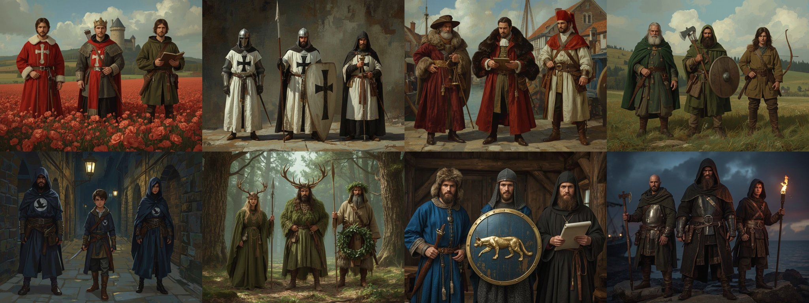

# Faction concept art

Status: reference only (not runtime assets, not imported by Godot; no `assets/SOURCES.csv` rows). Generated with Leonardo AI (account default model) in the saturated Baltic fantasy direction of [`docs/ART_BIBLE.md`](../../ART_BIBLE.md); field colours follow [`FactionHeraldry`](../../../scripts/map/faction_heraldry.gd). Each plate is a three-figure costume lineup (leader, fighter, specialist) for the eight launch factions in the root [`README.md`](../../../README.md).

| Faction | Plate | Figures |
|---|---|---|
| Danish Crown | [danish_crown.jpg](danish_crown.jpg) | viceroy, crossbow guard, tax clerk |
| Livonian Order | [livonian_order.jpg](livonian_order.jpg) | knight-brother, sergeant, priest-brother |
| Hanseatic guilds | [hanseatic.jpg](hanseatic.jpg) | cloth merchant, factor, hired guard |
| Harju Kings | [harju_kings.jpg](harju_kings.jpg) | elder chieftain, farmer fighter, scout |
| Black Cloaks | [black_cloaks.jpg](black_cloaks.jpg) | smith-conspirator, courier, informant |
| Cult of Metsik | [cult_metsik.jpg](cult_metsik.jpg) | seer, hunter, grove-keeper |
| Pskov & Novgorod | [pskov_novgorod.jpg](pskov_novgorod.jpg) | boyar envoy, druzhina warrior, monk-scribe |
| Vitalienbrüder | [vitalienbruder.jpg](vitalienbruder.jpg) | captain, cutthroat, ship-boy |

## Known deviations (review before using as costume reference)

- Danish Crown plate: a crowned figure (no crown for a viceroy) and a poppy-field backdrop instead of a castle; the red reads right.
- Livonian Order: helmets and shield shapes lean 14th-15th century; acceptable as mood, check against research before modelling.
- Black Cloaks: the swallow emblem is small and the cloaks are indigo, not black.
- Raw generations and prompts live in `generated/leonardo/` (ids in the git log); the first Vitalienbrüder, Pskov and Metsik drafts were redone for tricorn hats and stray caption text.
