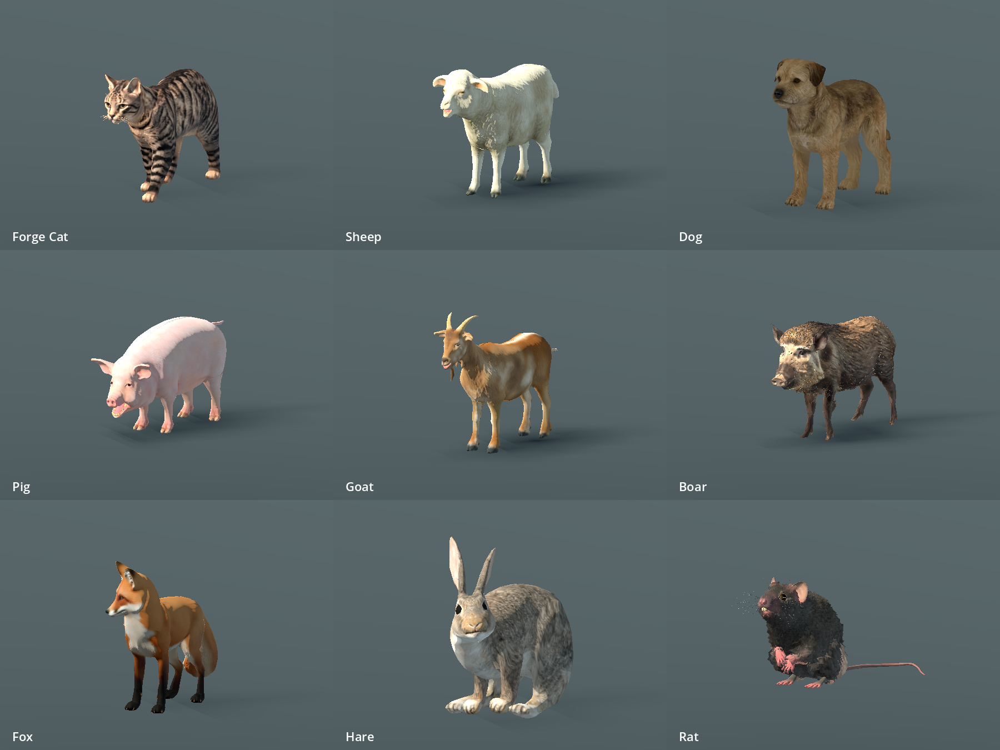
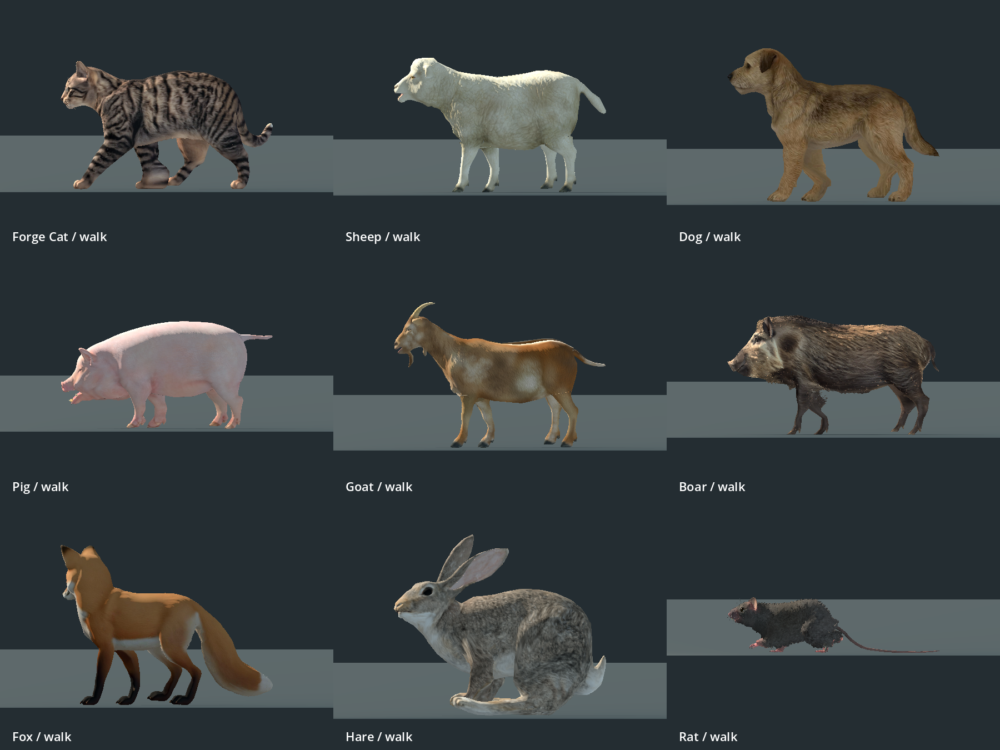

# Mammal replacement — P0-209b

The maintainer rejected the P0-209/209a primitive-built animals and requested a complete redo. Those passes are superseded. This replacement is implemented in the nine existing live runtime paths; final maintainer visual acceptance remains open. Work was wrapped up at the maintainer’s request on 2026-09-13.

## Result

Cat, sheep, dog, pig, goat, boar, fox, hare and rat now preserve licensed source geometry and coat UVs. The default mammal build routes through `tools/assets/import_realistic_mammals.py`; the former primitive builder explicitly refuses use. Species IDs, placement, animation aliases and gameplay behavior remain compatible.

The dog is a shaggy village phenotype from 3Dima, replacing a discarded Labrador candidate. It is not presented as an attested medieval breed. Eight models use measured forelimb and hindlimb chains; the rat keeps Nestaeric’s original articulated rig and authored clips. Runtime playback reads measured gait rates from Godot’s imported glTF `extras` dictionary and applies model scale once.

The importer preserves surfaces, corrects source transforms, excludes Blender bone-display helpers, caps textures at 1024, and uses rough nonmetallic materials. Large sources are reduced to approximately 38,000 triangles. Fox source chunks are welded before reduction, and its separate normal UV atlas is rebaked to the primary UV for Godot. Cat color variants retain the source face/coat texture.

## Source credits and reproduction

Every source is CC BY 4.0. Exact URLs, creators, source checksums, staging paths and adaptations are in [mammal_sources.json](../../assets/storybook/mammal_sources.json), with runtime assets and extracted textures registered in [SOURCES.csv](../../assets/SOURCES.csv). This includes disclosure of Meshy/Tripo identifiers where present. No Witcher or other ripped game assets are used.

Raw source bulk is restored from the credited download pages, which may require a free Sketchfab login; it is not committed. Match the manifest SHA-256 before rebuilding. Runtime GLBs are self-contained and do not require those downloads to play.

```sh
blender -b --python-exit-code 1 --python tools/assets/import_realistic_mammals.py -- --publish
godot --headless --editor --path . --import
python3 tools/verify_storybook_models.py --mammals-only
godot --headless --path . --script tools/run_godot_tests.gd -- --filter=test_mammal_limb_anatomy,test_storybook_models,test_storybook_live_integration,test_medieval_animal_models,test_medieval_dog_model,test_map_view_urban_fauna,test_map_view_penned_fauna,test_forge_cat,test_cat_rig
godot --path . --script tools/capture_animal_realism.gd
godot --path . --script tools/capture_animal_realism.gd -- --side --walk
```

Blender 5.2 and Godot 4.7.1 were used. Rat packing requires external Python with NumPy and Pillow (`/usr/bin/python3` in this workstation’s environment).

## Verification

- All nine portable model checks pass: normalized skin weights, valid joint indices, UV textures, nonmetallic materials, animation names/durations/loop seams, triangle and 10 MiB per-file budgets. Largest file is the rat, approximately 9.45 MiB.
- Focused Godot suite: **9 files, 81 tests, 0 failures, 0 errors**. Existing teardown resource-leak warnings remain.
- Independent reviewer inspected actual deformed meshes. Major cat/dog/boar tears were found and fixed. The cited cat centerline edge fell from 125 mm to 2.42 mm after correction; final sampled residual maximum was 12.61 mm at a local joint transition. Dog/boar retain modest local joint creasing, without the previous major splits. Hare’s hidden-helper-induced 103 mm floating offset was fixed.
- `git diff --check` passes. Asset provenance has no missing mammal entries; global validation still reports unrelated concurrent `assets/characters/kalev_fresh/` assets. The active-doc check retains nine unrelated issues and a stale generated report. Godot import reports unrelated character texture UID fallbacks.

## Remaining visual limits

This is a substantial surface replacement, not finished AAA fidelity. The hare is still a rabbit-derived lagomorph proxy, not a species-exact European hare. Rat source motion has some foot slip; an independent Godot posed-mesh check confirmed Idle/Walk ground contact within 2.3 mm. Capture framing uses posed skin bounds rather than misleading source bind-space bounds. Small joint creases and baked coat shading remain; cat sleep/groom clips are simple adaptations. These limits are not hidden by passing technical checks, and P0-209b remains open for maintainer visual acceptance.

## Actual Godot captures





Earlier `before`, `legs_before`, and `candidate` captures record superseded review stages; only `after` captures above describe the delivered runtime assets.
