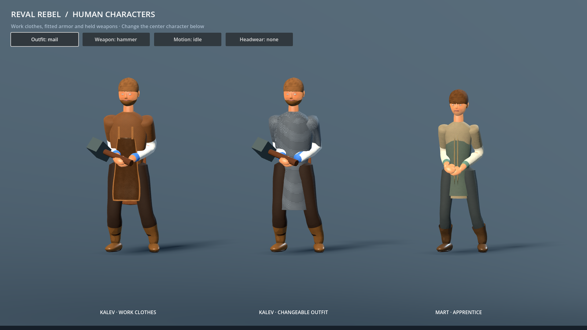

# Human model improvement and modular equipment — P0-199

Date: 2026-09-05. Maintainer request: improve human models while allowing different
armor, clothing and weapons to change their appearance.

## Delivered

All 13 human bodies and 26 distance LODs were regenerated in Blender 5.2 with the
same shared skeleton, 76 animation clips, stable character IDs and uniform scale.
Torso clothing, profession outerwear, optional armor, sleeves, hose, boots, scalp
hair and beard are independently addressable meshes. Facial geometry and neck
remain intact when scalp hair is hidden.

Work aprons and kirtle panels are now a curved leather panel with a supported cut, bound edges
and broad folds, weighted to hips/spine/chest. They replace the diamond-shaped
subdivided boxes visible in the before plate. Cloth/leather normals are softer,
skin uses its authored vertex complexion, and eye shaders handle absent maps
explicitly. Blender now sets image color space before populating pixels, avoiding
black normal maps and zero-roughness exports on regeneration.

`CharacterWearable` resources declare a stable appearance ID, slot, fitted body,
skinned scene and coverage prefixes. Invalid body fits, unknown coverage and
empty/unskinned scenes leave the current outfit intact. Coverage combines across
slots, restores default geometry on removal, and hides it at every distance LOD.
Imported garments reuse the live skeleton, animation player, material profiles,
readability layers and occlusion silhouette. Initial outfits can be selected in
`CharacterVariant.wearables`.

Kalev's 900-triangle mail example replaces his tunic/apron/sleeves and hides covered
skin. Body fit is resolved from the actual imported model, so changing a character
ID cannot bypass it. A filtered linked-iron shader supplies detail without geometry inflation.
The fitted cap hides scalp hair while preserving face and beard. The interactive
showcase switches clothes, cap, hammer/sword/unarmed and idle/walk/run/attack.

## Visual evidence



| State | Before | After |
| --- | --- | --- |
| Kalev, front | [Before](images/characters/modular_before/closeup_front_idle.png) | [Work clothes](images/characters/modular_after/worker/closeup_front_idle.png) |
| Kalev, action | — | [Weighted apron](images/characters/modular_after/worker/closeup_iso_action.png) |
| Kalev, mail/run | — | [Fitted armor in motion](images/characters/modular_after/mail/closeup_iso_run.png) |
| Kalev, headwear | — | [Cap, hair coverage, face preserved](images/characters/modular_after/headwear/closeup_front_idle.png) |
| Named armored body | — | [Henning](images/characters/modular_after/henning/closeup_front_idle.png) |
| Female body | — | [Townswoman](images/characters/modular_after/townswoman/closeup_front_idle.png) |

Hero work clothes/mail and the named-body captures include front, profile, walk,
run and action states. The example garments retain pose attachment; the mail's
hip-weighted skirt remains a stylized approximation rather than cloth simulation.

## Verification

- Blender rebuild completed for all 13 bodies and all 26 LODs; clean headless Godot import completed.
- Focused Godot suite: **49 tests passed**, zero failures/errors, across
  `test_character_rig`, `test_character_wardrobe` and `test_inventory_equipment`.
- Showcase synthesized input through the actual viewport: keyboard outfit toggle,
  controller A toggle/D-pad focus travel, and mouse weapon swap passed.
- Asset lint passed: 13 body specs and 42 tier-classified GLBs; body caps unchanged.
  Mail: 900 triangles, below the existing 1024-triangle garment cap.
- All 26 LOD GLBs have authored materials; fidelity Python tests: 3 passed.
- All generated human GLBs retain 76 animations. The mail's 41 skin joints and
  inverse bind matrices match Kalev's body; no duplicated animation player.
- Character asset provenance is complete, including the new mail and extracted
  texture sidecars. **Global provenance validation remains blocked by 52 unrelated
  imported bird/building/trade texture paths absent from SOURCES.csv**; these were
  not added to this character change.
- Active-doc consistency and `git diff --check` passed.
- Independent agent review found no blocking issues in rig, visibility/LOD,
  material, teardown, initial-outfit or headwear behavior. Its caption alignment
  suggestion was incorporated into the showcase. Its final new-identity LOD
  finding was fixed by selecting LODs from imported geometry, with a pre-spawn
  identity regression test.

| Body | LOD0 triangles | Clips |
| --- | ---: | ---: |
| hero | 52,880 | 76 |
| mart | 50,668 | 76 |
| henning | 53,436 | 76 |
| innkeeper | 49,936 | 76 |
| watchman | 50,668 | 76 |
| bandit | 51,816 | 76 |
| sergeant | 53,436 | 76 |
| danish_warrior | 51,864 | 76 |
| aita | 50,388 | 76 |
| kaja | 48,680 | 76 |
| jurgen | 51,816 | 76 |
| ellen | 50,388 | 76 |
| townswoman | 49,856 | 76 |

## Reproduce

```bash
tools/rebuild_hero_character.sh hero
godot --headless --path . --script tools/run_godot_tests.gd -- --filter=test_character_rig,test_character_wardrobe,test_inventory_equipment
godot --headless --path . assets/characters/showcase/modular_character_showcase.tscn -- --verify-controls
godot --path . assets/characters/showcase/modular_character_showcase.tscn
godot --path . assets/characters/showcase/modular_character_showcase.tscn -- --capture
python3 tools/verify_asset_lint.py
python3 tools/verify_character_lod_materials.py
python3 -m unittest tests.python.test_character_fidelity_tiers -v
python3 tools/generate_active_docs_report.py --check
git diff --check
```

`tools/capture_character_closeup.gd` accepts `--scene`, `--output-dir`, and one or
more `--wearable=res://...tres` flags after `--`. See
[character generation](../CHARACTER_GENERATION.md) for the authoring contract.

## Boundaries

This delivers model quality and presentation modularity. It does not introduce
armor loot, combat bonuses, save fields, inventory UI or new gameplay areas.
Inventory still owns persistent item IDs and mechanics; its existing tests pass.
Future equipment definitions can select wearable resources when equipped.
Different body proportions require separately fitted clothing; the system does
not claim automatic retargeting of arbitrary garments. Legacy `equip_garment`
callers still assume trusted imports with the shared skin contract. Faces and
motion remain stylized; this pass does not claim a photorealistic facial rig.
