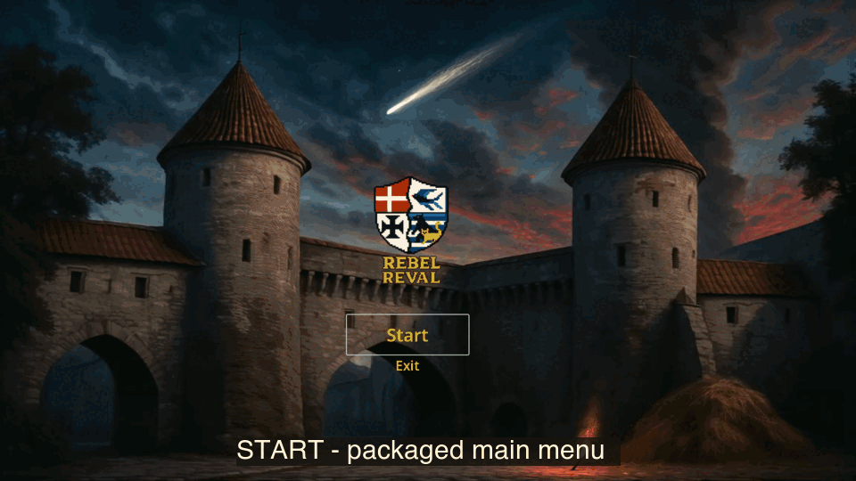
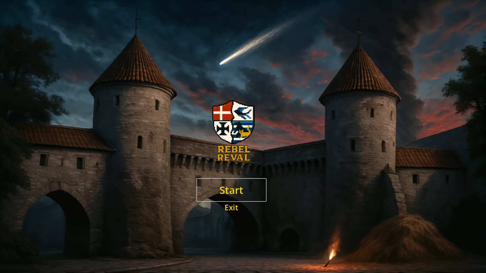
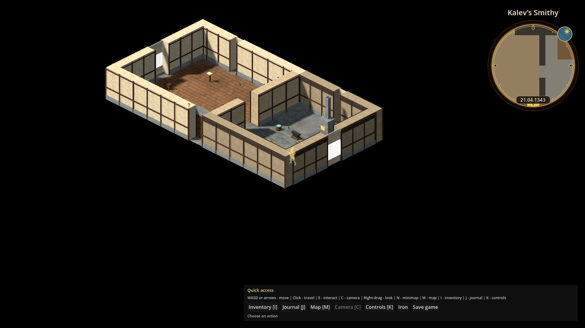
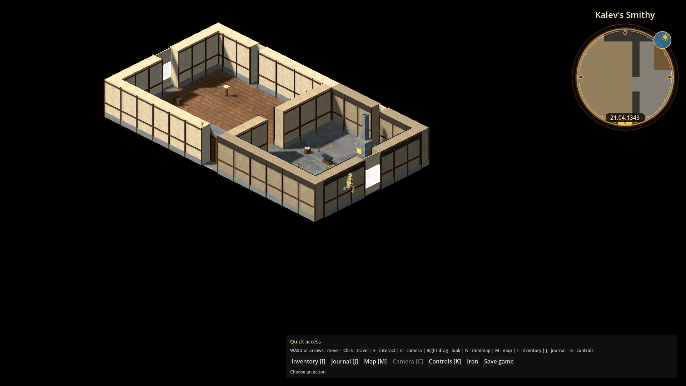
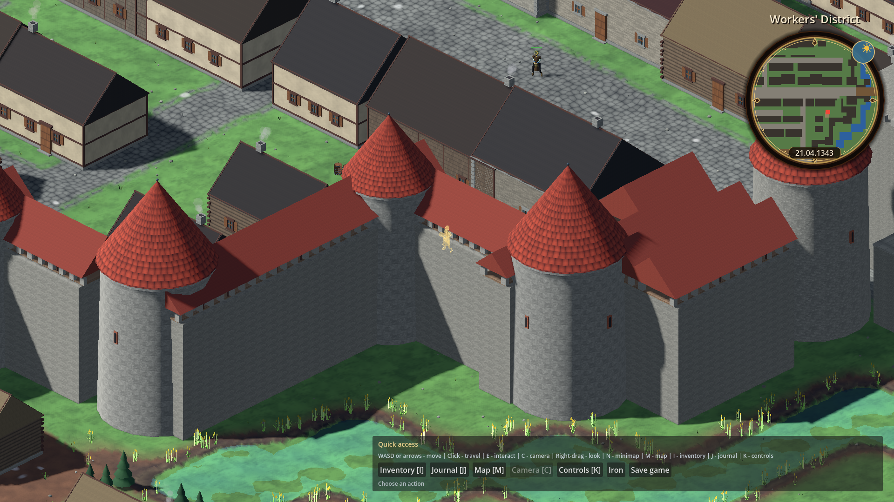
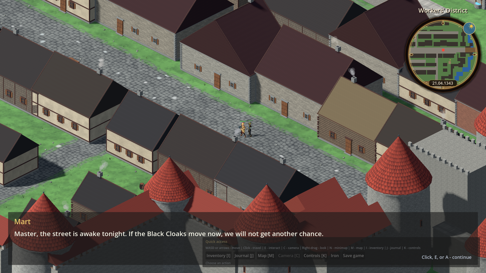
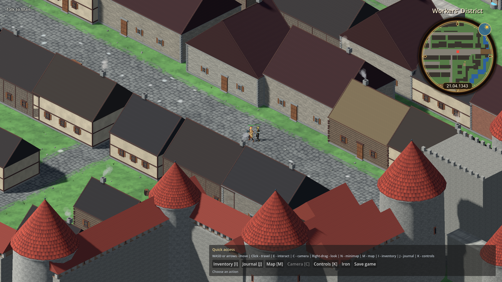
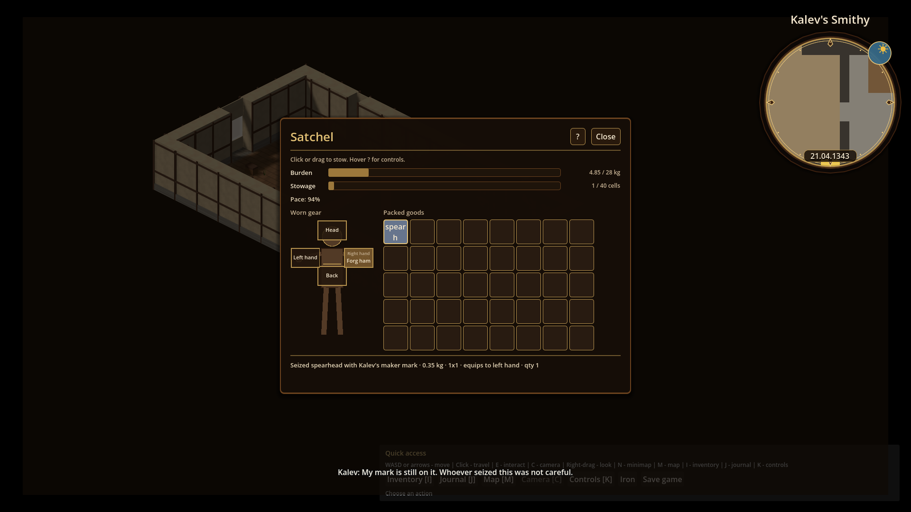

# Demo walkthrough (D-004)

Captured proof that the packaged demo loop completes without debug intervention:
Start -> forge move -> Lower Town Mart talk -> forge spearhead pickup into the bag.

## How to reproduce

```bash
tools/verify_packaged_demo.sh
# or refresh frames and the animated capture only:
godot --path . res://tools/capture_demo_walkthrough_host.tscn
tools/build_demo_walkthrough_gif.sh
```

## Animated capture

[](images/demo_walkthrough/demo_walkthrough.gif)

The animation is assembled from frames written by the packaged release binary during the in-binary walkthrough below. The editor capture host is only a local regeneration fallback.

## Frame sequence

| Step | Capture | What it shows |
|------|---------|---------------|
| 1 |  | Packaged app opens on the real Start menu |
| 2 |  | Main-menu Start lands at `smithy_start` |
| 3 |  | Player can move in the forge |
| 4 |  | Courtyard door reaches Lower Town |
| 5 |  | Talk to Mart opens demo dialogue |
| 6 |  | Conversation completes and sets `flag.demo_mart_spoken` |
| 7 |  | Anvil spearhead is taken into the open bag |

## Automated checks

- Headless flow: `godot --headless --path . --script tools/run_godot_tests.gd -- --filter=test_demo_walkthrough`
- Packaged macOS build: `tools/verify_packaged_demo.sh` exports `build/rr.dmg`, extracts `build/Reval Rebel.app`, and runs `Reval Rebel.app/Contents/MacOS/Reval Rebel -- --verify-packaged-demo`.
- The shipped main-scene verifier triggers Start, proves movement, completes Mart's interaction, picks up the spearhead, and must print `D-004C_PACKAGED_WALKTHROUGH_PASS` with exit 0. No editor binary chooses scenes or drives the packaged loop.

Release builds omit the debug inspector (`OS.is_debug_build()` is false), so this loop matches packaged play without debug presets.

## D-004a release-only triage

No release-only move-talk-pickup defects remain. Method, packaged launch log, and tooling fix notes: [`d004a_release_only_triage.md`](./d004a_release_only_triage.md).
