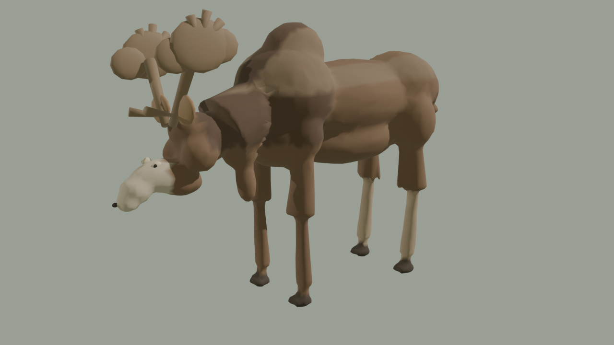
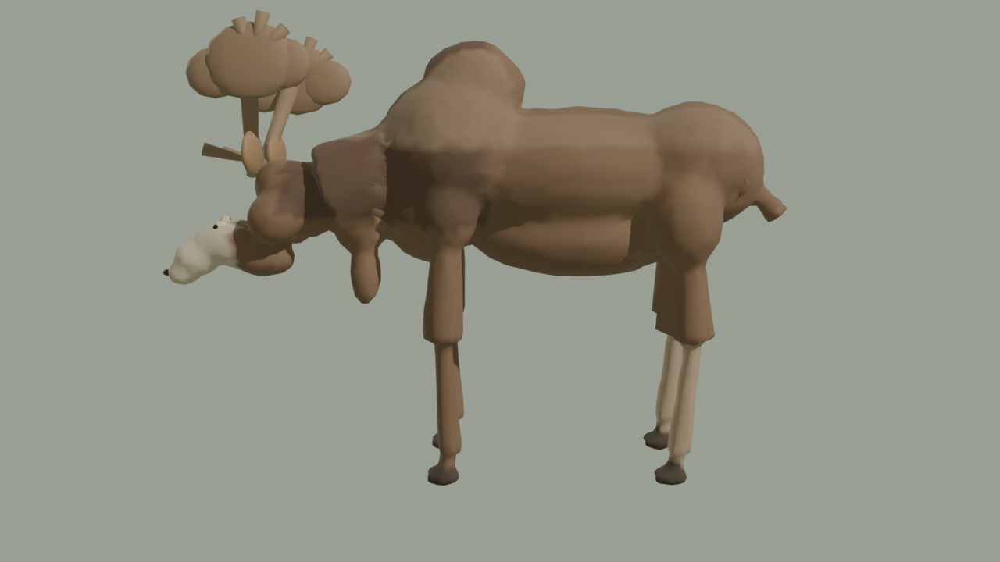
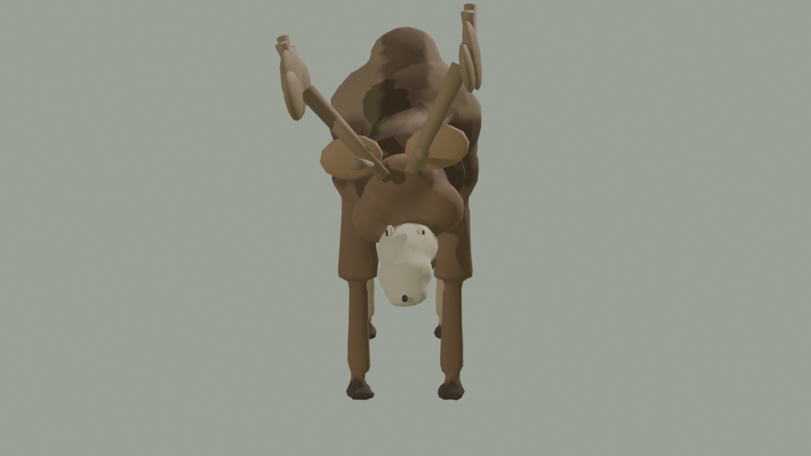

# Elk realism pass - 2026-09-23

The catalog `fauna.elk` actor was a 1.55 m ellipsoid loaf with two cone posts.
This pass replaces it with a production Eurasian elk (`Alces alces`) on the
closed-anatomy livestock pipeline used by cattle and the pack horse.

Witcher 3 is the fidelity reference only. No game assets were copied. Leonardo
image generation was unavailable in this Cursor CLI session, so coat color is
authored as COLOR_0 regions (dark body, cream muzzle, pale stockings, keratin
antlers) plus baked normal/roughness maps.

## What shipped

- `assets/animals/medieval/medieval_elk.glb`: remeshed body, 11,000 triangles,
  one manifold surface, 2.55 x 1.78 x 0.80 m.
- Palmate antlers and ears are Neck-parented details. Remeshing them with the
  hull fused the first palms into the scapular hump.
- Runtime path: `MapViewMedievalAnimalModels` for `fauna.elk`.
- Foreland flee placement on `viru_gate_foreland`.
- Idle / Walk / Trot / Graze clips on the shared quadruped rig.

## Evidence

## Limits

This is a deterministic procedural moose, not finished AAA wildlife. Antler
palms are flattened overlapping volumes, not scanned keratin. Coat hair is
displace plus a normal map. A licensed sculpted follow-up can replace the
surface without changing the species ID or clip contract.
