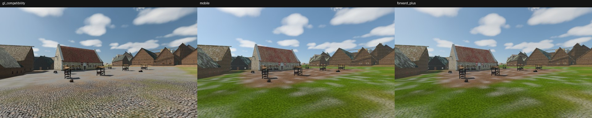
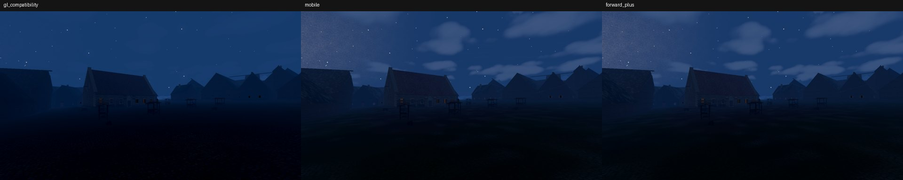
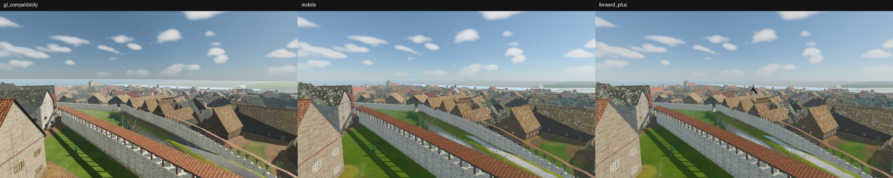
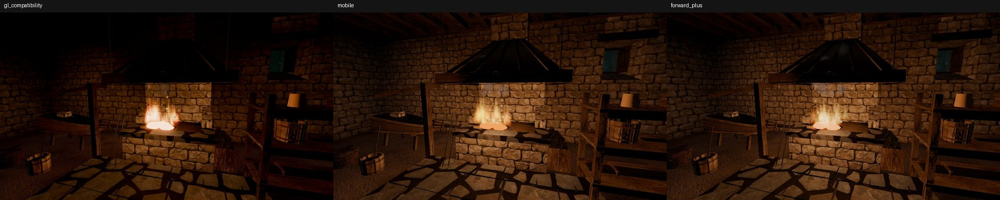
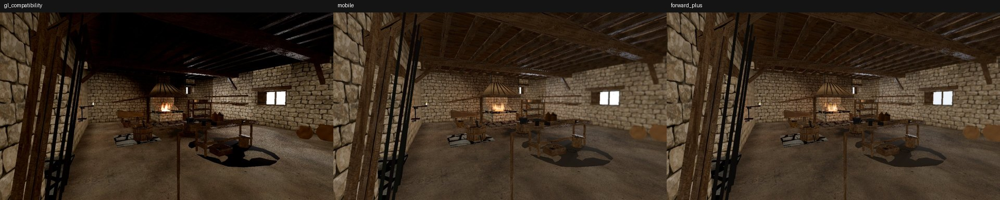
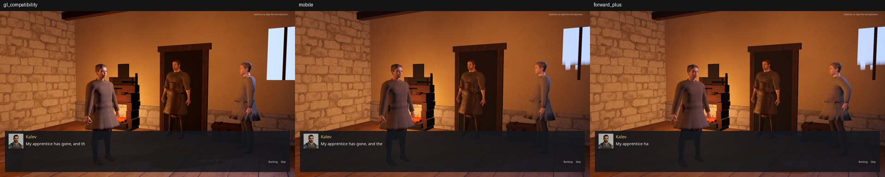
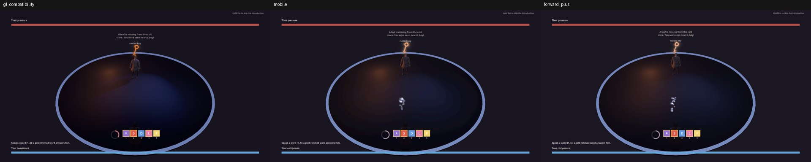

# P0-142 HDR (EDR) output spike, 2026-10-09

Task: **P0-142** (renderer evaluation, HDR follow-up). Status: measured; no project setting changed. Recommendation and the renderer switch proposal: [ADR 0043](../adr/0043-mobile-renderer-and-hdr-output.md).

Question: can Reval Rebel ship HDR (macOS EDR) output so the sun, fire, forge glow and lamps render brighter than SDR/UI white on Retina XDR displays? Godot 4.7 HDR output ([article](https://godotengine.org/article/hdr-output-arrives-in-godot-4-7), [docs](https://docs.godotengine.org/en/latest/tutorials/rendering/hdr_output.html)) needs the Mobile or Forward+ renderer on Metal; the project ships `gl_compatibility`.

Host: Apple M5 Pro (20-core GPU), macOS 26.3, Godot 4.7.1. Screens: built-in Liquid Retina XDR (3456x2234, up to 1600 nits) and an external 5K PA27JCV (590 nits peak). Renderers were switched with `--rendering-method` / `--rendering-driver` overrides only; `project.godot` is unchanged.

## Verdict

- **HDR output works on Mobile and Forward+ (Metal), not on Compatibility.** Compatibility reports `window_is_hdr_output_supported = false`.
- With the shipped AgX tonemapper and 4.0x EDR headroom, fire reaches **2.3x** and the sun **2.8x** UI white while UI stays at exactly **1.0**. The real forge hearth at night peaks at **2.2-2.3x** UI white on ~0.6% of the frame (the coals and flame cores only).
- **Mobile is the fastest renderer** on the current city: 13.6 ms median shot (74 FPS) vs Forward+ 20.2 ms (50 FPS) vs Compatibility 28.8 ms (35 FPS).
- Switching is not free: three city shader regressions on the RenderingDevice renderers and two SDR-only post settings must be fixed first (below).
- Recommendation: **switch to Mobile** (Metal) behind [ADR 0043](../adr/0043-mobile-renderer-and-hdr-output.md), status Proposed. It needs maintainer approval before any `project.godot` change.

## 1. Renderer captures and regressions

Same capture tools, three renderers (`build/hdr_spike/run_captures.sh` pattern, see Procedure). Shader compilation: **no shader compile errors on any renderer** in Lower Town day/night, forge interior or the almshouse prologue. The only renderer-specific log lines are the pre-existing particle shader leaks at exit (`ParticlesShaderGLES3` / `ParticlesShaderRD`).

Side-by-side sheets (left to right: gl_compatibility, mobile, forward_plus):

| Scene | Sheet | Per-renderer PNGs |
|---|---|---|
| Lower Town forum, late morning |  | `images/hdr_output_spike/lower_town_forum_day_{renderer}.png` |
| Lower Town forum, midnight |  | `images/hdr_output_spike/lower_town_forum_night_{renderer}.png` |
| Lower Town roofs from Toompea |  | sheet only |
| Forge hearth, night |  | `images/hdr_output_spike/forge_hearth_night_{renderer}.png` |
| Forge bay, day |  | sheet only |
| Almshouse prologue, Kalev |  | `images/hdr_output_spike/almshouse_kalev_{renderer}.png` |
| Almshouse prologue, spirit duel |  | sheet only |

Mobile and Forward+ look the same as each other in every plate (mean absolute difference vs Compatibility is within 1 level of each other). Differences against Compatibility:

| # | Regression on Mobile/Forward+ | Where | Severity |
|---|---|---|---|
| R1 | Cobbled paving renders as grass: the forum and streets lose the `splat` R (paving) layer | `scripts/city/city_ground.gdshader` | blocker |
| R2 | Cart road/moat bank reads as a pale blue-white streak instead of grey cobble | same shader, `roads` mask path | blocker |
| R3 | Roofs show strong camouflage-like moss/lichen blotches | city roof weathering shader | high |
| R4 | Interiors are about 1.7x brighter (forge hearth night mean luma 17 -> 30, forge bay day 41 -> 55); Compatibility's dark ceiling becomes lit | lighting grade, not a defect by itself | retune |
| R5 | Night clouds are visible on RD and absent on Compatibility | sky/cloud pass | retune or accept |

**R1 follow-up (2026-10-10, fixed):** the hypothesis held. `splat` was declared `source_color`; on the RD renderers that zeroed the paving layer. Declaring it as plain data restores the cobbles on Mobile and leaves the Compatibility forum capture visually unchanged. Hand-decoding sRGB in the shader (tried) is worse. Still open on Mobile after the fix: the forum plaza reads pale grey-white against Compatibility's darker grey-brown with earth patches. It is not specular (forcing roughness 1 / specular 0 changes nothing) and not the paving albedo constants (about 0.3 linear), so suspect the ground lighting/ambient or the sand/earth overlays; tracked in R-1535. Hypothesis for R2/R3 (not verified): same family of RD-vs-GLES3 differences. The shaders that already branch on `CURRENT_RENDERER` (water, underwater, god rays, fog, cloud shadows, aerial perspective) render correctly on RD.

The almshouse duel plates differ in phase only: the capture tool is frame-timed, so the spirit duel reached a different beat at each renderer's frame rate. The Kalev plate (static) matches.

## 2. HDR output measurement

Tool: `tools/probe_hdr_output.gd`. It requests HDR on the root window (`Window.hdr_output_requested`, `Viewport.use_hdr_2d`; the runtime equivalents of `display/window/hdr/request_hdr_output` and `rendering/viewport/hdr_2d`), moves the window to the screen with the most headroom, renders unshaded patches at known scene-linear values through the shipped `MapViewLighting.configure_post_process` (AgX, glow, adjustments), draws a white UI `ColorRect`, and reads the root framebuffer back as half float (`FORMAT_RGBAH`). A patch above the UI white sample is presented brighter than SDR reference white.

Built-in XDR display, `output_max_linear_value = 4.0` (reference 400 nits, peak 1600 nits), Mobile:

| Scene-linear patch | AgX + soft-light glow (shipped) | AgX + additive glow | AgX, no glow | Filmic (prologue) |
|---|---:|---:|---:|---:|
| UI white | 1.00 | 1.00 | 1.00 | 1.00 |
| 0.5 wall | 0.39 | 0.41 | 0.38 | 0.57 |
| 1.0 white | 0.70 | 0.75 | 0.70 | 0.82 |
| 2.0 lamp | 1.17 | 1.42 | 1.17 | 1.05 |
| 4.0 forge glow | 1.75 | 2.31 | 1.75 | 1.21 |
| 8.0 fire | 2.33 | 2.78 | 2.33 | 1.31 |
| 16 sun | 2.79 | 3.08 | 2.79 | 1.36 |

Forward+ gives the same values within 0.01. Findings:

- **UI stays at reference white** (1.00) in every case; 2D is not tonemapped.
- **AgX uses the EDR headroom.** With headroom 1.0 (SDR) the same sun patch reads 0.84; on the external 5K display (headroom 2.08) it reads 1.63; on the XDR display (4.0) 2.79.
- **Filmic ignores the headroom**: its values are identical at headroom 1.0 and 4.0. The almshouse prologue (`scripts/prologue/almshouse_stage.gd`, `TONE_MAPPER_FILMIC`) would stay SDR.
- **Soft-light glow is a no-op under HDR output** (identical to no glow). The game's glow (`GLOW_BLEND_MODE_SOFTLIGHT` in `scripts/map/view3d/map_view_lighting.gd`) is SDR-only per the Godot docs; additive or screen glow is needed and must be retuned.
- **Real forge hearth at night** (`--map=kalev_smithy`, hearth_close, root window): Mobile peak 2.21, Forward+ peak 2.34 of UI white; 0.59-0.60% of pixels exceed UI white. Tonemapped preview: `images/hdr_output_spike/hdr_probe_forge_hearth_mobile_tonemapped.png`. Raw numbers: `images/hdr_output_spike/hdr_probe_{renderer}.json`.
- **Headroom is dynamic.** macOS grants EDR headroom only while an EDR surface is on screen; on the XDR screen the minimized capture window got 1.0 in 2 of 8 runs, and one run right after a screen move read back a black frame. The game must read `Window.get_output_max_linear_value()` or `output_max_linear_value_changed`, never cache it.

Not done: an eyeball check of a visible window on the XDR panel. Project rules forbid visible Godot windows in agent runs and a screenshot cannot show EDR. The framebuffer read-back above is the measurable equivalent. For a human check:

```bash
GODOT_RENDER_VISIBLE=1 tools/godot_render.sh --rendering-method mobile --rendering-driver metal \
  --script tools/probe_hdr_output.gd -- --screen=1 --map=kalev_smithy
```

## 3. Frame time

`tools/run_performance_report.sh --quick` and the vegetation benchmark cannot measure the current world: `tools/benchmarks/lower_town_scene_benchmark.tscn`, `lower_town_render_probe.tscn` and `renderer_comparison_benchmark.tscn` reference the retired `scenes/reval_east/reval_east.tscn` and hang; `capture_vegetation_benchmark.gd` loads the removed `lower_town_slice_definition.gd`. The renderer override `BENCHMARK_RENDERING_METHOD` was added to the report scripts for when they are repaired.

Replacement: `tools/benchmarks/renderer_frame_time.gd` renders the continuous Reval city (ADR 0031) in the root window like the game, with the review cameras of `tools/capture_reval_city.gd` (forum, roofs from Toompea, aerial NE, smithy cutaway; day and midnight) plus the Kalev smithy interior, 1920x1080, vsync off, 120 frames after 20 warm-up frames. Wall frame time is used: the RenderingServer GPU timer reads 0 for the minimized window.

| Renderer | Median of shot medians | Worst shot | FPS (median) | Runs (median shot, ms) |
|---|---:|---:|---:|---|
| `gl_compatibility` (opengl3) | 28.8 ms | 40.4 ms | 35 | 41.1 / 25.1 / 28.8 |
| `mobile` (metal) | **13.6 ms** | **18.6 ms** | **74** | 23.2 / 12.2 / 13.6 |
| `forward_plus` (metal) | 20.2 ms | 37.5 ms | 50 | 28.5 / 15.9 / 20.2 |

Run 1 overlapped other sessions' GPU captures; runs 2 and 3 agree on the order. The table uses run 3 (`images/hdr_output_spike/frame_time_{renderer}.json`). This is the development baseline (M5 Pro), not minimum hardware. Heaviest Mobile shot: aerial NE day, 18.6 ms, 2742 draw calls.

## Procedure

```bash
# Captures per renderer (Compatibility uses opengl3, the others metal)
tools/godot_render.sh --rendering-method mobile --rendering-driver metal --script tools/capture_reval_city.gd -- \
  --out=res://build/hdr_spike/mobile/town_0.42 --progress=0.42 \
  --only=city_aerial_ne,forum,from_toompea_over_roofs,smithy_cutaway
tools/godot_render.sh --rendering-method mobile --rendering-driver metal --script tools/capture_kalev_smithy_interior.gd -- \
  --out=res://build/hdr_spike/mobile/smithy
tools/godot_render.sh --rendering-method mobile --rendering-driver metal --resolution 1280x720 \
  --script tools/capture_almshouse_opening.gd -- --out=res://build/hdr_spike/mobile/almshouse
# HDR probe
tools/godot_render.sh --rendering-method mobile --rendering-driver metal --script tools/probe_hdr_output.gd -- \
  --screen=1 --map=kalev_smithy --json=res://build/hdr_spike/mobile/hdr_probe.json
# Frame time
tools/godot_render.sh --rendering-method mobile --rendering-driver metal --resolution 1920x1080 --disable-vsync \
  --script res://tools/benchmarks/renderer_frame_time.gd -- --output=res://build/hdr_spike/frame_time_mobile.json
```
