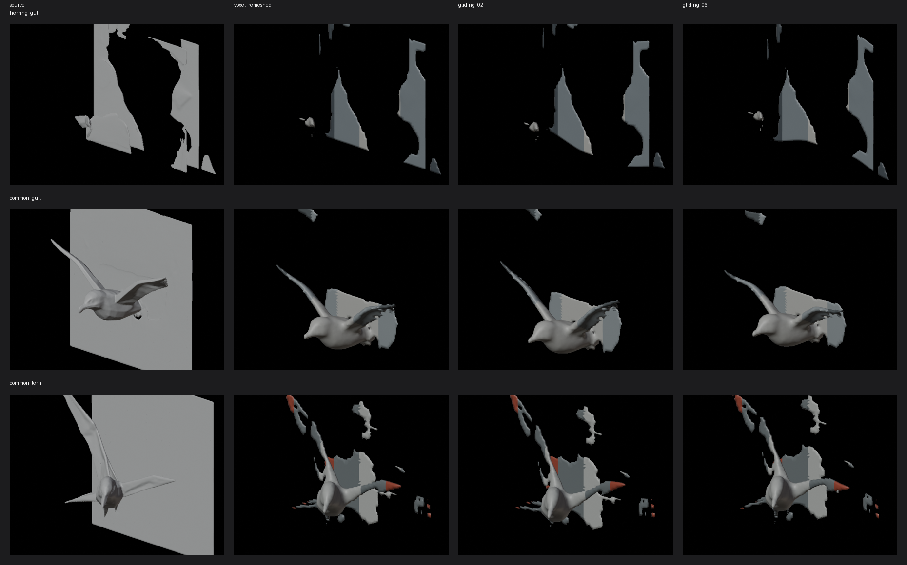

# Harbour gull Hunyuan3D Blender cleanup feasibility audit

Date: 2026-07-31
Task: P2-034b
Source task: P2-034a
Blender: 5.2.0 LTS

## Scope and decision boundary

This is a candidate-only feasibility pass. The three source Hunyuan GLBs remain under
`generated/comfyui/bird_gull_v1/candidates/`. Experimental cleanup outputs are isolated
under `generated/comfyui/bird_gull_v1/candidates/cleanup/`. No file under
`assets/birds/`, no runtime bird loader, and no production provenance row was modified.

The experiment is reproducible with:

```sh
blender -b --python generated/comfyui/bird_gull_v1/blender_cleanup_experiment.py
```

The script tests collapse decimation, voxel remesh followed by decimation, catalog-scale
normalization, ground correction, diagnostic material reconstruction, and an eight-frame
static gliding sequence. Full machine-readable measurements and hashes are in
`cleanup/experiment_results.json` and the summarized verdicts are in
`candidates/candidate_audit.json`.

## Before and after

| species | source tris | direct decimate tris | voxel-remesh tris | remesh components | mean/max sampled error in source space (m) | target/after largest axis (m) | after min Z (m) | result |
| --- | ---: | ---: | ---: | ---: | --- | --- | ---: | --- |
| herring gull | 212,932 | 194,345 fail | 4,388 pass | 15 | 0.049415 / 0.409092 | 1.551923 / 1.551923 | 0.000000 | reject |
| common gull | 608,462 | 523,236 fail | 7,800 pass | 10 | 0.124765 / 0.870462 | 1.112211 / 1.112211 | 0.000000 | reject |
| common tern | 617,606 | 545,196 fail | 7,800 pass | 27 | 0.102141 / 1.008479 | 1.133045 / 1.133045 | 0.000000 | reject |

Direct collapse decimation cannot approach the 8,000-triangle production ceiling. The
source meshes contain 116,706-335,101 non-manifold edges and are effectively split
surface-net topology. The low error reported for direct decimation is therefore not a
win: 194,345-545,196 triangles remain.

Voxel remesh can produce manifold geometry within the triangle budget. It also exposes
why these candidates are not production-ready: 10-27 disconnected components remain,
and the source-space bidirectional sampled surface error is material. The remesh keeps a
recognizable generated volume but does not recover a clean authored gull silhouette.

## Material reconstruction

Each compact cleanup mesh has three embedded rough, non-metallic diagnostic materials:
body, wing, and accent. They are assigned spatially so silhouette review is possible.
This is not a production material solution:

- the source has no UV coordinates or material semantics;
- body, wing, head, bill, eye, and tail boundaries cannot be recovered reliably from the
  monolithic voxel mesh;
- there is no species-faithful plumage texture, normal map, or roughness map;
- the common tern's cap, bill, and forked-tail pattern cannot be reconstructed from the
  source geometry with spatial regions alone.

Material result for all three species: **diagnostic reconstruction succeeds, production
material contract fails**.

## Catalog scale and grounding

Scale was normalized to the measured largest axis of each accepted production
`gliding_00.glb`, which is derived from the corresponding `MapViewBirdSpecies` profile.
This avoids incorrectly treating `scale_m` as the full wingspan. All compact remeshes hit
the target largest axis to six decimals and all static frames have `min_z = 0.0` after
candidate-only ground correction.

Scale/ground result for all three species: **technical pass**.

## Eight-frame gliding sequence

Eight static `gliding_00.glb` through `gliding_07.glb` files were exported for every
species. Every frame remains at or below 8,000 triangles, remains grounded, and records
a changing wingtip-to-root Z metric. This proves that a sequence can be serialized, not
that a valid flap cycle can be authored from these meshes.

The source GLBs have no armature, weights, wing separation, or anatomical joint loops.
The experiment therefore applies a smooth outer-span spatial bend to the cleaned remesh.
Review shows the phases bend a monolithic generated shell instead of rotating articulated
wings. The deformation retains disconnected debris and degrades the already weaker
silhouette. Pose result for all three species: **technical export pass, anatomical
articulation and production silhouette fail**.



## Species verdicts

- **Herring gull - reject for production.** Retain as cleanup evidence only. Remesh
  reaches 4,388 triangles, but 15 components, diagnostic-only material, and non-rigged
  bending remain inferior to the accepted Blender silhouette.
- **Common gull - reject for production.** Retain as cleanup evidence only. Remesh hits
  the 7,800 target but retains 10 components and has 0.124765 m mean sampled source-space
  error. No species-faithful material or articulated flap is recovered.
- **Common tern - reject for production.** Retain as cleanup evidence only. Remesh hits
  7,800 triangles but retains 27 components and has the largest sampled error at
  1.008479 m. The source does not support a forked-tail/tern-wing reconstruction or a
  valid flap cycle.

No cleaned candidate is competitive, so no Art/Canon swap approval is requested. A new
Hunyuan generation would need explicit thin-wing topology, separated anatomical regions,
UV/material output, and a riggable neutral pose before another cleanup review is useful.
The accepted deterministic Blender `harbour_gulls_v1` assets remain production.

## Verification

The production baseline and post-cleanup checks are:

```sh
python3 -m unittest tests.python.test_verify_bird_models
python3 tools/verify_bird_models.py
python3 tools/validate_asset_sources.py
```

Production bird SHA-256 snapshots are compared before and after the candidate run. The
three original Hunyuan candidate SHA-256 hashes also remain unchanged.
