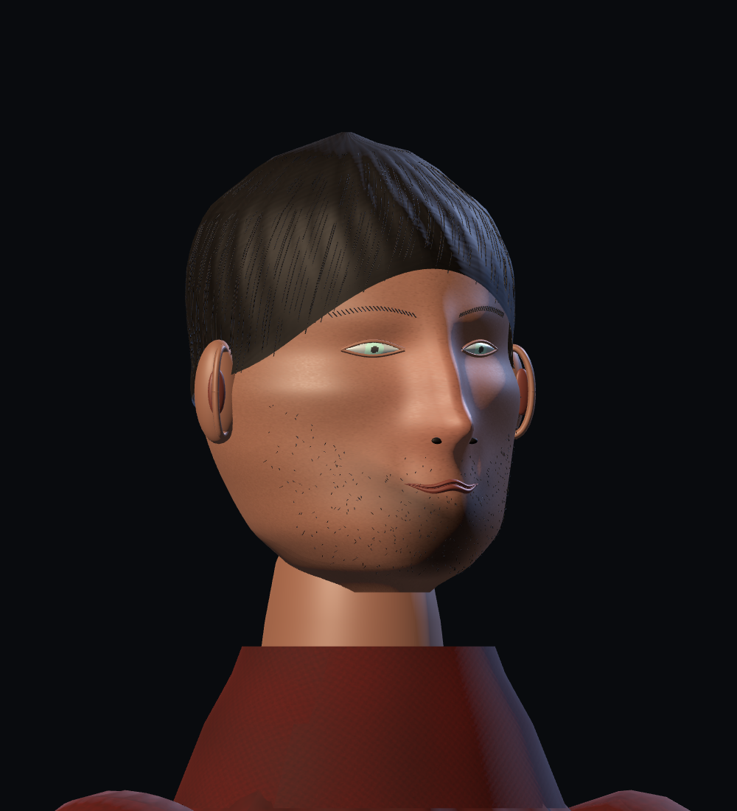
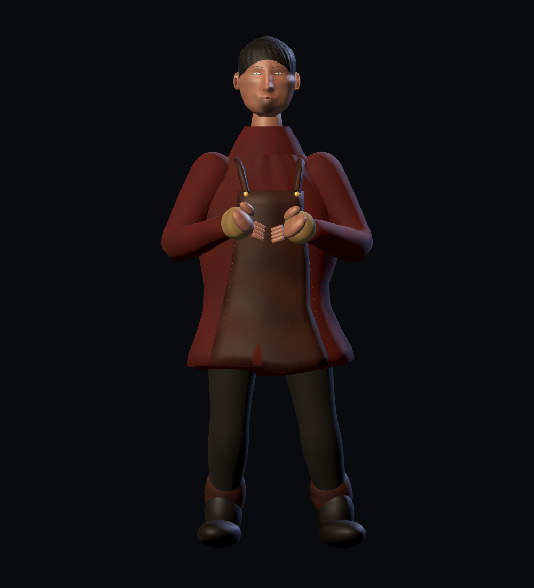
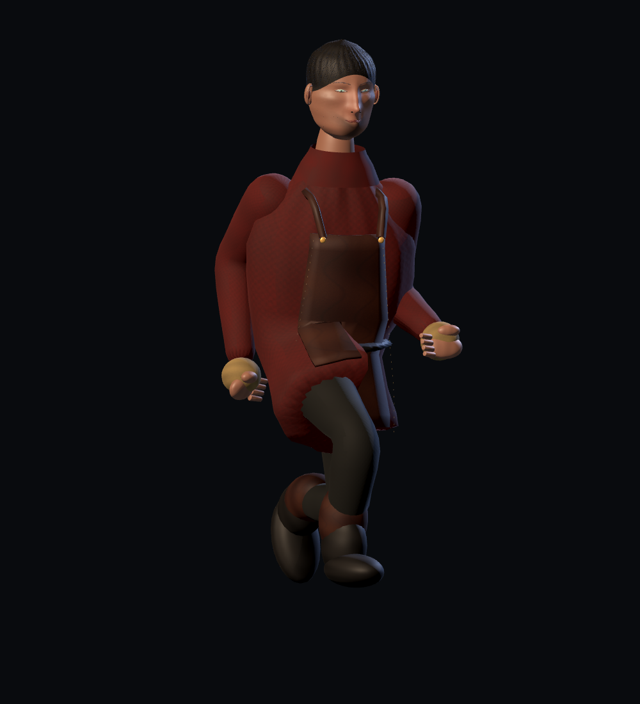
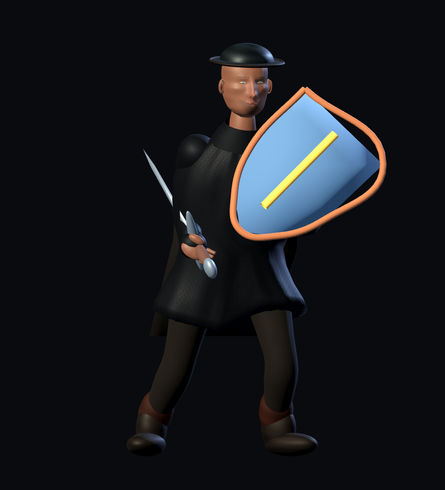

# Kalev realism revision — P0-210

Maintainer request, 2026-09-12: a much more realistic main character, using The Witcher 3 as a fidelity reference, while retaining interchangeable clothes, armour and weapons. [ADR 0020](../adr/0020-kalev-character-realism.md) records the Kalev-only direction change.

## Delivered changes

- Original sculpted cranial, jaw, cheek, brow and nasal surfaces, restrained eyes with iris/pupil regions contained in the eyelid aperture, tapered neck and continuous scalp coverage.
- Groomed hair, eyebrows and short stubble; portable albedo, normal and roughness textures for skin, hair, wool, linen, leather and steel. The generated material maps are embedded in the GLBs and extracted beside them by Godot’s existing importer. They do not depend on Blender-only shader nodes at runtime.
- Burgundy work tunic, fitted collar, leather apron with fine edge stitching, closer-fitting hands and connected boot shafts/ankles. Lower garment weights follow the actual thigh sockets rather than the lower pelvis bone.
- Fitted mail, kettle helmet and cape rebuilt with the same skin bind data. Fine mail is material detail rather than oversized geometric rings.
- Existing separate head, scalp, beard, hand, torso, sleeve, cuff, outerwear, leg and foot mesh regions retained. Wardrobe replacement hides covered regions and restores them on removal. Existing hammer/sword/shield attachment APIs remain in use. A single-model build no longer regenerates shared rigid props.

The live entry remains `assets/characters/kalev/kalev.tscn`, which loads `assets/storybook/kalev.glb`. Character and inventory IDs, gameplay state, maps, equipment stats and save schema are unchanged. NPC and fauna edits already in this shared checkout belong to separate work.

## Reproduction

Blender 5.2.0 LTS and Godot 4.7.1, GL Compatibility:

```sh
blender -b -t 6 --python-exit-code 1 --python tools/assets/build_storybook_models.py -- --only kalev
/Applications/Godot.app/Contents/MacOS/Godot --headless --path . --editor --import
python3 tools/verify_kalev_realism.py
/Applications/Godot.app/Contents/MacOS/Godot --headless --path . --script tools/run_godot_tests.gd -- --filter=test_kalev_realism,test_character_rig,test_character_wardrobe,test_inventory_equipment,test_save_service,test_save_envelope,test_storybook_models,test_storybook_live_integration
/Applications/Godot.app/Contents/MacOS/Godot --path . --script tools/capture_kalev_realism.gd
python3 tools/validate_asset_sources.py
```

Editable source: `build/storybook/kalev.blend` (ignored, reproducible). Geometry: `tools/assets/kalev_realism.py`; materials: `tools/assets/kalev_realism_materials.py`. Captures include front/three-quarter/profile portraits, work front/back, walking, running, hammer attack, armour, guard and restored work clothes. The existing interactive `scenes/debug/storybook_showcase.tscn` exercises outfit and weapon choices.

## Verification and limits

- Portable verifier enforces the 60,000-triangle/10 MiB ceilings, all 76 named clips, normalized weights, UVs, required PBR maps, replaceable regions, thigh-following hem and matching wearable bone order/bind matrices. The pre-edit snapshot comparison also checks sampled animation values; floating-point comparisons use a 1e-6 tolerance.
- Independent second-agent review confirmed the final captures resolve thigh escape, disconnected boots, scalp peak and lower-lip visibility; no remaining blocking correctness issues for this scoped improvement. Sharp apron folds during high strides remain a polish limitation.
- Runtime tests cover portable imported materials, armour/helmet/cape swaps, incompatible-fit rejection, restoring hair/clothes, weapon replacement, shared skeleton/animation-player identity, inventory equipment and save round-trips.
- Final model: **56,358 triangles, 9,046,132 bytes (8.63 MiB), 41 bones and 76 clips**. The full portable model-set validator passes.
- Final focused Godot suite: **8 files, 95 tests, 0 failures, 0 errors**. Provenance schema/coverage and `git diff --check` pass.
- Compared semantic bone ordering, inverse bind matrices and all sampled animation data against the pre-edit model; all agree within 1e-6. The change is mesh/material/skinning presentation rather than an animation replacement.
- The active-doc validator still reports the nine pre-existing broken links in the already-modified root README and a stale report. No unrelated documentation is rewritten to mask those failures. Existing shared-character texture UID fallback warnings remain in Godot startup output.
- This is a more detailed procedural hero, **not Witcher 3-equivalent finished character art**. The inherited body forms and hands remain stylized, facial animation and individual finger articulation are absent, and cloth is skinned rather than simulated. Additional sculpting, texture painting and animation polish are needed to reach that reference’s close-up fidelity. No hardware gamepad test was performed; this change adds no input behavior.

## Evidence

Before: [front](images/characters/realism_before/closeup_front_idle.png).








