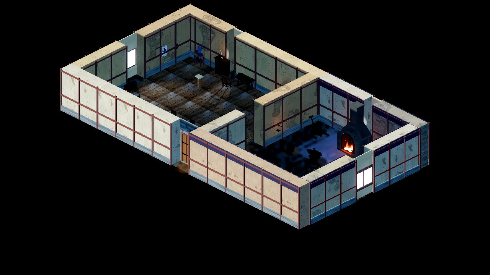
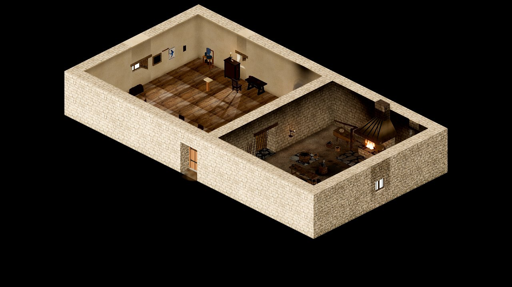
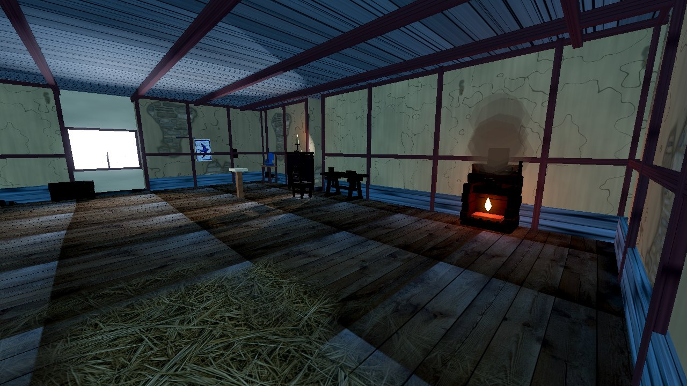
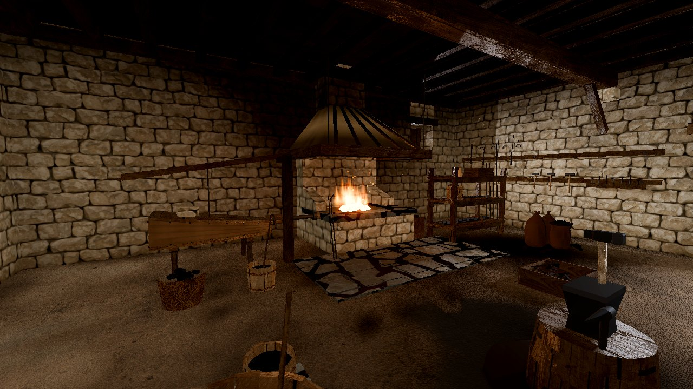

# Kalev smithy interior redesign (R-1100)

Recorded: 2026-09-30
Task: **R-1100** (maintainer request: replace the generic smithy interior with a custom, historically grounded 3D model)
Source dossier: [`history/dossiers/architecture/smithy-workshop-layout.md`](../../history/dossiers/architecture/smithy-workshop-layout.md), with [`blacksmith-materials-and-techniques.md`](../../history/dossiers/crafts/blacksmith-materials-and-techniques.md)

## Problem

The smithy was assembled from the generic interior path: every rrmap wall got the same plinth, two rails and a post grid, the ceiling was one flat plank slab with evenly spaced beams, and the forge kit was a brick arched oven with a sheet-metal hood, a horned London-pattern anvil and a riveted iron bucket. It read as a modern panelled room, and the daylight fill tinted every wall and iron tool sky-blue.

| Before | After |
|---|---|
|  |  |
|  |  |

## What ships

A deterministic Blender generator, [`tools/assets/generate_kalev_smithy_interior.py`](../../tools/assets/generate_kalev_smithy_interior.py), authors every piece in map world units (1 unit = 1 rrmap cell), so the shell sits exactly on the rrmap wall footprints.

| Kit | Path | Historical basis |
|---|---|---|
| Room shell | `assets/props/architecture/interiors/kalev_smithy_shell/` | Stone-footed craft house: limewashed rubble in the living bay, bare smoke-black rubble in the forge bay, a limestone fire wall between them with an oak door case and a stone threshold step (dossier: partition, ash kept out of the living bay). Deep splayed window embrasures with oak frames, lattice-held oiled linen and board shutters. Oak floorboards in the living bay, beaten earth with limestone flags at the hearth and tub in the forge bay. Tool wall on the east wall away from the heat, finished-goods shelf by the courtyard door. |
| Loft ceiling | `assets/props/architecture/interiors/kalev_smithy_ceiling/` | Oak wall plates, summer beams on limestone corbels with braces, joists, loft boards with a trimmed flue opening; smoke-blackened over the forge. |
| Hearth | `assets/props/forge/kalev_smithy_hearth/` | Raised rectangular limestone hearth about 2 m wide (Haapsalu raised-forge comparanda), clay-lined fire bed, three-wall enclosure, clay tuyere in the left (west) cheek, daubed smoke hood on an oak frame hung from the joists, masonry flue through the loft. No brick chimney pot. |
| Anvil | `assets/props/forge/kalev_smithy_anvil/` | Block anvil with a welded steel face and hardy hole, spiked into an iron-hooped oak stump, plus a beak iron. The horned anvil of the old model is post-medieval. |
| Bellows | `assets/props/forge/kalev_smithy_bellows/` | Great double-board leather bellows on a trestle, worked from a rocker pole whose handle is where routine `ap.forge.bellows` stands; the nozzle meets the tuyere. |
| Slack tub | `assets/props/forge/kalev_smithy_slack_tub/` | Coopered oak tub with split-hazel hoops beside the anvil (dossier: wooden trough or large tub, not in the coal bed). |
| Stock rack, scrap crate | `assets/props/forge/kalev_smithy_stock_rack/`, `.../kalev_smithy_scrap_heap/` | Bar iron, an osmund keg, nail rod and welding sand racked away from the quench splash; trade-in scrap kept for rework. |
| Finishing bench | `assets/props/forge/kalev_smithy_finishing_bench/` | Oak trestle bench between the anvil and the door for filing and riveting (dossier: finishing bench). Work is held on a stake iron driven through the top and on a hardy block; the screw vice is a later tool. Files, a rivet tray, a blade blank and a strap hinge on top, nail keg and offcut crate beneath. |

GLB materials are untextured `ksi_<surface>` slots with soot, grime and wear baked into `COLOR_0`. [`MapViewKalevSmithyInterior`](../../scripts/map/view3d/map_view_kalev_smithy_interior.gd) binds them to the shared photoreal plates (limestone rubble, plaster, timber, floorboards, flagstones, hay) with world triplanar mapping for masonry and grain-aligned UVs for wood. The forge floor uses a new Leonardo beaten-earth plate made seamless offline ([`derive_plate_normals.py`](../../tools/assets/derive_plate_normals.py), prompt beside the plate).

## Decisions

- **Presentation only.** rrmap walls, props, transitions and landmarks stay the collision, navigation and interaction authority. The view keeps each interior-wall `Walls` box as an invisible proxy so the occluded-actor probe still sees the walls, and it frees only the generic dressing.
- **Two map edits, both explained in the rrmap.** `forge_bellows` grows to a 3x2 footprint so the nozzle run to the tuyere is not walkable. `window.north_forge` moves from x 20 to x 23 because the hearth hood and flue now occupy the old opening; the dossier's high forge-bay window over the stock rack stays.
- **Forge hand tools** keep their shared GLBs but take the kit's wrought iron and ash inside the smithy; the hammer stands on the anvil face, the punch on the stump ledge, and the tongs cool in the slack tub.
- **Indoor light.** Enclosed interiors now use a warm bounce fill instead of sky-blue ambient and do not mirror the sky dome. This applies to every enclosed interior map, not only the smithy.
- **Retired assets.** `smithy_anvil`, `smithy_furnace`, `smithy_bellows`, `smithy_quench_bucket` and their three generators were removed; outdoor and other-map props keep their procedural fallbacks.

## Review pass

A second look at the capture set found four defects in the first build; all four are fixed in the shipped kit.

| Finding | Evidence | Fix |
|---|---|---|
| The south half of the forge bay was bare beaten earth for roughly 10 m x 5 m. The dossier's **finishing bench** ("between anvil and street door for filing, riveting") had never been modelled. | `topdown_forge_day.jpg`, `third_person_day.jpg` | New `kalev_smithy_finishing_bench` kit: oak trestle bench with a **stake iron and hardy block** (a screw vice would be an anachronism in 1343), files, rivet tray, part-finished blade and strap hinge, nail keg, offcut crate and coiled rod beneath. Placed at rrmap row 8, not against the south wall, because the 3.75 m wall head hides the far floor rows at the shipped camera pitch. Forge-bay corner dressing was added to the shell in the same pass: long stock leaning by the divider, a raked ash heap with its shovel, and two greyware crocks of standing water and quench oil. |
| The bellows bag rendered as a flat red-black blob: sampled pixels came back at R 39, G 5, B 2. | `bellows_close_day.jpg` | Two causes. The shared prop leather is cut for daylight props, so the smithy kit now uses a paler oiled hide; and `ForgeFireLight3D.FIRE_COLOR` was saturated enough (255, 140, 52) that any dark surface near the hearth lost its green and blue channels below one 8-bit step. A charcoal fire under forced draught is far whiter than that, so the key moved to (255, 170, 106). |
| Beams, shelves and the stock rack read as lacquered. | `tool_wall_close_day.jpg` | `_plate()` passed a roughness scalar **and** a roughness plate; Godot multiplies the two, so the timber plate's 0.42 average dropped to 0.35. The plate is now the sole authority, as in `MapViewMaterials`, and kit surfaces take a reduced `metallic_specular`. |
| The first crock pass was a smooth truncated cone and read as a bright orange marker. | `forge_bay_day.jpg` | Rebuilt with a wheel-thrown profile (bellied body, rolled rim) and an earthenware tone instead of the limewash tint. |

Regression cover lives in `tests/godot/test_kalev_smithy_interior.gd`:
`test_finishing_bench_fills_the_south_forge_floor_with_kit_materials`,
`test_bellows_leather_keeps_hue_separation_under_the_forge_key`,
`test_kit_plates_let_the_roughness_texture_govern`.

## Verification

```bash
blender --background --factory-startup --python tools/assets/generate_kalev_smithy_interior.py
python3 tools/assets/derive_plate_normals.py
tools/godot_render.sh --script tools/capture_kalev_smithy_interior.gd   # writes images/kalev_smithy_interior/
godot --headless --path . --script tools/run_godot_tests.gd -- --filter=test_kalev_smithy_interior
godot --headless --path . --script tools/run_godot_tests.gd -- --filter=test_forge_prop_meshes
python3 tools/validate_asset_sources.py && python3 tools/verify_asset_lint.py
```

The generator refuses to export a prop kit whose geometry sinks below the floor plane. Capture set: day and night for the gameplay overview, orthographic crops of both bays, and close shots of the hearth, anvil, bellows, tool wall, living bay and loft ([`images/kalev_smithy_interior/`](images/kalev_smithy_interior/)).
