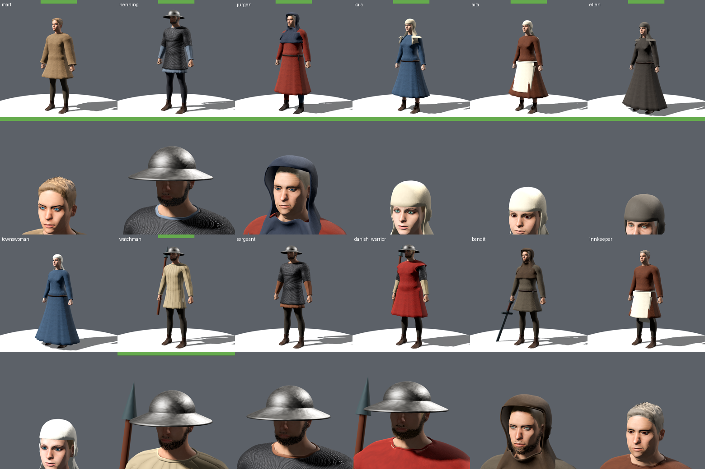
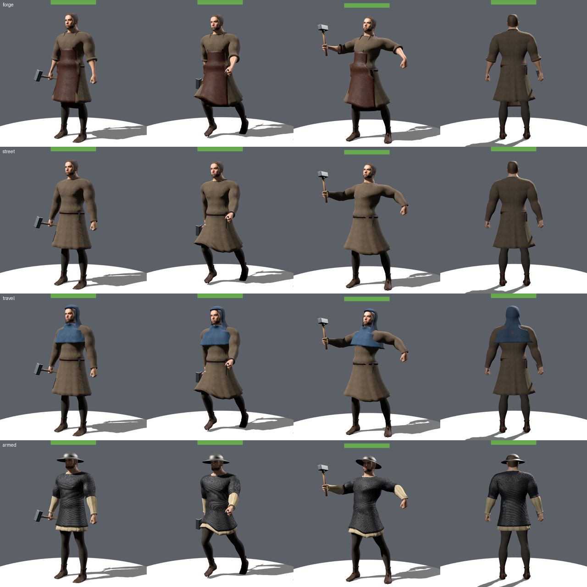
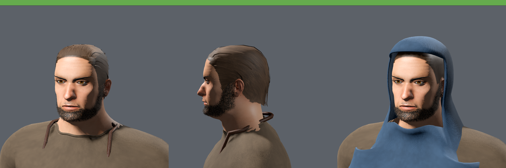
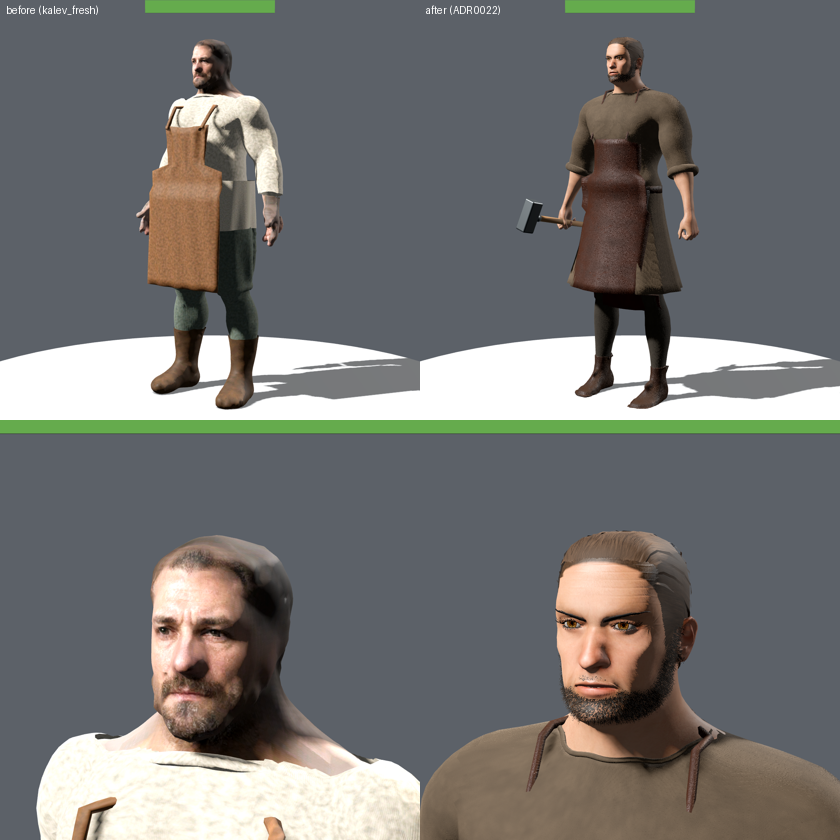

# Realistic human characters — Kalev first (ADR 0022), 2026-09-26

Maintainer request: rework human characters to realistic, historically accurate models
(Kingdom Come: Deliverance 2 / The Witcher 3 reference), all models realistic, key characters
polished further, and the main character modular for clothes, armour and weapons.
Decision record: [ADR 0022](../adr/0022-realistic-human-characters.md). Procedure:
[`CHARACTER_GENERATION.md`](../CHARACTER_GENERATION.md) "Realistic humans".

## Delivered

- New in-repo pipeline `tools/assets/realistic_humans/`: MPFB 2.0.17 + MakeHuman CC0 base body
  shaped by a spec, bound to the shared 41-bone rig with all 76 clips (MakeHuman weights,
  orientation-preserving joint fit), generated skin detail, beard fur shells, recoloured hair
  cards, and a generated 1343 wardrobe with tiling wool/linen/leather/mail/quilted/iron maps.
- **Kalev** (mid-40s Estonian master smith, dossier "Art — Kalev") replaces the photo-projected
  `kalev_fresh` body in `assets/characters/kalev/kalev.tscn`, spawning in the forge outfit.
- Ten wearables fitted to Kalev: `linen_shirt`, `work_tunic` (rolled sleeves), `wool_tunic`
  (belt, purse, knife), `gambeson`, `mail_haubergeon`, `smith_apron`, `hose`, `boots`, `hood`
  (Gugel with shoulder cape), `kettle_hat`; outfits `forge`, `street`, `travel`, `armed`,
  `undress` in `outfits.json`. Weapons use the unchanged `handslot` sockets.

### Named cast and NPCs

Twelve more humans now use the pipeline and replace their live scenes in
`assets/characters/variants/` (identity resources, health rings, held props and
walk overrides kept; scenes written by `write_scenes.py`), dressed by rank from the
clothing dossier:

| Character | Build | Default outfit |
|---|---|---|
| Mart (apprentice, 16) | slight teen | oversized tan short tunic, no belt knife, hose, shoes |
| Henning (watch captain, 48) | broad, grey-flecked beard | blue-grey aketon, mail, kettle hat |
| Jürgen (Hanseatic merchant, 52) | portly, clean-shaven | madder mid-calf tunic, parti-coloured hose, hood, purse |
| Kaja (courier, 26) | lean | woad work gown, linen headscarf |
| Aita (alewife, 42) | sturdy | russet work gown, linen apron, headscarf |
| Ellen (midwife, 63) | slight, aged | dark ankle gown, dark headscarf |
| Townswoman (burgher wife) | — | woad gown, linen coif and veil, belt |
| Watchman (militia) | lean, beard | padded jack, iron hat, spear |
| Sergeant | broader, beard | aketon, mail, iron hat |
| Danish man-at-arms | strong, fair beard | aketon, mail, red surcoat, iron hat, spear |
| Bandit (Harju rebel) | wiry, scruffy beard | coarse short tunic, hood, sword |
| Innkeeper | heavy, clean-shaven | russet tunic, linen apron |

New garment types: gowns (ankle and mid-calf), headscarf, coif and veil, waist
apron, surcoat (worn over mail in the `back` slot), long and short tunics and
parti-coloured hose.

**Crowd.** The four P0-153 seeded crowd bodies keep their manifest
(`crowd_variation_manifest.json`, generated by `tools/character_specs.py`) as the
source of truth; `specs.py` realises each seeded entry as a MakeHuman body with the
same stature order, build, skin tone (as a skin tint), hair, beard/bald features,
gait and period dyes, dressed by rank. Their variant scenes now use the realistic
rig. The Godot individuation test measures realistic materials and wardrobe layout
instead of the retired procedural normal-scale response.

## Evidence (Godot, GL Compatibility capture stage)

## Verification

- `tools/assets/realistic_humans/rebuild.sh kalev` — builds, imports, registers 38 provenance rows,
  `validate_asset_sources.py` and `verify_asset_lint.py` pass (Kalev classified Tier 0 from its spec).
- `--filter=test_realistic_kalev,test_kalev_live_integration,test_storybook_live_integration,test_character_wardrobe`:
  4 files, 23 tests, 0 failures. New `test_realistic_kalev.gd` covers the rig/clip contract, every
  wardrobe region, every garment's equip/hide/restore cycle, all named outfits, rejection of
  wearables fitted to another body, and the fur-shell material contract.
- `generate_active_docs_report.py --check` clean.

## Known limits / next

- Face: geometry, eyes, beard and hair are credible, but the skin still reads cleaner than the
  old photo projection at dialogue distance; a hero face texture pass (photo-grade albedo and
  wrinkle normal in the face region) is the next Kalev polish item.
- Cloth is skinned, not simulated; sleeves still hint at biceps in the full-sleeve tunic.
- Hands are a baked loose fist (no finger bones in the shared rig); no facial animation.
- Every live human scene now uses the realistic pipeline. `kalev_fresh`, storybook
  human and procedural `shared/*.glb` bodies remain only for their preview scenes and
  tests until retired; crowd scale (many instances) will need LOD/impostor work.
- The environment post-grade was tuned for ADR 0018 and still needs naturalistic recalibration.
