# Reval city plan review (2026-10-07)

First pass of [ADR 0031](../adr/0031-continuous-reval-city-plan.md): the whole of Reval in
spring 1343 as one seamless scene. Feature page:
[`SEAMLESS_CITY.md`](../SYSTEMS/SEAMLESS_CITY.md).

## Before

Ten rectangular district grids, one plane, a load at every crossing:

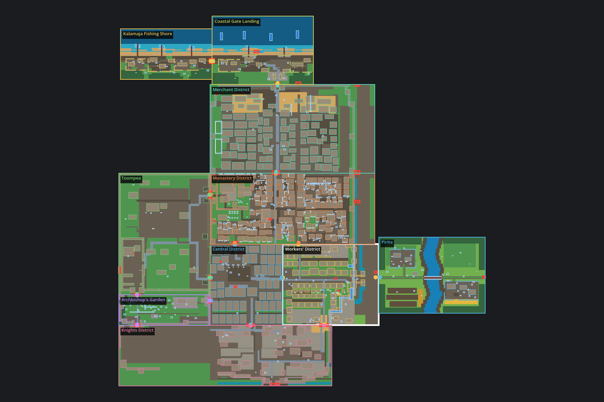

## Plan

Compiled plan (relief shading, 5-unit contours, streets, plots, curtain by 1343 state, towers,
gates, wells in blue, guard posts in red, gutter outfalls):

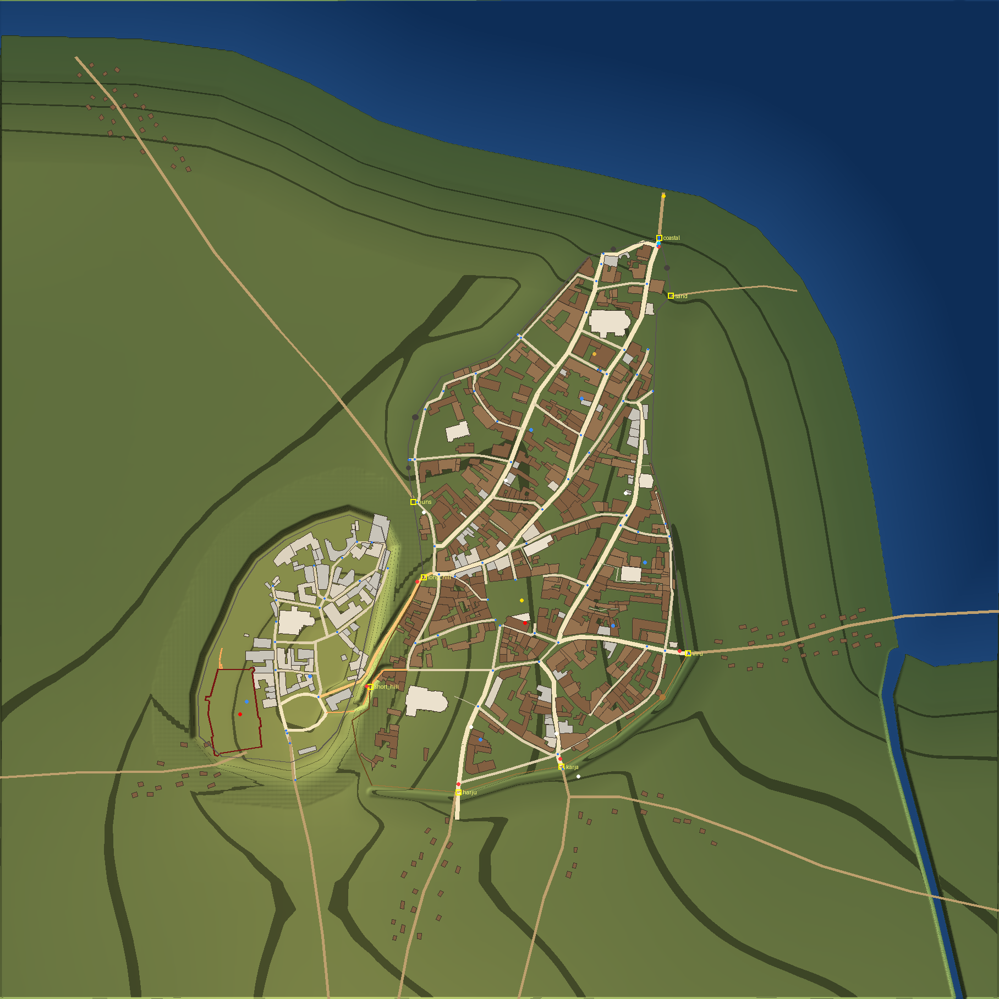

| Measure | Value |
|---|---|
| Streets and roads | 135 |
| Buildings | 641, of which 564 enterable |
| Curtain segments / built towers / gates | 35 / 6 / 8 |
| Trees / strip fields | ~940 / 29 |
| Forum → Lossi plats | +24.5 m |
| Coastal Gate above the 1343 sea | 6 m |
| Pikk jalg climb | 19.6 m |

## In the scene

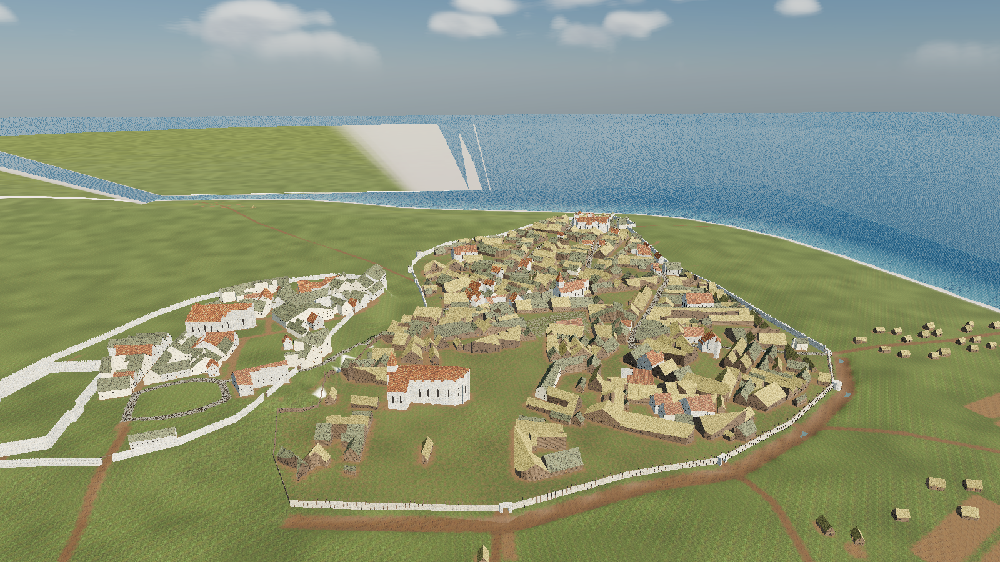
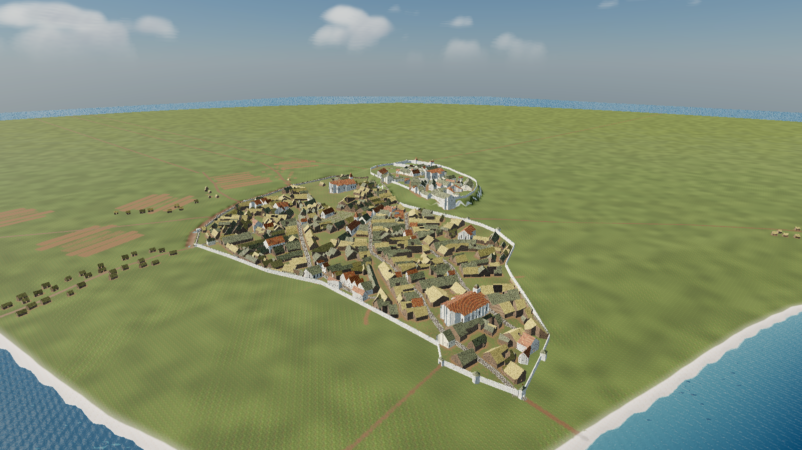
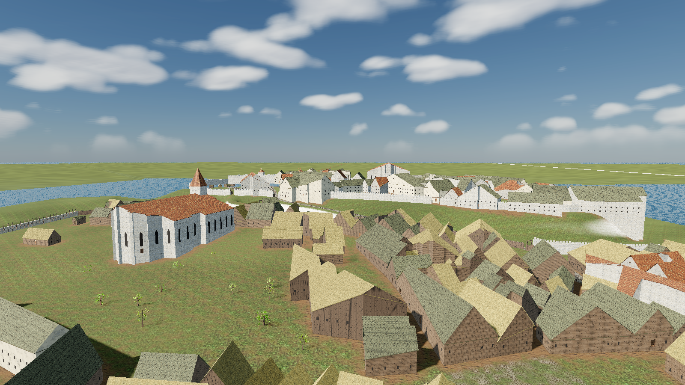
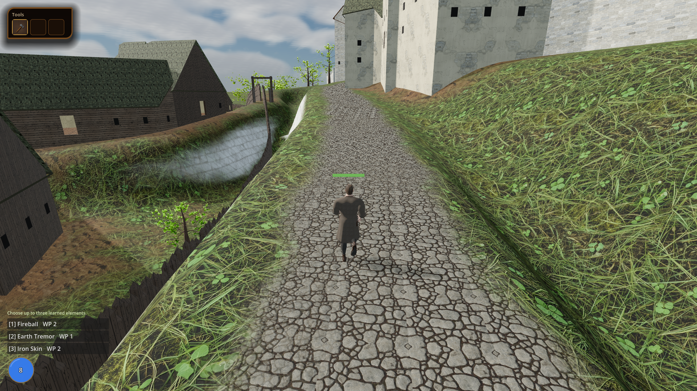
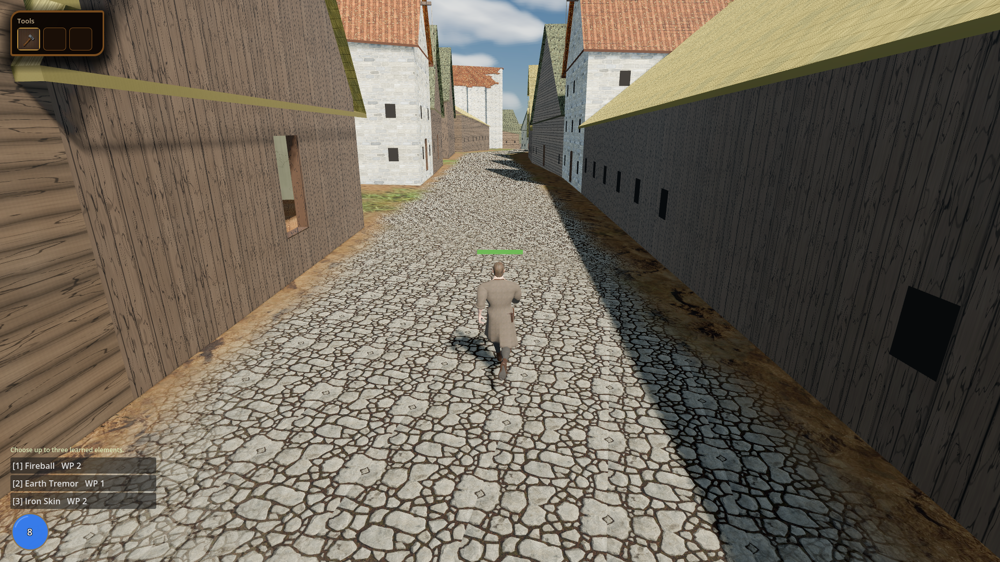
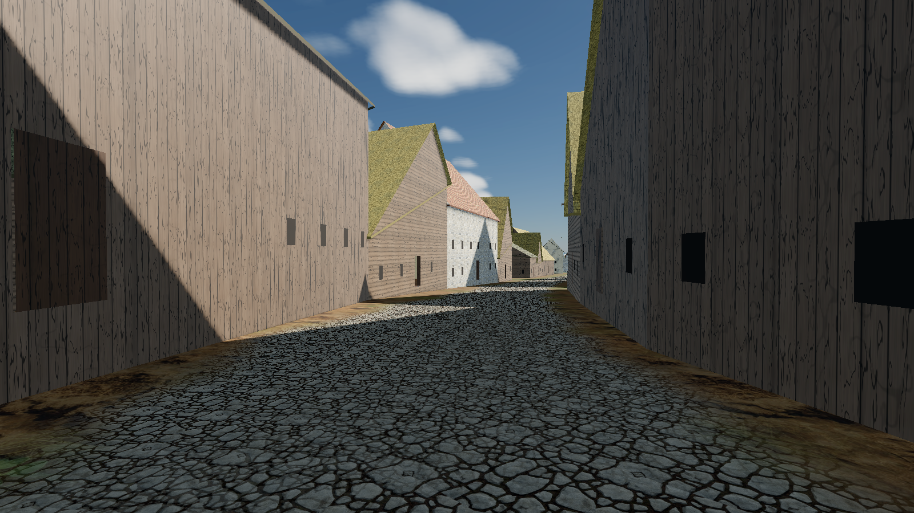
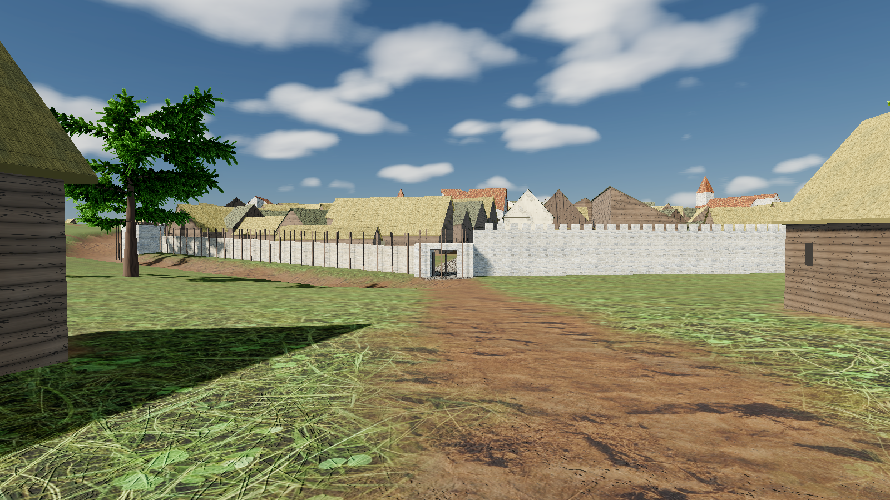
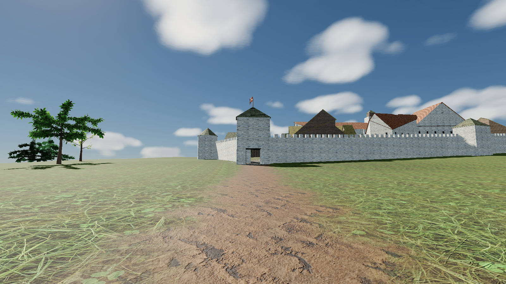
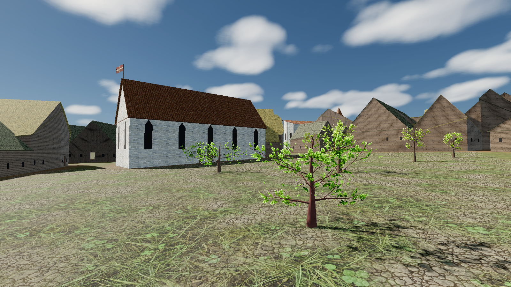
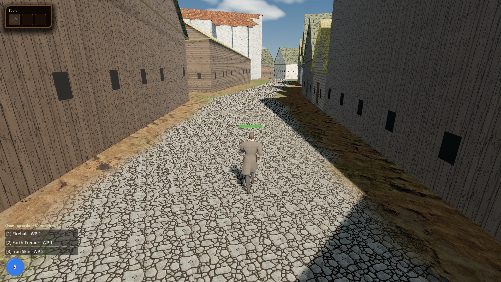

## Acceptance walk

`tools/godot_render.sh --resolution 1600x900 res://tools/capture_reval_city_walk.tscn`:

| Route | Result |
|---|---|
| Viru gate → inward | 36/36 waypoints, +8.5 m |
| Pikk jalg up to Toompea | 52/52, +19.6 m |
| Lühike jalg up to Toompea | 28/28, +12.4 m |
| Pikk → Coastal Gate → shore | 127/127, −24.2 m |
| Into and out of the council hall | roof lifts inside, restores outside |

Frame time p50 7-13 ms, p95 ≤ 16.4 ms at 1600×900. Scene ready in ~4 s.

## Fixed during the pass

- Packed arrays held in a Dictionary are copies in GDScript 4; the mesh shell now owns its
  arrays (no geometry rendered before).
- The hill-way middle sections lie between the Lower Town wall and the plateau and were
  filtered out as "outside the walls", so the ramp carve bridged them in a straight line.
- Toompea wall openings are placed where a street crosses the wall, not near its end.
- The boundary at the Short Hill gate ran parallel to the steps; it now crosses them, and
  gates face along their street.
- The north curtain was bent 18 m south by a "behind" tower; it now follows the surviving
  wall line, and later breaches (Bremeni käik, Suurtüki, outer Olevimägi) are cut at the
  curtain.
- Vegetation cost 30 ms per frame as one MultiMesh per species; chunked crowns with a
  visibility range bring the frame to 7-13 ms.
- The surface model's rooftops lifted the Lower Town ~5 m; corrected so Toompea stands
  ~25 m over the forum.

## Wind check

`tools/verify_wind_direction.gd` renders a tower pennant and the town hall flag top-down
under four wind directions; both fly downwind in every case (cloth centroid 1.1-1.4 units
downwind of the staff). Every other wind consumer (clouds, chimney smoke, trees, grass,
sails, banners, hoist ropes, sea waves) uses the same "blows toward" vector, so after the
R-1181 flag rewrite there is no reversed element.
