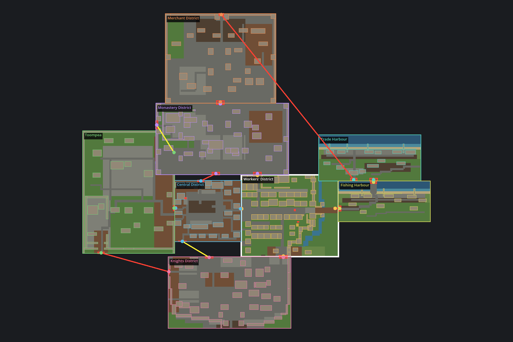

# P0-068 Reval district reshape

Recorded: 2026-07-20

The semantic district layout now follows Tallinn's preserved medieval urban
structure more closely while retaining existing stable map and transition IDs.

- `lower_town_slice` is visibly **Workers' District** and ends at 128 cells high.
- `south_quarter` is **Knights District**, with denser civic/military fabric and
  a stepped outer wall instead of a rectangular enclosure.
- The old north ward is split horizontally: a 208 x 112 **Monastery District**
  with fortified west/east edges below a 173 x 140 **Merchant District** with
  west/east/north walls. Round towers follow the Workers' District fortification
  treatment, and the turreted Great Coast Gate connects the merchant ward to
  **Trade Harbour**.
- The northern and eastern harbour maps are wider, display **Trade Harbour**
  and **Fishing Harbour**, and join left-to-right so both Baltic basins remain
  along their north edges.
- Toompea is 144 x 192 cells and carries `elevation=2.8`; the 3D terrain view
  tapers this into a raised plateau without changing navigation or stable IDs.

The functional district names are gameplay labels, not claims about medieval
administrative boundaries. The stepped fortification, distinct Toompea hill,
and northward commercial/harbour relationship are informed by Tallinn's
official [city history](https://www.tallinn.ee/en/history-tallinn),
[heritage-protection overview](https://www.tallinn.ee/en/ehitus/heritage-protection),
and [Toompea wall description](https://www.tallinn.ee/en/news/patkuli-stairs-closed-due-restoration-toompea-wall-until-27-june).

## Reviewed semantic alignment

Red connectors are reciprocal map transitions; their apparent length reflects
separate scene coordinates, not walkable open-world distance. All eight shown
district maps compile from `.rrmap` sources and remain independently streamed
scenes. Only the existing slice maps are release-active; the reshaped districts
remain developer traversal prototypes.
