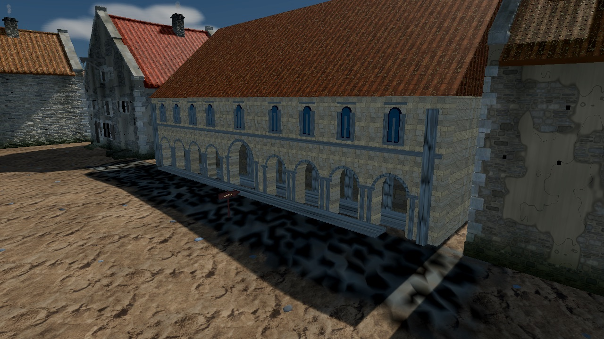
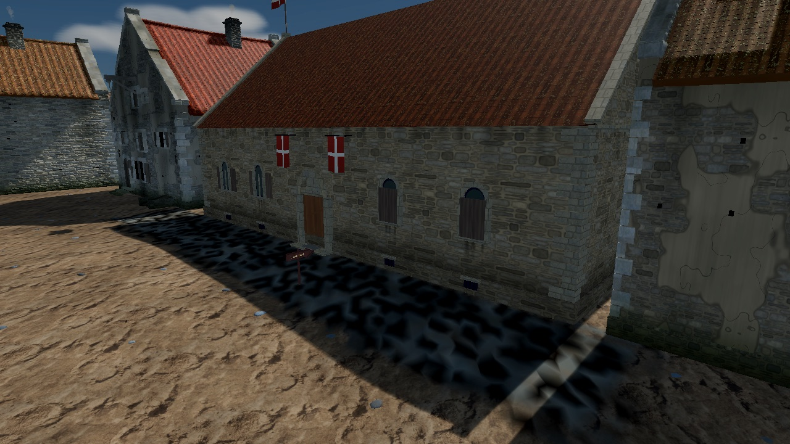

# Town Hall 1343 remodel: historical state, wear and Danish banners

Recorded: 2026-09-30
Map: `market_civic_quarter`
Building: `town_hall_mass` (primitive `town_hall_1343`)
Board: R-1135 (follow-up pack R-1121)

## Problem

The maintainer found the Town Hall "too shiny". It read as a new build: regular
buff ashlar across the whole mass, blue-grey trim with a stretched texture,
bright blue glass, and a clean orange roof. It also still carried the post-1404
arcade that P0-072 kept for legibility, although the 1343 dossier
([`raekoja-plats-extents-1343.md`](../../history/dossiers/topography/raekoja-plats-extents-1343.md))
says the hall had no arcade then.

## Decision

The maintainer asked for a historically accurate hall. The clarification
question about keeping the arcade timed out, so the model follows the dossier:
**no arcade**. This supersedes the 2026-07-23 decision in
[`town_hall_arcade_rework.md`](./town_hall_arcade_rework.md). The Canon labels are in
[`../CANON.md`](../CANON.md) and the audit row in
[`../HISTORICAL_AUDIT.md`](../HISTORICAL_AUDIT.md).

## Change

`scripts/map/view3d/map_view_town_hall_model.gd` owns the hall:

- **Fabric.** Walls are pinned to the `rubble_buff` library stem (split local
  limestone, *paekivi*). Only the quoins, portal and window frames use dressed
  stone (`ashlar_pale`, object-space triplanar so small blocks keep stone scale).
  The roof is pinned to `tile_moss`. Library tints only carry hue, so each
  material gets an explicit tone multiplier. It stays in the AR-03 cache, so the
  anti-tiling quality toggle still reaches it.
- **Form.** One storey with an attic storeroom. The market wall has a
  round-headed portal on the building axis, round-headed two-light windows with
  board shutters (some left closed), and small barred cellar lights below them.
  Seven such openings from the 1322 building survive. Stone gable ends are
  masonry prisms that cover the tile verge, with a gable course, coping slabs and
  apex stones. The east gable has a loft door, a hoist beam, a pulley and a rope.
  The west gable abuts its neighbour.
- **Wear.** A darker footing plinth, a rising-damp band, eave soot and runoff
  streaks with seeded lengths, rain streaks under every sill, a worn step, dull
  leaded glass and silvered shutters.
- **Banners.** Two square red banners with a centred white cross hang from iron
  rods either side of the portal. A third flies from a staff on the east gable.
  They are vertex-coloured cloth meshes with no texture on disk, faded toward
  the hem.
- **Removed.** The arcade wall, gallery, vault, ribs, stepped gable boxes and
  `MapViewMeshBuilderPrimitives.arcade_wall_mesh` (its only user). The door
  transition is still snapped to the portal axis (`centres_entrance`), but it now
  stands in the market wall. Collision and navigation came from the footprint and
  are unchanged. No `.rrmap` was edited.

## Evidence

Captured with `tools/godot_render.sh --script tools/capture_town_hall_facade.gd`
(a new `west_gable` shot was added):

| Before | After |
|---|---|
|  |  |

- Eye level at the portal: [`remodel_after_eye.jpg`](images/view3d/town_hall/remodel_after_eye.jpg)
- East gable with hoist and flag: [`remodel_after_side.jpg`](images/view3d/town_hall/remodel_after_side.jpg)
- Gameplay-height dimetric: [`remodel_after_dimetric.jpg`](images/view3d/town_hall/remodel_after_dimetric.jpg)

`tests/godot/test_market_prototype_maps.gd` asserts the 1343 parts, the absence
of the arcade and gallery, full-footprint mass depth, the pinned `rubble_buff` /
`tile_moss` stems, red-field-white-cross banner colours, and the door on the
portal axis in the market wall.

## Open

- Maintainer visual acceptance (R-1135).
- The shared weathering kit and the other landmarks are tracked in pack R-1121
  (LM-01..LM-08).
