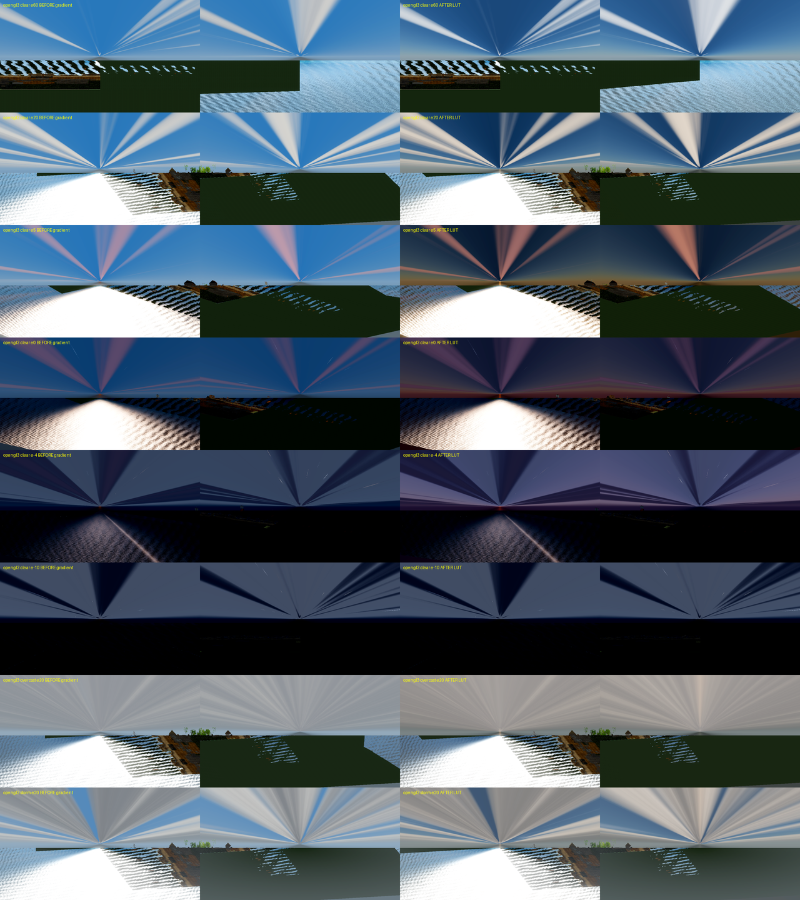
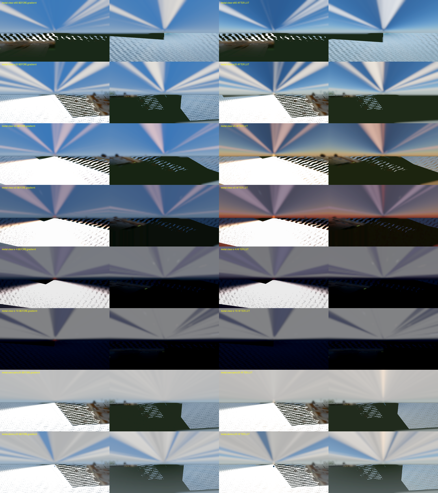
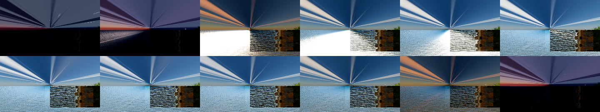
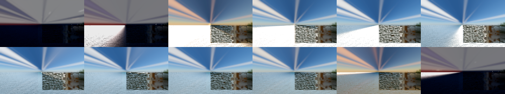

# WS-10 physical sky - evidence report

Task: WS-10 / R-895 ([contract](../tasks/water_sky/WS-10_sky_view_lut_runtime.md)). Date: 2026-09-25.
Host: Apple M5 Pro, Godot 4.7.1. Status: implemented, pending named visual review.

## What changed

- `SkyAtmosphereLut` (`scripts/map/view3d/sky_atmosphere_lut.gd`) owns an HDR `SubViewport`
  (192x108 on `recommended`, 96x54 on `minimum`) that renders `sky_view_lut.gdshader`, the Hillaire
  sky-view LUT, with `UPDATE_ONCE`. It renders every frame on `recommended` and every second frame
  on `minimum`, and always renders when the sun zenith cosine moves by more than 0.02.
- `sky_weather_3d.gdshader` samples the LUT for the clear-sky background. It colours the sun disk
  with `sun_illuminance * T(ground, mu_sun)` plus limb darkening, and lights clouds with
  `T(1.5 km, mu_sun)` plus a zenith/horizon LUT ambient term. Stars, moon, cloud shapes, storm
  cells, rain shafts and lightning use the same code as before. When the WS-09 assets are missing,
  `sky_lut_available` is false and the old gradient code runs unchanged.
- Art controls: `sky_exposure` (0.7), `sky_tint`, `sunset_boost` (0.25), `sun_disk_scale`,
  `cloud_sun_scale`, and a partial eye adaptation `sky_adaptation` (0.6, max gain 4).
- The save/transition state contract has not changed (see `docs/SKY_WEATHER_STATE_CONTRACT.md`).

## Decisions

1. **HDR storage, not RGBM.** A non-headless probe wrote `vec4(3.5, 0.25, 0.01, 0.4)` into a
   `use_hdr_2d` SubViewport and read it back exactly: `RGBAF` on Compatibility (opengl3) and
   `RGBAH` on Metal.
2. **Backend quirks found during integration.**
   - The kernel computes its UV from `FRAGCOORD` (framebuffer memory order), so the stored texel
     order is the order `texture()` reads on every backend.
   - On GL Compatibility, a sky shader that samples the ViewportTexture gets sRGB-decoded values.
     Measured: a stored horizon of 0.38 rendered like 0.12, and every GL plate was about 2.2 gamma
     darker than Metal. On `gl_compatibility` only, the kernel pre-encodes its output with the
     exact inverse curve (`encode_srgb`). Float storage keeps the round trip lossless.
3. **Calibration.** With `sky_exposure` 0.7 and the sun at 60 degrees, the Compatibility horizon
   linear luminance is 0.338, against 0.335 for the old gradient (the target was within 15%). The
   zenith is darker than the horizon.
4. **Eye adaptation.** The scene grade is fixed, so the physical sky at a 0-5 degree sun was about
   10x darker than at noon, while the lit ground stayed bright. The gain is
   `clamp((0.155 / L_zenith)^0.6, 1, 4)`, where `L_zenith` is the zenith luminance from one LUT
   fetch. It is computed on the GPU with no readback, and it is 1 at the 60-degree calibration
   point.

## Captures

The tool is `tools/capture_ws10_sky_elevations.gd`. Each plate uses a separate process on
`reval_harbor_north` and shows two horizon views: towards the sun on the left, away from the sun
on the right. The sun is set through `apply_sky_state`. In each sheet, the left column is BEFORE
(`--gradient`, the unchanged old shader path) and the right column is AFTER (LUT). Rows are clear
60, 20, 5, 0, -4 and -10 degrees, then overcast 20 and storm 20.

- Compatibility: 
- Metal: 

Observations:

- **60 and 20 degrees:** deep blue zenith over a pale, hazy horizon. The zenith is darker than
  the horizon.
- **5 degrees:** a warm orange horizon glow on the sun side. The sun disk is orange at the
  horizon.
- **0 degrees:** a red sun and a red horizon line on the sun side. The anti-sun half shows a
  pink/violet band over a darker blue-grey Earth shadow.
- **-4 degrees:** deep violet-blue twilight, a red remnant glow on the sun side, and the first
  stars.
- **-10 degrees:** matches the old night, because the LUT is about 0 and the night floor is the
  old gradient.
- **Overcast and storm at 20 degrees:** still dim and grey. Overcast is slightly warmer and
  brighter than before, because cloud lighting now follows the physical sun colour.

The radial cloud streaks that converge on the horizon are the existing cloud projection seen from
a horizontal camera. They appear in the BEFORE plates too, and the gameplay camera does not see
them.

## One compressed day (flicker and pop check)

`--day-sweep` drives the runtime path (`MapView3D.apply_cycle_progress`) for 3600 frames, which is
one 60 s day at 60 fps. It measures the mean absolute change in the sky band between consecutive
frames, on a 0-255 scale:

| Renderer | Mean step | Max step | Max at progress |
|---|---|---|---|
| Compatibility | 0.083 | 0.588 | 0.942 (dusk) |
| Metal | 0.066 | 0.482 | 0.067 (pre-dawn) |

A pop would show up as a spike far above the mean. The largest step is less than 1/255, so the LUT
updates produce no visible pop or flicker. Strips: 

This is a frame-difference sweep and a thumbnail strip, not a video file. A human video review is
still open.

## Performance

`--benchmark`: 2560x1440, vsync off, 600 frames, 20-degree clear sky. The numbers are the mean
wall-clock frame time over two runs each. SubViewport GPU timers read 0 on this Mac.

| Renderer | Tier | Gradient ms | LUT ms | Delta |
|---|---|---|---|---|
| Compatibility | recommended | 13.26 | 14.41 | +1.15 |
| Compatibility | minimum | 12.99 | 13.43 | +0.44 |
| Metal | recommended | 7.78 | 7.91 | +0.13 |

The cost scales with how often the LUT renders, so it is the LUT pass. The sky dome pass on its own was
not isolated. On Compatibility, the 192x108 x 30-step pass costs about 1 ms per
render. That fits inside the sky tier budgets (2.5 ms recommended, 1.5 ms minimum), but it is
worth optimising (follow-up). `tools/run_performance_report.sh --quick` was not re-run for this
change.

## Verification run

- `test_sky_atmosphere_lut.gd` (5 tests) checks the viewport at tier size, the throttle, the
  missing-asset fallback, and the shader mapping and include. `test_sky_weather_3d.gd`,
  `test_atmosphere_luts.gd`, `test_r713_sky_weather_continuity.gd`, `test_weather_realism.gd` and
  `test_ocean_fft_material.gd` pass unchanged.
- The full Godot suite fails in about 50 files, none of them sky/weather/water-shader tests.
  Examples are building surfaces, combat and content. These failures were present before this
  change.
- `python3 tools/verify_r713_sky_weather_evidence.py` returns PASS.
  `verify_r713_sky_weather_acceptance.py` stays BLOCKED on the same external owners and reviews as
  before. The continuity images were not re-captured, because the verifiers do not compare pixels.

## Open

- Named human visual review of both sheets.
- A 60 s video of one day, for the human review.
- Optimising the Compatibility LUT pass.
