# The St. George's Night Uprising (1343–1345)

## 🎭 Historical Context

### The State of Estonia in 1342

On paper, Northern Estonia is the Duchy of Estonia, a dominion of the Danish Crown, ruled by a viceroy from Toompea Castle in Reval (modern-day Tallinn). In reality, Danish power is a hollow shell. The true authority lies with a web of competing interests:

-   **The German Vassals**: Feudal lords who control the land and its people, loyal to the Danish king only when it suits them.
-   **The Livonian Order**: A powerful, semi-independent military order of German knights who act as the region's de facto army and landlords. They have their own agenda and often operate in defiance of the Danish crown.
-   **The Hanseatic League**: The wealthy German merchants of Reval, who operate with a high degree of autonomy and are primarily concerned with protecting their trade routes and profits.

This fractured power structure has created a powder keg of resentment and ambition, where the native Estonian population is caught between a distant king, foreign knights, and wealthy merchants, all of whom see the land and its people as a resource to be exploited.

### The Wider World: 1343

#### The Kingdom of Denmark: A Hollow Crown

In 1343, Denmark was ruled by **Valdemar IV Atterdag**, a king grappling with a realm in pieces. Having ascended to the throne in 1340, he inherited a kingdom that had been largely pawned off to German princes. His reign was a determined effort to reconstitute Danish territory and authority through a combination of cunning diplomacy and military campaigns. The sale of the Duchy of Estonia in 1346 was a direct consequence of this broader strategy to consolidate his power and resources closer to home.

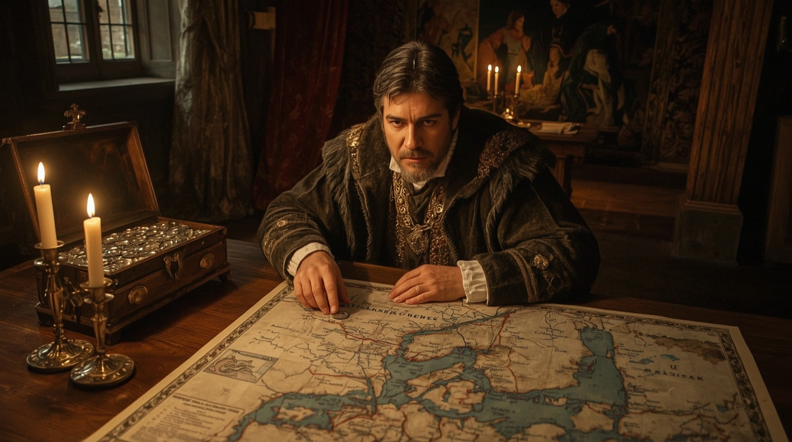

#### The Livonian Order: A State of Knights

The Livonian Order, a semi-autonomous branch of the Teutonic Knights, was the dominant military power in the region. Led by the Livonian Master from his seat in Riga, the Order operated as a state within a state. In 1343, the Order was both expanding its influence—acquiring Reval and Wesenberg from Denmark—and facing significant internal threats, most notably the St. George's Night Uprising itself. The Order's swift and brutal suppression of the rebellion demonstrated its military might and its unwavering commitment to maintaining control over its territories.
![[26.jpg]]

#### The Hanseatic League: The Power of Trade

The Hanseatic League, a powerful confederation of merchant guilds, dominated trade in the Baltic. Reval (Tallinn), a member since 1285, was a key hub in this network. The city's German merchants operated with a high degree of autonomy, their primary concern being the protection of their commercial interests. The political turmoil of the uprising was a direct threat to their trade routes and profits, making them natural allies of the Livonian Order in restoring order.

![[27.jpg]]

#### The Kingdom of Sweden: A Divided Realm

Sweden, under **King Magnus IV (Magnus Eriksson)**, was a kingdom in transition. Magnus ruled over a vast territory that included Sweden, Finland, and Norway. However, by 1343, he faced growing opposition from the nobility, particularly in Norway. To manage these tensions, he made the strategic decision to divide his realms, appointing his younger son, Haakon, as King of Norway in 1343, while his elder son, Eric, was designated to rule Sweden. This internal focus meant that while Sweden was a potential player in the Estonian conflict, its capacity for direct intervention was limited.

#### The Eastern Republics: Novgorod and Pskov

To the east, the Novgorod Republic was a major power, but its relationship with its western neighbor, the Pskov Republic, was complex. By 1343, Pskov was de facto independent from Novgorod, though this status would not be formally recognized until the Treaty of Bolotovo in 1348. Both republics were frequent adversaries of the Livonian Order, and the Estonian rebels appealed to them for aid. However, the internal dynamics between Novgorod and Pskov, combined with the speed of the Order's response, prevented any effective intervention.

**The Posadniks of Novgorod:** The Novgorod Republic was not ruled by a single prince but by a council of nobles (boyars) and an elected official known as a *posadnik*. While the names of the specific posadniks from 1343 are not readily available, this collective leadership was the key political authority in the powerful city-state.

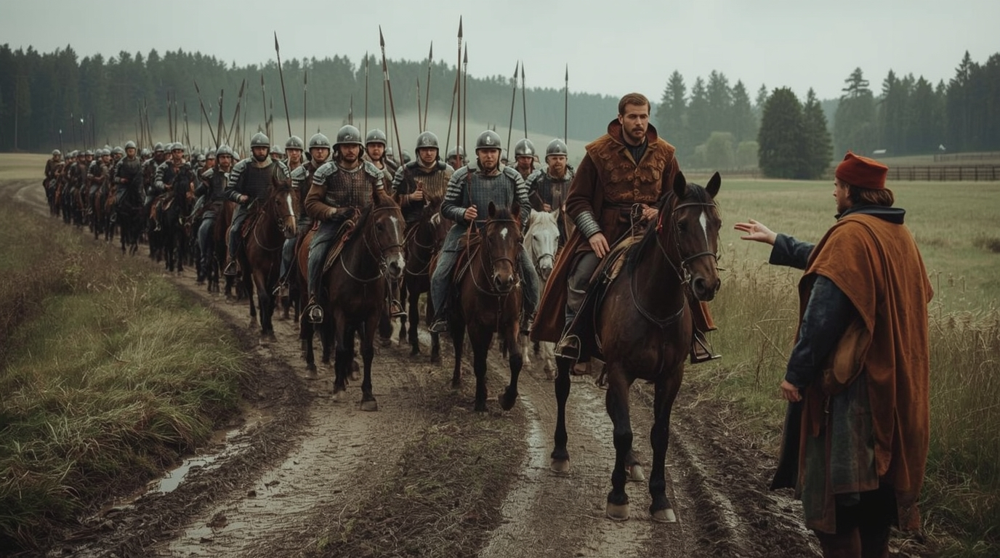

#### The Grand Duchy of Moscow: A Rising Power under Mongol Rule

In 1343, the Grand Duchy of Moscow was a rising power, but still a vassal state under the authority of the Golden Horde. The Grand Prince, **Simeon "the Proud" Ivanovich**, navigated a complex political landscape, balancing the need to maintain favor with the Mongol Khan **Jani Beg** while simultaneously asserting Moscow's influence over other Russian principalities.

The relationship with the Golden Horde was one of calculated subservience. The Khan's authority was absolute, and Russian princes were required to obtain a *yarlyk* (a patent of authority) from the Khan to legitimize their rule. Jani Beg, like his predecessors, practiced a policy of "divide and rule," supporting rival principalities like Tver and Ryazan to prevent any single Russian state from becoming too powerful.

Despite this, Simeon skillfully used his position to continue his father's policy of "gathering the Russian lands." In 1343, this was most evident in his conflict with his cousin, **Prince Konstantin of Nizhny Novgorod**. Simeon attempted to annex the strategic principalities of Nizhny Novgorod and Gorodets, even convincing the local boyars to switch their allegiance. However, the move was ultimately thwarted by Khan Jani Beg, who intervened and restored the lands to Konstantin, demonstrating the clear limits of Moscow's autonomy. This event highlighted the central tension of the era: Moscow's ambition to unify the Russian lands under its leadership, and the Golden Horde's determination to maintain its control by keeping the Russian principalities fragmented and weak.

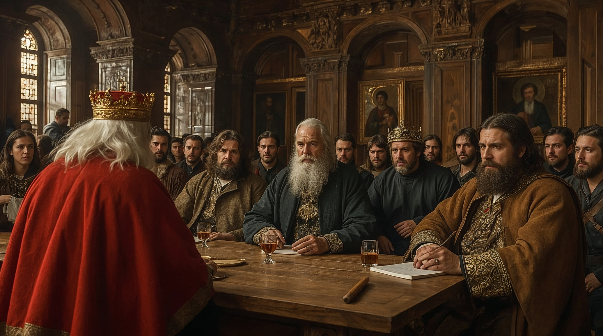

#### The Grand Duchy of Lithuania: A Power in Transition

In 1343, the Grand Duchy of Lithuania was in a state of flux following the death of its powerful ruler, Gediminas, in 1341. His son, Jaunutis, held the title of Grand Duke, but his authority was weak and contested by his more ambitious and militarily capable brothers, Algirdas and Kęstutis. This internal power struggle, which would culminate in Algirdas seizing power in 1345, meant that Lithuania, despite being a major regional power and a natural enemy of the Livonian Order, was too preoccupied with its own succession crisis to offer any meaningful support to the Estonian rebels.

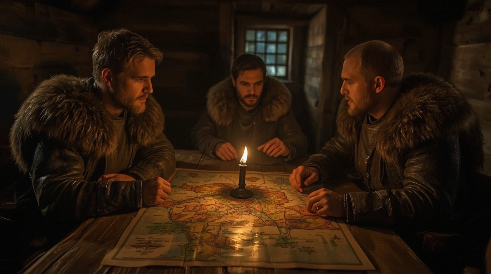

#### The Golden Horde: A Fading Power

Far to the east, the Golden Horde, once a formidable power, was beginning its long decline. In 1343, under the rule of **Jani Beg Khan**, the Horde was grappling with internal instability following the death of the powerful Özbeg Khan in 1341. Jani Beg's reign was marked by succession struggles, economic difficulties, and growing tensions with the Genoese and Venetian trading colonies in the Crimea. While the Horde's influence was still felt in the Russian principalities, its ability to project power into the Baltic was waning, and it played no direct role in the events of the St. George's Night Uprising.

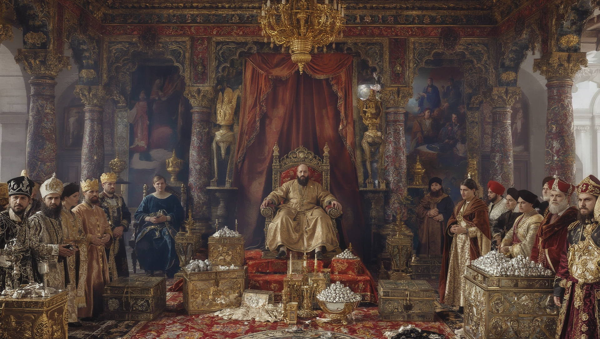

### The Seeds of Rebellion

The St. George's Night Uprising was not a sudden event, but the culmination of decades of simmering resentment. The key grievances include:

-   **Heavy Taxation**: While ethnic and cultural tensions were high, recent research points to extraordinary taxes imposed by the Danish King Valdemar IV as a primary trigger. To fund the redemption of his pawned kingdom, he levied heavy taxes on all residents of Danish Estonia, including the church, creating widespread economic grievance.
-   **Cultural and Religious Oppression**: The German-speaking ruling class and the Catholic Church have systematically suppressed Estonian culture, language, and pagan beliefs.
-   **Economic Exploitation**: The Hanseatic merchants of Reval control the flow of trade, enriching themselves while the local population sees little benefit.
-   **Loss of Land and Freedom**: The rights of free Estonian peasants have been steadily eroded, with many forced into serfdom by the German feudal lords. As the chronicler Wigand of Marburg wrote, "the knights and vassals burdened the population with such heavy taxes and extortions... and so great was their violence that they dishonored their wives, raped their daughters, took away their property, and treated them as slaves."

## The Uprising: A Detailed Account

The St. George's Night Uprising was not a single, isolated event but a meticulously planned and brutally executed series of revolts that swept across Danish Estonia in 1343. It represented a desperate, violent attempt by the indigenous Estonian population to cast off a century of foreign domination.

### The Spark of Rebellion: St. George's Night

The uprising ignited on the night of April 23, 1343—St. George's Night. A single house was set ablaze on a hilltop in Harju County, a pre-arranged signal that unleashed a coordinated wave of violence. The goal was nothing short of the complete extermination of the German-speaking ruling class.

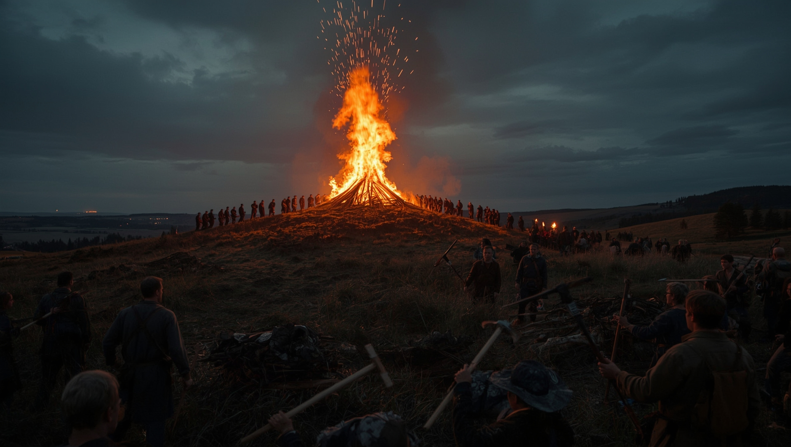

The rebels showed no mercy. They moved swiftly through the countryside, slaughtering German nobles, officials, and merchants, along with their families. Manors and strongholds were put to the torch. The Cistercian monastery at Padise was sacked, and the 28 monks who had not fled were massacred. The violence was indiscriminate, with Estonian women reportedly killing any German women and children who had been spared by the men.

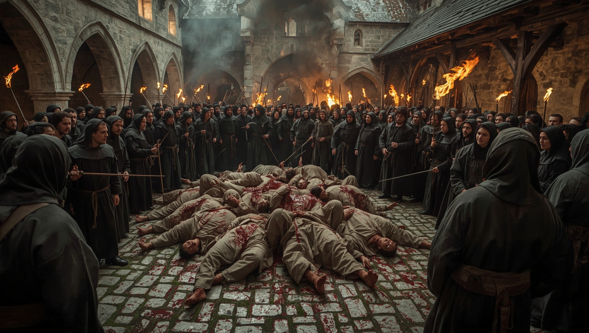

### The Siege of Reval and the Four Kings

Having purged the countryside, the Estonian forces, demonstrating remarkable organization, elected four leaders among themselves, crowning them as "kings." This newly formed army, estimated at 10,000 strong, then marched on the fortified city of Reval (Tallinn) and laid siege to it. In the initial confrontation beneath the city walls, the rebels defeated the knights of the Livonian Order.

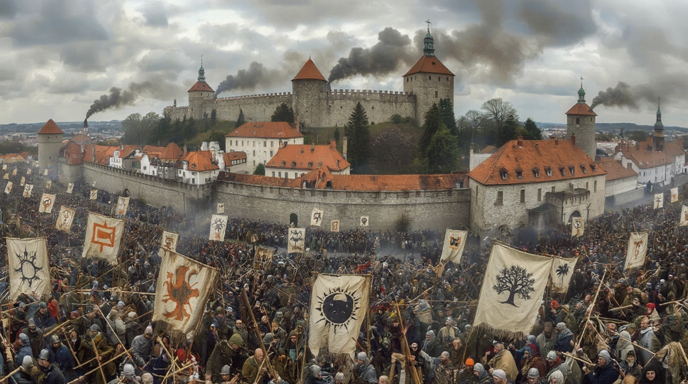
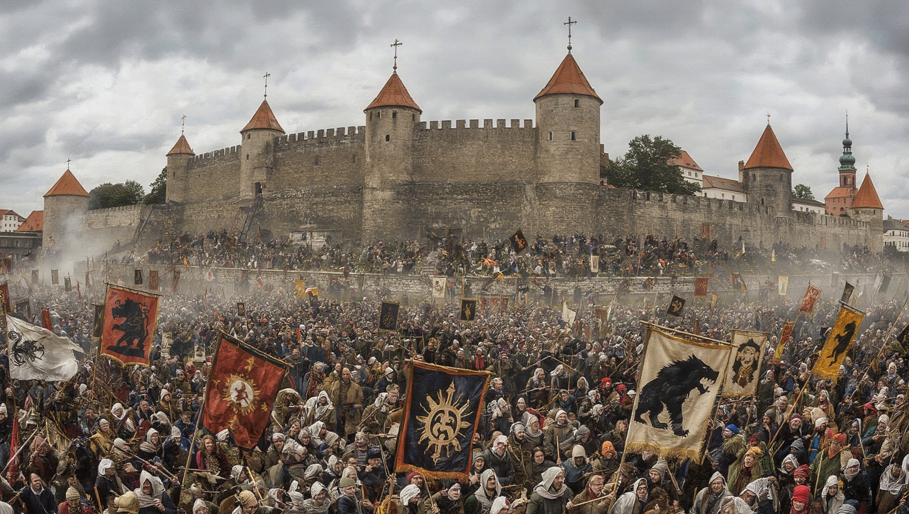
Understanding that their initial success was fragile, the four kings made a shrewd diplomatic move. They sent a delegation to the Swedish bailiffs in Turku and Vyborg, offering to make Reval a Swedish city in exchange for military aid. The Swedes, seeing an opportunity to expand their influence, promised to raise an army and sail for Estonia.

### The Livonian Order's Intervention

The besieged citizens of Reval, unable to defend the city, appealed to the Livonian Order for military aid. The Master of the Order, Burchard von Dreileben, who was on a campaign near the Pskov border, rushed his forces toward Tallinn. To buy time, he invited the four Estonian "kings" to negotiations at Paide Castle. The talks were a ruse. The Master accused the Estonians of murder, a quarrel broke out, and all the envoys were killed.

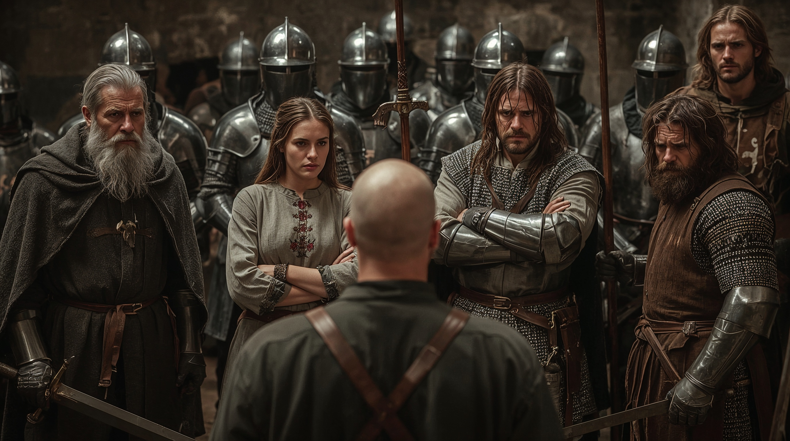

Deprived of their leaders, the rebel army was thrown into disarray. On May 11, a detachment of the Order was defeated by a large Estonian force near Kanavere bog. Master Burchard, however, quickly advanced with his main army. The knights, forced to fight on foot in the marshy terrain, eventually surrounded and overwhelmed the rebels. According to the chronicler Hoeneke, about 1,600 Estonians were killed after surrendering under a promise of mercy.

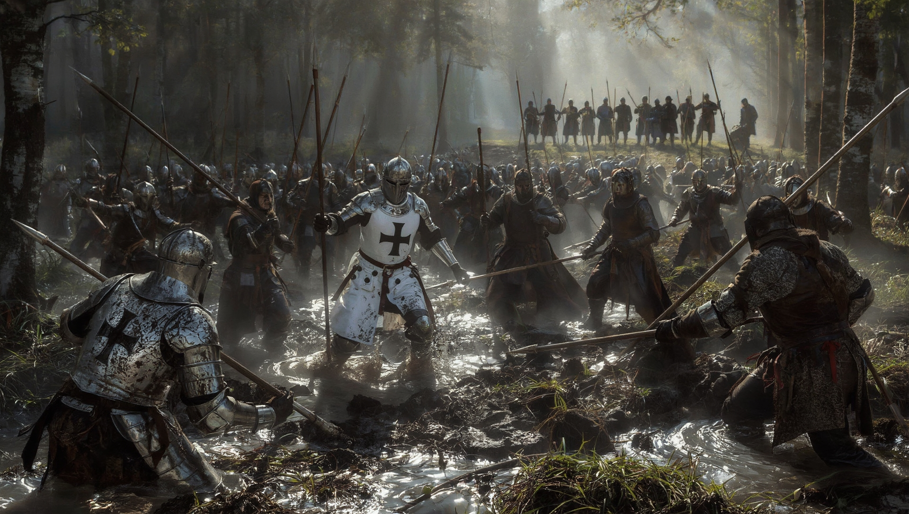

A few days later, on May 14, the Order's army attacked the main rebel camp near Tallinn. Using a similar tactic of feigned negotiations to encircle the enemy, the knights launched a surprise attack and slaughtered over 3,000 Estonians, effectively crushing the rebellion on the mainland.

### The Livonian Order's Intervention

The leaders of the rebellion understood that they could not defeat the Livonian Order alone and sought allies. Envoys were sent to Pskov, Lithuania, and the Swedish bailiffs in Turku and Vyborg. The Swedes, long-time rivals of Denmark, saw an opportunity to gain control of Northern Estonia and offered promises of support.

The besieged citizens of Reval, unable to defend the city, appealed to the Livonian Order for military aid. The Master of the Order, Burchard von Dreileben, who was on a campaign near the Pskov border, rushed his forces toward Tallinn. To buy time, he invited the four Estonian "kings" to negotiations at Paide Castle. The talks were a ruse. The Master accused the Estonians of murder, a quarrel broke out, and all the envoys were killed.

Deprived of their leaders, the rebel army was thrown into disarray. On May 11, a detachment of the Order was defeated by a large Estonian force near Kanavere bog. Master Burchard, however, quickly advanced with his main army. The knights, forced to fight on foot in the marshy terrain, eventually surrounded and overwhelmed the rebels. According to the chronicler Hoeneke, about 1,600 Estonians were killed after surrendering under a promise of mercy.

A few days later, on May 14, the Order's army attacked the main rebel camp near Tallinn. Using a similar tactic of feigned negotiations to encircle the enemy, the knights launched a surprise attack and slaughtered over 3,000 Estonians, effectively crushing the rebellion on the mainland.

### The Role of Foreign Powers

The Estonian rebels actively sought foreign aid, understanding they could not defeat the Order alone.

-   **Sweden**: Envoys were sent to the Swedish bailiffs in Turku and Vyborg. The Swedes, rivals of Denmark, promised support and a fleet did arrive off the coast of Tallinn on May 18-19, 1343. However, by then the Order had already crushed the mainland rebellion. Seeing the Order in full control, the Swedes did not risk a landing and instead concluded a peace treaty.
-   **Pskov**: The rebels also sent envoys to Pskov, a traditional enemy of the Livonian Order. A Pskovian army of 5,000, led by Prince Ivan, did invade the territory of the Bishopric of Dorpat and reached Otepää on May 26, 1343. However, upon learning from local peasants that the uprising in Harju had already been suppressed, they turned back. The Livonian Order's army intercepted them near Vastseliina Castle, and a battle ensued in which both sides claimed victory but suffered losses.
-   **Lithuania**: While the Order was engaged with Pskov, a Lithuanian army appeared near Riga. However, they retreated quickly upon learning that the Order's main forces were returning.

The Order's swift and decisive action effectively neutralized the threat from all potential allies of the Estonian rebels.

#### The Attempt on Viljandi Castle

The chronicler Renner tells of a separate attempt by rebels to seize the formidable Order castle at Viljandi (Fellin). According to the story, the rebels hid inside sacks of rye, which were to be delivered as tribute, hoping to be carried into the castle. However, an Estonian woman, whose son was among the rebels, revealed the plot to the knights in exchange for her son's life. The knights intercepted the delivery, and the rebels hidden in the sacks were thrown into the castle's dungeon, where they all perished.

### The Uprising on Saaremaa (Ösel)

On July 24, 1343, the rebellion reignited on the island of Saaremaa. The islanders killed their German lords, drowned the priests, and besieged the castle of Pöide. The garrison surrendered on the condition of free passage, but the Estonians broke their promise and killed all the defenders.

The islanders, led by their "king" Vesse, began constructing a large fortress at Karja, knowing the Order lacked a fleet to cross the strait until winter. In February 1344, the Order's army, reinforced by troops from Prussia, crossed the frozen sea. After ravaging the island, they besieged the Karja fortress. Using siege engines, the knights breached the walls and stormed the stronghold, killing around 2,000 rebels. Their leader, Vesse, was captured and executed. The Order departed before the ice melted, securing a promise of submission from the island elders.

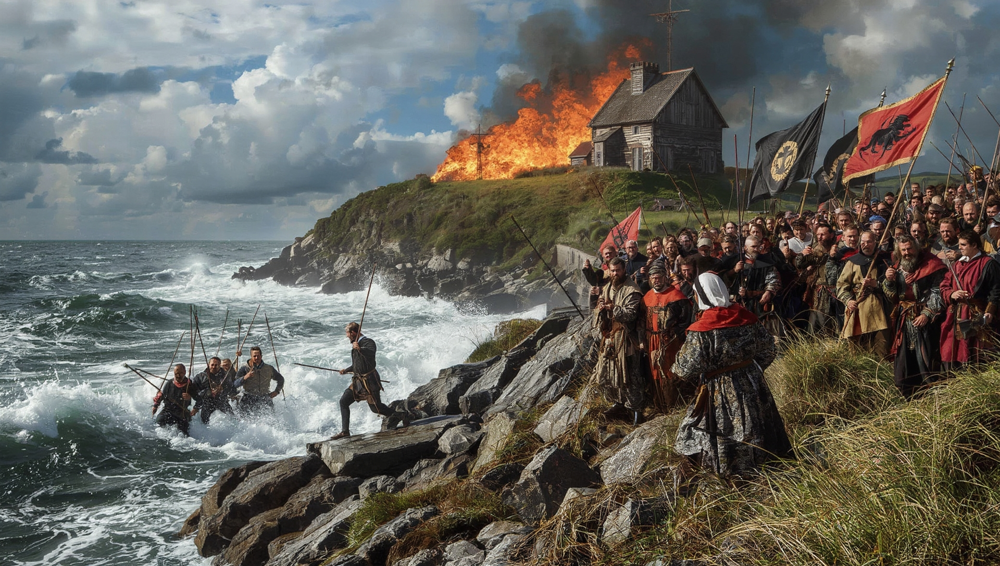

The final pacification of Saaremaa occurred in the winter of 1345. The Order returned, and through a campaign of terror, forced the islanders to surrender. They were made to demolish their fortresses and hand over their weapons. To ensure control, the Order began construction of Maasilinna Castle (Soneburg), the "castle of atonement."

### Key Battles and Events

-   **Padise Monastery Massacre** (April 1343): The rebels attack and burn the monastery, killing the monks.
    -   *Location*: Padise, Harju County
-   **Siege of Reval** (April-May 1343): Estonian forces lay siege to the Danish-controlled city.
    -   *Location*: Reval (Tallinn)
-   **Siege of Haapsalu Castle** (1343): Rebels in Läänemaa besiege the seat of the Bishop of Ösel-Wiek.
    -   *Location*: Haapsalu, Läänemaa
-   **Paide "Negotiations"** (May 1343): The four Estonian "kings" are executed by the Livonian Order during supposed peace talks.
    -   *Location*: Paide Castle
-   **Battle of Kanavere Bog** (May 11, 1343): An initial rebel victory is followed by a crushing defeat at the hands of the main Order army.
    -   *Location*: Kanavere, Harju County
-   **Battle of Sõjamäe** (May 14, 1343): The decisive battle where the main rebel army on the continent is destroyed.
    -   *Location*: Near Lake Ülemiste, Tallinn
-   **Siege of Pöide Castle** (July 1343): Rebels on Saaremaa capture and destroy the Order's fortress.
    -   *Location*: Pöide, Saaremaa
-   **Battle of Karja Fortress** (February 1344): The Order storms the main rebel stronghold on Saaremaa, killing their leader, Vesse.
    -   *Location*: Karja, Saaremaa

### Key Locations of the Era

-   **Reval (Tallinn)**: The main fortified city and administrative center of Danish Estonia, a key member of the Hanseatic League.
-   **Toompea Castle (Castrum Danorum)**: The seat of Danish power in Reval.
-   **Padise Monastery**: A Cistercian monastery that was a significant landholder and a target of the rebellion.
-   **Paide Castle (Wittenstein)**: A major stronghold of the Livonian Order, where the Estonian leaders were executed.
-   **Haapsalu Castle (Hapsal)**: The main residence of the Bishop of Ösel-Wiek.
-   **Pöide Castle (Peude)**: The Livonian Order's fortress on the island of Saaremaa.
-   **Karja Fortress**: A purpose-built rebel stronghold on Saaremaa.
-   **Maasilinna Castle (Soneburg)**: The "castle of atonement" built by the Order on Saaremaa after the uprising was crushed.
-   **Viljandi Castle (Fellin)**: A powerful Order castle that was the target of a failed rebel infiltration attempt.

## Aftermath and Consequences

The uprising had devastating consequences for the Estonian population. The land was ravaged, and the population was decimated. The chronicler Renner describes Harju as a "desolate and abandoned land" for years afterward.

For Denmark, the rebellion was a final blow to its authority in Estonia. In 1346, King Valdemar IV sold the Duchy of Estonia to the Teutonic Order, which in turn handed it over to the Livonian Order a year later. This consolidated the power of the German knights in the region for centuries to come.

The Novgorod First Chronicle records the event as follows: "In the year 6852 (1344), there was a great rebellion beyond Narva: the Chud [Estonians] killed their own boyars, 300 of them, in the land of Kolyvan and the parish of Rugodiv. Then the Velnezites with the Yurievites went and killed 14,000 of the Chud, and the rest fled to the land of Ostrov. The Velnezites pursued them into the land of Ostrov, but did not capture them, and were themselves beaten and retreated."

## Historiography and Legacy

The St. George's Night Uprising remains a powerful symbol of Estonian resistance and a testament to the enduring desire for self-determination. While Soviet-era historiography emphasized the class struggle aspect of the rebellion against feudal oppressors, modern Estonian historiography often frames it as a national liberation movement against foreign rule.

In memory of the uprising, a park was established in the Lasnamäe district of Tallinn. The Jüriöö Park (St. George's Night Park) features a memorial depicting a warrior's sword rising from a hill, symbolizing the start of the rebellion. The main primary sources for the events of the uprising are the *Younger Livonian Rhymed Chronicle* by Bartholomäus Hoeneke and the chronicles of Wigand of Marburg and Hermann von Wartberge.

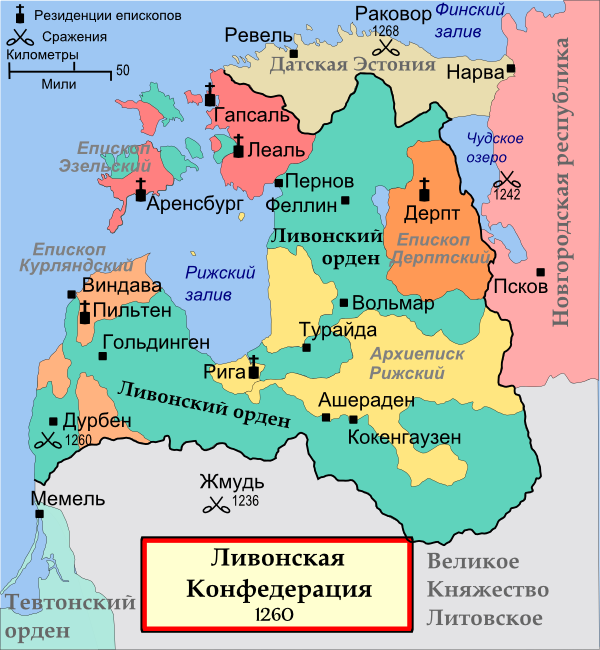

### Appendix: On Witch Hunts

While the great European witch hunts that swept across the continent from the 15th to the 18th centuries had not yet begun in 1343, the seeds of this conflict were already sown in the soil of 14th-century Estonia. The game's setting provides a glimpse into the precursor tensions that would later explode into widespread persecution.

The core of the conflict was the clash between the encroaching German-led Christian order and the resilient pagan traditions of the Estonian people. The Livonian Order and the Catholic Church viewed local healers, wise women, and folk practitioners with deep suspicion, seeing their ancient customs not as cultural heritage, but as demonic superstition. Accusations of "witchcraft" or "sorcery" became a convenient and powerful tool for social and religious control, a way to eliminate influential local figures and suppress dissent.

This tension was often intertwined with economic motives. A classic example is the brewing of beer. For centuries, brewing was the domain of women ("alewives"), who produced traditional ales in their homes for their families and for local sale. As monasteries and feudal lords sought to monopolize this lucrative trade, accusations of witchcraft could be weaponized to discredit and eliminate female competitors, framing their traditional herbal brews as "potions" and their cauldrons as tools of dark magic. In "Reval Rebel," this simmering conflict provides a rich source of quests and narrative, exploring a time when the lines between faith, folklore, and fear were dangerously blurred.

### Appendix: Notable Figures of the Era (1343)

A list of influential individuals who were alive in the year 1343, including artists, writers, thinkers, and rulers who shaped the cultural and political landscape of the 14th century. This list provides context on the key players of the time, some of whom had a direct or indirect influence on the events surrounding the St. George's Night Uprising.

#### Artists & Architects
1.  **Ambrogio Lorenzetti (c. 1290–1348):** An Italian painter of the Sienese school, known for his frescoes *The Allegory of Good and Bad Government*.
2.  **Pietro Lorenzetti (c. 1280–1348):** Brother of Ambrogio, also a prominent painter of the Sienese school.
3.  **Taddeo Gaddi (c. 1300–1366):** A pupil of Giotto, he was a leading painter and architect in Florence.
4.  **Maso di Banco (c. 1300–1350):** A Florentine painter, considered one of the most important followers of Giotto.
5.  **Andrea Pisano (c. 1290–1348):** A sculptor and architect, known for his work on the Baptistery in Florence.
6.  **Jean Pucelle (c. 1300–1355):** A Parisian Gothic manuscript illuminator.
7.  **Гойтан (Goytan) (fl. 1345):** A Russian icon painter active in the mid-14th century. Mentioned in historical records in 1345, he worked under the patronage of Simeon the Proud, the Grand Prince of Moscow. His work is representative of the Russian iconographic tradition during the rise of the Grand Duchy of Moscow.
#### Writers, Poets & Composers
8.  **Petrarch (Francesco Petrarca) (1304–1374):** An Italian scholar and poet, considered the "Father of Humanism."
9.  **Giovanni Boccaccio (1313–1375):** An Italian writer, poet, and humanist, author of the *Decameron*.
10. **Geoffrey Chaucer (c. 1343–1400):** The "Father of English literature," born in this very year.
11. **Guillaume de Machaut (c. 1300–1377):** A French poet and composer, a key figure in the *Ars Nova* musical style.
12. **Hafiz-i Shirazi (c. 1325–1390):** A Persian lyric poet whose collected works are regarded as a pinnacle of Persian literature.
13. **Juan Ruiz, Archpriest of Hita (c. 1283–c. 1350):** A Castilian poet, author of *The Book of Good Love*.

#### Thinkers & Philosophers
13. **William of Ockham (c. 1287–1347):** An English Franciscan friar, scholastic philosopher, and theologian, known for the principle of Ockham's razor.
14. **Nicole Oresme (c. 1323–1382):** A French philosopher, economist, mathematician, and physicist who made significant contributions to science.
15. **Jean Buridan (c. 1300–c. 1358):** A French priest and philosopher who developed the theory of impetus, a key step toward modern dynamics.
16. **Ibn Khaldun (1332–1406):** An Arab sociologist, philosopher, and historian, considered a forerunner of modern sociology, historiography, and economics.
17. **Giovanni Dondi dell'Orologio (1330–1388):** An Italian physician, astronomer, and clockmaker who designed the Astrarium, a complex astronomical clock.
18. **Levi ben Gershon (Gersonides) (1288–1344):** A French-Jewish philosopher, Talmudist, mathematician, and astronomer.
19. **Richard Rolle (c. 1300–1349):** An English mystic and religious writer whose works in Middle English made complex theology accessible.
20. **Simon Tunsted (d. 1369):** An English Franciscan friar, theologian, and musician who wrote on music theory and revised astronomical instruments.

#### Travelers & Explorers
21. **Ibn Battuta (1304–1369):** A Moroccan scholar and explorer who traveled extensively through Africa, the Middle East, and Asia, documenting his journeys.
22. **John Mandeville (Author):** The pseudonymous author of *The Travels of Sir John Mandeville*, a highly influential (though partly fictional) travel narrative.

#### Rulers & Political Figures
23. **Valdemar IV Atterdag (c. 1320–1375):** King of Denmark, a central figure in the St. George's Night Uprising.
24. **Magnus IV Eriksson (1316–1374):** King of Sweden, Norway, and Scania.
25. **Edward III of England (1312–1377):** King of England, whose reign saw the beginning of the Hundred Years' War.
26. **Philip VI of France (1293–1350):** King of France, the first of the House of Valois.
27. **Louis IV, Holy Roman Emperor (1282–1347):** Emperor of the Holy Roman Empire.
28. **Jani Beg Khan (d. 1357):** Khan of the Golden Horde.
29. **Emperor Go-Murakami (1328–1368):** Emperor of Japan's Southern Court during the Nanboku-chō period.
30. **Casimir III the Great (1310–1370):** King of Poland, who oversaw a period of great prosperity and reform.

#### Eastern Rulers & Figures
31. **Semyon Ivanovich (Simeon the Proud) (1316–1353):** Grand Prince of Moscow and Grand Prince of Vladimir. As the leader of the rising power of Moscow, he exerted significant influence over the neighboring Novgorod Republic, continuing his father's policy of consolidating power.
32. **Prince Ivan of Pskov (fl. 1343):** A prince of the Pskov Republic who, according to chronicles, led a 5,000-strong army to support the Estonian rebels during the uprising.

### Scholars & Scientists

A list of influential thinkers, scholars, and scientists who were alive in the year 1343, shaping the intellectual landscape of the 14th century.

34. **Berthold Schwarz (fl. 14th century):** A legendary German alchemist and Franciscan monk, often credited with the invention or independent discovery of gunpowder in Europe. While his historical existence is debated, with some scholars considering him a symbolic figure, he is said to have been active in the 14th century. His work, whether real or allegorical, represents the arrival of gunpowder technology in Europe, a development that would fundamentally change warfare and society.
35. **Albert of Saxony (c. 1320–1390):** A German philosopher and mathematician known for his contributions to logic and physics. He was a key figure in the spread of Parisian natural philosophy.
36. **Isaac Argyros (c. 1310–c. 1375):** A Byzantine monk, mathematician, and astronomer who wrote treatises on arithmetic, geometry, and astronomy.
37. **Immanuel ben Jacob Bonfils (c. 1300–1377):** A French-Jewish mathematician and astronomer who developed influential astronomical tables known as the "Six Wings."
38. **Thomas Bradwardine (c. 1300–1349):** An English mathematician, philosopher, and theologian at Oxford, known for his work on the mean speed theorem. He was a member of the Oxford Calculators.
39. **Paolo Dagomari (c. 1282–1374):** An Italian mathematician, astronomer, and astrologer in Florence, known as "Paul the Calculator."
40. **John Dumbleton (c. 1310–c. 1349):** An English philosopher, logician, and natural philosopher at Merton College, Oxford. He was a key member of the Oxford Calculators.
41. **Jamal al-Din Sa'id al-Turkistani (14th century):** A Persian astronomer and mathematician.
42. **Giovanni di Casali (d. c. 1375):** A Franciscan friar and natural philosopher who taught at Cambridge and is known for his work on the kinematics of accelerated motion.
43. **Ali al-Jurjani (1339–1414):** A Persian polymath, logician, and theologian.
44. **Ibn al-Shatir (1304–1375):** An Arab astronomer, mathematician, and engineer from Damascus who developed non-Ptolemaic models of planetary motion.
45. **Madhava of Sangamagrama (c. 1340–c. 1425):** An Indian mathematician and astronomer who founded the Kerala school of astronomy and mathematics.
46. **Jean de Muris (c. 1290–c. 1350):** A French music theorist, mathematician, and astronomer.
47. **Oxford Calculators (14th century):** A group of thinkers at Merton College, Oxford, including Thomas Bradwardine, William Hytesbury, John Dumbleton, and Richard Swineshead, who used a logical and mathematical approach to philosophical problems.
48. **Nicole Oresme (c. 1323–1382):** A French philosopher, economist, and mathematician who made significant contributions to a wide range of fields and was one of the most original thinkers of the 14th century.
49. **Peter of Denmark (14th century):** A Danish mathematician and astronomer known for his work on astronomical instruments.
50. **Richard Swineshead (fl. c. 1340–1354):** An English mathematician and natural philosopher, famous for his work on kinematics and a member of the Oxford Calculators.
51. **William Hytesbury (c. 1313–1372):** An English philosopher and logician, a prominent member of the Oxford Calculators.
