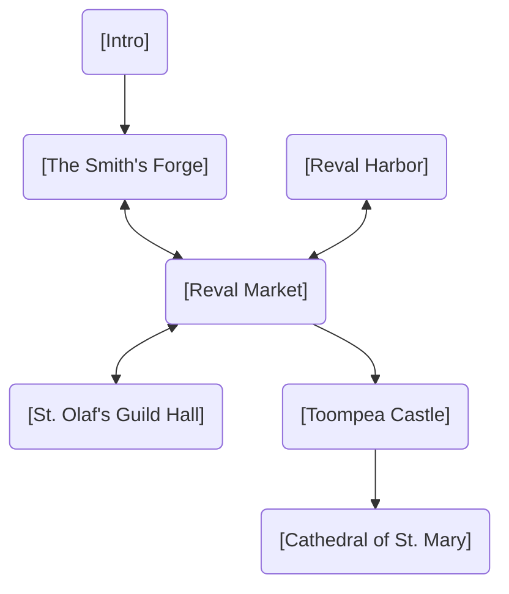
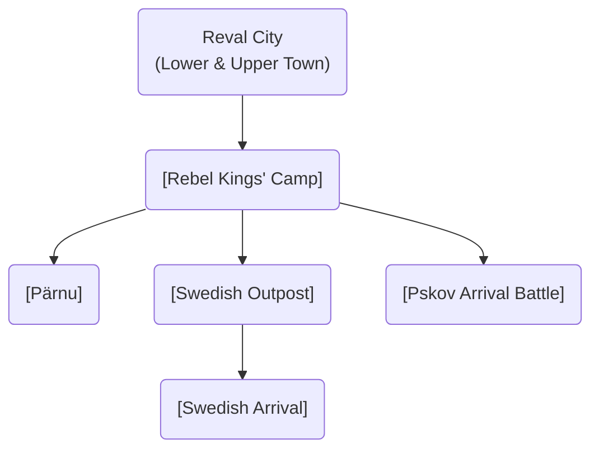
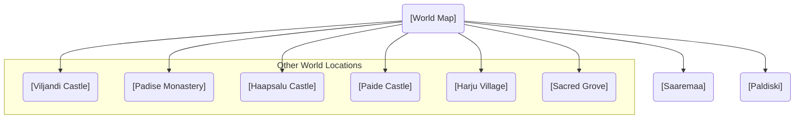

# Scenes

This directory contains all the game scenes, organized by their location and purpose.

### Scene Flow

These diagrams illustrate the relationships and progression between the major game locations, split by chapter. **Click on a node to view its detailed description.**

#### Chapter 1: The Simmering City

#### Chapter 2: The Fire of Rebellion

#### Chapter 3 & World Map

## Scene Index

### System & Menu
- [Main Menu](./menu/main_menu.md)
- [Introduction](./intro/intro.md)
- [World Map](./map/map.md)

### Reval (Tallinn)
#### Lower Town
- [The Smith's Forge](./lower_town/the_smiths_forge.md)
- [Reval Harbor](./lower_town/harbor.md)
- [Reval Market](./lower_town/market.md)
- [St. Olaf's Guild Hall](./lower_town/st_olafs_guild_hall.md)

#### Upper Town (Toompea)
- [Toompea Castle](./upper_town/toompea_castle.md)
- [Cathedral of Saint Mary](./upper_town/cathedral_of_saint_mary.md)

### World Locations
- [Haapsalu Castle](./world/haapsalu_castle.md)
- [Harju Village](./world/harju_village.md)
- [Karja Fortress](./world/karja_fortress.md)
- [Maasilinna Castle](./world/maasilinna_castle.md)
- [Padise Monastery](./world/padise_monastery.md)
- [Paide Castle](./world/paide_castle.md)
- [Pöide Castle](./world/poide_castle.md)
- [Sacred Grove](./world/sacred_grove.md)
- [Viljandi Castle](./world/viljandi_castle.md)

### Event Locations
- [Paldiski](./events/paldiski.md)
- [Pärnu](./events/pernau.md)
- [Pskov Arrival Battle](./events/pskov_arrival_battle.md)
- [Rebel Kings' Camp](./events/rebel_kings.md)
- [Saaremaa](./events/saaremaa.md)
- [Swedish Outpost](./events/swedesh_outpost.md)
- [Swedish Arrival](./events/swedish_arrival.md)
