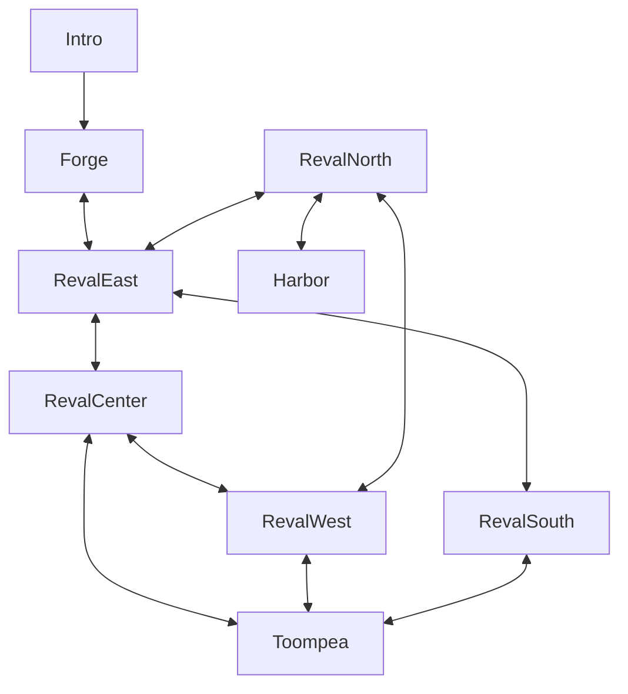
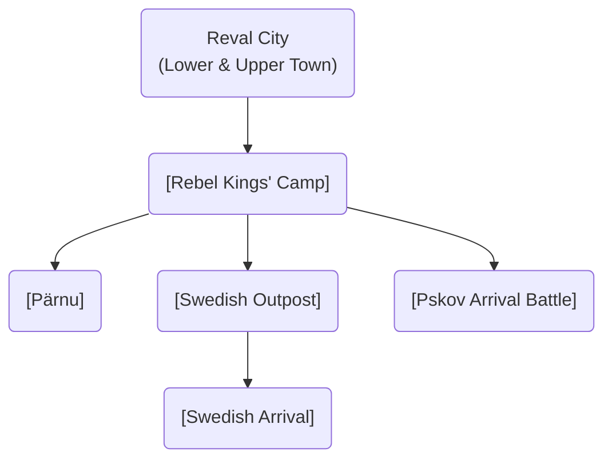
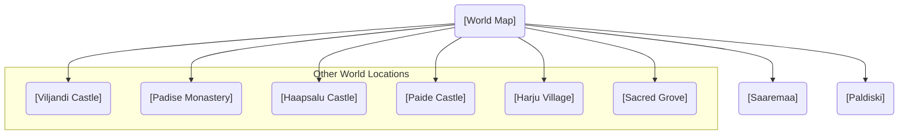

# Scenes

This directory contains all the game scenes, organized by their location and purpose.

### Scene Flow

These diagrams illustrate the relationships and progression between the major game locations, split by chapter. **Click on a node to view its detailed description.**

#### Chapter 1: The Simmering City

## Scene Index

### System & Menu
- [Main Menu](./menu/main_menu.md)
- [Introduction](./intro/intro.md)
- [World Map](./map/map.md)

### Reval (Tallinn)

## City Wall and Towers
- 1. 🚪 Nun's Gate (north-west, demolished later)
- 2. 🧱 **Nun's Tower** (Nunnatorn, 14th century)
- 3. 🧱 **Sauna Tower** (14th century)
- 3. 🧱 **Golden Foot Tower** (Kuldjala, 14th century)
- 4. 🧱 Nunnadetagune tower
- 6. 🧱 Loewenschede torn (1373)
- 7. 🧱 Lippe torn (demolished)
- 8. 🧱 Köismäe torn (1360)
- 9. 🧱 Plate torn (1401)
- 10. 🧱 [Eppingi Tower](./lower_town/eppingi_tower.md) (1370)
- 11. 🧱 Grusbeke-tagune torn
- 12. 🧱 [Renteni Tower](./lower_town/renteni_tower.md) (1340)
- 13. 🧱 Wulfardi-tagune torn (1370)
- 14. 🚪 [Great Coast Gate](revel_central_quarter/harbor_quarter/great_coast_gate.md) (1359, Strantporte, north)
- 15. 🧱 [Stoltingi Tower](./lower_town/stoltingi_tower.md) (1410)
- 16. 🧱 [Hattorpe-tagune Tower](./lower_town/hattorpe_tagune_tower.md) (1410)
- 17. 🧱 Russian (demolished)
- 18. 🚪 Small harbour gate
- 19. 🧱 [Bremeni Tower](./lower_town/bremeni_tower.md)
- 20. 🧱 Munkadetagune form
- 21. 🧱 Hellemani torn
- 22. 🚪 [Viru Gate](revel_walls_towers/viru_gate.md) (14th century, east)
- 23. 🧱 Hinke tower
- 24. 🧱 [Kuradiema Tower](./lower_town/kuradiema_tower.md)
- 25. 🚪 Karjavärav
- 26. 🧱 [Assauwe Tower](./lower_town/assauwe_tower.md)
- 27. 🚪 [Harju Gate](revel_walls_towers/harju_gate.md) (1355, south)
- 28. 🧱 Zeghen tower (Kitsetorn, 1413)
- 29. Kiek in de Kok (anachronistic)
- 30. 🧱 [Maiden's Tower (Neitsitorn, Megede torn)](revel_walls_towers/maidens_tower.md) (1370-1373)
- 31. 🧱 Horse tower (Tallitorn)
- 32. 🚪 [Lühike Jalg (Short Leg) Gate](revel_walls_towers/luhike_jalg_gate.md) (aka swedish gates)
- 33. 🚪 Long Leg Gate (center, connects lower/upper towns)
- 34. 🧱 Seegitagune torn (1450, demolished)
- 35. 🧱 Saunatagune torn

#### Lower Town

- [EAST](./revel_east/) 
    - 🏠 [FORGE](./revel_east/forge/forge.md)
    - ⛪️ [Dominican Monastery of St. Catherine](revel_east_quarter_monastery/dominican_monastery.md) (late 1240s)
    - Tavern

- [NORTH](./revel_north_oleviste/)
    - ⚓️ [Reval Harbor](./lower_town/harbor.md)
    - 🏠 [Seamen's Inn](revel_central_quarter/harbor_quarter/seamens_inn.md)
    - 🏠 [Warehouses](revel_central_quarter/harbor_quarter/warehouses.md)
    - ⛪️ [St. Olaf's Church (Oleviste kirik)](revel_north_west_quarter_merchants/st_olafs_church.md) (1267)

- [CENTER](./revel_central_quarter/)
    - ⚓️ [Reval Market](./lower_town/market.md)
    - ⚓️ [Town Hall Square (Raekoja plats)](revel_central_quarter/market_civic_quarter/town_hall_square.md)
    - 🏛️ [Town Hall (Raekoda)](revel_central_quarter/market_civic_quarter/town_hall.md) (1322)
    - ⛪️ [Church of the Holy Spirit (Püha Vaimu kirik)](revel_central_quarter/market_civic_quarter/church_of_the_holy_spirit.md) (before 1319)
    - ⛓️ [City Jail](revel_central_quarter/city_jail.md)
    - ⚕️ [Town Council's Apothecary (Raeapteek)](revel_central_quarter/apothecary.md) (1422)
    - 🍻 [Eating Establishments](revel_central_quarter/eating_establishments.md)
    

- [WEST](./revel_north_west_quarter_merchants/)
    - ⚓️ [Pikk Street](revel_north_west_quarter_merchants/pikk_street.md)
    - ⛪️ [St. Michael's Cistercian Nunnery (Mihkli klooster)](revel_central_quarter/st_michaels_nunnery.md) (1249)
    - 🏛️ [Great Guild Hall](revel_north_west_quarter_merchants/great_guild_hall.md) (1410)
    - 🏛️ [St. Olaf's Guild Hall](./revel_north_west_quarter_merchants/great_guild_hall.md) (1422)
    - 🏛️ [Brotherhood of Blackheads House](revel_north_west_quarter_merchants/brotherhood_of_blackheads_house.md) (1399)

- [SOUTH]
    - 💧 [Rataskaev Well](revel_south_quarter_niguliste/rataskaev_well.md)
    - ⛪️ [St. Nicholas' Church (Niguliste kirik)](revel_east_quarter_monastery/st_nicholas_church.md) (1230)    
    - 🏥 [Jaani Hospital (Leprosorium)](./world/jaani_hospital.md) (early 13th century)
    - ⚔️ [Knights' Quarters](revel_south_quarter_niguliste/knights_quarters.md)
    - 🌳 [Danish King's Garden](./upper_town/danish_kings_garden.md)

??
- 🐴 [Horse Mill (Hobuveski)](revel_central_quarter/horse_mill.md) (1379) ??
- 💧 [Sewer System](revel_central_quarter/sewer_system.md)

#### Upper Town (Toompea), west
- 🏰 [Toompea Castle](revel_west_toompea/domberg/domberg.md) (~1050)
- ⛪️ [Cathedral of Saint Mary](revel_west_toompea/cathedral_of_saint_mary/cathedral_of_saint_mary.md) (1233)
- 🎓 [Dome School (Toompea Kool)](revel_west_toompea/dome_school/dome_school.md) (13th century)

### World Locations (TODO)

Denmark
- Rakvere Castle (!)

Bishopric of Ösel–Wiek - Hermann II Osenbrügge as bishop
- [Haapsalu Castle](./world/haapsalu_castle.md) (!)
- Leal Castle (Lihula)

Dorpat bishop
- Dorpat Castle (Tartu)

Livonian order:
- Pernau Castle (Pärnu)
- [Fellin Castle](./world/viljandi_castle.md) (Viljandi)
- Põltsamaa Castle (!)
- [Paide Castle](./world/paide_castle.md)
- Hermann Castle (Narva)
- [Pöide Castle](./world/poide_castle.md) (saaremaa)
- Karkus-Nuija (Karksi-Nuia)
- [Harju Village](./world/harju_village.md)
- [Karja Fortress](./world/karja_fortress.md)
- [Maasilinna Castle](./world/maasilinna_castle.md)
- [Padise Monastery](world/padise/padise_monastery.md)
- Helme Castle
- [Sacred Grove](./world/sacred_grove.md)
- Koluvere Castle
- Vastseliina Castle

### Event Locations
- [Paldiski](./events/paldiski.md)
- [Pärnu](./events/pernau.md)
- [Pskov Arrival Battle](./events/pskov_arrival_battle.md)
- [Rebel Kings' Camp](./events/rebel_kings.md)
- [Saaremaa](./events/saaremaa.md)
- [Swedish Outpost](./events/swedesh_outpost.md)
- [Swedish Arrival](./events/swedish_arrival.md)

#### Chapter 2: The Fire of Rebellion

#### Chapter 3 & World Map

