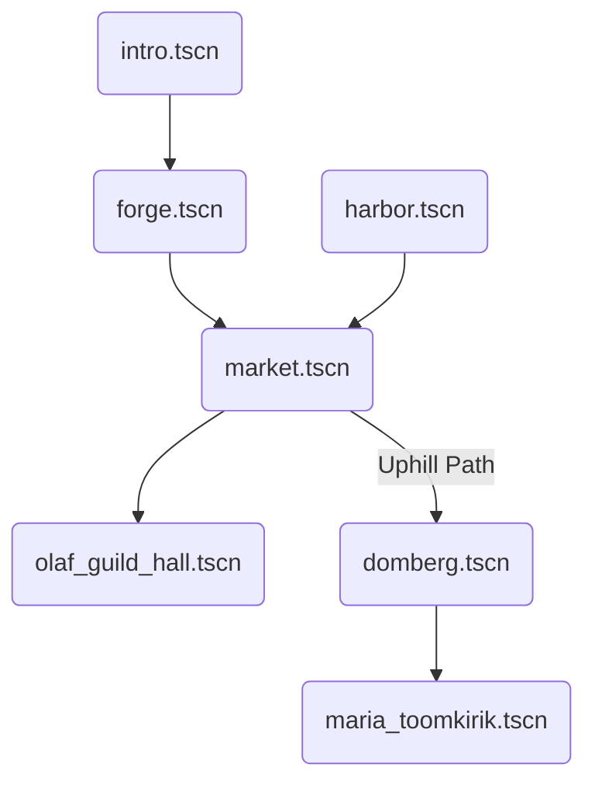
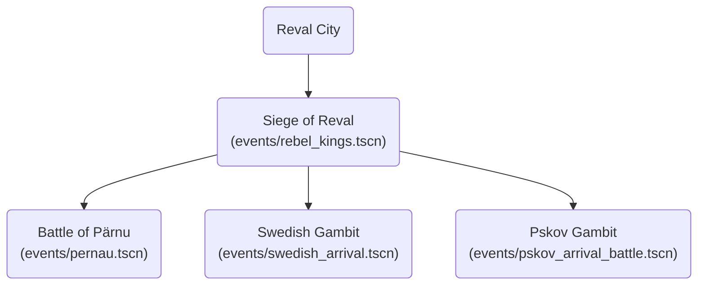
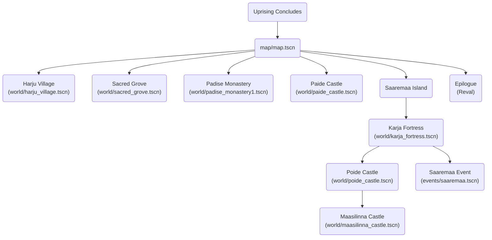

# Scenes

This directory contains all the game scenes, organized by their location and purpose.

### Scene Flow

#### Chapter 1: Reval

#### Chapter 2: The Uprising

#### Chapter 3 & Epilogue

## Intro
Scenes related to the game's introduction.

- `intro/intro.tscn`: The main intro scene.

## Reval (Tallinn)
The main city, divided into the Lower and Upper Town.

### Lower Town
The bustling commercial center of Reval.

- `forge.tscn`: The blacksmith's forge.
- `harbor.tscn`: The main harbor.
- `market.tscn`: The town market.
- `olaf_guild_hall.tscn`: The Guild Hall of St. Olaf.

### Upper Town (Toompea)
The administrative and religious center, seat of the Danish Viceroy and the Bishop.

- `domberg.tscn`: Toompea Hill, representing the castle area.
- `maria_toomkirik.tscn`: St. Mary's Cathedral.

## World
Locations outside of Reval, representing key historical sites across Estonia.

- `harju_village.tscn`: A generic village in Harju county.
- `sacred_grove.tscn`: A pagan worship site.
- `karja_fortress.tscn`: The rebel fortress on Saaremaa.

### Order
- `padise_monastery1.tscn` & `padise_monastery2.tscn`: The Cistercian monastery at Padise.
- `haapsalu_castle.tscn`: The Bishop's castle at Haapsalu (Hapsal).
- `paide_castle.tscn`: The Livonian Order's stronghold at Paide (Wittenstein).
- `poide_castle.tscn`: The Order's fortress on Saaremaa (Peude).
- `viljandi_castle.tscn`: The Order's powerful castle at Viljandi (Fellin).
- `maasilinna_castle.tscn`: The "castle of atonement" on Saaremaa (Soneburg).

## Events
Special event scenes related to the main questline.

- `paldiski.tscn`: An event related to the port town of Paldiski.
- `pernau.tscn`: An event in the Hanseatic city of Pärnu.
- `rebel_kings.tscn`: A scene involving the four Estonian kings.
- `saaremaa.tscn`: A key event on the island of Saaremaa.
- `swedesh_outpost.tscn`: An encounter at a Swedish outpost.
- `swedish_arrival.tscn`: A scene depicting the arrival of the Swedish fleet.
- `pskov_arrival_battle.tscn`: A scene for the arrival of the Pskovian army and their subsequent battle with the Order.
