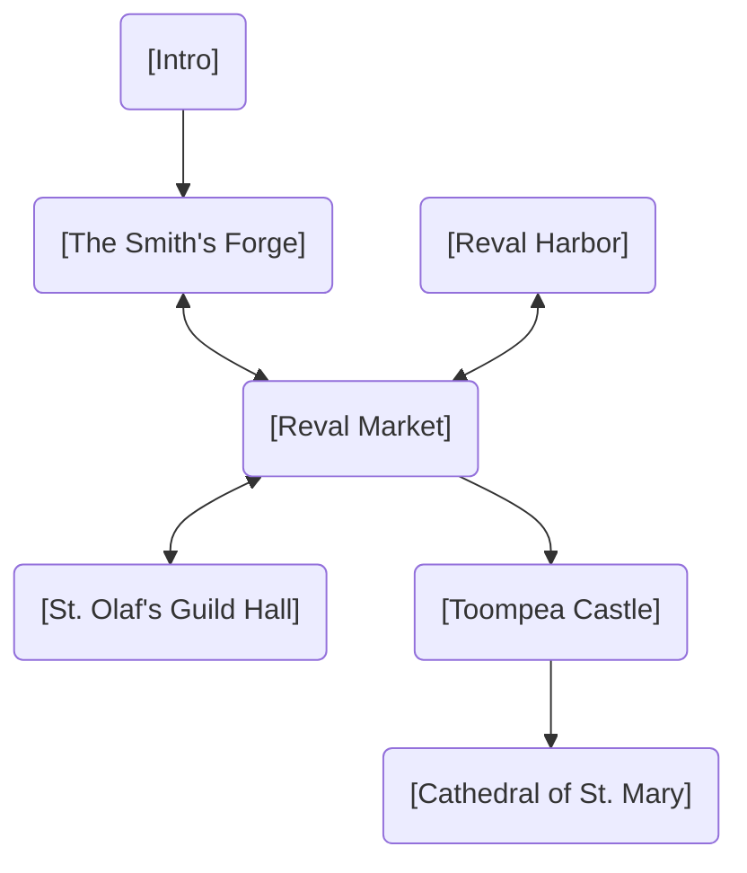
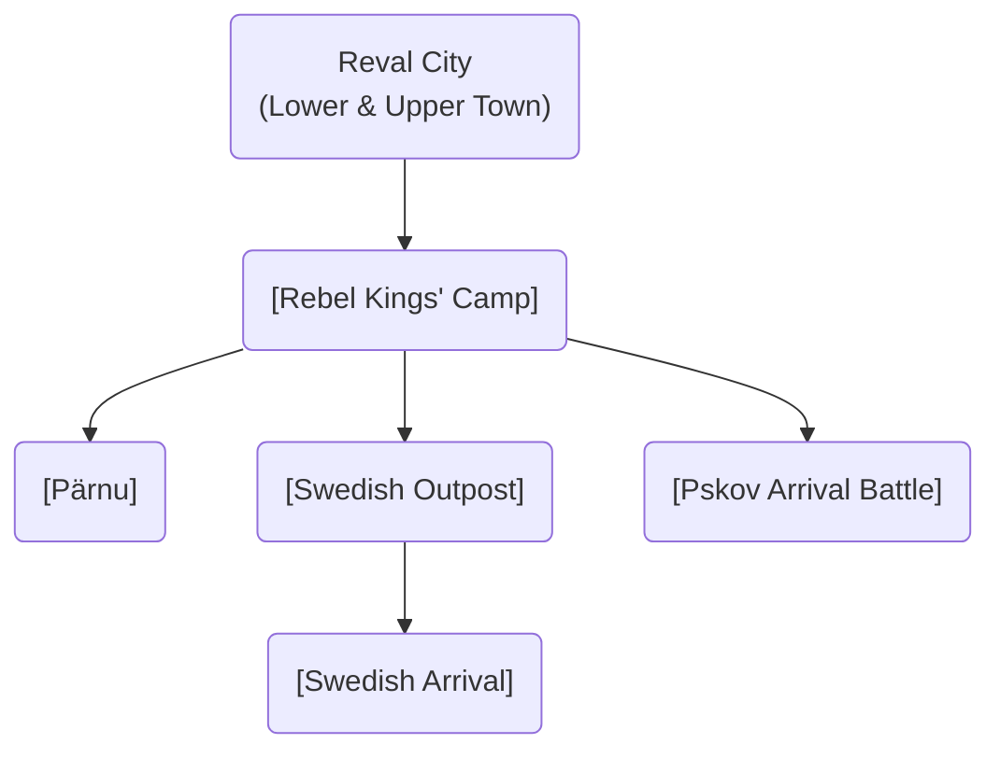
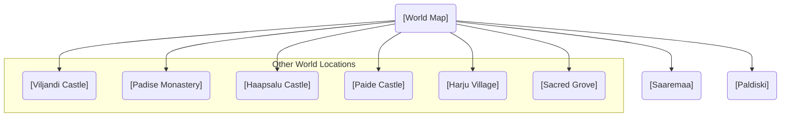
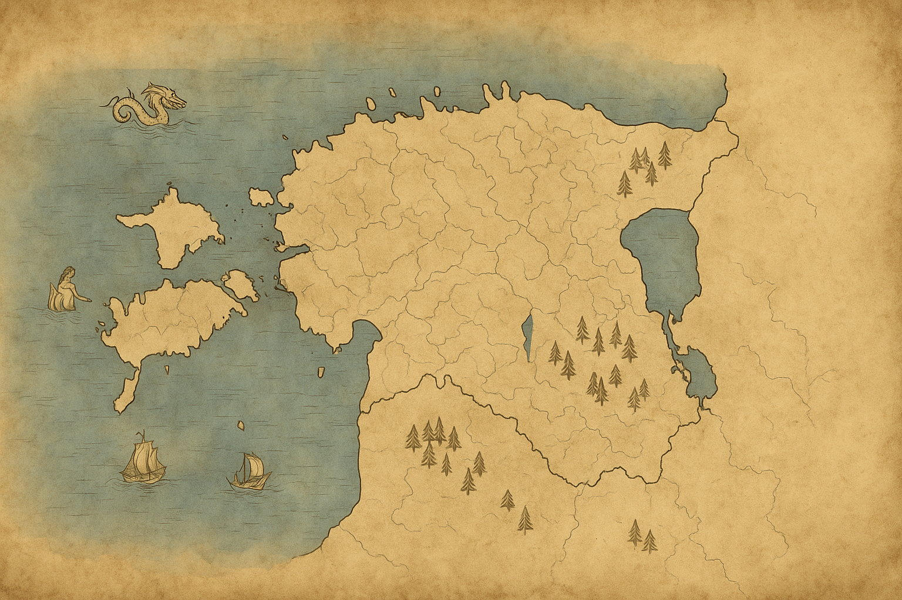

# Scenes

This directory contains all the game scenes, organized by their location and purpose.

### Scene Flow

These diagrams illustrate the relationships and progression between the major game locations, split by chapter. **Click on a node to view its detailed description.**

#### Chapter 1: The Simmering City

#### Chapter 2: The Fire of Rebellion

#### Chapter 3 & World Map

## Scene Index

### System & Menu
- [Main Menu](./menu/main_menu.md)
- [Introduction](./intro/intro.md)
- [World Map](./map/map.md)

### Reval (Tallinn)
#### Lower Town

**Harbor Quarter** (north)
- 🧱 [Great Coast Gate](./lower_town/harbor_quarter/great_coast_gate.md) (1359)
- ⚓️ [Reval Harbor](./lower_town/harbor.md)
- 🏠 [Seamen's Inn](./lower_town/harbor_quarter/seamens_inn.md)
- 🏠 [Warehouses](./lower_town/harbor_quarter/warehouses.md)

**Guild & Merchant Quarter** (center)
- 🧱 Hinke tower
- 🧱 Nunnatorn tower
- ⚓️ [Reval Market](./lower_town/market.md)
- ⚓️ [Town Hall Square (Raekoja plats)](./lower_town/market_civic_quarter/town_hall_square.md)
- 🏛️ [Town Hall (Raekoda)](./lower_town/market_civic_quarter/town_hall.md) (1322)
- ⛪️ [Church of the Holy Spirit (Püha Vaimu kirik)](./lower_town/market_civic_quarter/church_of_the_holy_spirit.md) (before 1319)
- 🏛️ [Great Guild Hall](./lower_town/guild_merchant_quarter/great_guild_hall.md) (1410)
- 🏛️ [St. Olaf's Guild Hall](./lower_town/st_olafs_guild_hall.md) (1422)
- 🏛️ [Brotherhood of Blackheads House](./lower_town/guild_merchant_quarter/brotherhood_of_blackheads_house.md) (1399)
- ⚓️ [Pikk Street](./lower_town/guild_merchant_quarter/pikk_street.md)
- 💧 [Rataskaev Well](./lower_town/rataskaev_well.md)
- ⛪️ [Dominican Monastery of St. Catherine](./lower_town/church_monastery_quarter/dominican_monastery.md) (late 1240s)

**Knights Quarter** (south)
- 🧱 **Nun's Tower** (14th century)
- 🧱 **Sauna Tower** (14th century)
- 🧱 **Golden Foot Tower** (14th century)
- 🧱 [Eppingi Tower](./lower_town/eppingi_tower.md)
- 🧱 [Renteni Tower](./lower_town/renteni_tower.md)
- 🧱 [Bremeni Tower](./lower_town/bremeni_tower.md)
- 🧱 [Stoltingi Tower](./lower_town/stoltingi_tower.md)
- 🧱 [Hattorpe-tagune Tower](./lower_town/hattorpe_tagune_tower.md)
- 🧱 [Kuradiema Tower](./lower_town/kuradiema_tower.md)
- 🧱 [Assauwe Tower](./lower_town/assauwe_tower.md)
- 🧱 [Lühike Jalg (Short Leg) Gate](./lower_town/church_monastery_quarter/luhike_jalg_gate.md)
- 🚪 [Viru Gate](./lower_town/viru_gate.md) (14th century)
- 🚪 [Harju Gate](./lower_town/harju_gate.md) (1355)
- 🧱 Zeghen tower
- 🧱 [Maiden's Tower (Neitsitorn)](./lower_town/maidens_tower.md) (1370-1373)
- 🧱 Horse tower (Tallitorn)

- ⛪️ [St. Nicholas' Church (Niguliste kirik)](./lower_town/church_monastery_quarter/st_nicholas_church.md) (1230)
- 🏠 [The Smith's Forge](./lower_town/the_smiths_forge.md)
- ⛪️ [St. Olaf's Church (Oleviste kirik)](./lower_town/st_olafs_church.md) (1267)
- ⛪️ [St. Michael's Cistercian Nunnery (Mihkli klooster)](./lower_town/st_michaels_nunnery.md) (mid-13th century)
- 🏥 [Jaani Hospital (Leprosorium)](./world/jaani_hospital.md) (early 13th century)
- 🏥 [Church of the Holy Spirit Hospital](./lower_town/holy_spirit_hospital.md) (late 13th century)
- ⚔️ [Knights' Quarters](./lower_town/knights_quarters.md)
- ⛓️ [City Jail](./lower_town/city_jail.md)
- 🐴 [Horse Mill (Hobuveski)](./lower_town/horse_mill.md) (1379)
- ⚕️ [Town Council's Apothecary (Raeapteek)](./lower_town/apothecary.md) (1422)
- 🍻 [Eating Establishments](./lower_town/eating_establishments.md)
- 💧 [Sewer System](./lower_town/sewer_system.md)

#### Upper Town (Toompea), west
- 🏰 [Toompea Castle](upper_town/domberg/domberg.md) (~1050)
- 🌳 [Danish King's Garden](./upper_town/danish_kings_garden.md) - featuring the "Three Monks" sculpture.
- ⛪️ [Cathedral of Saint Mary](upper_town/cathedral_of_saint_mary/cathedral_of_saint_mary.md) (1233)
- 🎓 [Dome School (Toompea Kool)](upper_town/dome_school/dome_school.md) (13th century)
- 🧱 Swedish Gates (Small leg gates)

### World Locations
- [Haapsalu Castle](./world/haapsalu_castle.md)
- [Harju Village](./world/harju_village.md)
- [Karja Fortress](./world/karja_fortress.md)
- [Maasilinna Castle](./world/maasilinna_castle.md)
- [Padise Monastery](./world/padise_monastery.md)
- [Paide Castle](./world/paide_castle.md)
- [Pöide Castle](./world/poide_castle.md)
- [Sacred Grove](./world/sacred_grove.md)
- [Viljandi Castle](./world/viljandi_castle.md)

### Event Locations
- [Paldiski](./events/paldiski.md)
- [Pärnu](./events/pernau.md)
- [Pskov Arrival Battle](./events/pskov_arrival_battle.md)
- [Rebel Kings' Camp](./events/rebel_kings.md)
- [Saaremaa](./events/saaremaa.md)
- [Swedish Outpost](./events/swedesh_outpost.md)
- [Swedish Arrival](./events/swedish_arrival.md)

