# Scenes

This directory contains all the game scenes, organized by their location and purpose.

### Scene Flow

These diagrams illustrate the relationships and progression between the major game locations, split by chapter. **Click on a node to view its detailed description.**

#### Chapter 1: The Simmering City

## Scene Index

### System & Menu
- [Main Menu](./menu/main_menu.md)
- [Introduction](./intro/intro.md)
- [World Map](./map/map.md)

### Reval (Tallinn)

## City Wall and Towers
- 1. 🚪 Nun's Gate (north-west, demolished later)
- 2. 🧱 **Nun's Tower** (Nunnatorn, 14th century)
- 3. 🧱 **Sauna Tower** (14th century)
- 3. 🧱 **Golden Foot Tower** (Kuldjala, 14th century)
- 4. 🧱 Nunnadetagune tower
- 6. 🧱 Loewenschede torn (1373)
- 7. 🧱 Lippe torn (demolished)
- 8. 🧱 Köismäe torn (1360)
- 9. 🧱 Plate torn (1401)
- 10. 🧱 [Eppingi Tower](./lower_town/eppingi_tower.md) (1370)
- 11. 🧱 Grusbeke-tagune torn
- 12. 🧱 [Renteni Tower](./lower_town/renteni_tower.md) (1340)
- 13. 🧱 Wulfardi-tagune torn (1370)
- 14. 🚪 [Great Coast Gate](revel_central_quarter/harbor_quarter/great_coast_gate.md) (1359, Strantporte, north)
- 15. 🧱 [Stoltingi Tower](./lower_town/stoltingi_tower.md) (1410)
- 16. 🧱 [Hattorpe-tagune Tower](./lower_town/hattorpe_tagune_tower.md) (1410)
- 17. 🧱 Russian (demolished)
- 18. 🚪 Small harbour gate
- 19. 🧱 [Bremeni Tower](./lower_town/bremeni_tower.md)
- 20. 🧱 Munkadetagune form
- 21. 🧱 Hellemani torn
- 22. 🚪 [Viru Gate](revel_walls_towers/viru_gate.md) (14th century, east)
- 23. 🧱 Hinke tower
- 24. 🧱 [Kuradiema Tower](./lower_town/kuradiema_tower.md)
- 25. 🚪 Karjavärav
- 26. 🧱 [Assauwe Tower](./lower_town/assauwe_tower.md)
- 27. 🚪 [Harju Gate](revel_walls_towers/harju_gate.md) (1355, south)
- 28. 🧱 Zeghen tower (Kitsetorn, 1413)
- 29. Kiek in de Kok (anachronistic)
- 30. 🧱 [Maiden's Tower (Neitsitorn, Megede torn)](revel_walls_towers/maidens_tower.md) (1370-1373)
- 31. 🧱 Horse tower (Tallitorn)
- 32. 🚪 [Lühike Jalg (Short Leg) Gate](revel_walls_towers/luhike_jalg_gate.md) (aka swedish gates)
- 33. 🚪 Long Leg Gate (center, connects lower/upper towns)
- 34. 🧱 Seegitagune torn (1450, demolished)
- 35. 🧱 Saunatagune torn

#### Lower Town

- [EAST](./revel_east/) 
    - 🏠 [FORGE](./revel_east/forge/forge.md)
    - ⛪️ [Dominican Monastery of St. Catherine](revel_east_quarter_monastery/dominican_monastery.md) (late 1240s)
    - 🍺 [The Leaky Flagon Tavern](./revel_east/leaky_flagon_tavern.md) - A dimly lit, smoky tavern known for its cheap ale and as a gathering place for the city's working class and malcontents. A hotbed of rebel sentiment.
    - **Artisan & Craft Guilds**
        - 🔨 [The Iron Guild Hall](./revel_east/iron_guild_hall.md) - A modest hall for the city's blacksmiths and metalworkers, often filled with the clang of hammers and the smell of coal smoke. Kalev is a member.
        - 🧵 [Weavers' Collective](./revel_east/weavers_collective.md) - A workshop where the city's weavers produce roughspun cloth. The rhythmic clatter of looms is a constant sound.
        - 👞 [Cobblers' Square](./revel_east/cobblers_square.md) - An open area where several cobblers have their stalls, mending shoes for the city's residents.
        - 🏺 [Potter's Wheel Workshop](./revel_east/potters_wheel_workshop.md) - A small, dusty workshop where a family of potters creates simple, functional earthenware.
        - 🪵 [Carpenter's Yard](./revel_east/carpenters_yard.md) - A yard filled with lumber and sawdust, where furniture and building materials are crafted.
    - **Commerce & Trade**
        - 🥖 [Old Milda's Bakery](./revel_east/mildas_bakery.md) - A small bakery known for its dark rye bread, a staple for the quarter's residents.
        - 🐟 [Fishmonger's Stall](./revel_east/fishmongers_stall.md) - A stall selling salted and smoked fish brought in from the harbor, a cheap source of protein.
        - 🕯️ [Chandler's Shop (Wax & Tallow)](./revel_east/chandlers_shop.md) - A shop selling candles made from tallow and beeswax, essential for the city's dark nights.
        - 🧂 [Novgorod Salt Warehouse](./revel_east/novgorod_salt_warehouse.md) - A small warehouse controlled by merchants from Novgorod, storing precious salt.
        - 🌿 [Herbalist's Hovel](./revel_east/herbalists_hovel.md) - The home of an old Estonian woman who practices traditional medicine, viewed with suspicion by the church.
    - **Residential**
        - 🏠 [Artisan's Row](./revel_east/artisans_row.md) - A street of narrow, timber-framed houses where many of the quarter's craftsmen live with their families.
        - 🏠 [Monastery Lay-Brothers' Dormitory](./revel_east/lay_brothers_dormitory.md) - A simple dormitory for the non-ordained members of the Dominican monastery.
        - 🏠 [The Widow's House](./revel_east/widows_house.md) - The home of a woman whose husband was killed in a skirmish with the Livonian Order. A place of quiet grief and resentment.
        - 🏠 [Guard's Barracks (Viru Gate)](./revel_east/guards_barracks_viru.md) - A small barracks for the city guards stationed at the nearby Viru Gate.
        - 🏠 [Tenement Building](./revel_east/tenement_building.md) - A crowded, poorly maintained building housing the poorest residents of the quarter.
    - **Religious & Community**
        - 🙏 [St. Brigid's Chapel](./revel_east/st_brigids_chapel.md) - A small, simple chapel that serves the local community, less grand than the monastery.
        - 🌳 [The Elder Tree Grove](./revel_east/elder_tree_grove.md) - A small, hidden grove with an ancient elder tree, a secret place of worship for followers of the old ways.
        - 💧 [The Quarter's Well](./revel_east/quarters_well.md) - A central well where residents gather to draw water and exchange news and gossip.
        - 🧼 [Public Bathhouse (Badstube)](./revel_east/public_bathhouse.md) - A communal bathhouse, a place for hygiene and social interaction.
    - **Infrastructure & Other**
        - 🧱 [City Wall Access Point](./revel_east/city_wall_access.md) - A set of stairs leading up to the battlements of the city wall.
        - 🗑️ [Midden Heap](./revel_east/midden_heap.md) - A designated area for the quarter's refuse, smelly and frequented by stray animals.
        - 🐖 [Pigsty Alley](./revel_east/pigsty_alley.md) - A narrow alley where several families keep pigs.
        - 🔥 [Charcoal Burner's Hut](./revel_east/charcoal_burners_hut.md) - A hut on the edge of the quarter where charcoal is produced for the forges.
        - 🔪 [Butcher's Block](./revel_east/butchers_block.md) - An open-air stall where animals are slaughtered and butchered.
    - **Hidden & Secret Locations**
        - 🤫 [The Black Cloaks' Safehouse](./revel_east/black_cloaks_safehouse.md) - A hidden cellar beneath a seemingly ordinary house, used as a meeting place for the urban rebels.
        - 📜 [The Scribe's Attic](./revel_east/scribes_attic.md) - The hidden workshop of a scribe who forges documents for various factions.
        - 🍻 [The Smuggler's Den](./revel_east/smugglers_den.md) - A secret room in the Leaky Flagon, used for storing contraband.
        - 🌿 [The Pagan Shrine](./revel_east/pagan_shrine.md) - A small, hidden shrine in the Elder Tree Grove, dedicated to the old gods.
    - **Additional Buildings**
        - 🧀 [Cheesemonger's Shop](./revel_east/cheesemongers_shop.md)
        - 🧺 [Laundress's House](./revel_east/laundress_house.md)
        - 🪓 [Woodcutter's Shack](./revel_east/woodcutters_shack.md)
        - 🕸️ [Rat Catcher's Hovel](./revel_east/rat_catchers_hovel.md)
        - 🍯 [Beekeeper's House](./revel_east/beekeepers_house.md)
        - 🧵 [Tailor's Workshop](./revel_east/tailors_workshop.md)
        - 🥣 [Soup Kitchen (Monastery)](./revel_east/soup_kitchen.md)
        - ⚰️ [Undertaker's Workshop](./revel_east/undertakers_workshop.md)
        - 🧱 [Brick Maker's Yard](./revel_east/brick_makers_yard.md)
        - 🛢️ [Cooper's Workshop (Barrel Maker)](./revel_east/coopers_workshop.md)
        - 🏹 [Fletcher's Shop (Arrow Maker)](./revel_east/fletchers_shop.md)
        - 🧤 [Glover's Workshop (Glove Maker)](./revel_east/glovers_workshop.md)
        - 🔪 [Grindstone](./revel_east/grindstone.md)
        - ⛓️ [Locksmith's Shop](./revel_east/locksmiths_shop.md)
        -  नेट [Net Maker's House](./revel_east/net_makers_house.md)
        - 📜 [Parchment Maker's Workshop](./revel_east/parchment_makers_workshop.md)
        - 밧줄 [Ropemaker's Walk](./revel_east/ropemakers_walk.md)
        -  saddler [Saddler's Workshop](./revel_east/saddlers_workshop.md)
        - 🕯️ [Tallow Chandler's Workshop](./revel_east/tallow_chandlers_workshop.md)
        - 🔨 [Tinsmith's Shop](./revel_east/tinsmiths_shop.md)
        - 🍺 [The Foaming Mug Brewery](./revel_east/foaming_mug_brewery.md)
        - 🌾 [The Eastern Granary](./revel_east/eastern_granary.md)
        - 🏠 [Simple Hut](./revel_east/simple_hut.md)
        - 🍺 [The Weary Traveler Inn](./revel_east/weary_traveler_inn.md)
        - 🏛️ [East Market Hall](./revel_east/east_market_hall.md)
        - 🏠 [Merchant's House](./revel_east/merchant_house.md)
        - 🏠 [Stone Gothic Merchant House](./revel_east/stone_gothic_merchant_house.md)
        - 🏠 [Tanner's Hut](./revel_east/tanners_hut.md)
        - 📦 [East Warehouse](./revel_east/east_warehouse.md)

- [NORTH](./revel_north_oleviste/)
    - ⚓️ [Pikk Street](revel_north/pikk_street.md)
    - ⛪️ [St. Michael's Cistercian Nunnery (Mihkli klooster)](revel_central_quarter/st_michaels_nunnery.md) (1249)
    - 🏛️ [Great Guild Hall](revel_north/great_guild_hall.md) (1410)
    - 🏛️ [St. Olaf's Guild Hall](revel_north/great_guild_hall.md) (1422)
    - 🏛️ [Brotherhood of Blackheads House](revel_north/brotherhood_of_blackheads_house.md) (1399)
    - ⛪️ [St. Olaf's Church (Oleviste kirik)](revel_north/st_olafs_church.md) (1267)
    - **Commerce & Trade**
        - 💰 [The Hanseatic Kontor](./revel_north/hanseatic_kontor.md) - The main trading office of the Hanseatic League in Reval, a grand stone building bustling with merchants and clerks.
        - 📦 [Swedish Trading Post](./revel_north/swedish_trading_post.md) - A modest trading post run by Swedish merchants, dealing in iron, copper, and fish.
        - 🍯 [Novgorodian Wax Depot](./revel_north/novgorodian_wax_depot.md) - A large warehouse where merchants from Novgorod store beeswax, a key export.
        - 🧂 [Lübeck Salt House](./revel_north/lubeck_salt_house.md) - A warehouse controlled by merchants from Lübeck, storing precious salt from Lüneburg.
        - 🐟 [The Gilded Herring (Fish Market)](./revel_north/gilded_herring.md) - A covered market where fresh and salted fish from the Baltic are sold.
        -  furs [The Sable & Fox (Furrier)](./revel_north/sable_and_fox.md) - A high-end furrier's shop, catering to the wealthy merchants and nobility.
        - 🍷 [The Claret Cask (Vintner)](./revel_north/claret_cask.md) - A wine merchant's shop, importing expensive wines from France and the Rhine.
        - 💎 [The Amber Merchant](./revel_north/amber_merchant.md) - A shop specializing in amber, a prized commodity from the Baltic coast.
        - 🗺️ [Hinrik the Cartographer's Workshop](./revel_north/hinrik_the_cartographer.md) - The workshop of a skilled cartographer, a member of the Brotherhood of Blackheads.
        - ⚖️ [The City Scales](./revel_north/city_scales.md) - A public weigh house where goods are officially weighed and taxed.
        - 💰 [The Moneychanger's Booth](./revel_north/moneychangers_booth.md) - A small booth where foreign currencies are exchanged.
        - 📜 [The Notary's Office](./revel_north/notarys_office.md) - An office where contracts and legal documents are drawn up and witnessed.
        - 📚 [The Bookbinder's Shop](./revel_north/bookbinders_shop.md) - A shop where manuscripts are bound and sold.
        - 🕯️ [The Wax Chandler's Guild](./revel_north/wax_chandlers_guild.md) - A guildhall and workshop for the city's wax chandlers, who produce high-quality beeswax candles.
    - **Artisan & Craft Guilds**
        - 🔨 [The Coopers' Guild](./revel_north/coopers_guild.md) - A guildhall and workshop for the city's barrel makers, essential for the shipping trade.
        - 밧줄 [The Ropemakers' Guild](./revel_north/ropemakers_guild.md) - A long, open-sided building where ropes for ships are made.
        - ⛵ [The Shipwrights' Yard](./revel_north/shipwrights_yard.md) - A yard near the harbor where ships are built and repaired.
        -  नेट [The Netmakers' Loft](./revel_north/netmakers_loft.md) - A loft where fishing nets are made and mended.
        - 돛 [The Sailmakers' Workshop](./revel_north/sailmakers_workshop.md) - A large workshop where sails for ships are sewn.
        - 🎨 [The Painters' Guild](./revel_north/painters_guild.md) - A guildhall for artists who paint everything from religious icons to the coats of arms of noble families.
        - 🗿 [The Stonemasons' Lodge](./revel_north/stonemasons_lodge.md) - A lodge for the stonemasons who build and maintain the city's grand stone buildings.
        - ✨ [The Goldsmiths' Row](./revel_north/goldsmiths_row.md) - A street of workshops where goldsmiths and silversmiths create fine jewelry and tableware.
        - 👞 [The Shoemakers' Guild (St. Crispin's Hall)](./revel_north/shoemakers_guild.md) - The guildhall of the city's shoemakers.
        - 👕 [The Tailors' Guild (The Golden Fleece)](./revel_north/tailors_guild.md) - The guildhall of the city's tailors, who clothe the wealthy merchants.
    - **Residential**
        - 🏠 [The Von League House](./revel_north/von_league_house.md) - The opulent residence of Jürgen von League, a powerful Hanseatic merchant.
        - 🏠 [The Blackheads' Dormitory](./revel_north/blackheads_dormitory.md) - A residential building for the unmarried members of the Brotherhood of Blackheads.
        - 🏠 [The Sea Captain's House](./revel_north/sea_captains_house.md) - The home of a wealthy sea captain, decorated with treasures from distant lands.
        - 🏠 [The Merchant's Row](./revel_north/merchants_row.md) - A street of fine stone houses, home to the city's most prosperous merchants.
        - 🏠 [The Foreign Quarter](./revel_north/foreign_quarter.md) - An area where merchants and sailors from other Hanseatic cities reside.
        - 🏠 [The Artisan's Courtyard](./revel_north/artisans_courtyard.md) - A courtyard surrounded by the homes and workshops of skilled artisans.
        - 🏠 [The Sailor's Tenement](./revel_north/sailors_tenement.md) - A crowded tenement building near the harbor, housing sailors and dockworkers.
        - 🏠 [The Ropewalk Cottages](./revel_north/ropewalk_cottages.md) - A row of small cottages for the families of the ropemakers.
    - **Religious & Community**
        - 🙏 [St. Peter's Chapel](./revel_north/st_peters_chapel.md) - A small chapel that serves the sailors and merchants of the harbor district.
        - 🌳 [The Sacred Oak](./revel_north/sacred_oak.md) - An ancient oak tree in a small, hidden square, a secret place of worship for followers of the old ways.
        - 💧 [The Pikk Street Well](./revel_north/pikk_street_well.md) - A public well on the main street of the quarter.
        - 🧼 [The Merchants' Bathhouse](./revel_north/merchants_bathhouse.md) - A well-appointed bathhouse for the wealthy merchants of the quarter.
    - **Taverns & Inns**
        - 🍺 [The Salty Siren](./revel_north/salty_siren.md) - A rowdy tavern frequented by sailors and pirates, a place to hear rumors from across the sea.
        - 🍷 [The Gilded Grape](./revel_north/gilded_grape.md) - An upscale inn that caters to wealthy merchants and foreign dignitaries.
        - 🍻 [The Russian Bear](./revel_north/russian_bear.md) - A tavern popular with merchants from Novgorod and Pskov.
        - 🛌 [The Seafarer's Rest](./revel_north/seafarers_rest.md) - A cheap lodging house for sailors and travelers.
    - **Infrastructure & Other**
        - 🧱 [The Harbor Master's Office](./revel_north/harbor_masters_office.md) - The office that oversees the bustling activity of the harbor.
        - ⚓ [The Customs House](./revel_north/customs_house.md) - The building where taxes are collected on imported and exported goods.
        - 🔥 [The Lighthouse](./revel_north/lighthouse.md) - A small lighthouse at the entrance to the harbor.
        - ⛓️ [The Harbor Chain](./revel_north/harbor_chain.md) - A massive chain that can be raised to block the entrance to the harbor.
        - 🏗️ [The Crane](./revel_north/crane.md) - A large wooden crane used for loading and unloading ships.
        - 🐟 [The Fish Gutting Sheds](./revel_north/fish_gutting_sheds.md) - A series of sheds where fish are gutted and prepared for market.
        - 🧂 [The Salt Pans](./revel_north/salt_pans.md) - An area where seawater is evaporated to produce salt.
    - **Hidden & Secret Locations**
        - 🤫 [The Lizard Union's Cellar](./revel_north/lizard_unions_cellar.md) - A hidden cellar beneath a warehouse, used as a meeting place for the ambitious Lizard Union.
        - 📜 [The Forger's Den](./revel_north/forgers_den.md) - A secret workshop where a skilled forger creates false documents for the city's underworld.
        - 🍻 [The Smuggler's Tunnel](./revel_north/smugglers_tunnel.md) - A secret tunnel leading from the cellar of the Salty Siren to the sea wall.
        - 🌿 [The Herbalist's Secret Garden](./revel_north/herbalists_secret_garden.md) - A hidden garden where a follower of the old ways grows rare and potent herbs.
        - 🗡️ [The Assassin's Roost](./revel_north/assassins_roost.md) - A hidden room in the attic of a tenement building, offering a perfect vantage point for an ambush.

- [CENTER](./revel_central_quarter/)
    - ⚓️ [Reval Market](./lower_town/market.md)
    - ⚓️ [Town Hall Square (Raekoja plats)](revel_central_quarter/market_civic_quarter/town_hall_square.md)
    - 🏛️ [Town Hall (Raekoda)](revel_central_quarter/market_civic_quarter/town_hall.md) (1322)
    - ⛪️ [Church of the Holy Spirit (Püha Vaimu kirik)](revel_central_quarter/market_civic_quarter/church_of_the_holy_spirit.md) (before 1319)
    - ⛓️ [City Jail](revel_central_quarter/city_jail.md)
    - ⚕️ [Town Council's Apothecary (Raeapteek)](revel_central_quarter/apothecary.md) (1422)
    - 🍻 [Eating Establishments](revel_central_quarter/eating_establishments.md)
    - **Commerce & Trade**
        -  vải [The Cloth Hall](./revel_central_quarter/cloth_hall.md) - A bustling covered market where merchants trade in fine textiles from Flanders and England.
        - ⚖️ [The Weigh House](./revel_central_quarter/weigh_house.md) - The official weigh house of the city, where all goods must be weighed and taxed.
        - 💰 [The Goldsmiths' Guild](./revel_central_quarter/goldsmiths_guild.md) - The guildhall of the city's goldsmiths, a place of wealth and fine craftsmanship.
        - 👞 [The Leatherworkers' Market](./revel_central_quarter/leatherworkers_market.md) - An open-air market where leather goods, from shoes to saddles, are sold.
        - 🍞 [The Bakers' Guild](./revel_central_quarter/bakers_guild.md) - The guildhall of the city's bakers, filled with the scent of fresh bread.
        - 🍺 [The Brewers' Guild](./revel_central_quarter/brewers_guild.md) - The guildhall of the city's brewers, a powerful and influential guild.
    - **Artisan & Craft Guilds**
        - 🔨 [The Masons' Guild](./revel_central_quarter/masons_guild.md) - The guildhall of the city's stonemasons, responsible for building the city's grandest structures.
        - 🎨 [The Painters' & Sculptors' Guild](./revel_central_quarter/painters_sculptors_guild.md) - The guildhall for artists who create the religious art that adorns the city's churches.
        - 📜 [The Scribes' Guild](./revel_central_quarter/scribes_guild.md) - The guildhall for the city's scribes and illuminators, who produce manuscripts for the church and the wealthy.
        - 🕯️ [The Candlemakers' Guild](./revel_central_quarter/candlemakers_guild.md) - The guildhall for the makers of beeswax and tallow candles.
    - **Residential**
        - 🏠 [The Burgomaster's Residence](./revel_central_quarter/burgomasters_residence.md) - The grand residence of the city's burgomaster, located on the Town Hall Square.
        - 🏠 [The Guild Masters' Houses](./revel_central_quarter/guild_masters_houses.md) - A row of impressive stone houses belonging to the masters of the city's most powerful guilds.
        - 🏠 [The Judge's House](./revel_central_quarter/judges_house.md) - The home of the city's chief magistrate.
        - 🏠 [The Town Clerk's House](./revel_central_quarter/town_clerks_house.md) - The residence of the town clerk, who is responsible for the city's records.
    - **Religious & Community**
        - 🙏 [The Chapel of St. John](./revel_central_quarter/chapel_of_st_john.md) - A small chapel attached to the Town Hall.
        - 💧 [The Market Well](./revel_central_quarter/market_well.md) - The main well of the city, a central gathering place for citizens.
        - 🏫 [The Town School](./revel_central_quarter/town_school.md) - A school for the sons of wealthy merchants and nobles.
    - **Taverns & Inns**
        - 🍷 [The Golden Lion Inn](./revel_central_quarter/golden_lion_inn.md) - A prestigious inn on the Town Hall Square, frequented by visiting dignitaries.
        - 🍺 [The Town Crier's Tavern](./revel_central_quarter/town_criers_tavern.md) - A popular tavern where news and gossip are exchanged.
    - **Infrastructure & Other**
        - 🏛️ [The Town Archives](./revel_central_quarter/town_archives.md) - A secure building where the city's official records are kept.
        - 🔥 [The Bell Tower](./revel_central_quarter/bell_tower.md) - The bell tower of the Church of the Holy Spirit, which is also used as a fire watchtower.
        - 📢 [The Pillory](./revel_central_quarter/pillory.md) - A pillory in the Town Hall Square, where criminals are publicly punished.
    - **Hidden & Secret Locations**
        - 🤫 [The Secret Council Chamber](./revel_central_quarter/secret_council_chamber.md) - A hidden room in the Town Hall where the city's leaders hold secret meetings.
        - 📜 [The Dissident Printer's Workshop](./revel_central_quarter/dissident_printers_workshop.md) - A secret printing press where pamphlets critical of the ruling factions are produced.
        - 💰 [The Hidden Treasury](./revel_central_quarter/hidden_treasury.md) - A secret vault beneath the Town Hall where the city's wealth is stored.
    
- [HARBOUR](./revel_harbour/)
    - ⚓️ [Reval Harbor](./lower_town/harbor.md)
    - 🏠 [Seamen's Inn](revel_central_quarter/harbor_quarter/seamens_inn.md)
    - � [Warehouses](revel_central_quarter/harbor_quarter/warehouses.md)

- [SOUTH]
    - 💧 [Rataskaev Well](revel_south_quarter_niguliste/rataskaev_well.md)
    - ⛪️ [St. Nicholas' Church (Niguliste kirik)](revel_east_quarter_monastery/st_nicholas_church.md) (1230)
    - 🏥 [Jaani Hospital (Leprosorium)](./world/jaani_hospital.md) (early 13th century)
    - ⚔️ [Knights' Quarters](revel_south_quarter_niguliste/knights_quarters.md)
    - 🌳 [Danish King's Garden](./upper_town/danish_kings_garden.md)
    - **Commerce & Trade**
        - 🐴 [The Horse Market](./revel_south/horse_market.md) - An open square where horses and livestock are traded.
        - 🌾 [The Grain Exchange](./revel_south/grain_exchange.md) - A marketplace where grain from the surrounding countryside is bought and sold.
        - 🪵 [The Timber Market](./revel_south/timber_market.md) - A market for timber and firewood.
        - 🧱 [The Brickworks](./revel_south/brickworks.md) - A yard where bricks are made for the city's construction projects.
    - **Artisan & Craft Guilds**
        - 🔨 [The Blacksmiths' Row](./revel_south/blacksmiths_row.md) - A street of blacksmith forges, where the clang of hammers is a constant sound.
        - 🛡️ [The Armorers' Guild](./revel_south/armorers_guild.md) - The guildhall of the city's armorers, who supply the knights of the Livonian Order.
        - 🏹 [The Bowyers' and Fletchers' Guild](./revel_south/bowyers_fletchers_guild.md) - The guildhall for the makers of bows and arrows.
        -  saddler [The Saddlers' Guild](./revel_south/saddlers_guild.md) - The guildhall for the makers of saddles and harnesses.
    - **Residential**
        - 🏠 [The Knights' Barracks](./revel_south/knights_barracks.md) - Barracks for the soldiers of the Livonian Order.
        - 🏠 [The Squires' Dormitory](./revel_south/squires_dormitory.md) - A dormitory for the young squires in training to become knights.
        - 🏠 [The Mercenary Captain's House](./revel_south/mercenary_captains_house.md) - The residence of a mercenary captain in the employ of the Livonian Order.
        - 🏠 [The City Guard's Barracks](./revel_south/city_guards_barracks.md) - Barracks for the city guard, who are responsible for patrolling the southern quarter.
    - **Religious & Community**
        - 🙏 [The Chapel of St. George](./revel_south/chapel_of_st_george.md) - A chapel dedicated to the patron saint of knights and soldiers.
        - 묘지 [St. Nicholas' Cemetery](./revel_south/st_nicholas_cemetery.md) - The cemetery attached to St. Nicholas' Church.
        - 💧 [The Knights' Well](./revel_south/knights_well.md) - A well that serves the Knights' Quarters.
    - **Taverns & Inns**
        - 🍺 [The Broken Shield Tavern](./revel_south/broken_shield_tavern.md) - A rough tavern frequented by soldiers and mercenaries.
        - 🍷 [The Pilgrim's Rest Inn](./revel_south/pilgrims_rest_inn.md) - An inn that provides lodging for pilgrims visiting the city's churches.
    - **Infrastructure & Other**
        - ⚔️ [The Armory](./revel_south/armory.md) - A secure building where weapons and armor are stored.
        - 🎯 [The Archery Range](./revel_south/archery_range.md) - A practice range for the city's archers.
        - 🐴 [The Stables](./revel_south/stables.md) - Stables for the horses of the Livonian Order.
        - 🔥 [The Forge of the Order](./revel_south/forge_of_the_order.md) - A large forge that produces weapons and armor for the Livonian Order.
    - **Hidden & Secret Locations**
        - 🤫 [The Rebel Sympathizer's House](./revel_south/rebel_sympathizers_house.md) - The home of a citizen who secretly supports the rebellion, providing a safe house for rebel agents.
        - 📜 [The Deserter's Hideout](./revel_south/deserters_hideout.md) - A hidden cellar where a deserter from the Livonian Order is hiding.
        - 💰 [The Stolen Cache](./revel_south/stolen_cache.md) - A hidden cache of weapons and supplies, stolen from the Order's armory.

??
- 🐴 [Horse Mill (Hobuveski)](revel_central_quarter/horse_mill.md) (1379) ??
- 💧 [Sewer System](revel_central_quarter/sewer_system.md)

#### Upper Town (Toompea), west
- 🏰 [Toompea Castle](revel_west_toompea/domberg/domberg.md) (~1050)
- ⛪️ [Cathedral of Saint Mary](revel_west_toompea/cathedral_of_saint_mary/cathedral_of_saint_mary.md) (1233)
- 🎓 [Dome School (Toompea Kool)](revel_west_toompea/dome_school/dome_school.md) (13th century)

### World Locations (TODO)

Denmark
- Rakvere Castle (!)

Bishopric of Ösel–Wiek - Hermann II Osenbrügge as bishop
- [Haapsalu Castle](./world/haapsalu_castle.md) (!)
- Leal Castle (Lihula)

Dorpat bishop
- Dorpat Castle (Tartu)

Livonian order:
- Pernau Castle (Pärnu)
- [Fellin Castle](./world/viljandi_castle.md) (Viljandi)
- Põltsamaa Castle (!)
- [Paide Castle](./world/paide_castle.md)
- Hermann Castle (Narva)
- [Pöide Castle](./world/poide_castle.md) (saaremaa)
- Karkus-Nuija (Karksi-Nuia)
- [Harju Village](./world/harju_village.md)
- [Karja Fortress](./world/karja_fortress.md)
- [Maasilinna Castle](./world/maasilinna_castle.md)
- [Padise Monastery](world/padise/padise_monastery.md)
- Helme Castle
- [Sacred Grove](./world/sacred_grove.md)
- Koluvere Castle
- Vastseliina Castle

### Event Locations
- [Paldiski](./events/paldiski.md)
- [Pärnu](./events/pernau.md)
- [Pskov Arrival Battle](./events/pskov_arrival_battle.md)
- [Rebel Kings' Camp](./events/rebel_kings.md)
- [Saaremaa](./events/saaremaa.md)
- [Swedish Outpost](./events/swedesh_outpost.md)
- [Swedish Arrival](./events/swedish_arrival.md)

#### Chapter 2: The Fire of Rebellion

```mermaid
graph TD
    Reval("Reval City<br>(Lower & Upper Town)");
    RebelCamp("[Rebel Kings' Camp]");
    Parnu("[Pärnu]");
    SwedishOutpost("[Swedish Outpost]");
    SwedishArrival("[Swedish Arrival]");
    PskovBattle("[Pskov Arrival Battle]");

    Reval --> RebelCamp;
    RebelCamp --> Parnu;
    RebelCamp --> SwedishOutpost;
    SwedishOutpost --> SwedishArrival;
    RebelCamp --> PskovBattle;

    click RebelCamp "./events/rebel_kings.md" "Rebel Kings' Camp"
    click Parnu "./events/pernau.md" "Pärnu"
    click SwedishOutpost "./events/swedesh_outpost.md" "Swedish Outpost"
    click SwedishArrival "./events/swedish_arrival.md" "Swedish Arrival"
    click PskovBattle "./events/pskov_arrival_battle.md" "Pskov Arrival Battle"
```

#### Chapter 3 & World Map

