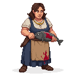

# Reval Harbor

**Game Scene:** `harbor.tscn`

The lifeblood of the city's trade, the harbor is a chaotic mix of sailors, merchants, city guards, and smugglers. It is a place of opportunity and danger, where valuable goods arrive and depart, and where several factions compete for control of the flow of goods.

## Factions Present

### The Hanseatic League 🇪🇺
The League dominates the official trade in the harbor, with their warehouses and offices lining the docks.

**Hanseatic League Guard**: A well-armed and disciplined soldier in the employ of the Hanseatic League, standing guard in front of a warehouse. He has a cold, professional demeanor.

**Hanseatic League Clerk**: A prim and proper man in his late 20s, with a neat haircut and a perpetually worried expression. He carries a ledger and a quill pen.

### The Vitalienbrüder 🏴‍☠️
The pirates have a strong, often clandestine, presence here, recruiting sailors, fencing stolen goods, and planning raids.

**"Ironhand" Störtebeker**: A grizzled pirate captain with a prosthetic iron hand, a braided beard, and a patched-up eye. He wears a long leather coat and a confident smirk.

### The Black Cloaks 🌃
The urban rebels use the harbor for smuggling weapons and supplies, and for making contact with sympathetic sailors.

**Black Cloak Contact**: A man in a dark cloak, pretending to be a simple dockworker. He has a coded phrase ready for those who know what to ask.

## Novgorod & Pskov

 
**Russian Fur Trader**: A large, bearded man dressed in layered pelts and a bearskin hat with earflaps. His belt is heavy with pouches, and his breath mists in the cold air.

**Foreign Merchant from Novgorod**: A man with sharp, intelligent eyes and a long, flowing robe. He speaks with a thick accent and is always looking for a good deal.

## Other Characters

The harbor is populated by a variety of NPCs, reflecting its role as a cultural melting pot.

## NPCs

**Weathered Estonian Fishwife**: An old woman with a wrinkled, sun-beaten face and seaweed tangled in her greying braids. Her hands are red and raw from the cold water.

**Drunken Sailor from Lübeck**: A young man with a thick German accent, singing a bawdy sea shanty. He has a tattoo of a mermaid on his arm and a tankard of ale in his hand.

**City Guard on Patrol**: A bored-looking guard in a dented helmet and a chainmail shirt, leaning on his spear and watching the ships come and go.

**Smuggler's Lookout**: A young boy perched on a rooftop, keeping a watchful eye out for the city guard. He has a slingshot tucked into his belt.

**Ship's Carpenter**: A man with a muscular build and a friendly, open face, carrying a set of well-used tools. He smells of sawdust and tar.

**Seagull-Feeding Old Man**: A gentle old man who spends his days on the docks, feeding scraps of bread to the seagulls. He has a long white beard and a peaceful smile.

**Fishmonger's Wife**: A stout woman with a booming voice, gutting fish with a practiced hand. She wears a blood-stained apron and a no-nonsense expression.

**Rat Catcher with a Terrier**: A wiry man with a ferret-like face, accompanied by a small, feisty terrier that darts in and out of the shadows.

**Harbor Master**: A portly, important-looking man with a neatly trimmed beard and a ledger under his arm. He barks orders at the dockworkers and collects fees from the ships.

**Sailor's Lass**: A pretty young woman with a flower in her hair, waiting on the docks for her lover's ship to return. She has a hopeful, anxious expression.

**Mendicant Friar**: A thin, barefoot man in a simple brown robe, begging for alms from the sailors and merchants. He has a serene, otherworldly expression.

**Ship's Cook**: A cheerful, one-legged man with a ladle in his hand and a parrot on his shoulder. He is missing several teeth and has a hearty laugh.

**Child Playing with a Toy Boat**: A small boy kneeling by the water's edge, sailing a crudely carved wooden boat. He is oblivious to the chaos and danger around him.

## Ships in Port

### The "Peeter"
A sturdy, seaworthy cog, recently arrived from a long voyage. It's a hub of activity, with sailors and merchants bustling about its deck. The ship is owned by a prominent member of the Hanseatic League and is a symbol of the city's wealth and trade.

*Visual Prompt: A 14th-century Hanseatic cog docked in a bustling medieval harbor. The ship is in good condition, with a single mast, a square-rigged sail, and high, rounded sides. The deck is crowded with sailors loading and unloading cargo. The style should be a blend of historical realism and moody, atmospheric lighting.*

### The Wreck of the "Viljo"
An older, smaller vessel that has seen better days. It lies partially submerged in a quieter corner of the harbor, its mast broken and its hull covered in barnacles. The wreck is a source of salvage for some of the harbor's more desperate inhabitants.

*Visual Prompt: The wreck of a small medieval ship, partially submerged in the calm, murky water of a harbor. The wood is dark and waterlogged, with seaweed and barnacles clinging to its sides. The broken mast juts out of the water at an angle. The scene should be quiet and melancholic, with a sense of history and decay.*

## New NPCs

### The Scavenger
An old, resourceful man who can be found picking through the wreckage of the "Viljo." He has a keen eye for valuable salvage and might be willing to trade rare items or offer quests related to the wrecks.

## Dynamic Events

### The Sinking of the "Peeter"
The "Peeter" is not destined to remain in the harbor forever. Through a series of quests, the player's actions could lead to the ship sinking, dramatically altering the harbor's landscape and unlocking new opportunities for salvage and intrigue.

## Items of Interest

*   **Siegburg Pottery Shards:** Fragments of high-quality stoneware, found near the "Viljo."
*   **Norwegian Bakestone Fragment:** A piece of a rare cooking stone, a testament to the far-reaching trade routes of the Hanseatic League.
*   **Whale Tooth:** A valuable and mysterious item, perhaps from a whale hunted in the North Sea, that can be used in crafting powerful items.
